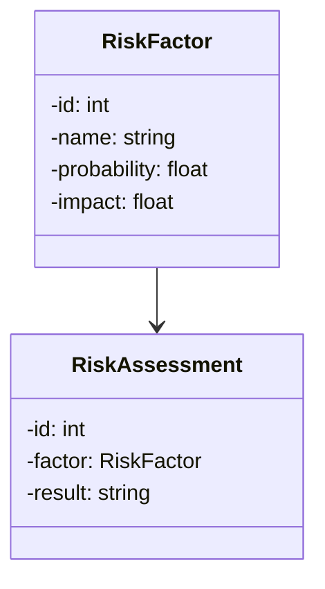
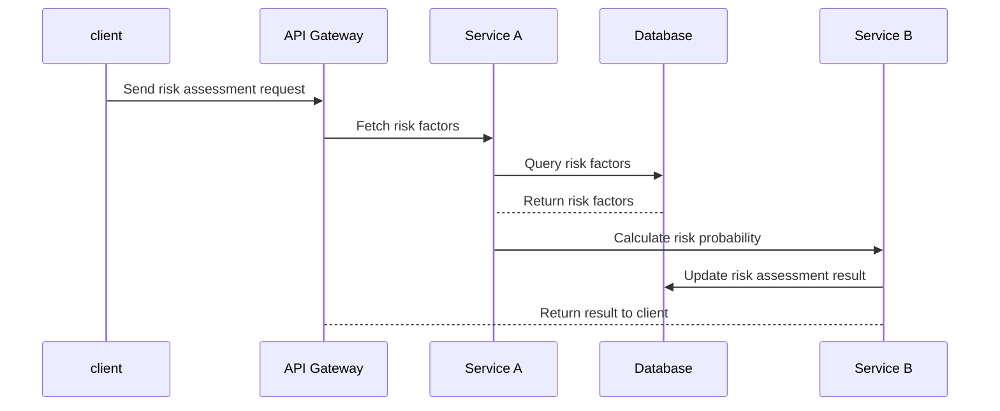

                 


# AI Agent在企业风险评估与管理中的应用

> 关键词：AI Agent, 企业风险管理, 强化学习, 多智能体系统, 风险评估, 系统架构, 项目实战

> 摘要：本文将探讨AI Agent在企业风险评估与管理中的应用，分析其核心概念、算法原理、系统架构，并通过实际案例展示如何利用AI Agent技术实现企业风险管理的智能化与高效化。

---

# 第1章: AI Agent的基本概念与背景

## 1.1 AI Agent的定义与特点

### 1.1.1 AI Agent的基本定义
AI Agent（人工智能代理）是指能够感知环境、自主决策并采取行动的智能实体。它通过传感器获取信息，利用算法处理信息，并通过执行器采取行动以实现目标。

### 1.1.2 AI Agent的核心特点
- **自主性**：AI Agent能够自主决策，无需外部干预。
- **反应性**：能够实时感知环境变化并做出反应。
- **学习能力**：通过机器学习算法不断优化自身行为。
- **协作性**：能够与其他AI Agent或人类协同工作。

### 1.1.3 AI Agent与传统软件的区别
传统软件依赖于预定义的规则和流程，而AI Agent能够动态学习和适应环境，具有更强的智能性和灵活性。

---

## 1.2 企业风险评估与管理的背景

### 1.2.1 企业风险的定义与分类
企业风险是指企业在经营过程中可能面临的各种不确定性，常见的风险包括财务风险、市场风险、操作风险和声誉风险。

### 1.2.2 传统风险评估方法的局限性
传统风险评估方法通常依赖于人工分析，存在效率低、覆盖面窄、实时性差等问题。

### 1.2.3 AI Agent在风险评估中的优势
AI Agent能够通过实时数据分析、模式识别和决策优化，显著提升风险评估的效率和准确性。

---

## 1.3 AI Agent在企业中的应用现状

### 1.3.1 全球AI Agent应用趋势
全球范围内，AI Agent技术在金融、医疗、制造等行业的应用日益广泛。

### 1.3.2 中国企业AI Agent应用现状
中国企业正在积极探索AI Agent技术的应用，尤其是在金融科技和智能制造领域。

### 1.3.3 AI Agent在不同行业的应用案例
- 金融行业：AI Agent用于信用评估和欺诈检测。
- 制造业：AI Agent用于生产过程监控和质量控制。
- 零售业：AI Agent用于客户行为分析和供应链优化。

---

## 1.4 本章小结
本章介绍了AI Agent的基本概念、特点及其在企业风险管理中的优势，并分析了其在全球和中国企业的应用现状。

---

# 第2章: AI Agent在企业风险评估中的核心概念

## 2.1 多智能体系统概述

### 2.1.1 多智能体系统的定义
多智能体系统是指由多个相互作用的智能体组成的系统，能够通过协作完成复杂任务。

### 2.1.2 多智能体系统的分类
- **集中式系统**：所有智能体共享同一个控制器。
- **分布式系统**：智能体之间通过通信协议协作。
- **混合式系统**：结合集中式和分布式特点。

### 2.1.3 多智能体系统在企业中的应用
多智能体系统能够应用于供应链管理、资源分配和风险分散等领域。

---

## 2.2 强化学习与决策树

### 2.2.1 强化学习的基本原理
强化学习是一种通过试错机制优化决策的算法，智能体通过与环境交互获得奖励或惩罚，从而优化策略。

### 2.2.2 决策树的构建与优化
决策树是一种用于分类和回归的机器学习模型，通过构建树状结构优化决策路径。

### 2.2.3 强化学习在风险评估中的应用
强化学习可以用于优化风险应对策略，例如在金融投资中选择最优的资产配置。

---

## 2.3 风险评估与管理的核心要素

### 2.3.1 风险识别
通过数据分析和模式识别，识别潜在风险因素。

### 2.3.2 风险量化
利用概率论和统计学方法量化风险的影响程度。

### 2.3.3 风险应对策略
根据风险评估结果制定相应的应对措施，例如风险规避、转移或接受。

---

## 2.4 本章小结
本章介绍了多智能体系统、强化学习和决策树在企业风险评估中的应用，并强调了风险识别、量化和应对策略的重要性。

---

# 第3章: AI Agent的算法原理与实现

## 3.1 强化学习算法

### 3.1.1 Q-learning算法
Q-learning是一种经典的强化学习算法，通过更新Q值表实现策略优化。

### 3.1.2 Deep Q-Networks (DQN)算法
DQN算法结合深度神经网络和Q-learning，能够处理高维状态空间。

### 3.1.3 算法实现步骤
1. 初始化Q值表或神经网络模型。
2. 环境感知与状态输入。
3. 策略选择与动作输出。
4. 状态转移与奖励反馈。
5. Q值更新与模型训练。

---

## 3.2 贝叶斯网络与风险评估

### 3.2.1 贝叶斯网络的定义
贝叶斯网络是一种有向无环图，用于表示变量之间的概率关系。

### 3.2.2 贝叶斯网络的构建与训练
通过数据训练确定网络参数，实现概率推理和决策优化。

### 3.2.3 贝叶斯网络在风险评估中的应用
用于风险因素分析、风险概率计算和风险影响评估。

---

## 3.3 算法实现的数学模型

### 3.3.1 Q-learning的数学模型
$$ Q(s,a) = Q(s,a) + \alpha[r + \gamma \max Q(s',a')] $$

### 3.3.2 贝叶斯网络的数学模型
$$ P(A|B) = \frac{P(B|A)P(A)}{P(B)} $$

---

## 3.4 本章小结
本章详细讲解了强化学习和贝叶斯网络的算法原理，并给出了具体的数学模型和实现步骤。

---

# 第4章: AI Agent的系统架构与设计

## 4.1 系统架构概述

### 4.1.1 分层架构
- **感知层**：负责数据采集和环境感知。
- **决策层**：负责策略制定和决策优化。
- **执行层**：负责动作执行和结果反馈。

### 4.1.2 微服务架构
- **服务发现**：通过API Gateway实现服务发现。
- **服务通信**：通过消息队列实现异步通信。

---

## 4.2 系统功能设计

### 4.2.1 领域模型


---

## 4.3 系统架构设计


---

## 4.4 系统接口设计

### 4.4.1 RESTful API
- **GET /risk/factors**: 获取风险因素列表。
- **POST /risk/assess**: 提交风险评估任务。
- **GET /risk/results**: 获取风险评估结果。

---

## 4.5 系统交互设计



---

## 4.6 本章小结
本章详细设计了AI Agent的系统架构，包括分层架构、微服务架构和系统接口设计，并通过类图和序列图展示了系统的实现细节。

---

# 第5章: AI Agent的项目实战

## 5.1 项目背景

### 5.1.1 项目目标
开发一个基于AI Agent的企业风险评估系统，实现风险识别、量化和应对策略优化。

### 5.1.2 项目需求
- 实时数据采集与分析。
- 风险评估模型训练与部署。
- 风险应对策略生成与执行。

---

## 5.2 系统核心实现

### 5.2.1 环境安装
```bash
pip install numpy pandas scikit-learn tensorflow
```

### 5.2.2 核心代码实现
```python
import numpy as np
import tensorflow as tf

class AIAgent:
    def __init__(self):
        self.model = self.build_model()

    def build_model(self):
        model = tf.keras.Sequential([
            tf.keras.layers.Dense(64, activation='relu'),
            tf.keras.layers.Dense(1, activation='sigmoid')
        ])
        model.compile(optimizer='adam', loss='binary_crossentropy')
        return model

    def train(self, X, y):
        self.model.fit(X, y, epochs=10, batch_size=32)

    def predict(self, X):
        return self.model.predict(X)
```

---

## 5.3 案例分析

### 5.3.1 数据采集与预处理
从企业财务报表和市场数据中提取特征，进行标准化处理。

### 5.3.2 模型训练与部署
利用历史数据训练AI Agent模型，并将其部署到生产环境。

### 5.3.3 风险评估与应对
通过AI Agent生成风险评估报告，并根据结果制定应对策略。

---

## 5.4 本章小结
本章通过实际案例展示了AI Agent在企业风险评估中的应用，详细讲解了项目的实施步骤和核心代码实现。

---

# 第6章: 最佳实践与总结

## 6.1 小结

### 6.1.1 AI Agent的核心价值
通过智能化和自动化提升企业风险管理的效率和准确性。

### 6.1.2 项目实施的关键点
- 数据质量：确保数据的完整性和准确性。
- 模型优化：不断优化算法以提升性能。
- 系统安全：保障系统的稳定性和安全性。

---

## 6.2 注意事项

### 6.2.1 数据隐私与安全
在处理企业数据时，必须严格遵守数据隐私法规。

### 6.2.2 模型解释性
复杂的模型可能导致决策过程不透明，需注重模型的可解释性。

### 6.2.3 系统可扩展性
在设计系统时，需考虑未来的扩展性和可维护性。

---

## 6.3 拓展阅读

### 6.3.1 推荐书籍
- 《强化学习：理论与应用》
- 《贝叶斯网络：原理与实践》

### 6.3.2 推荐博客
- Medium上的AI技术博客
- Towards Data Science的AI相关文章

---

# 作者：AI天才研究院 & 禅与计算机程序设计艺术

