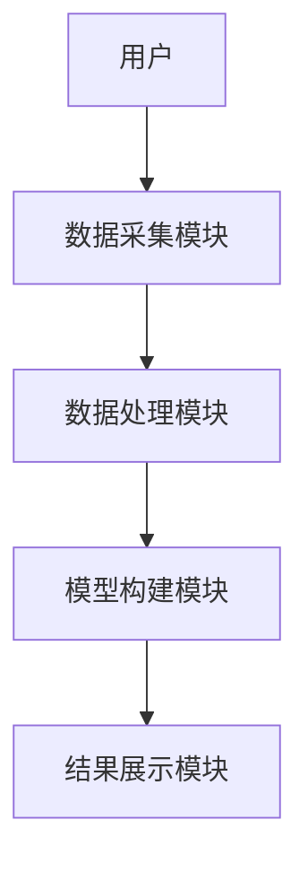
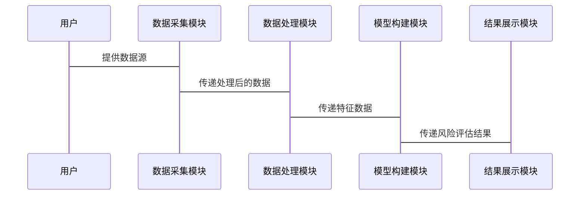

                 


# AI Agent在企业风险评估中的应用

> **关键词**：AI Agent, 企业风险评估, 机器学习, 数据分析, 系统架构, 知识图谱, 风险管理

> **摘要**：本文深入探讨AI Agent在企业风险评估中的应用，分析其核心原理、系统架构及实际案例。文章从背景介绍到技术实现，详细讲解了AI Agent如何提升企业风险评估的效率和准确性，为读者提供全面的技术指导和实践参考。

---

# 第一部分: AI Agent与企业风险评估基础

## 第1章: AI Agent与企业风险评估概述

### 1.1 AI Agent的基本概念

#### 1.1.1 AI Agent的定义
AI Agent（人工智能代理）是指能够感知环境、自主决策并执行任务的智能实体。它通过传感器获取信息，利用算法处理数据，并通过执行器采取行动，以实现特定目标。

#### 1.1.2 AI Agent的核心特征
- **自主性**：能够自主决策，无需人工干预。
- **反应性**：能够实时感知环境变化并做出反应。
- **学习能力**：能够通过经验优化决策策略。
- **协作性**：能够与其他系统或AI Agent协同工作。

#### 1.1.3 AI Agent与传统风险评估的区别
传统的风险评估方法依赖人工分析和经验判断，而AI Agent能够通过大数据分析和机器学习模型，快速识别潜在风险并提供优化建议，显著提高效率和准确性。

---

### 1.2 企业风险评估的背景与挑战

#### 1.2.1 企业风险评估的基本概念
企业风险评估是识别、分析和应对潜在风险的过程，旨在降低风险对企业运营的影响。常见的风险包括市场风险、财务风险、操作风险和声誉风险。

#### 1.2.2 传统风险评估方法的局限性
- **效率低下**：依赖人工分析，耗时且成本高。
- **主观性**：受评估人员经验影响，结果可能不准确。
- **覆盖范围有限**：难以处理复杂且动态变化的环境。

#### 1.2.3 AI Agent在风险评估中的作用
AI Agent能够实时监控企业内外部数据，快速识别潜在风险，并提供基于数据的决策支持，帮助企业在复杂环境中做出更明智的选择。

---

### 1.3 AI Agent在企业风险评估中的应用前景

#### 1.3.1 AI Agent的核心优势
- **高效性**：快速处理大量数据，提高评估效率。
- **准确性**：通过机器学习模型，减少人为误差。
- **实时性**：实时监控和响应，降低风险发生概率。

#### 1.3.2 企业采用AI Agent的风险评估模式的可行性
AI Agent结合大数据分析和机器学习技术，能够显著提升风险评估的准确性和效率，是未来企业风险管理的重要工具。

#### 1.3.3 AI Agent应用的潜在挑战与解决方案
- **数据隐私问题**：需要通过数据加密和访问控制来保护企业数据。
- **模型可解释性**：需要开发更加透明的模型，以便企业理解和信任AI Agent的决策。

---

## 第2章: AI Agent的核心原理与技术实现

### 2.1 AI Agent的基本原理

#### 2.1.1 AI Agent的感知机制
AI Agent通过传感器或API接口获取环境数据，包括市场数据、财务数据和社交媒体信息等。

#### 2.1.2 AI Agent的决策机制
基于获取的数据，AI Agent利用机器学习模型进行分析，生成风险评估报告和应对策略。

#### 2.1.3 AI Agent的执行机制
根据决策结果，AI Agent通过执行系统（如自动化交易系统或报警系统）采取相应行动。

---

### 2.2 AI Agent在风险评估中的技术实现

#### 2.2.1 数据采集与处理
- **数据源**：包括企业内部数据（如财务报表）、外部数据（如市场趋势）和社交媒体数据。
- **数据清洗**：去除噪声数据，确保数据质量。
- **特征提取**：提取关键特征，如财务指标和市场指标。

#### 2.2.2 风险评估模型的构建
- **监督学习模型**：如支持向量机（SVM）和随机森林（Random Forest）。
- **无监督学习模型**：如聚类分析和异常检测。
- **深度学习模型**：如神经网络和LSTM。

#### 2.2.3 AI Agent的反馈与优化机制
AI Agent根据实际结果调整模型参数，优化风险评估的准确性。

---

### 2.3 AI Agent的核心算法与实现

#### 2.3.1 机器学习算法在AI Agent中的应用
- **线性回归**：用于预测风险概率。
- **决策树**：用于分类风险类型。
- **神经网络**：用于复杂模式识别。

#### 2.3.2 自然语言处理技术在风险评估中的应用
- **情感分析**：分析社交媒体上的企业声誉风险。
- **实体识别**：识别关键风险因素。

#### 2.3.3 知识图谱构建与应用
通过构建知识图谱，AI Agent能够更好地理解和关联不同风险因素之间的关系。

---

## 第3章: 企业风险评估的基本方法与模型

### 3.1 传统风险评估方法概述

#### 3.1.1 风险识别方法
- **头脑风暴法**：通过团队讨论识别潜在风险。
- **问卷调查法**：通过收集员工意见识别风险。

#### 3.1.2 风险量化方法
- **概率-影响矩阵**：评估风险的概率和影响程度。
- **成本-效益分析**：评估应对措施的成本和效益。

#### 3.1.3 风险应对策略
- **规避策略**：完全避免高风险项目。
- **减轻策略**：降低风险发生的概率或影响。
- **接受策略**：接受风险并制定应对计划。

---

### 3.2 AI驱动的风险评估模型

#### 3.2.1 基于机器学习的风险评估模型
- **逻辑回归**：用于分类风险等级。
- **梯度提升树**：用于预测风险概率。

#### 3.2.2 基于深度学习的风险评估模型
- **卷积神经网络（CNN）**：用于处理图像数据。
- **循环神经网络（RNN）**：用于处理时间序列数据。

#### 3.2.3 基于知识图谱的风险评估模型
- **知识图谱构建**：整合企业内外部数据，构建语义网络。
- **图嵌入技术**：将图结构数据转换为向量，用于风险分析。

---

### 3.3 风险评估模型的性能评估

#### 3.3.1 模型的准确性评估
- **精确率**：预测为正类的样本中实际为正类的比例。
- **召回率**：实际为正类的样本中被正确预测的比例。
- **F1分数**：精确率和召回率的调和平均。

#### 3.3.2 模型的鲁棒性评估
- **过拟合检测**：评估模型在训练集和测试集上的表现差异。
- **交叉验证**：通过多次训练和验证评估模型的稳定性。

#### 3.3.3 模型的可解释性评估
- **特征重要性分析**：识别对风险评估影响最大的特征。
- **模型可视化**：通过可视化工具展示模型的决策过程。

---

## 第4章: 基于AI Agent的风险评估模型构建

### 4.1 数据采集与预处理

#### 4.1.1 数据源的选择与整合
- **内部数据**：如企业财务报表、销售数据。
- **外部数据**：如市场趋势、行业报告。
- **社交媒体数据**：如企业声誉相关的评论和话题。

#### 4.1.2 数据清洗与特征提取
- **数据清洗**：处理缺失值、异常值和重复值。
- **特征提取**：从文本数据中提取关键词，从结构化数据中提取统计指标。

#### 4.1.3 数据标注与标注标准
- **标注标准**：如将风险分为高、中、低三个等级。
- **标注工具**：如使用Python的scikit-learn库进行分类标注。

---

### 4.2 风险评估模型的构建

#### 4.2.1 基于监督学习的模型构建
- **训练数据**：标注好的数据集。
- **模型选择**：如随机森林、支持向量机。
- **模型训练**：通过训练数据优化模型参数。

#### 4.2.2 基于无监督学习的模型构建
- **聚类分析**：识别数据中的风险集群。
- **异常检测**：识别异常数据点作为潜在风险。

#### 4.2.3 基于强化学习的模型
- **强化学习框架**：通过奖励机制优化风险应对策略。
- **状态空间**：如企业当前的财务状况和市场环境。
- **动作空间**：如采取的风险应对措施。

---

### 4.3 模型优化与部署

#### 4.3.1 模型优化
- **超参数调优**：如调整学习率、树深度等。
- **集成学习**：如将多个模型的结果进行集成，提高准确率。

#### 4.3.2 模型部署
- **API接口**：将模型封装成API，方便其他系统调用。
- **实时监控**：部署监控系统，实时更新模型参数。

---

## 第5章: 系统架构设计与实现

### 5.1 系统功能设计

#### 5.1.1 功能模块划分
- **数据采集模块**：负责采集企业内外部数据。
- **数据处理模块**：负责清洗和特征提取。
- **模型构建模块**：负责训练和优化风险评估模型。
- **结果展示模块**：负责展示风险评估结果和应对建议。

#### 5.1.2 系统交互流程
1. 用户输入企业数据。
2. 数据采集模块获取实时数据。
3. 数据处理模块清洗和处理数据。
4. 模型构建模块训练模型并生成结果。
5. 结果展示模块将结果呈现给用户。

---

### 5.2 系统架构设计

#### 5.2.1 系统架构图


#### 5.2.2 系统接口设计
- **数据接口**：如API接口，用于与其他系统的数据交互。
- **用户接口**：如Web界面，供用户查看和操作。

#### 5.2.3 系统交互流程图


---

## 第6章: 项目实战与案例分析

### 6.1 项目背景与目标
假设我们为一家中型制造企业开发一个基于AI Agent的风险评估系统，目标是实时监控企业的财务风险和市场风险。

---

### 6.2 环境安装与配置

#### 6.2.1 环境要求
- **操作系统**：Linux或Windows。
- **Python版本**：3.6以上。
- **依赖库**：如scikit-learn、TensorFlow、Flask。

#### 6.2.2 安装依赖
```bash
pip install scikit-learn tensorflow flask
```

---

### 6.3 系统核心实现

#### 6.3.1 数据采集模块
```python
import requests

def get_market_data(api_key):
    url = f"https://api.example.com/market_data?api_key={api_key}"
    response = requests.get(url)
    return response.json()
```

#### 6.3.2 数据处理模块
```python
import pandas as pd

def preprocess_data(data):
    df = pd.DataFrame(data)
    df.dropna(inplace=True)
    return df
```

#### 6.3.3 模型构建模块
```python
from sklearn.ensemble import RandomForestClassifier

def train_model(X_train, y_train):
    model = RandomForestClassifier()
    model.fit(X_train, y_train)
    return model
```

#### 6.3.4 结果展示模块
```python
from flask import Flask

app = Flask(__name__)

@app.route('/')
def index():
    return "Risk Assessment System"
```

---

### 6.4 项目总结

#### 6.4.1 项目成果
- 成功开发了一个基于AI Agent的风险评估系统。
- 系统能够实时监控企业内外部数据，提供风险预警和应对建议。

#### 6.4.2 经验与教训
- 数据质量对模型性能影响巨大，需重视数据清洗和特征工程。
- 模型的可解释性对企业用户非常重要，需优化模型的透明度。

---

## 第7章: 最佳实践与未来展望

### 7.1 最佳实践

#### 7.1.1 数据隐私保护
- 使用加密技术保护敏感数据。
- 遵守相关法律法规，确保数据合法使用。

#### 7.1.2 模型优化
- 定期更新模型参数，保持模型的准确性。
- 引入新的数据源，丰富模型的输入信息。

#### 7.1.3 系统维护
- 定期检查系统运行状态，及时修复漏洞。
- 提供用户培训，确保系统得到正确使用。

---

### 7.2 未来展望

#### 7.2.1 技术发展趋势
- **多模态学习**：结合文本、图像等多种数据源，提高风险评估的准确性。
- **联邦学习**：在保护数据隐私的前提下，实现跨机构的数据协作。

#### 7.2.2 应用场景扩展
- **供应链风险管理**：通过AI Agent优化供应链的稳定性。
- **金融风险管理**：通过实时监控和预测，降低金融市场的风险。

---

# 第四部分: 总结与展望

## 8.1 总结

通过本文的详细讲解，我们了解了AI Agent在企业风险评估中的核心原理、系统架构和实际应用。AI Agent能够显著提升企业风险管理的效率和准确性，是未来企业风险管理的重要工具。

---

## 8.2 未来展望

随着AI技术的不断发展，AI Agent在企业风险评估中的应用将更加广泛和深入。通过技术创新和场景拓展，AI Agent将为企业提供更加智能和高效的决策支持。

---

# 作者

**作者**：AI天才研究院/AI Genius Institute & 禅与计算机程序设计艺术/Zen And The Art of Computer Programming

