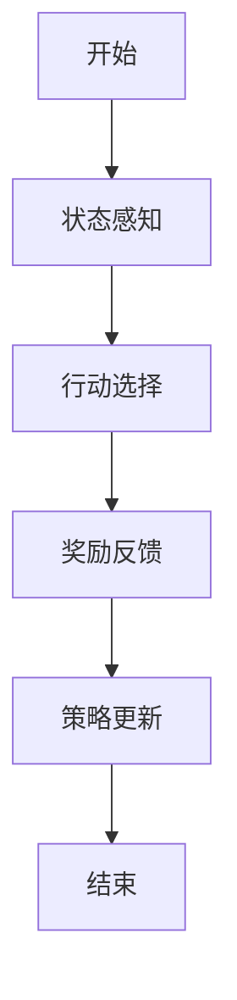
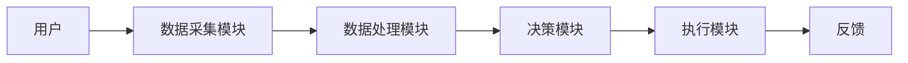

                 


# AI Agent在企业风险预警与危机管理中的应用

> 关键词：AI Agent, 企业风险预警, 危机管理, 人工智能, 数据分析

> 摘要：本文探讨了AI Agent在企业风险预警与危机管理中的应用，从核心概念到算法原理，再到系统设计和项目实战，详细分析了AI Agent如何助力企业预测和应对潜在风险，提供了丰富的技术细节和实际案例。

---

## 第1章: 企业风险预警与危机管理概述

### 1.1 企业风险预警的定义与重要性

#### 1.1.1 什么是企业风险预警
企业风险预警是指通过监测和分析企业内外部环境中的潜在风险因素，提前发出警告，以便采取措施降低风险对企业的影响。

#### 1.1.2 风险预警在企业中的作用
1. 预防潜在危机，降低损失。
2. 提高企业应对突发事件的能力。
3. 优化企业运营流程，提升管理效率。

#### 1.1.3 企业风险预警的边界与外延
- 边界：仅关注对企业有直接影响的潜在风险。
- 外延：涉及企业战略、财务、市场、运营等多个方面。

### 1.2 危机管理的核心概念

#### 1.2.1 危机管理的定义
危机管理是指在危机发生前、发生中和发生后，采取有效措施降低危机对企业的影响。

#### 1.2.2 危机管理的核心要素
1. 危机预防：识别潜在危机，采取预防措施。
2. 危机响应：快速反应，控制危机扩散。
3. 危机恢复：危机过后，恢复正常运营。

#### 1.2.3 危机管理与风险预警的关系
风险预警是危机管理的第一步，通过预警系统提前发现潜在危机，从而在危机发生前采取措施。

---

## 第2章: AI Agent的基本概念与技术原理

### 2.1 AI Agent的定义与特点

#### 2.1.1 什么是AI Agent
AI Agent是一种能够感知环境、自主决策并采取行动的智能实体，旨在帮助用户完成特定任务。

#### 2.1.2 AI Agent的核心特点
1. **自主性**：无需人工干预，自主完成任务。
2. **反应性**：能够实时感知环境变化并做出反应。
3. **学习能力**：通过数据和经验不断优化自身行为。

#### 2.1.3 AI Agent与传统软件的区别
| 特性      | AI Agent             | 传统软件         |
|-----------|----------------------|------------------|
| 自主性     | 高                   | 低               |
| 学习能力   | 强                   | 无               |
| 决策能力   | 强                   | 无               |

### 2.2 AI Agent在企业中的应用潜力

#### 2.2.1 AI Agent在企业中的主要应用场景
1. **风险预警**：实时监测企业内外部数据，识别潜在风险。
2. **决策支持**：通过数据分析，提供最优决策建议。
3. **危机管理**：在危机发生时，快速响应并制定解决方案。

#### 2.2.2 AI Agent的优势与挑战
- **优势**：
  - 提高企业决策效率。
  - 实时监控，快速响应。
- **挑战**：
  - 数据隐私和安全问题。
  - 算法的准确性和可靠性。

#### 2.2.3 AI Agent与企业风险预警的结合
通过AI Agent的实时数据分析和自主决策能力，企业能够更高效地进行风险预警和危机管理。

---

## 第3章: AI Agent的核心原理

### 3.1 AI Agent的工作原理

#### 3.1.1 感知层: 数据采集与处理
- **数据采集**：通过传感器、数据库等获取环境数据。
- **数据处理**：对数据进行清洗、转换和分析。

#### 3.1.2 计划层: 战略制定与决策
- **策略制定**：基于感知数据，制定最优策略。
- **决策优化**：通过强化学习等算法，优化决策过程。

### 3.2 AI Agent的算法实现

#### 3.2.1 强化学习算法
- **定义**：通过试错和奖励机制，优化决策策略。
- **流程**：
  1. 状态感知。
  2. 行动选择。
  3. 奖励反馈。
  4. 策略更新。

#### 3.2.2 监督学习算法
- **定义**：通过标注数据训练模型，预测未来风险。

#### 3.2.3 算法流程图


---

## 第4章: AI Agent的数学模型与算法实现

### 4.1 强化学习算法的数学模型

#### 4.1.1 Q-Learning算法
- **公式**：
  $$ Q(s, a) = Q(s, a) + \alpha (r + \gamma \max Q(s', a') - Q(s, a)) $$
  其中：
  - \( Q(s, a) \)：状态 \( s \) 下采取行动 \( a \) 的价值。
  - \( \alpha \)：学习率。
  - \( r \)：奖励值。
  - \( \gamma \)：折扣因子。
  - \( s' \)：下一步状态。

#### 4.1.2 算法实现
```python
import numpy as np

class QAgent:
    def __init__(self, state_space, action_space):
        self.state_space = state_space
        self.action_space = action_space
        self.Q = np.zeros((state_space, action_space))
        self.alpha = 0.1
        self.gamma = 0.9

    def choose_action(self, state):
        return np.argmax(self.Q[state, :])

    def update_Q(self, state, action, reward, next_state):
        self.Q[state, action] += self.alpha * (reward + self.gamma * np.max(self.Q[next_state, :]) - self.Q[state, action])
```

---

## 第5章: 系统分析与架构设计

### 5.1 系统架构设计

#### 5.1.1 系统功能模块
1. **数据采集模块**：采集企业内外部数据。
2. **数据处理模块**：清洗和分析数据。
3. **决策模块**：基于算法生成决策。
4. **执行模块**：根据决策采取行动。

#### 5.1.2 系统架构图


---

## 第6章: 项目实战

### 6.1 环境安装与配置
- **工具**：Python、TensorFlow、Keras。
- **数据集**：企业财务数据、市场数据等。

### 6.2 核心代码实现
```python
import tensorflow as tf
from tensorflow.keras import layers

# 构建模型
model = tf.keras.Sequential([
    layers.Dense(64, activation='relu'),
    layers.Dense(1, activation='sigmoid')
])

# 编译模型
model.compile(optimizer='adam', loss='binary_crossentropy', metrics=['accuracy'])
```

### 6.3 案例分析
通过实际案例分析，展示AI Agent在企业风险预警中的应用效果，包括模型训练、测试和部署。

---

## 第7章: 结论与展望

### 7.1 总结
AI Agent在企业风险预警与危机管理中的应用具有巨大潜力，能够显著提高企业的风险应对能力。

### 7.2 展望
未来，随着AI技术的进步，AI Agent将更加智能化和自动化，为企业提供更强大的支持。

---

## 作者
作者：AI天才研究院/AI Genius Institute  
作者：禅与计算机程序设计艺术 /Zen And The Art of Computer Programming

