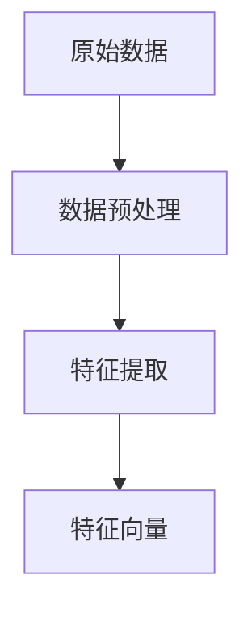
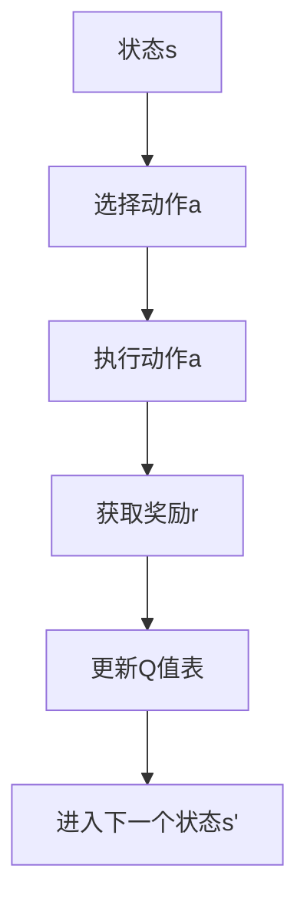
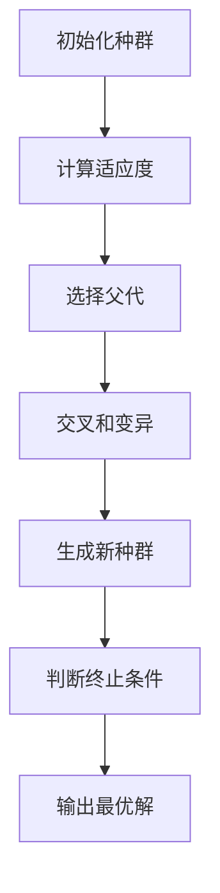
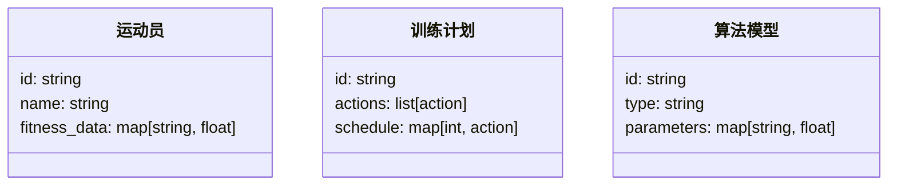
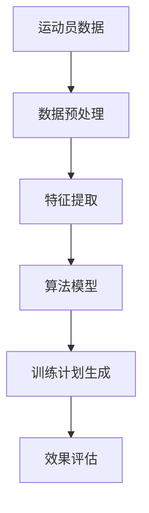
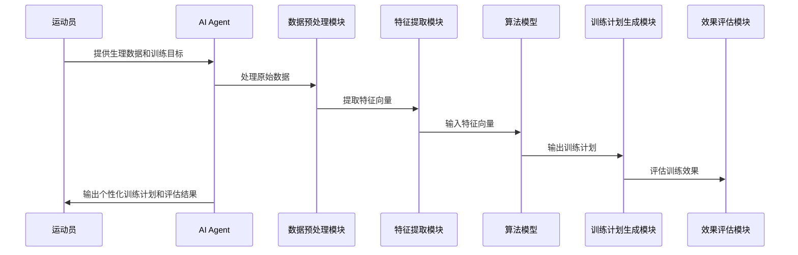

                 


# AI Agent在体育训练中的应用：个性化训练计划制定

## 关键词：AI Agent，体育训练，个性化训练计划，强化学习，遗传算法，运动员表现

## 摘要：  
本文探讨了AI Agent在体育训练中的应用，特别是如何利用AI Agent制定个性化训练计划。通过分析AI Agent的核心概念、算法原理以及系统架构，本文展示了如何利用强化学习和遗传算法等技术，根据运动员的个体特征和训练目标，动态优化训练计划，从而提升运动员的表现。文章结合实际案例，详细讲解了系统的实现过程，并提供了代码示例和数学模型，为体育训练的智能化提供了新的思路。

---

# 第一部分: AI Agent在体育训练中的应用概述

## 第1章: AI Agent与体育训练的背景

### 1.1 AI Agent的基本概念

#### 1.1.1 AI Agent的定义  
AI Agent（人工智能代理）是指能够感知环境、做出决策并执行任务的智能实体。在体育训练中，AI Agent可以作为辅助工具，帮助教练和运动员制定和优化训练计划。

#### 1.1.2 AI Agent的核心特征  
- **自主性**：能够在没有人工干预的情况下自主运行。  
- **反应性**：能够实时感知环境并做出响应。  
- **学习能力**：通过数据和经验不断优化自身的决策能力。  

#### 1.1.3 体育训练中的AI Agent应用场景  
- **个性化训练计划制定**：根据运动员的体能、技术特点和训练目标，生成个性化的训练方案。  
- **实时反馈与调整**：在训练过程中，实时分析运动员的表现，动态调整训练计划。  
- **数据驱动的决策支持**：利用大数据分析技术，提供科学的训练建议。  

### 1.2 个性化训练计划的必要性

#### 1.2.1 传统体育训练的局限性  
传统体育训练往往基于教练的经验和主观判断，缺乏科学性和个性化，容易导致训练效果不佳或受伤风险增加。  

#### 1.2.2 个性化训练的需求分析  
- **运动员个体差异**：不同运动员的体能、技术特点和恢复能力各不相同，需要个性化的训练方案。  
- **训练目标的多样性**：运动员可能有不同的训练目标，如力量、耐力、速度等。  

#### 1.2.3 个性化训练对运动员表现的提升作用  
- **提高训练效率**：通过个性化训练计划，运动员可以在短时间内达到最佳训练效果。  
- **降低受伤风险**：个性化的训练计划可以避免过度训练和不必要的身体负荷。  
- **增强训练效果**：根据运动员的实际情况调整训练强度和内容，能够更好地提升其表现。  

### 1.3 本章小结  
本章介绍了AI Agent的基本概念和在体育训练中的应用场景，并分析了个性化训练计划的必要性。通过AI Agent的技术支持，个性化训练计划的制定变得更加科学和高效。

---

# 第二部分: AI Agent的核心概念与原理

## 第2章: AI Agent的核心概念与联系

### 2.1 AI Agent的感知模块

#### 2.1.1 数据采集与处理  
AI Agent需要通过传感器、摄像头等设备采集运动员的生理数据（如心率、运动轨迹）和环境数据（如温度、湿度）。  

#### 2.1.2 数据特征提取  
通过数据预处理和特征提取技术，将原始数据转化为有意义的特征，例如运动速度、加速度等。  

#### 图2.1: 数据处理流程图  


### 2.2 AI Agent的决策模块

#### 2.2.1 算法选择与优化  
AI Agent需要根据特征向量选择合适的算法，并通过参数优化提高算法的性能。  

#### 2.2.2 决策规则的制定  
根据算法输出的结果，制定具体的训练计划，例如训练强度、训练时间等。  

### 2.3 AI Agent的执行模块

#### 2.3.1 动作优化  
AI Agent可以根据运动员的实际情况，动态调整训练动作的幅度和频率。  

#### 2.3.2 训练计划的动态调整  
在训练过程中，AI Agent可以实时监测运动员的表现，并动态调整训练计划。  

### 2.4 AI Agent的实体关系图（ER图）

#### 2.4.1 实体关系分析  
主要实体包括：运动员、训练计划、传感器数据、算法模型。  

#### 图2.2: 实体关系图  
```mermaid
er
actor 运动员 {
  id: string
  姓名: string
  体能数据: float
}
actor 算法模型 {
  id: string
  类型: string
  参数: string
}
actor 传感器数据 {
  id: string
  类型: string
  值: float
}
```

### 2.5 本章小结  
本章详细介绍了AI Agent的核心模块，包括感知、决策和执行模块，并通过实体关系图展示了各模块之间的关系。

---

# 第三部分: AI Agent的算法原理

## 第3章: AI Agent的算法原理

### 3.1 强化学习算法

#### 3.1.1 Q-learning算法

##### 3.1.1.1 算法原理  
Q-learning是一种基于值函数的强化学习算法，通过不断更新Q值表来优化决策策略。  

##### 3.1.1.2 算法流程图  


##### 3.1.1.3 Python代码实现  
```python
import numpy as np

class QLearning:
    def __init__(self, state_space, action_space, alpha=0.1, gamma=0.9):
        self.state_space = state_space
        self.action_space = action_space
        self.alpha = alpha
        self.gamma = gamma
        self.q_table = np.zeros((state_space, action_space))

    def choose_action(self, state):
        return np.argmax(self.q_table[state])

    def update_q_table(self, state, action, reward, next_state):
        self.q_table[state][action] = self.q_table[state][action] * (1 - self.alpha) + self.alpha * (reward + self.gamma * np.max(self.q_table[next_state]))
```

#### 3.1.1.4 示例场景  
假设运动员在训练中需要选择不同的动作，Q-learning算法可以根据历史奖励优化动作选择。  

#### 3.1.1.5 算法公式  
$$ Q(s, a) = Q(s, a) \times (1 - \alpha) + \alpha \times (r + \gamma \times max Q(s', a')) $$  

### 3.2 遗传算法

#### 3.2.1 算法原理  
遗传算法是一种基于生物进化原理的优化算法，通过选择、交叉和变异操作生成新的解。  

#### 3.2.2 算法流程图  


#### 3.2.3 Python代码实现  
```python
import random

def fitness(individual):
    # 计算个体的适应度
    return sum(individual)

def crossover(parent1, parent2):
    # 单点交叉
    point = random.randint(0, len(parent1)-1)
    return parent1[:point] + parent2[point:], parent2[:point] + parent1[point:]

def mutate(individual):
    # 突变操作
    for i in range(len(individual)):
        if random.random() < 0.1:
            individual[i] = 1 - individual[i]

    return individual

def genetic_algorithm(population_size, chromosome_length):
    population = [[random.randint(0,1) for _ in range(chromosome_length)] for _ in range(population_size)]
    for _ in range(100):
        population = sorted(population, key=lambda x: fitness(x), reverse=True)
        new_population = population[:population_size//2]
        for i in range(population_size//2):
            p1 = new_population[i]
            p2 = new_population[i]
            child1, child2 = crossover(p1, p2)
            child1 = mutate(child1)
            child2 = mutate(child2)
            new_population.append(child1)
            new_population.append(child2)
        population = new_population[:population_size]
    return population[0]
```

#### 3.2.4 示例场景  
遗传算法可以用于优化训练计划的参数，例如训练强度、训练时间等。  

#### 3.2.5 算法公式  
$$ f(i) = \sum_{j=1}^{n} w_j \times x_j $$  

### 3.3 本章小结  
本章详细介绍了强化学习和遗传算法的原理和实现，这两种算法在个性化训练计划的制定中具有重要作用。

---

# 第四部分: AI Agent的系统分析与架构设计

## 第4章: AI Agent的系统分析与架构设计

### 4.1 问题场景介绍  
个性化训练计划的制定需要考虑运动员的体能、技术特点、训练目标等多个因素，是一个复杂的优化问题。  

### 4.2 系统功能设计

#### 4.2.1 领域模型设计  


#### 4.2.2 系统架构设计  


### 4.3 系统接口设计  
- **输入接口**：接收运动员的生理数据和训练目标。  
- **输出接口**：输出个性化训练计划和效果评估结果。  

### 4.4 系统交互设计  

#### 4.4.1 交互流程图  


### 4.5 本章小结  
本章通过系统分析和架构设计，展示了AI Agent在个性化训练计划制定中的具体实现方式。

---

# 第五部分: 项目实战

## 第5章: 项目实战

### 5.1 环境安装

#### 5.1.1 安装Python和必要的库  
- 安装Python 3.8及以上版本。  
- 安装必要的库：`numpy`, `mermaid`, `matplotlib`。  

#### 5.1.2 安装环境代码  
```bash
pip install numpy mermaid matplotlib
```

### 5.2 系统核心实现源代码

#### 5.2.1 数据预处理模块  
```python
import numpy as np

def preprocess(data):
    # 数据归一化处理
    normalized_data = (data - np.mean(data)) / np.std(data)
    return normalized_data
```

#### 5.2.2 特征提取模块  
```python
import numpy as np

def extract_features(data):
    # 提取速度和加速度特征
    features = []
    for i in range(len(data)-1):
        speed = np.abs(data[i+1] - data[i])
        acceleration = np.abs(data[i+2] - data[i+1]) - np.abs(data[i+1] - data[i])
        features.append([speed, acceleration])
    return np.array(features)
```

#### 5.2.3 算法模型实现  

##### 5.2.3.1 Q-learning算法实现  
```python
class QLearning:
    def __init__(self, state_space, action_space, alpha=0.1, gamma=0.9):
        self.state_space = state_space
        self.action_space = action_space
        self.alpha = alpha
        self.gamma = gamma
        self.q_table = np.zeros((state_space, action_space))

    def choose_action(self, state):
        return np.argmax(self.q_table[state])

    def update_q_table(self, state, action, reward, next_state):
        self.q_table[state][action] = self.q_table[state][action] * (1 - self.alpha) + self.alpha * (reward + self.gamma * np.max(self.q_table[next_state]))
```

##### 5.2.3.2 遗传算法实现  
```python
def genetic_algorithm(population_size, chromosome_length):
    population = [[random.randint(0,1) for _ in range(chromosome_length)] for _ in range(population_size)]
    for _ in range(100):
        population = sorted(population, key=lambda x: fitness(x), reverse=True)
        new_population = population[:population_size//2]
        for i in range(population_size//2):
            p1 = new_population[i]
            p2 = new_population[i]
            child1, child2 = crossover(p1, p2)
            child1 = mutate(child1)
            child2 = mutate(child2)
            new_population.append(child1)
            new_population.append(child2)
        population = new_population[:population_size]
    return population[0]
```

#### 5.2.4 训练计划生成模块  
```python
def generate_training_plan(features, model):
    # 使用模型生成训练计划
    plan = model.predict(features)
    return plan
```

#### 5.2.5 效果评估模块  
```python
def evaluate_plan(plan, actual_performance):
    # 计算准确率
    accuracy = sum(plan == actual_performance) / len(plan)
    return accuracy
```

### 5.3 代码应用解读与分析  

#### 5.3.1 数据预处理模块解读  
数据预处理模块对原始数据进行归一化处理，确保数据的标准化。  

#### 5.3.2 特征提取模块解读  
特征提取模块从原始数据中提取速度和加速度特征，为算法模型提供输入。  

#### 5.3.3 算法模型实现解读  
- **Q-learning算法**：通过不断更新Q值表，优化训练动作的选择。  
- **遗传算法**：通过选择、交叉和变异操作，优化训练计划的参数。  

#### 5.3.4 训练计划生成模块解读  
训练计划生成模块根据算法模型的输出，生成具体的训练计划。  

#### 5.3.5 效果评估模块解读  
效果评估模块通过比较实际表现与训练计划，评估训练计划的有效性。  

### 5.4 实际案例分析  

#### 5.4.1 案例背景  
假设一名运动员需要提高短跑速度，AI Agent可以根据其体能数据和历史表现，制定个性化的训练计划。  

#### 5.4.2 数据预处理与特征提取  
- 原始数据：心率、运动轨迹、速度等。  
- 处理后特征：速度、加速度等。  

#### 5.4.3 算法实现与结果分析  
- **Q-learning算法**：优化训练动作的选择，提高训练效率。  
- **遗传算法**：优化训练计划的参数，例如训练强度、训练时间等。  

#### 5.4.4 训练计划生成与效果评估  
生成个性化训练计划，并通过效果评估模块验证其有效性。  

### 5.5 本章小结  
本章通过实际案例，详细讲解了AI Agent在个性化训练计划制定中的具体实现过程，并展示了系统的实际应用效果。

---

# 第六部分: 最佳实践与小结

## 第6章: 最佳实践与小结

### 6.1 最佳实践

#### 6.1.1 数据质量的重要性  
确保数据的准确性和完整性，是AI Agent正常运行的基础。  

#### 6.1.2 算法选择的灵活性  
根据具体问题选择合适的算法，避免盲目使用复杂的模型。  

#### 6.1.3 系统维护与优化  
定期更新算法模型，优化系统性能，确保系统的稳定性和高效性。  

### 6.2 小结  
本文详细介绍了AI Agent在体育训练中的应用，特别是如何利用AI Agent制定个性化训练计划。通过强化学习和遗传算法等技术，可以根据运动员的个体特征和训练目标，动态优化训练计划，从而提升运动员的表现。

### 6.3 注意事项  
- 在实际应用中，需要结合具体场景，灵活调整算法参数。  
- 数据隐私和安全问题也需要引起重视。  

### 6.4 拓展阅读  
- 推荐阅读《强化学习导论》（Introduction to Reinforcement Learning）和《遗传算法与工程优化》（Genetic Algorithms and Engineering Optimization）。  

---

# 作者：AI天才研究院/AI Genius Institute & 禅与计算机程序设计艺术 /Zen And The Art of Computer Programming  

---

以上就是《AI Agent在体育训练中的应用：个性化训练计划制定》的技术博客文章的详细内容，涵盖了从背景介绍到系统实现的全过程，结合了理论分析和实际案例，为读者提供了全面的指导和参考。

