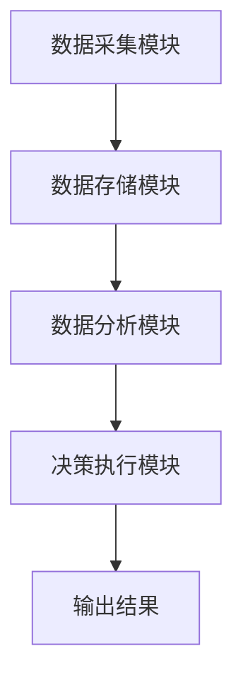
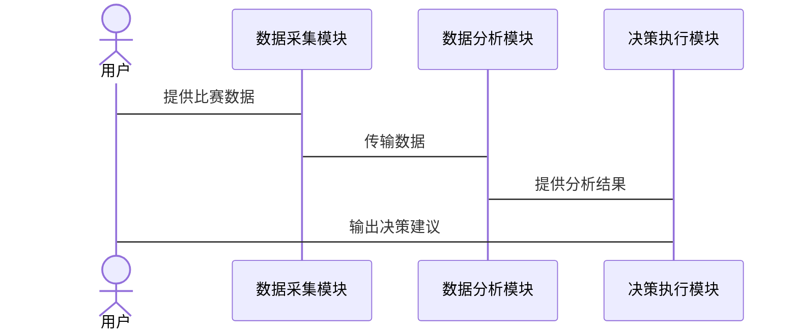

                 


# AI Agent在体育赛事分析中的应用

## 关键词：AI Agent, 体育赛事分析, 数据挖掘, 机器学习, 实时分析, 球员评估

## 摘要：AI Agent在体育赛事分析中的应用是一种结合人工智能技术与体育数据分析的创新方法。通过AI Agent，可以实现对比赛数据的实时处理、动态分析和智能决策，从而优化比赛策略、提升运动员表现和增强观众体验。本文将从AI Agent的基本概念、核心算法、系统架构到实际项目案例，全面探讨其在体育赛事分析中的应用与价值。

---

# 第一部分: AI Agent与体育赛事分析的背景介绍

## 第1章: AI Agent的基本概念与技术基础

### 1.1 AI Agent的定义与核心特征

#### 1.1.1 什么是AI Agent
AI Agent（人工智能代理）是一种能够感知环境、自主决策并执行任务的智能实体。与传统AI不同，AI Agent具有自主性、反应性、目标导向性和社交能力等特征，能够在动态复杂环境中完成特定任务。

#### 1.1.2 AI Agent的核心特征
- **自主性**：无需外部干预，自主完成任务。
- **反应性**：能够实时感知环境并做出反应。
- **目标导向性**：基于目标驱动决策和行动。
- **社交能力**：能够与其他AI Agent或人类进行交互与协作。

#### 1.1.3 AI Agent与传统AI的区别
| 特性         | 传统AI                     | AI Agent                  |
|--------------|---------------------------|---------------------------|
| 执行方式     | 执行预定义任务             | 自主决策并执行任务         |
| 环境适应性   | 适应性有限                 | 高度适应动态环境           |
| 任务目标     | 静态目标                   | 动态目标                   |
| 交互能力     | 单向或有限交互             | 支持复杂交互与协作         |

### 1.2 体育赛事分析的背景与挑战

#### 1.2.1 体育赛事分析的复杂性
体育赛事分析涉及大量多维度数据，包括球员表现、比赛战术、场地条件、观众情绪等，传统分析方法难以全面覆盖。

#### 1.2.2 数据来源与类型
- **数据来源**：比赛统计数据、球员传感器数据、视频流数据、社交媒体数据等。
- **数据类型**：结构化数据（如胜负记录）与非结构化数据（如视频流）。

#### 1.2.3 传统分析方法的局限性
- **人工分析**：耗时且容易主观。
- **统计模型**：难以处理实时动态变化。
- **单一维度**：难以综合分析多因素影响。

---

## 第2章: AI Agent在体育赛事分析中的应用前景

### 2.1 体育赛事分析的典型场景

#### 2.1.1 比赛数据实时分析
AI Agent能够实时处理比赛数据，分析比赛走势，预测比赛结果。

#### 2.1.2 球员表现评估
通过AI Agent对球员的历史数据和实时表现进行综合评估，提供个性化反馈。

#### 2.1.3 比赛策略优化
AI Agent可以根据比赛情况动态调整战术策略，帮助教练制定最优方案。

### 2.2 AI Agent在体育赛事分析中的优势

#### 2.2.1 数据处理能力
AI Agent能够快速处理和分析海量数据，提供实时洞察。

#### 2.2.2 自适应学习能力
AI Agent可以通过机器学习不断优化模型，适应比赛环境的变化。

#### 2.2.3 实时决策能力
AI Agent能够在比赛中实时做出决策，提供即时反馈。

---

## 第3章: AI Agent的核心技术与实现原理

### 3.1 数据预处理与特征提取

#### 3.1.1 数据清洗与标准化
- 数据清洗：去除噪声数据，填补缺失值。
- 数据标准化：将数据归一化，便于模型处理。

#### 3.1.2 特征工程与选择
- 特征提取：从原始数据中提取有价值的信息。
- 特征选择：筛选出对分析影响最大的特征。

#### 3.1.3 数据增强技术
通过数据增强技术（如数据平滑、插值等）提升数据质量和多样性。

### 3.2 AI Agent的算法实现

#### 3.2.1 基于深度学习的模型
- 使用神经网络模型（如LSTM、Transformer）进行序列分析和预测。

#### 3.2.2 基于强化学习的策略
- 使用强化学习（如Q-Learning）进行动态决策和策略优化。

#### 3.2.3 混合模型的应用
结合监督学习和无监督学习，构建混合模型以提高分析精度。

### 3.3 系统架构与模块划分

#### 3.3.1 数据采集模块
- 负责采集比赛数据，包括实时数据和历史数据。

#### 3.3.2 数据分析模块
- 负责数据的预处理、特征提取和模型训练。

#### 3.3.3 决策执行模块
- 根据分析结果做出决策，并执行相关操作（如调整战术）。

---

## 第4章: 系统架构与模块划分

### 4.1 系统架构设计

#### 4.1.1 系统功能设计
- 数据采集模块：实时采集比赛数据。
- 数据分析模块：分析数据并生成洞察。
- 决策执行模块：根据分析结果执行决策。

#### 4.1.2 系统架构图


### 4.2 系统接口设计

#### 4.2.1 数据接口
- 数据输入接口：接收比赛数据。
- 数据输出接口：输出分析结果。

#### 4.2.2 用户接口
- 用户输入接口：接收用户指令。
- 用户输出接口：显示分析结果。

### 4.3 系统交互流程

#### 4.3.1 交互流程图


---

## 第5章: 项目实战

### 5.1 环境安装与配置

#### 5.1.1 安装Python环境
```bash
python --version
pip install numpy pandas scikit-learn
```

#### 5.1.2 安装机器学习库
```bash
pip install tensorflow keras
```

### 5.2 系统核心实现源代码

#### 5.2.1 数据预处理代码
```python
import pandas as pd
import numpy as np

# 读取数据
data = pd.read_csv('sports_data.csv')

# 数据清洗
data.dropna(inplace=True)
data = data[~data.duplicated()]

# 数据标准化
from sklearn.preprocessing import StandardScaler
scaler = StandardScaler()
scaled_data = scaler.fit_transform(data)
```

#### 5.2.2 模型训练代码
```python
from tensorflow.keras import layers
import tensorflow as tf

# 构建神经网络模型
model = tf.keras.Sequential([
    layers.Dense(64, activation='relu'),
    layers.Dense(1, activation='sigmoid')
])

# 编译模型
model.compile(optimizer='adam', loss='binary_crossentropy', metrics=['accuracy'])

# 训练模型
model.fit(x_train, y_train, epochs=10, batch_size=32)
```

### 5.3 实际案例分析

#### 5.3.1 案例背景
以足球比赛为例，分析球员表现和比赛策略。

#### 5.3.2 数据分析结果
通过模型预测，发现某球员在特定位置的进攻效率较低，建议教练调整其位置。

#### 5.3.3 决策执行
教练根据模型建议调整战术，最终帮助球队获胜。

### 5.4 项目小结

- **实现目标**：成功构建AI Agent系统，实现比赛数据实时分析和策略优化。
- **实际价值**：帮助教练制定科学决策，提升球队表现。

---

## 第6章: 总结与展望

### 6.1 总结
本文详细探讨了AI Agent在体育赛事分析中的应用，从理论到实践，展示了其在数据处理、实时分析和决策优化中的巨大潜力。

### 6.2 未来展望
- **实时性优化**：提升AI Agent的实时响应能力。
- **个性化分析**：结合球员个体特征，提供个性化分析。
- **跨领域应用**：将AI Agent技术扩展到更多体育项目和领域。

---

## 作者：AI天才研究院 & 禅与计算机程序设计艺术

---

以上是《AI Agent在体育赛事分析中的应用》的完整目录和内容概览。

