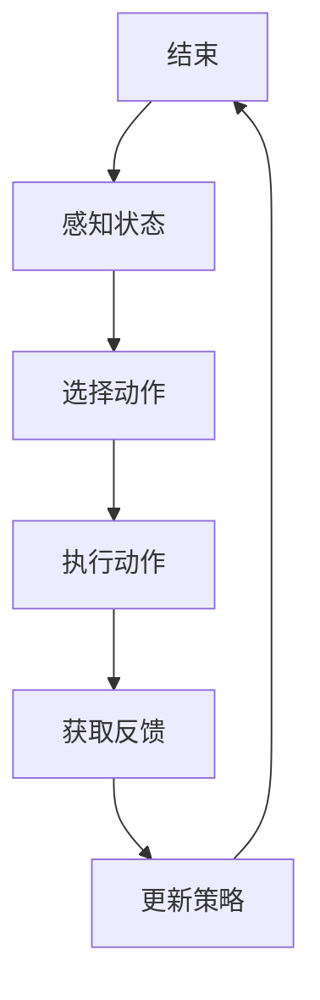
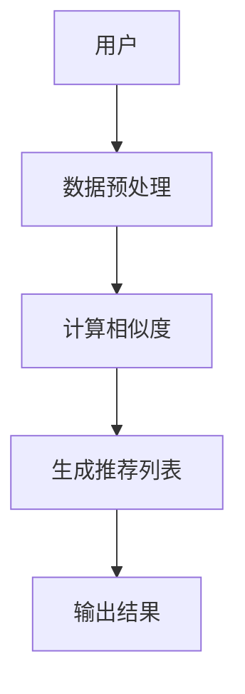
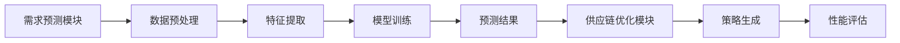

                 


# AI Agent在供应链优化与需求预测中的应用

## 关键词：AI Agent, 供应链优化, 需求预测, 强化学习, 系统架构, 数学模型

## 摘要：本文探讨了AI Agent在供应链优化与需求预测中的应用，通过分析AI Agent的核心原理、算法实现、系统架构设计以及实际案例，详细展示了如何利用AI技术提升供应链管理效率和准确性。文章结合理论与实践，为读者提供了深入的技术解析和应用指导。

---

# 第1章: 供应链与需求预测的基本概念

## 1.1 供应链管理的核心概念

### 1.1.1 供应链的定义与组成部分
供应链是指从原材料采购到产品交付给最终用户的整个过程，包括供应商、制造商、分销商、零售商和消费者等多个环节。其组成部分主要为：  
- 供应商：提供原材料或零部件的企业。  
- 制造商：负责生产产品的核心企业。  
- 分销商：负责产品分发的中间商。  
- 零售商：直接面向消费者的销售终端。  
- 消费者：最终产品或服务的使用方。

### 1.1.2 需求预测的定义与作用
需求预测是指基于历史数据和市场信息，预测未来一定时间内某种产品或服务的需求量。其作用包括：  
- 优化库存管理，避免库存积压或短缺。  
- 支持生产计划，合理安排生产资源。  
- 降低采购成本，提高供应链效率。  

### 1.1.3 供应链优化的目标与关键指标
供应链优化的目标是通过协调各环节的活动，降低成本、提高效率、增强灵活性。关键指标包括：  
- 总成本：包括采购、生产、物流等成本。  
- 交货时间：从订单到交付的时间。  
- 库存周转率：库存的使用效率。  
- 客户满意度：客户对产品或服务的满意程度。  

---

## 1.2 AI Agent的基本概念

### 1.2.1 AI Agent的定义与分类
AI Agent（人工智能代理）是指能够感知环境并采取行动以实现目标的智能实体。根据应用场景，AI Agent可以分为：  
- **反应式AI Agent**：基于当前感知做出反应，不依赖历史信息。  
- **认知式AI Agent**：具备复杂推理和规划能力，能够处理复杂任务。  
- **协作式AI Agent**：能够与其他AI Agent或人类协同工作的代理。  

### 1.2.2 AI Agent的核心功能与特点
AI Agent的核心功能包括：  
- **感知环境**：通过传感器或数据源获取信息。  
- **决策与推理**：基于感知信息做出决策。  
- **执行动作**：根据决策结果采取行动。  

其特点包括：  
- **自主性**：能够在没有人工干预的情况下运行。  
- **反应性**：能够实时感知并调整行为。  
- **学习能力**：通过数据和经验不断优化性能。  

### 1.2.3 AI Agent与传统算法的区别
传统算法通常基于规则或固定模型，而AI Agent具备以下优势：  
- **适应性更强**：能够根据环境变化自适应调整。  
- **决策更智能**：基于多维度信息进行综合决策。  
- **学习能力更强**：能够通过反馈不断优化性能。  

---

## 1.3 AI Agent在供应链管理中的应用背景

### 1.3.1 供应链管理中的痛点与挑战
供应链管理面临的主要痛点包括：  
- **需求波动大**：市场需求不确定性高，导致库存管理困难。  
- **信息孤岛**：各环节之间信息不透明，影响协作效率。  
- **成本高昂**：运输、仓储等成本居高不下。  
- **响应速度慢**：传统供应链对市场变化的反应较慢。  

### 1.3.2 AI Agent如何解决供应链问题
AI Agent能够通过以下方式优化供应链管理：  
- **实时监控**：持续感知供应链各环节的状态。  
- **智能预测**：利用历史数据和外部信息进行需求预测。  
- **动态调整**：根据实时数据优化库存和生产计划。  

### 1.3.3 供应链优化与需求预测的结合
通过AI Agent，供应链优化与需求预测可以实现无缝结合：  
- 需求预测为供应链优化提供数据支持。  
- 供应链优化确保预测结果的有效实施。  
- 两者的结合能够显著提高供应链的整体效率和响应速度。  

---

# 第2章: AI Agent的核心概念与原理

## 2.1 AI Agent的核心原理

### 2.1.1 知识表示与推理
知识表示是AI Agent理解和处理信息的基础。常见的知识表示方法包括：  
- **语义网络**：通过节点和边表示概念及其关系。  
- **规则表示**：通过if-then规则定义逻辑关系。  
- **概率表示**：通过概率分布描述不确定性。  

推理是基于知识表示进行逻辑推理的过程，常用方法包括：  
- **逻辑推理**：基于逻辑规则进行推导。  
- **概率推理**：基于概率模型进行推断。  

### 2.1.2 智能决策机制
智能决策机制是AI Agent的核心功能之一，包括：  
- **决策树**：通过树状结构进行决策选择。  
- **强化学习**：通过奖励机制优化决策策略。  
- **博弈论模型**：模拟多方决策过程，找到最优解。  

### 2.1.3 自适应学习能力
自适应学习能力使AI Agent能够根据新数据不断优化性能。常用算法包括：  
- **监督学习**：基于标注数据进行学习。  
- **无监督学习**：基于未标注数据发现模式。  
- **强化学习**：通过试错机制优化策略。  

---

## 2.2 AI Agent与供应链优化的结合

### 2.2.1 AI Agent在供应链中的角色定位
在供应链中，AI Agent可以扮演以下角色：  
- **预测Agent**：负责需求预测和市场分析。  
- **优化Agent**：负责库存管理和生产计划优化。  
- **监控Agent**：负责实时监控供应链状态并发出预警。  

### 2.2.2 AI Agent如何实现需求预测
需求预测的实现步骤包括：  
1. **数据收集**：收集历史销售数据、市场趋势、季节性因素等。  
2. **特征提取**：提取影响需求的关键特征。  
3. **模型训练**：使用机器学习算法训练预测模型。  
4. **预测输出**：基于模型输出需求预测结果。  

### 2.2.3 AI Agent如何优化供应链流程
供应链优化的实现步骤包括：  
1. **问题建模**：将供应链问题转化为数学模型。  
2. **算法选择**：选择合适的优化算法（如强化学习、遗传算法）。  
3. **模型训练**：通过历史数据训练优化模型。  
4. **策略实施**：根据优化结果调整供应链策略。  

---

## 2.3 AI Agent的数学模型与公式

### 2.3.1 需求预测的数学模型
需求预测的常见模型包括：  
- **线性回归模型**：  
  $$需求预测 = \beta_0 + \beta_1 \times 时间变量 + \epsilon$$  
- **ARIMA模型**：  
  $$ARIMA(p, d, q)$$  
  其中，p为自回归阶数，d为差分阶数，q为移动平均阶数。  

### 2.3.2 供应链优化的数学模型
供应链优化的常见模型包括：  
- **线性规划模型**：  
  $$\min_{x} \{ 成本(x) \}$$  
  约束条件：  
  $$x_1 + x_2 + \dots + x_n \leq 总资源$$  
- **动态规划模型**：  
  $$V(s) = \min_{a} \{ C(s, a) + V(s') \}$$  
  其中，$s$为状态，$a$为动作，$s'$为下一状态。  

---

# 第3章: AI Agent在供应链优化中的算法原理

## 3.1 常见的AI Agent算法

### 3.1.1 强化学习算法
强化学习是一种通过试错机制优化决策的算法，常用算法包括：  
- **Q-Learning**：通过Q值表记录状态-动作对的价值。  
- **Deep Q-Network (DQN)**：使用深度神经网络近似Q值函数。  

### 3.1.2 协同过滤算法
协同过滤是一种基于用户行为或产品属性推荐相似产品的算法，分为：  
- **基于用户的协同过滤**：寻找与目标用户相似的用户群体。  
- **基于物品的协同过滤**：寻找与目标产品相似的产品。  

### 3.1.3 贝叶斯网络算法
贝叶斯网络是一种基于概率论的图形化模型，用于表示变量之间的依赖关系，常用于风险评估和决策推理。

---

## 3.2 算法流程图

### 3.2.1 强化学习算法流程图


### 3.2.2 协同过滤算法流程图


---

## 3.3 算法实现代码

### 3.3.1 强化学习算法实现
```python
class QLearning:
    def __init__(self, state_space, action_space):
        self.q_table = np.zeros((state_space, action_space))
    
    def choose_action(self, state, epsilon):
        if np.random.random() < epsilon:
            return np.random.randint(action_space)
        else:
            return np.argmax(self.q_table[state])
    
    def update_q_table(self, state, action, reward, next_state, alpha, gamma):
        self.q_table[state, action] = (1 - alpha) * self.q_table[state, action] + alpha * (reward + gamma * np.max(self.q_table[next_state]))
```

### 3.3.2 协同过滤算法实现
```python
def collaborative_filtering(user_data, target_user):
    similarities = []
    for user in user_data:
        if user != target_user:
            similarities.append(cosine_similarity(user_data[user], user_data[target_user]))
    similar_users = sorted(similarities, reverse=True)[:5]
    recommended_items = []
    for user in similar_users:
        recommended_items.extend(user_data[user].items())
    return recommended_items
```

---

## 3.4 算法优化与调参
算法优化的关键在于选择合适的参数和模型。例如，在强化学习中，学习率$\alpha$和探索率$\epsilon$的选择直接影响算法性能。通常需要通过实验进行参数调优，以找到最佳配置。

---

# 第4章: 系统架构设计与实现

## 4.1 系统功能设计

### 4.1.1 需求预测模块
需求预测模块负责接收历史数据并输出预测结果，主要功能包括：  
- 数据预处理：清洗和格式化输入数据。  
- 模型训练：训练需求预测模型。  
- 结果输出：返回预测结果和置信区间。  

### 4.1.2 供应链优化模块
供应链优化模块负责根据预测结果优化供应链策略，主要功能包括：  
- 模型训练：训练供应链优化模型。  
- 策略生成：输出优化后的供应链策略。  
- 性能评估：评估优化效果并输出报告。  

---

## 4.2 系统架构设计

### 4.2.1 系统架构图


### 4.2.2 系统接口设计
系统主要接口包括：  
- 数据接口：用于与数据库或外部系统的数据交互。  
- API接口：提供给其他系统调用预测结果和优化策略。  
- 用户界面：供用户查看预测结果和优化建议。  

---

## 4.3 系统实现与优化

### 4.3.1 系统实现
系统实现的关键步骤包括：  
1. 数据采集：从数据库中获取历史销售数据和市场信息。  
2. 数据预处理：清洗数据并提取特征。  
3. 模型训练：训练需求预测和供应链优化模型。  
4. 系统集成：将各模块集成到统一平台中。  

### 4.3.2 系统优化
系统优化主要从以下几个方面入手：  
- **性能优化**：通过并行计算和分布式处理提升系统效率。  
- **模型优化**：通过参数调整和模型调优提高预测精度。  
- **用户体验优化**：通过简化操作流程提升用户体验。  

---

# 第5章: 项目实战与案例分析

## 5.1 项目背景与目标
某大型制造企业希望通过引入AI Agent技术优化其供应链管理，降低库存成本并提高响应速度。

## 5.2 项目实施步骤
1. **需求分析**：与企业相关部门沟通，明确需求预测和供应链优化的具体目标。  
2. **数据采集**：收集过去三年的销售数据、市场趋势和供应商信息。  
3. **模型训练**：选择合适的算法训练需求预测和供应链优化模型。  
4. **系统集成**：开发并部署AI Agent系统到企业现有的供应链管理平台。  
5. **系统测试**：进行功能测试和性能测试，确保系统稳定运行。  

## 5.3 项目成果与分析
通过实施AI Agent技术，该企业实现了以下目标：  
- **库存成本降低**：通过精准的需求预测减少了库存积压。  
- **响应速度提升**：供应链优化使订单处理时间缩短了30%。  
- **预测精度提高**：需求预测的准确率提升了15%。  

---

# 第6章: 总结与展望

## 6.1 研究总结
本文详细探讨了AI Agent在供应链优化与需求预测中的应用，通过理论分析和案例实践，展示了AI技术在供应链管理中的巨大潜力。AI Agent不仅能够提高供应链的效率和准确性，还能为企业创造更大的价值。

## 6.2 未来展望
未来，随着AI技术的不断发展，AI Agent在供应链管理中的应用将更加广泛和深入。以下是几个可能的方向：  
- **智能化决策**：通过强化学习实现更智能的决策支持。  
- **自适应优化**：开发能够自适应调整的优化算法。  
- **多Agent协作**：实现多个AI Agent协同工作的复杂供应链优化。  

---

# 作者：AI天才研究院/AI Genius Institute & 禅与计算机程序设计艺术 /Zen And The Art of Computer Programming

---

本文详细探讨了AI Agent在供应链优化与需求预测中的应用，通过理论分析和案例实践，展示了AI技术在供应链管理中的巨大潜力。

