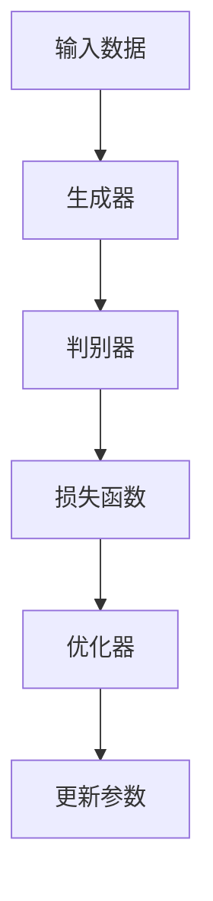
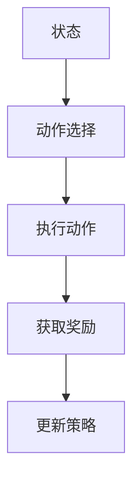
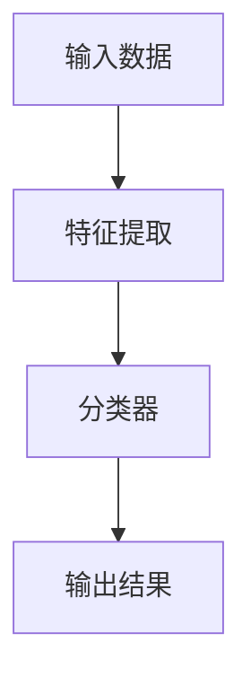
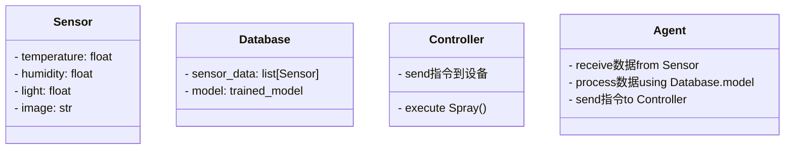
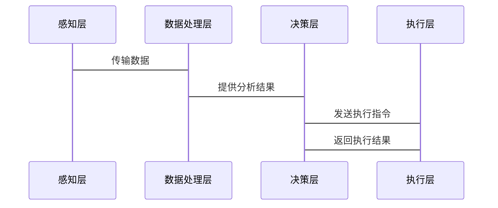

                 


# AI Agent在农业中的应用与前景

## 关键词：AI Agent, 农业, 精准农业, 病虫害监测, 农业智能化

## 摘要

人工智能（AI）代理（Agent）在农业领域的应用正逐渐改变传统农业的生产方式。AI Agent能够通过感知环境、分析数据、做出决策并执行任务，帮助农民实现精准农业管理、病虫害监测、资源优化配置等。本文将从AI Agent的基本概念、算法原理、系统架构设计、项目实战等多个方面详细探讨其在农业中的应用，并分析其未来的发展前景。

---

## 第一章：AI Agent的基本概念与农业应用背景

### 1.1 AI Agent的定义与特点

AI Agent是一种能够感知环境、自主决策并执行任务的智能体。与传统的自动化系统不同，AI Agent具备以下特点：

1. **自主性**：能够在没有人工干预的情况下自主运行。
2. **反应性**：能够实时感知环境变化并做出反应。
3. **目标导向**：具有明确的目标，能够根据目标优化决策。
4. **学习能力**：通过数据和经验不断优化自身的算法。

### 1.2 农业中的问题背景与挑战

传统农业在资源利用、病虫害防治、种植管理等方面面临诸多挑战：

- **资源浪费**：水、化肥、农药等资源的使用效率低下。
- **病虫害问题**：传统防治手段效率低，且可能对环境造成污染。
- **劳动力不足**：随着农村人口老龄化，劳动力短缺问题日益突出。
- **数据孤岛**：各环节数据分散，难以形成有效的数据闭环。

AI Agent的引入，能够通过智能化手段解决这些问题，提升农业生产的效率和可持续性。

### 1.3 AI Agent在农业中的问题解决思路

AI Agent通过以下方式解决农业问题：

1. **数据采集与分析**：利用传感器、无人机等设备实时采集农田数据，通过AI算法进行分析，提供决策支持。
2. **精准管理**：根据作物生长状况、天气变化等信息，优化水肥管理、病虫害防治等措施。
3. **自动化执行**：通过智能设备执行喷洒农药、灌溉等操作，减少人工干预。

---

## 第二章：AI Agent的核心概念与技术联系

### 2.1 AI Agent的核心概念原理

AI Agent的工作流程可以分为以下几个步骤：

1. **感知环境**：通过传感器、摄像头等设备获取农田数据。
2. **数据处理**：对采集的数据进行清洗、特征提取和分析。
3. **决策制定**：基于分析结果，结合历史数据和模型预测，制定最优决策。
4. **执行任务**：通过智能设备执行决策任务，例如喷洒农药、调整灌溉量。

### 2.2 AI Agent与相关技术的联系

AI Agent在农业中的应用涉及多种技术，包括物联网（IoT）、大数据、机器学习等。以下是AI Agent与其他技术的对比：

| 技术         | 描述                                                                 |
|--------------|----------------------------------------------------------------------|
| 物联网（IoT） | 通过传感器和网络设备采集数据，为AI Agent提供实时数据支持。                 |
| 大数据       | 处理和分析海量数据，为AI Agent的决策提供支持。                             |
| 机器学习     | 通过训练模型，AI Agent能够学习和优化决策策略。                             |
| 强化学习     | 通过与环境的交互，AI Agent能够不断优化其决策策略。                         |

---

## 第三章：AI Agent的算法原理

### 3.1 生成模型的原理与应用

生成模型（如GAN、VAE）用于生成高质量的农田数据，例如模拟作物生长情况或病虫害图像。以下是一个简单的生成模型流程：



### 3.2 强化学习的应用

强化学习（如Q-Learning、DQN）用于AI Agent的决策优化。以下是一个强化学习的流程示例：



### 3.3 监督学习的应用

监督学习用于分类任务，例如病虫害识别。以下是监督学习的流程：



### 3.4 算法实现

以下是一个简单的监督学习分类器代码示例：

```python
import numpy as np
from sklearn.linear_model import LogisticRegression

# 示例数据
X = np.array([[1, 2], [3, 4], [5, 6], [7, 8]])
y = np.array([0, 1, 0, 1])

# 训练模型
model = LogisticRegression()
model.fit(X, y)

# 预测
print(model.predict([[9, 10]]))
```

---

## 第四章：AI Agent的系统架构设计

### 4.1 问题场景介绍

假设我们正在设计一个AI Agent系统，用于监测农田中的病虫害情况。系统需要完成以下任务：

- 实时采集农田图像数据。
- 分析图像数据，识别病虫害。
- 根据识别结果，制定喷洒农药的方案。
- 执行喷洒任务。

### 4.2 系统功能设计

以下是系统功能的领域模型：



### 4.3 系统架构设计

以下是系统的架构设计：


### 4.4 系统接口设计

系统接口设计如下：



---

## 第五章：AI Agent在农业中的项目实战

### 5.1 环境安装

为了运行以下代码，需要安装以下库：

```bash
pip install numpy scikit-learn matplotlib
```

### 5.2 核心代码实现

以下是病虫害识别的代码示例：

```python
import cv2
from sklearn.svm import SVC
from sklearn.feature_extraction import image

# 加载图像数据
images = [...]  # 示例图像数据
labels = [...]   # 对应的标签

# 特征提取
features = []
for img in images:
    feature = image.hog(img)
    features.append(feature)

# 训练模型
model = SVC()
model.fit(features, labels)

# 预测
new_img = cv2.imread("test.jpg")
new_feature = image.hog(new_img)
print(model.predict([new_feature]))
```

### 5.3 案例分析

以病虫害监测为例，AI Agent能够通过图像识别技术快速识别病虫害类型，并根据历史数据和天气情况，推荐最佳的防治方案。

### 5.4 项目小结

通过以上实战，我们可以看到AI Agent在农业中的巨大潜力。通过不断优化算法和模型，AI Agent能够帮助农民实现更高效、更精准的农业生产。

---

## 第六章：AI Agent在农业中的应用场景分析

### 6.1 精准农业

AI Agent通过实时监测土壤湿度、温度等数据，优化灌溉和施肥方案，减少资源浪费。

### 6.2 病虫害监测与防治

通过图像识别和数据分析，AI Agent能够快速识别病虫害，并制定最佳防治方案。

### 6.3 农业资源优化配置

AI Agent能够优化种植计划、劳动力分配等，提高资源利用效率。

---

## 第七章：AI Agent在农业中的未来发展趋势与挑战

### 7.1 未来发展趋势

1. **技术融合**：AI Agent将与物联网、区块链等技术深度融合，形成更高效的农业生态系统。
2. **边缘计算**：边缘计算的应用将减少数据传输延迟，提高AI Agent的实时响应能力。
3. **自主学习**：AI Agent将具备更强的自主学习能力，能够根据环境变化自适应调整策略。

### 7.2 当前面临的挑战

1. **数据隐私**：农业数据的隐私保护问题需要引起重视。
2. **技术成本**：AI Agent的应用需要较高的技术投入和成本，限制了其在小规模农场中的应用。
3. **技术标准化**：不同厂商的技术标准不统一，导致系统集成困难。

---

## 第八章：附录

### 8.1 术语表

- **AI Agent**：人工智能代理，能够自主感知、决策和执行任务的智能体。
- **精准农业**：通过智能化手段优化农业生产过程，提高效率和资源利用率。

### 8.2 工具推荐

- **TensorFlow**：深度学习框架。
- **OpenCV**：图像处理库。
- **Scikit-learn**：机器学习库。

### 8.3 数据集资源

- **COCO**：常用的目标检测数据集。
- **Kaggle**：提供丰富的农业相关数据集。

### 8.4 参考文献

- [1] LeCun Y, Bengio Y, Hinton G. Deep learning[M]. Nature, 2015.
- [2] Goodfellow I, Bengio Y, Courville A. Deep learning[M]. MIT Press, 2016.

---

## 作者：AI天才研究院 & 禅与计算机程序设计艺术

---

通过本文的详细分析，我们可以看到AI Agent在农业中的巨大潜力。未来，随着技术的不断进步，AI Agent将帮助农民实现更高效、更可持续的农业生产方式，推动农业智能化的全面发展。

