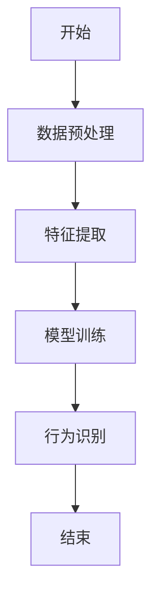

                 


# AI Agent在动物保护中的应用：行为分析与栖息地管理

**关键词**：AI Agent, 动物保护, 行为分析, 栖息地管理, 人工智能, 机器学习

**摘要**：  
本文探讨了AI Agent在动物保护中的应用，重点分析其在动物行为分析与栖息地管理中的技术原理和实际应用。文章从AI Agent的基本概念出发，结合具体案例，详细阐述了行为分析与栖息地管理的系统架构、算法实现、项目实战及最佳实践，为读者提供全面的技术视角。

---

## 第一部分: AI Agent的基本概念与动物保护背景

### 第1章: AI Agent的基本概念与动物保护背景

#### 1.1 AI Agent的定义与核心概念
AI Agent（人工智能代理）是一种能够感知环境、自主决策并执行任务的智能体。它具备以下核心属性：
- **自主性**：无需外部干预，自主完成任务。
- **反应性**：实时感知环境并做出反应。
- **目标导向性**：基于目标驱动行为。
- **学习能力**：通过经验优化决策。

AI Agent与传统AI的区别在于其具备自主性和目标导向性，能够动态适应环境变化。

#### 1.2 动物保护的背景与挑战
动物保护的核心问题包括：
- **物种灭绝**：栖息地破坏、人类活动等导致物种多样性减少。
- **行为监测**：动物行为变化反映生态健康，需实时监测。
- **栖息地管理**：保护濒危物种，需科学规划栖息地。

AI Agent在动物保护中的潜在价值：
- 提供实时监测与数据分析。
- 动态优化栖息地管理。
- 降低人为干扰，保护动物隐私。

#### 1.3 AI Agent在动物保护中的应用案例
- **行为分析案例**：监测濒危动物的活动模式，识别异常行为。
- **栖息地管理案例**：通过AI Agent优化栖息地保护策略。
- **实际应用**：AI Agent帮助保护机构提高保护效率。

---

## 第二部分: AI Agent在动物行为分析中的应用

### 第2章: AI Agent在动物行为分析中的技术实现

#### 2.1 动物行为分析的基本原理
动物行为分析旨在通过数据识别行为模式，揭示生态规律。AI Agent通过感知和学习，实现对动物行为的实时分析。

#### 2.2 AI Agent的行为分析算法
- **强化学习**：AI Agent通过奖励机制学习最佳行为策略。
- **监督学习**：基于标记数据训练分类模型。

算法流程图：


#### 2.3 数据预处理与特征提取
- **数据预处理**：去噪、标准化。
- **特征提取**：提取关键行为特征。

---

## 第三部分: AI Agent在栖息地管理中的应用

### 第3章: AI Agent在栖息地管理中的系统架构

#### 3.1 栖息地管理的核心问题
- **栖息地破坏**：人类活动导致栖息地碎片化。
- **生态平衡**：保护物种多样性。

#### 3.2 系统架构设计
系统模块：
- 数据采集模块：实时采集环境数据。
- 数据处理模块：预处理和特征提取。
- AI Agent模块：决策和优化。

系统架构图：


---

## 第四部分: 项目实战

### 第4章: 实战项目：AI Agent辅助的动物保护系统

#### 4.1 项目环境与工具安装
- **工具**：Python、TensorFlow、Scikit-learn。

#### 4.2 核心代码实现
```python
class AI-Agent:
    def __init__(self):
        self.model = self.build_model()

    def build_model(self):
        # 网络结构
        pass

    def train(self, data):
        # 训练模型
        pass

    def predict(self, input):
        # 预测行为
        pass
```

#### 4.3 案例分析与结果解读
- **案例**：监测某濒危物种的行为模式。
- **结果**：识别出异常行为，及时发出预警。

---

## 第五部分: 总结与展望

### 第5章: 总结与建议

#### 5.1 项目总结
- AI Agent在动物保护中的价值显著。
- 技术实现需结合实际需求。

#### 5.2 未来展望
- 结合边缘计算，提升实时性。
- 开发更高效的算法。

#### 5.3 实践建议
- 数据质量至关重要。
- 保护隐私与伦理。

---

## 作者信息

作者：AI天才研究院/AI Genius Institute & 禅与计算机程序设计艺术/Zen And The Art of Computer Programming

---

这篇文章系统地探讨了AI Agent在动物保护中的应用，结合技术原理和实际案例，为读者提供了全面的技术视角。

