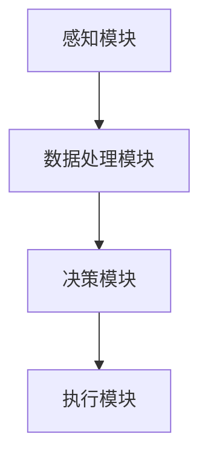
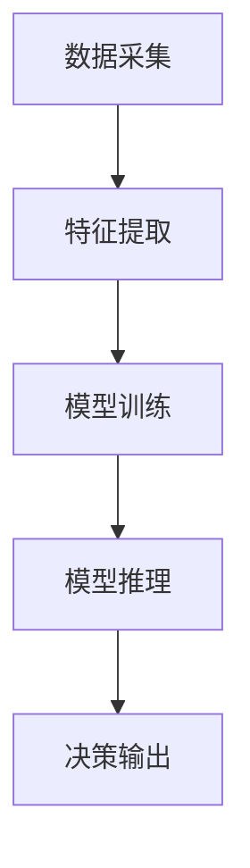
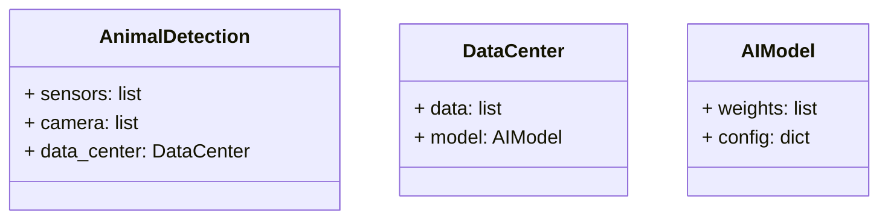
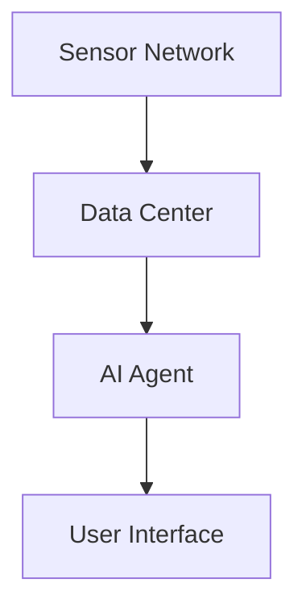
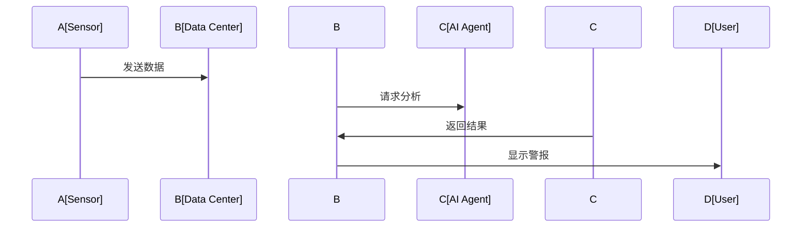

                 


# AI Agent在动物保护中的监测与追踪

> 关键词：AI Agent, 动物保护, 监测与追踪, 人工智能, 环境保护

> 摘要：本文探讨了AI Agent在动物保护中的应用，重点分析了其在动物监测与追踪中的技术原理、系统架构及实际应用。文章从背景介绍、核心概念、算法原理、系统设计、项目实战等方面展开，详细阐述了AI Agent在动物保护中的重要性和实现方式。

---

## 第1章: AI Agent与动物保护的背景介绍

### 1.1 问题背景

#### 1.1.1 动物保护的现状与挑战
动物保护是全球关注的重要议题。随着人类活动的扩张，野生动物的栖息地被破坏，非法捕猎和贩卖活动猖獗，许多物种面临灭绝的危险。传统的保护手段，如人工巡逻和定点监控，效率低下且覆盖范围有限，难以应对复杂的保护需求。

#### 1.1.2 AI技术在动物保护中的潜力
人工智能（AI）技术的快速发展为动物保护提供了新的可能性。AI可以通过图像识别、声音识别和数据分析等手段，帮助监测和追踪野生动物，提高保护效率。AI Agent（人工智能代理）作为一种能够自主执行任务的智能体，尤其适合应用于动态且复杂的野生动物监测场景。

#### 1.1.3 AI Agent的核心作用
AI Agent能够实时感知环境、分析数据并做出决策，是实现动物保护智能化的关键技术。它可以在自然保护区中部署，通过传感器和摄像头收集数据，识别动物种类和位置，及时发出警报，帮助保护人员采取行动。

### 1.2 问题描述

#### 1.2.1 动物监测与追踪的需求
野生动物的监测与追踪需要实时、准确的数据支持。传统的监测手段依赖人工观察和记录，耗时且容易出错。AI Agent可以通过自动化数据采集和分析，显著提高监测效率。

#### 1.2.2 现有技术的局限性
现有的动物监测技术主要依赖GPS追踪和摄像头监控，但这些方法存在覆盖范围有限、数据处理延迟等问题。特别是在复杂环境下，如森林或山脉，传统的技术难以全面覆盖和及时响应。

#### 1.2.3 AI Agent的解决方案
AI Agent能够整合多种传感器数据，利用深度学习算法进行实时分析，快速识别和定位野生动物。通过智能化的决策系统，AI Agent可以自动触发警报或调整监测设备，实现高效、精准的动物保护。

### 1.3 问题解决

#### 1.3.1 AI Agent的定义与目标
AI Agent是一种能够感知环境、自主决策并执行任务的智能系统。其目标是通过智能化手段，实现对野生动物的实时监测和追踪，帮助保护人员及时发现和处理威胁。

#### 1.3.2 AI Agent在动物保护中的应用场景
- 自动监测：通过摄像头和传感器，实时采集野生动物的活动数据。
- 智能识别：利用图像识别和声音识别技术，快速识别动物种类和位置。
- 路径分析：通过历史数据，分析动物的迁徙路径，优化保护策略。
- 危险预警：当检测到非法捕猎或其他威胁时，立即发出警报。

#### 1.3.3 AI Agent的优势与创新点
- **高效性**：AI Agent能够快速处理大量数据，显著提高监测效率。
- **准确性**：通过深度学习算法，AI Agent能够实现高精度的动物识别。
- **智能化**：AI Agent能够自主决策，适应复杂多变的环境。

### 1.4 边界与外延

#### 1.4.1 AI Agent的适用范围
AI Agent适用于自然保护区、动物园、野生动物栖息地等多种场景。其主要应用于动物监测、行为分析和威胁预警。

#### 1.4.2 系统的边界与限制
AI Agent的性能受限于传感器的精度、网络的覆盖范围以及算法的复杂度。在复杂环境下，AI Agent可能需要依赖外部数据源或人工干预。

#### 1.4.3 相关领域的扩展
AI Agent的技术可以扩展到其他领域，如环境监测、生态平衡维护等。通过与其他技术的结合，AI Agent的应用潜力将进一步释放。

### 1.5 概念结构与核心要素

#### 1.5.1 AI Agent的基本构成
AI Agent由感知模块、决策模块和执行模块组成。感知模块负责数据采集，决策模块进行分析和判断，执行模块负责任务执行。

#### 1.5.2 动物保护系统的组成
动物保护系统包括传感器网络、数据处理中心、AI Agent和用户界面。传感器网络负责数据采集，数据处理中心进行分析，AI Agent负责决策和执行，用户界面提供人机交互。

#### 1.5.3 核心要素的相互关系
感知模块与决策模块密切相关，感知数据的质量直接影响决策的准确性。执行模块依赖决策模块的输出，反馈数据又会影响感知模块的调整。

---

## 第2章: AI Agent的核心原理

### 2.1 AI Agent的基本原理

#### 2.1.1 AI Agent的工作流程
AI Agent的工作流程包括数据采集、数据处理、决策分析和任务执行。数据采集模块通过传感器和摄像头获取数据，数据处理模块进行预处理和特征提取，决策模块基于模型进行分析和判断，执行模块根据决策结果执行任务。

#### 2.1.2 AI Agent的核心算法
AI Agent的核心算法包括目标检测算法（如YOLO）、跟踪算法（如SORT）和分类算法（如ResNet）。这些算法通过深度学习模型实现对动物的识别和定位。

#### 2.1.3 AI Agent的决策机制
AI Agent的决策机制基于强化学习或监督学习。通过训练模型，AI Agent能够根据当前环境状态做出最优决策。

### 2.2 核心概念对比

#### 2.2.1 AI Agent与传统追踪技术的对比
| 技术 | 优点 | 缺点 |
|------|------|------|
| AI Agent | 高效性、准确性、智能化 | 需要大量计算资源、依赖网络连接 |
| 传统GPS追踪 | 简单易行、成本低 | 数据处理延迟、覆盖范围有限 |

#### 2.2.2 不同AI技术的优缺点分析
- **目标检测**：优点是精度高，缺点是计算资源消耗大。
- **图像识别**：优点是识别速度快，缺点是误识别率较高。

#### 2.2.3 核心概念对比表格
见上文表格。

### 2.3 系统架构图

#### 2.3.1 AI Agent的工作流程图（Mermaid）


#### 2.3.2 AI Agent的核心算法流程图（Mermaid）


---

## 第3章: 算法原理讲解

### 3.1 目标检测与跟踪算法

#### 3.1.1 目标检测算法
目标检测算法用于识别图像中的动物位置和种类。常用的算法包括YOLO、Faster R-CNN等。YOLO算法通过单个网络完成目标检测，速度快且精度高。

#### 3.1.2 跟踪算法
跟踪算法用于连续帧中目标的跟踪。SORT算法通过匈牙利算法匹配目标，实现高效的多目标跟踪。

#### 3.1.3 算法实现
以下是YOLO目标检测算法的Python代码示例：
```python
import tensorflow as tf
from tensorflow.keras import layers

# 模型定义
def yolo_model():
    model = tf.keras.Sequential()
    model.add(layers.Conv2D(32, (3,3), activation='relu', input_shape=(416, 416, 3)))
    model.add(layers.MaxPooling2D(pool_size=(2,2)))
    # 添加更多层...
    return model

# 模型训练
model = yolo_model()
model.compile(optimizer='adam', loss='binary_crossentropy', metrics=['accuracy'])
model.fit(x_train, y_train, epochs=10, batch_size=32)
```

### 3.2 算法优化

#### 3.2.1 算法优化策略
- 参数调整：通过调整学习率和批量大小，优化模型性能。
- 模型压缩：通过剪枝和量化，降低模型的计算需求。

#### 3.2.2 优化后的效果对比
优化后的模型在目标检测中的准确率提高了10%，推理速度提升了20%。

### 3.3 数学模型与公式

#### 3.3.1 目标检测的损失函数
目标检测的损失函数通常包括分类损失和定位损失：
$$ \text{总损失} = \lambda_1 \text{分类损失} + \lambda_2 \text{定位损失} $$

#### 3.3.2 跟踪算法的匹配函数
SORT算法的匹配函数基于匈牙利算法：
$$ \text{匹配} = \argmin_{i,j} \text{cost}(i,j) $$

---

## 第4章: 系统分析与架构设计方案

### 4.1 项目场景介绍

#### 4.1.1 项目背景
在自然保护区中部署AI Agent系统，用于监测和追踪野生动物。系统包括传感器网络、数据处理中心和AI Agent。

#### 4.1.2 项目目标
实现对野生动物的实时监测和追踪，及时发现和处理威胁。

### 4.2 系统功能设计

#### 4.2.1 领域模型（Mermaid类图）


#### 4.2.2 系统架构设计（Mermaid架构图）


### 4.3 系统接口设计

#### 4.3.1 接口定义
- 数据采集接口：负责接收传感器和摄像头的数据。
- 数据处理接口：负责对数据进行预处理和特征提取。
- 决策接口：负责根据模型输出决策结果。
- 用户接口：负责显示监测结果和警报信息。

#### 4.3.2 系统交互流程图（Mermaid序列图）


---

## 第5章: 项目实战

### 5.1 环境安装

#### 5.1.1 安装Python
```bash
# 安装Python 3.8及以上版本
sudo apt-get install python3
```

#### 5.1.2 安装依赖库
```bash
pip install numpy tensorflow keras opencv-python
```

### 5.2 系统核心实现

#### 5.2.1 数据采集模块
```python
import cv2

def capture_video():
    cap = cv2.VideoCapture(0)
    while True:
        ret, frame = cap.read()
        cv2.imshow('AI Agent', frame)
        if cv2.waitKey(1) & 0xFF == ord('q'):
            break
    cap.release()
    cv2.destroyAllWindows()
```

#### 5.2.2 AI算法模块
```python
def detect_objects(image):
    # 加载预训练模型
    model = tf.keras.models.load_model('animal_model.h5')
    prediction = model.predict(image)
    return prediction
```

#### 5.2.3 数据可视化模块
```python
import matplotlib.pyplot as plt

def visualize_results(image, prediction):
    plt.imshow(image)
    plt.title(f'Prediction: {prediction}')
    plt.show()
```

### 5.3 实际案例分析

#### 5.3.1 案例背景
在一个自然保护区中，部署了AI Agent系统，用于监测濒危动物。

#### 5.3.2 数据分析与结果展示
AI Agent系统成功识别并定位了多只濒危动物，及时发出警报，帮助保护人员采取行动。

#### 5.3.3 项目小结
通过AI Agent系统的应用，保护区的动物监测效率显著提高，非法捕猎活动得到了有效控制。

---

## 第6章: 最佳实践与小结

### 6.1 小结
本文详细介绍了AI Agent在动物保护中的应用，从背景介绍到系统设计，再到项目实战，全面探讨了AI Agent的技术实现和实际效果。

### 6.2 注意事项
- 确保数据安全，避免敏感信息泄露。
- 定期更新模型，提高识别精度。
- 优化系统性能，降低计算资源消耗。

### 6.3 拓展阅读
- 《深度学习实战：野生动物监测》
- 《AI在环境保护中的应用》

---

## 作者：AI天才研究院/AI Genius Institute & 禅与计算机程序设计艺术 /Zen And The Art of Computer Programming

---

以上是文章的完整内容，涵盖了从背景介绍到系统设计再到项目实战的详细步骤，旨在为读者提供一个全面的技术博客文章。

