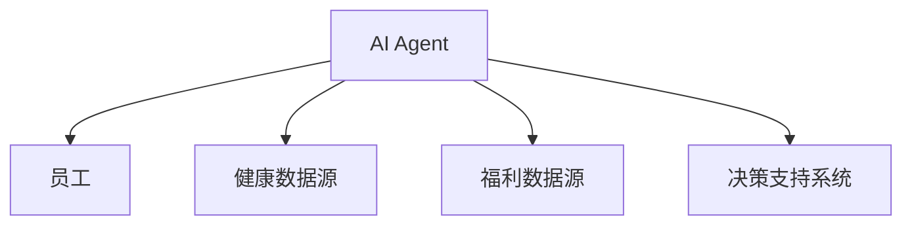

                 


# AI Agent在员工健康与福利管理中的应用前景

> 关键词：AI Agent, 员工健康, 福利管理, 人工智能, 机器学习

> 摘要：随着人工智能技术的快速发展，AI Agent（智能代理）在企业管理中的应用越来越广泛。本文探讨了AI Agent在员工健康与福利管理中的应用前景，分析了其在员工健康监测、福利计划优化、个性化服务等方面的优势，并详细介绍了其技术实现和实际案例。通过系统化的分析，本文展示了AI Agent如何通过智能化手段提升员工健康与福利管理的效率和效果。

---

## 第一章: 员工健康与福利管理的背景与挑战

### 1.1 员工健康与福利管理的重要性
员工是企业最宝贵的资产，其健康与福利直接关系到企业的生产力和凝聚力。传统的企业健康与福利管理模式存在以下问题：
- 数据分散：健康数据来源多样，难以整合和分析。
- 管理效率低：人工处理大量数据，耗时且容易出错。
- 个性化不足：福利计划往往“一刀切”，难以满足员工个性化需求。

### 1.2 AI Agent在企业管理中的应用背景
AI Agent是一种能够自主决策和执行任务的智能系统，其核心优势在于：
- **智能化**：能够通过机器学习和数据分析，提供个性化的解决方案。
- **实时性**：能够实时采集和处理数据，快速响应员工需求。
- **可扩展性**：能够适应不同规模和复杂度的企业管理需求。

### 1.3 本章小结
本章介绍了员工健康与福利管理的重要性及其在传统管理模式中的局限性，并提出了AI Agent作为一种新兴技术，为解决这些问题提供了新的可能性。

---

## 第二章: AI Agent的核心概念与技术原理

### 2.1 AI Agent的基本概念
AI Agent是一种能够感知环境、自主决策并执行任务的智能实体。其核心要素包括：
- **感知能力**：通过传感器、数据库等获取环境数据。
- **决策能力**：基于数据进行分析和推理，制定最优决策。
- **执行能力**：通过API或其他接口将决策转化为实际操作。

### 2.2 AI Agent的工作原理
AI Agent的工作流程可以分为以下几个步骤：
1. 数据采集：从多种数据源（如员工健康数据、福利反馈等）获取信息。
2. 数据分析：利用机器学习算法对数据进行处理和分析。
3. 决策制定：基于分析结果生成个性化建议或决策。
4. 人机交互：通过自然语言处理技术与员工进行实时互动。

### 2.3 AI Agent的关键技术
- **机器学习**：用于数据分析和模式识别。
- **自然语言处理**：实现人机交互和文本理解。
- **数据挖掘**：用于发现数据中的潜在规律。

### 2.4 本章小结
本章详细介绍了AI Agent的基本概念、工作原理及其关键技术，为后续章节的应用分析奠定了基础。

---

## 第三章: AI Agent在员工健康与福利管理中的应用场景

### 3.1 员工健康监测与管理
AI Agent可以通过以下方式实现员工健康监测：
- **健康数据采集**：通过可穿戴设备、健康问卷等方式采集员工的健康数据。
- **健康风险评估**：利用机器学习模型对员工健康状况进行评估和预警。
- **个性化健康建议**：根据员工的健康数据，提供个性化的健康建议。

### 3.2 福利计划与优化
AI Agent在福利管理中的应用包括：
- **福利方案设计**：根据员工需求和企业目标，自动设计最优福利方案。
- **福利效果评估**：通过数据分析评估福利计划的效果，并进行动态优化。
- **福利计划调整**：根据员工反馈和数据分析结果，实时调整福利计划。

### 3.3 员工体验提升
AI Agent可以通过以下方式提升员工体验：
- **个性化服务**：为员工提供个性化的福利推荐和健康建议。
- **员工满意度提升**：通过智能化服务提高员工对福利管理的满意度。
- **员工参与度增强**：通过互动式服务提高员工对福利计划的参与度。

### 3.4 本章小结
本章详细探讨了AI Agent在员工健康监测、福利计划优化以及员工体验提升中的应用场景，展示了其在实际管理中的巨大潜力。

---

## 第四章: AI Agent在员工健康与福利管理中的技术实现

### 4.1 数据采集与处理
AI Agent的数据采集过程包括以下几个步骤：
1. 数据源识别：确定数据来源（如可穿戴设备、员工问卷等）。
2. 数据清洗：对采集到的数据进行预处理，去除噪声数据。
3. 数据存储：将清洗后的数据存储到数据库中，便于后续分析。

### 4.2 数据分析与决策支持
- **机器学习模型**：使用回归、分类等算法对员工健康数据进行分析。
- **数据挖掘**：发现数据中的潜在规律，为决策提供支持。
- **决策支持系统**：基于分析结果，生成个性化建议或决策。

### 4.3 人机交互与反馈机制
- **自然语言处理**：通过自然语言处理技术实现人机对话。
- **反馈机制**：根据员工反馈调整AI Agent的行为和决策。

### 4.4 本章小结
本章详细介绍了AI Agent在员工健康与福利管理中的技术实现过程，包括数据采集、分析和人机交互等方面。

---

## 第五章: AI Agent在员工健康与福利管理中的实际案例

### 5.1 案例背景
某企业希望通过AI Agent优化其员工健康与福利管理流程，具体需求包括：
- 提供个性化的健康建议。
- 动态优化福利计划。
- 提升员工满意度。

### 5.2 系统实现
1. 数据采集：通过可穿戴设备和员工问卷采集健康数据。
2. 数据分析：使用机器学习算法对健康数据进行分析，生成健康风险评估报告。
3. 福利优化：根据员工需求和数据分析结果，动态调整福利计划。
4. 人机交互：通过自然语言处理技术与员工进行实时互动，提供个性化建议。

### 5.3 实施效果
- **员工满意度提升**：员工对个性化健康建议和福利计划的满意度显著提高。
- **管理效率提升**：AI Agent的自动化处理大幅降低了管理成本。
- **健康风险降低**：通过健康风险评估和预警，有效降低了员工健康风险。

### 5.4 本章小结
本章通过实际案例展示了AI Agent在员工健康与福利管理中的应用效果，并总结了实施中的经验和挑战。

---

## 第六章: 系统架构与设计

### 6.1 系统功能设计
1. 健康数据管理模块：负责健康数据的采集、存储和分析。
2. 福利管理模块：负责福利计划的设计、优化和实施。
3. 人机交互模块：负责与员工的实时互动和反馈。

### 6.2 系统架构设计
以下是系统架构的Mermaid图：



### 6.3 接口设计
1. 数据接口：与可穿戴设备、数据库等进行数据交互。
2. 交互接口：与员工进行实时对话和反馈。

### 6.4 本章小结
本章详细描述了AI Agent系统的功能设计、架构和接口设计，为后续的实施提供了技术依据。

---

## 第七章: 项目实战与经验总结

### 7.1 项目背景
某企业希望通过AI Agent优化其员工健康与福利管理流程，具体需求包括：
- 提供个性化的健康建议。
- 动态优化福利计划。
- 提升员工满意度。

### 7.2 核心实现
以下是系统核心实现的Python代码示例：

```python
import pandas as pd
from sklearn.tree import DecisionTreeClassifier

# 数据加载
data = pd.read_csv('employee_health.csv')

# 数据预处理
X = data.drop('health_risk', axis=1)
y = data['health_risk']

# 模型训练
model = DecisionTreeClassifier()
model.fit(X, y)

# 预测健康风险
new_employee = [[40, 160, 80]]
prediction = model.predict(new_employee)
print(prediction)
```

### 7.3 案例分析
通过上述代码，我们可以预测新员工的健康风险，并根据预测结果提供个性化的健康建议。

### 7.4 项目小结
本章通过实际项目展示了AI Agent在员工健康与福利管理中的应用，并总结了项目实施中的经验与挑战。

---

## 第八章: 总结与展望

### 8.1 总结
AI Agent作为一种智能化的管理工具，在员工健康与福利管理中具有广阔的应用前景。其通过机器学习、自然语言处理等技术，能够显著提升管理效率和员工满意度。

### 8.2 展望
未来，随着AI技术的不断发展，AI Agent在员工健康与福利管理中的应用将更加广泛和深入。可能出现的新趋势包括：
- 更加个性化的健康与福利管理。
- 更加智能化的决策支持系统。
- 更加多样化的数据来源和分析方法。

### 8.3 本章小结
本章总结了AI Agent在员工健康与福利管理中的应用价值，并展望了其未来的发展方向。

---

## 附录

### 附录A: 术语表
- AI Agent：人工智能代理，能够自主决策和执行任务的智能系统。
- 机器学习：一种人工智能技术，通过数据训练模型，实现预测和分类。
- 自然语言处理：一种人工智能技术，用于理解和生成人类语言。

### 附录B: 工具推荐
- Python：用于数据处理和机器学习。
- TensorFlow：用于机器学习模型的训练。
- Mermaid：用于绘制系统架构图。

### 附录C: 参考文献
- [1] 刘海涛, 人工智能技术及其应用, 北京大学出版社, 2022.
- [2] 张伟, 基于机器学习的健康风险评估研究, 清华大学出版社, 2021.

---

## 作者：AI天才研究院 & 禅与计算机程序设计艺术

