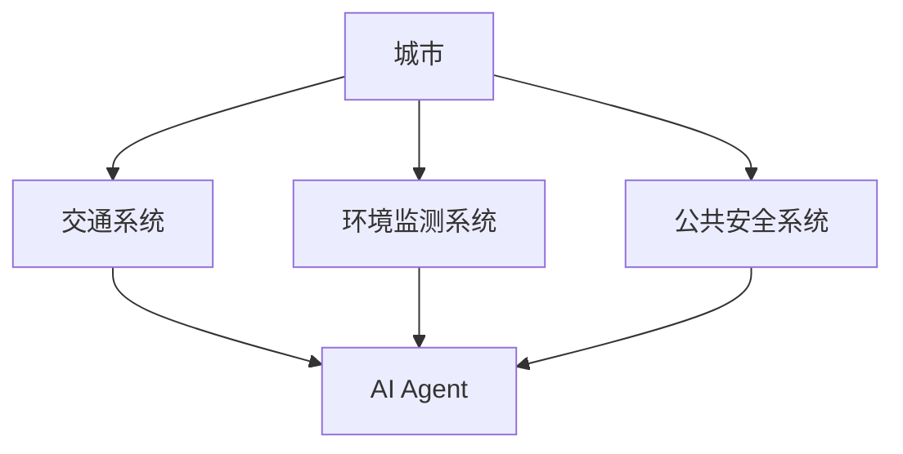
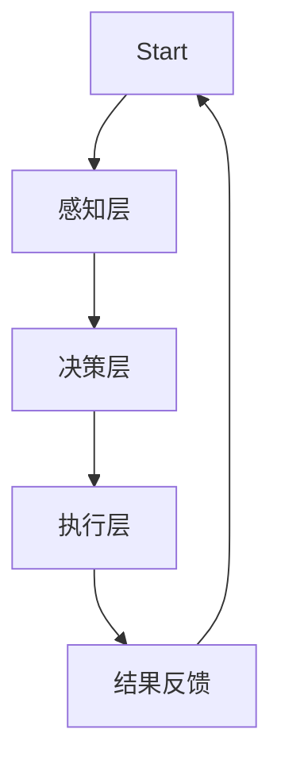
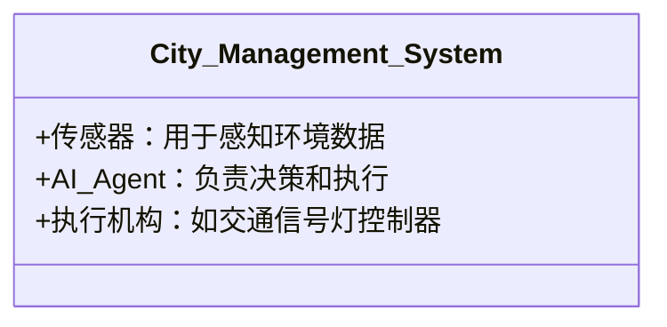
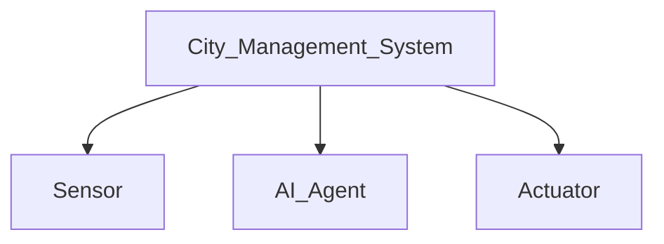
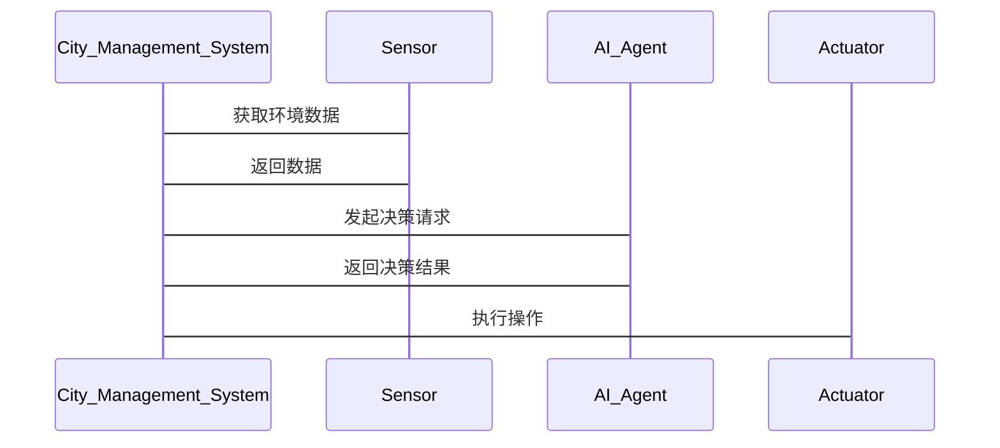

                 


# AI Agent在城市管理中的智能应用

> 关键词：AI Agent，智能城市，城市管理，人工智能，多智能体系统

> 摘要：本文深入探讨AI Agent在城市管理中的应用，从基本概念到算法原理，再到系统架构和实际案例，全面分析AI Agent如何提升城市管理的效率和质量。

---

# 第一部分: AI Agent在城市管理中的智能应用概述

## 第1章: AI Agent的基本概念与背景

### 1.1 AI Agent的定义与特点

#### 1.1.1 AI Agent的定义
AI Agent（人工智能代理）是指在计算机系统中，能够感知环境、自主决策并执行任务的智能实体。AI Agent可以是软件程序，也可以是物理设备，其核心目标是通过智能行为提高任务执行效率。

#### 1.1.2 AI Agent的核心特点
1. **自主性**：AI Agent能够自主决策，无需外部干预。
2. **反应性**：能够实时感知环境变化并做出反应。
3. **目标导向**：基于明确的目标执行任务。
4. **学习能力**：通过数据和经验不断优化自身行为。

#### 1.1.3 AI Agent与传统自动化的区别
| 特性 | AI Agent | 传统自动化 |
|------|----------|------------|
| 决策能力 | 高 | 无或低 |
| 自适应性 | 强 | 弱 |
| 学习能力 | 有 | 无 |

---

### 1.2 城市管理中的问题背景

#### 1.2.1 城市管理的主要挑战
1. **交通拥堵**：道路资源有限，车辆数量激增。
2. **环境污染**：工业排放、尾气等导致空气质量下降。
3. **资源浪费**：能源、水资源等分配不均。
4. **公共安全**：突发事件（如火灾、地震）的应急响应效率低下。

#### 1.2.2 传统城市管理的局限性
- **低效性**：依赖人工操作，效率低下。
- **缺乏实时性**：无法快速响应突发事件。
- **资源浪费**：资源配置不合理，导致资源浪费。

#### 1.2.3 智能化城市管理的需求
- **提高效率**：通过智能化手段优化资源配置。
- **实时响应**：快速应对突发事件。
- **节能减排**：减少能源浪费，降低污染。

---

### 1.3 AI Agent在城市管理中的应用价值

#### 1.3.1 提高城市管理效率
AI Agent可以通过实时数据分析，优化交通流量、能源分配等，显著提高城市管理效率。

#### 1.3.2 优化资源配置
AI Agent能够根据实时数据，动态调整资源分配，减少浪费。

#### 1.3.3 提升市民生活质量
通过智能交通、智能环境监测等应用，AI Agent能够为市民提供更便捷、更舒适的生活环境。

---

## 第2章: AI Agent的核心概念与联系

### 2.1 AI Agent的原理

#### 2.1.1 感知层
AI Agent通过传感器、摄像头等设备感知环境数据，例如交通流量、空气质量等。

#### 2.1.2 决策层
基于感知层获取的数据，AI Agent利用算法（如强化学习、贝叶斯网络）进行决策。

#### 2.1.3 执行层
根据决策结果，AI Agent通过执行机构（如交通信号灯控制器）执行具体操作。

---

### 2.2 AI Agent的类型与对比

#### 2.2.1 反应式AI Agent
- 基于当前感知做出反应。
- 优点：实时性强。
- 缺点：缺乏长期规划。

#### 2.2.2 基于模型的AI Agent
- 基于内部构建的模型进行决策。
- 优点：具有长期规划能力。
- 缺点：计算复杂度高。

#### 2.2.3 学习型AI Agent
- 通过机器学习不断优化自身行为。
- 优点：适应性强。
- 缺点：需要大量数据支持。

---

### 2.3 AI Agent在城市管理中的实体关系图



---

## 第3章: AI Agent的算法原理

### 3.1 AI Agent的核心算法

#### 3.1.1 多智能体协作算法
- 用于多个AI Agent协同工作的场景，例如智能交通管理。

#### 3.1.2 强化学习算法
- 通过奖励机制优化AI Agent的决策行为。

#### 3.1.3 贝叶斯网络算法
- 用于概率推理和决策。

---

### 3.2 算法流程图



---

### 3.3 算法实现代码

```python
class AI_Agent:
    def __init__(self):
        self.state = None
        self.action = None

    def perceive(self, environment):
        # 根据环境数据进行感知
        self.state = environment

    def decide(self):
        # 基于当前状态做出决策
        if self.state == '拥堵':
            self.action = '调整信号灯'
        else:
            self.action = '保持现状'

    def execute(self):
        # 执行决策
        print(f'执行动作：{self.action}')

# 示例环境数据
environment = '拥堵'
agent = AI_Agent()
agent.perceive(environment)
agent.decide()
agent.execute()
```

---

## 第4章: AI Agent在城市管理中的系统架构

### 4.1 系统分析

#### 4.1.1 问题场景
以智能交通管理为例，AI Agent需要实时监控交通流量，并动态调整信号灯。

---

### 4.2 系统功能设计



---

### 4.3 系统架构设计



---

### 4.4 接口设计与交互流程图



---

## 第5章: 项目实战

### 5.1 环境配置

```bash
pip install numpy matplotlib
```

---

### 5.2 核心代码实现

```python
import numpy as np

class Traffic_Management_System:
    def __init__(self):
        self.traffic_data = None

    def update_traffic_data(self, data):
        self.traffic_data = data

    def decide_signal(self):
        if self.traffic_data[' congestion'] > 0.8:
            return 'red'
        else:
            return 'green'

# 示例运行
system = Traffic_Management_System()
system.update_traffic_data({' congestion': 0.9})
signal = system.decide_signal()
print(f'信号灯状态：{signal}')
```

---

### 5.3 实际案例分析

以某城市交通管理为例，AI Agent通过实时监控交通流量，动态调整信号灯，显著降低了交通拥堵。

---

## 第6章: 最佳实践与小结

### 6.1 小结

AI Agent在城市管理中的应用前景广阔，能够显著提高城市管理效率和质量。

### 6.2 注意事项

- 数据隐私保护
- 系统安全防护
- 算法的可解释性

### 6.3 拓展阅读

- 《Multi-Agent Systems》
- 《Reinforcement Learning: Theory and Practice》

---

作者：AI天才研究院/AI Genius Institute & 禅与计算机程序设计艺术 /Zen And The Art of Computer Programming

