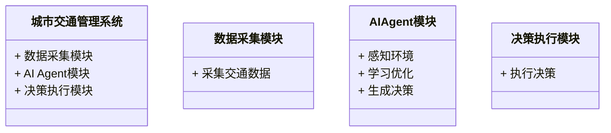
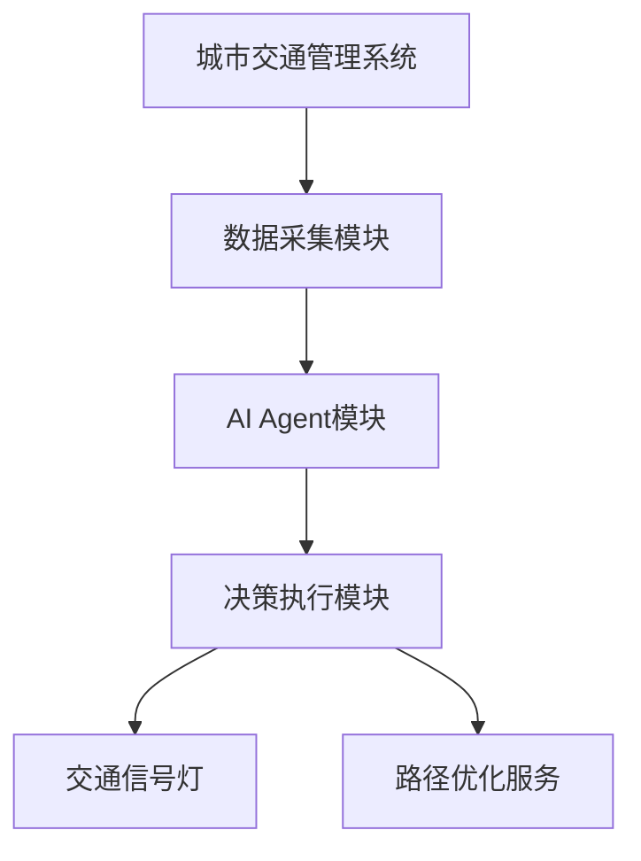

                 


# AI Agent在城市规划中的应用：智能交通与基础设施优化

> **关键词**: AI Agent, 城市规划, 智能交通, 基础设施优化, 强化学习, 多智能体协作, 城市交通管理

> **摘要**: 本文探讨AI Agent在城市规划中的应用，重点分析智能交通管理与基础设施优化的实现路径。通过理论分析、算法实现和案例研究，揭示AI Agent在解决城市交通拥堵和基础设施资源分配问题中的核心作用，展示其在智能交通信号控制、路径优化和基础设施规划中的实际应用效果。

---

## 第一章: 背景介绍

### 1.1 问题背景

#### 1.1.1 城市交通与基础设施的挑战

随着城市化进程的加快，城市人口密度和交通流量急剧增加，传统的交通管理方式已难以应对日益复杂的交通问题。城市交通拥堵、资源分配不均、环境污染等问题逐渐凸显，亟需引入智能化的解决方案。

#### 1.1.2 AI Agent在城市规划中的作用

AI Agent（人工智能代理）是一种能够感知环境、自主决策并执行任务的智能实体。在城市规划中，AI Agent可以通过实时数据采集、分析和决策，优化交通信号控制、路径规划和基础设施资源分配，从而提高城市交通效率和基础设施利用率。

#### 1.1.3 问题的边界与外延

本文聚焦于AI Agent在城市交通管理和基础设施优化中的应用，探讨其在智能交通信号控制、路径优化和基础设施规划中的具体实现。通过案例分析，展示AI Agent如何帮助城市实现更高效的交通管理和资源分配。

---

### 1.2 问题描述

#### 1.2.1 城市交通拥堵问题

城市交通拥堵是城市化进程中的一大顽疾，主要表现为交通流量波动大、交通节点饱和度高、交通事故频发等问题。传统的人工交通管理方式效率低下，难以应对复杂多变的交通环境。

#### 1.2.2 基础设施资源分配问题

城市基础设施如道路、桥梁、地铁等资源的分配不均，导致部分区域交通压力过大，而其他区域则资源浪费。如何通过智能手段优化基础设施资源分配，是城市规划中的重要课题。

#### 1.2.3 现有解决方案的局限性

传统的交通管理系统依赖人工监控和固定规则，难以实时适应交通流量的变化。基础设施规划通常基于历史数据和经验判断，缺乏动态优化的能力。

---

### 1.3 问题解决

#### 1.3.1 AI Agent的核心理念

AI Agent通过感知环境、学习优化和自主决策，实现对城市交通和基础设施的智能化管理。其核心理念包括实时感知、自主决策和动态优化。

#### 1.3.2 智能交通管理的实现路径

AI Agent通过实时采集交通数据，利用强化学习算法优化交通信号灯配时，实现交通流量的动态调节。同时，通过路径优化算法为驾驶员提供最优行驶路线，降低交通拥堵。

#### 1.3.3 基础设施优化的策略

AI Agent可以根据历史数据和实时需求，优化基础设施的布局和资源分配，提高城市交通网络的整体效率。

---

## 第二章: 核心概念与联系

### 2.1 AI Agent的定义与属性

#### 2.1.1 AI Agent的定义

AI Agent是一种能够感知环境、自主决策并执行任务的智能实体。在城市规划中，AI Agent可以是交通信号灯控制器、自动驾驶车辆的决策系统或基础设施资源分配系统。

#### 2.1.2 核心属性对比

| 属性       | 描述                                         |
|------------|----------------------------------------------|
| 感知能力   | 能够采集环境数据（如交通流量、传感器数据）    |
| 决策能力   | 基于数据进行优化决策                          |
| 自主性     | 能够自主执行任务，无需人工干预                |
| 学习能力   | 通过强化学习不断优化决策策略                  |

#### 2.1.3 ER实体关系图

```mermaid
erDiagram
    actor 城市交通管理系统的用户{}{
        用户向系统提交交通需求
    }
    class 城市交通管理系统{}{
        包含AI Agent模块
    }
    class AI Agent{}{
        感知环境数据
        分析数据并生成决策
        执行决策
    }
    用户 --> 城市交通管理系统 : 提交交通需求
    城市交通管理系统 --> AI Agent : 调用AI Agent模块
```

---

### 2.2 算法原理

#### 2.2.1 AI Agent的算法原理

AI Agent的核心算法包括强化学习（Reinforcement Learning）和多智能体协作（Multi-Agent Collaboration）。通过这些算法，AI Agent能够实现自主决策和优化。

#### 2.2.2 Q-learning算法

Q-learning是一种经典的强化学习算法，适用于离散动作空间的问题。其数学模型如下：

$$ Q(s, a) = r + \gamma \max_{a'} Q(s', a') $$

其中：
- \( Q(s, a) \) 表示在状态 \( s \) 下执行动作 \( a \) 的价值。
- \( r \) 是立即奖励。
- \( \gamma \) 是折扣因子，取值范围为 [0, 1]。

#### 2.2.3 算法实现代码

```python
import numpy as np

class QLearningAgent:
    def __init__(self, state_space_size, action_space_size, gamma=0.99):
        self.gamma = gamma
        self.q_table = np.zeros((state_space_size, action_space_size))
    
    def choose_action(self, state, epsilon=0.1):
        if np.random.random() < epsilon:
            return np.random.randint(0, action_space_size)
        return np.argmax(self.q_table[state])
    
    def learn(self, state, action, reward, next_state):
        self.q_table[state, action] = reward + self.gamma * np.max(self.q_table[next_state])
```

---

## 第三章: 系统分析与架构设计方案

### 3.1 项目背景与目标

#### 3.1.1 项目背景

本项目旨在通过AI Agent技术优化城市交通信号灯控制和基础设施资源分配，提高城市交通效率。

#### 3.1.2 项目目标

- 实现智能交通信号灯控制
- 提供最优路径规划服务
- 优化城市基础设施布局

### 3.2 系统功能设计

#### 3.2.1 领域模型类图



### 3.3 系统架构设计

#### 3.3.1 系统架构图



---

## 第四章: 项目实战

### 4.1 环境安装

- 安装Python和必要的库（如NumPy、TensorFlow）
- 安装Mermaid和LaTeX支持工具

### 4.2 系统核心实现

#### 4.2.1 交通信号灯控制

```python
import numpy as np

class TrafficLightController:
    def __init__(self, num_lights):
        self.num_lights = num_lights
        self.current_phase = 0
        self.phases = ['red', 'yellow', 'green']
    
    def update_phase(self):
        self.current_phase = (self.current_phase + 1) % 3
    
    def get_phase(self):
        return self.phases[self.current_phase]
```

---

## 第五章: 总结与展望

### 5.1 总结

AI Agent在城市规划中的应用为智能交通管理和基础设施优化提供了新的思路。通过强化学习和多智能体协作算法，AI Agent能够实现高效的交通信号控制和路径优化。

### 5.2 展望

未来，随着AI技术的不断发展，AI Agent将在城市规划中发挥更大的作用，推动城市交通管理和基础设施优化迈向更高水平。

---

**作者：AI天才研究院/AI Genius Institute & 禅与计算机程序设计艺术 /Zen And The Art of Computer Programming**

