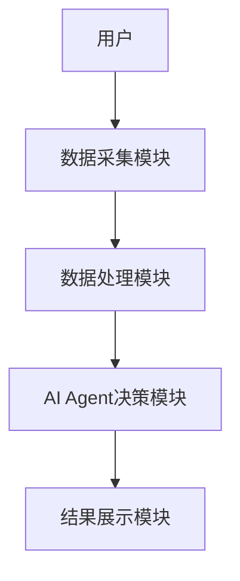

                 


# AI Agent在天文学中的应用：数据处理与模式识别

> 关键词：AI Agent，天文学，数据处理，模式识别，机器学习，恒星分类，数据可视化

> 摘要：本文探讨AI Agent在天文学中的应用，重点分析数据处理与模式识别的技术细节。通过介绍AI Agent的核心概念、天文学数据的特点、数据处理方法，以及模式识别算法在恒星分类中的应用，本文为读者提供了一套完整的解决方案，并通过实际案例展示了AI Agent在天文学中的潜力。

---

## 第1章: AI Agent与天文学的概述

### 1.1 AI Agent的基本概念

#### 1.1.1 AI Agent的定义
AI Agent（人工智能代理）是一种智能体，能够感知环境、自主决策并执行任务。它通过传感器接收信息，利用计算模型处理数据，并通过执行器与环境互动。

#### 1.1.2 AI Agent的核心特征
- **自主性**：无需外部干预，自主完成任务。
- **反应性**：实时感知环境并做出反应。
- **学习能力**：通过经验改进性能。
- **社交能力**：与其他AI Agent或人类协作。

#### 1.1.3 AI Agent与传统算法的区别
| 特性 | AI Agent | 传统算法 |
|------|----------|----------|
| 决策 | 自主决策 | 预定义规则 |
| 学习 | 可在线学习 | 无法学习 |
| 环境 | 适应动态环境 | 静态规则 |

### 1.2 天文学的基本概念

#### 1.2.1 天文学的研究领域
- 星体运动
- 星体结构
- 宇宙背景辐射
- 高能天体物理

#### 1.2.2 天文学数据的特点
- 数据量大：海量观测数据
- 数据类型多样：图像、光谱、时间序列
- 数据稀疏性：部分数据缺失或不完整

#### 1.2.3 天文学中的主要问题与挑战
- 数据处理复杂性
- 模式识别难度
- 计算资源限制

### 1.3 AI Agent在天文学中的应用背景

#### 1.3.1 数据处理的复杂性
天文学数据来自不同观测手段，格式多样，需要高效的数据清洗和预处理。

#### 1.3.2 模式识别的难点
恒星分类、星系分类等问题需要高精度的模式识别算法。

#### 1.3.3 AI Agent的优势与潜力
- 高效数据处理
- 自主学习与优化
- 实时响应与决策

---

## 第2章: AI Agent的核心原理

### 2.1 AI Agent的决策机制

#### 2.1.1 状态表示
状态表示是AI Agent感知环境的基础。常用的表示方法包括：
- **特征向量**：将环境状态转换为数值向量。
- **知识库**：存储先验知识和经验。

#### 2.1.2 行动选择
行动选择是AI Agent的核心决策过程，常用算法包括：
- **策略网络**：直接输出最佳动作。
- **Q-learning**：通过价值函数选择最优动作。

#### 2.1.3 环境交互
AI Agent通过传感器接收数据，执行器输出动作，与环境互动。

### 2.2 AI Agent的学习机制

#### 2.2.1 监督学习
通过标记数据训练模型，常用算法：
- 线性回归
- 支持向量机（SVM）

#### 2.2.2 无监督学习
发现数据中的隐含结构，常用算法：
- K-means聚类
- 主成分分析（PCA）

#### 2.2.3 强化学习
通过与环境互动获得奖励，常用算法：
- Q-learning
- Deep Q-Networks（DQN）

### 2.3 AI Agent的推理机制

#### 2.3.1 逻辑推理
基于逻辑规则进行推理，常用于规则明确的场景。

#### 2.3.2 概率推理
基于概率论进行推理，常用于不确定场景。

#### 2.3.3 类比推理
通过类比推理解决问题，常用于创新场景。

---

## 第3章: 天文学中的数据处理与模式识别

### 3.1 数据采集与预处理

#### 3.1.1 数据来源
- 光谱数据
- 影像数据
- 时间序列数据

#### 3.1.2 数据清洗
- 去除噪声
- 处理缺失值
- 标准化

#### 3.1.3 数据特征提取
- 基本特征：亮度、颜色指数
- 高阶特征：光谱特征、形态特征

### 3.2 数据存储与管理

#### 3.2.1 数据库设计
使用关系型数据库存储结构化数据。

#### 3.2.2 数据仓库构建
整合多源数据，支持高效查询。

#### 3.2.3 数据可视化
使用可视化工具展示数据分布。

---

## 第4章: 模式识别在天文学中的应用

### 4.1 恒星分类

#### 4.1.1 数据特征分析
分析光谱特征、颜色指数等。

#### 4.1.2 分类算法选择
选择支持向量机（SVM）进行分类。

#### 4.1.3 分类结果评估
使用准确率、召回率评估模型性能。

### 4.2 星系分类

#### 4.2.1 数据特征提取
提取星系的形态特征和光谱特征。

#### 4.2.2 分类算法选择
使用随机森林进行分类。

#### 4.2.3 结果分析
分析分类结果的准确性和鲁棒性。

---

## 第5章: 系统架构与项目实战

### 5.1 系统架构设计

#### 5.1.1 系统功能设计
- 数据采集模块
- 数据处理模块
- AI Agent决策模块
- 结果展示模块

#### 5.1.2 系统架构图
使用mermaid绘制系统架构图。



### 5.2 项目实战

#### 5.2.1 环境安装
- Python 3.8+
- TensorFlow 2.0+
- Scikit-learn 0.24+

#### 5.2.2 核心代码实现

```python
import numpy as np
from sklearn import svm

# 数据预处理
X = ...  # 特征数据
y = ...  # 标签数据

# 训练模型
model = svm.SVC()
model.fit(X, y)

# 预测结果
y_pred = model.predict(X)
```

### 5.2.3 结果分析
分析模型的准确率、召回率等性能指标。

---

## 第6章: 总结与展望

### 6.1 本章小结
总结AI Agent在天文学中的应用，强调数据处理和模式识别的关键作用。

### 6.2 注意事项
- 数据质量对结果影响重大。
- 算法选择需结合实际场景。
- 系统设计需考虑可扩展性和可维护性。

### 6.3 拓展阅读
推荐相关书籍和论文，供读者深入学习。

---

## 作者信息

作者：AI天才研究院（AI Genius Institute） & 禅与计算机程序设计艺术（Zen And The Art of Computer Programming）

---

通过以上步骤，您可以系统地撰写一篇结构清晰、内容详实的技术博客文章，全面展示AI Agent在天文学中的数据处理与模式识别应用。

