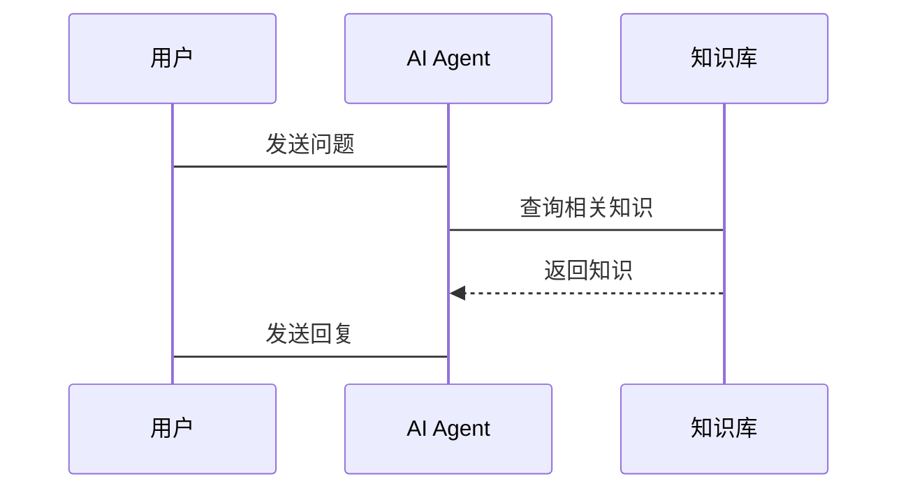

                 


# AI Agent在客户服务中的应用

## 关键词
AI Agent, 人工智能客服, 客户服务, 自然语言处理, 机器学习, 知识图谱

## 摘要
AI Agent（人工智能代理）在客户服务中的应用是当前技术领域的热点之一。本文从AI Agent的基本概念、核心原理、应用场景、系统架构设计和项目实战等多方面展开详细论述。文章首先介绍了AI Agent的定义、技术背景及其在客户服务中的价值，接着深入分析了AI Agent的核心原理，包括感知、决策和执行机制。随后，结合实际案例探讨了AI Agent在客户支持、销售自动化和客户分析等场景中的具体应用。在系统设计部分，详细阐述了AI Agent系统的架构、模块设计和接口设计，并通过mermaid流程图和类图展示了系统的结构和交互过程。最后，通过一个具体的项目案例，从环境安装到代码实现，详细讲解了AI Agent在客户服务中的实战应用。本文旨在为读者提供全面的理论知识和实践指导，帮助他们在实际应用中更好地理解和运用AI Agent技术。

## 正文

### 第1章: AI Agent的基本概念与技术背景

#### 1.1 AI Agent的定义与核心特征
AI Agent是一种能够感知环境、自主决策并执行任务的智能系统。与传统的自动化系统不同，AI Agent具备更强的自主性和适应性，能够根据实时信息动态调整行为策略。

**1.1.1 AI Agent的定义**
AI Agent是指通过感知环境信息、基于知识库和推理机制做出决策，并通过执行层完成任务的智能系统。其核心特征包括：自主性、反应性、主动性、社会性、学习能力和适应性。

**1.1.2 AI Agent的核心特征**
- **自主性**：AI Agent能够在没有外部干预的情况下自主运行。
- **反应性**：能够实时感知环境变化并做出响应。
- **主动性**：主动寻找解决问题的方法，而非被动等待指令。
- **社会性**：能够与人类或其他系统进行交互协作。
- **学习能力**：通过机器学习算法不断优化自身的知识库和行为策略。
- **适应性**：能够根据环境变化自适应调整行为。

**1.1.3 AI Agent与传统客服系统的区别**
AI Agent相较于传统客服系统，具有以下区别：

| 特性                | 传统客服系统             | AI Agent                     |
|---------------------|--------------------------|------------------------------|
| 决策方式            | 基于预设规则             | 基于机器学习和知识库         |
| 服务响应速度        | 受人工干预影响            | 实时响应，无需人工干预       |
| 服务范围            | 有限，依赖预设场景        | 具备广泛的应用场景适应性     |
| 学习与优化能力      | 无法自主学习             | 具备自主学习和优化能力       |

#### 1.2 AI Agent的技术背景
AI Agent的发展离不开自然语言处理、机器学习和大数据分析等技术的进步。

**1.2.1 自然语言处理技术的发展**
自然语言处理（NLP）是AI Agent实现人机交互的核心技术。近年来，随着深度学习的兴起，NLP技术取得了长足进步，尤其是在文本生成和意图识别方面。

**1.2.2 机器学习与深度学习的进展**
机器学习和深度学习为AI Agent提供了强大的数据处理和模式识别能力。通过训练大量数据，AI Agent能够理解和生成符合上下文的自然语言文本。

**1.2.3 大数据分析与实时响应能力**
大数据分析技术使得AI Agent能够快速处理和分析海量数据，从而实现高效的实时响应。

#### 1.3 AI Agent在客户服务中的应用现状
AI Agent在客户服务中的应用已经从理论研究走向实际应用，尤其是在银行、电商、医疗和教育等行业取得了显著成效。

**1.3.1 全球AI Agent在客户服务中的应用趋势**
- 全球范围内，AI Agent的应用正在快速增长，尤其是在客服领域的智能化转型中。
- 企业通过AI Agent实现了24/7的客户服务，显著提升了客户满意度和运营效率。

**1.3.2 国内AI Agent在客户服务中的实践案例**
- 国内企业如阿里巴巴、腾讯等在AI Agent的应用上进行了大量实践，尤其是在智能客服领域。
- 例如，支付宝的智能客服系统能够通过NLP技术理解用户意图，并通过知识图谱快速生成准确的回复。

**1.3.3 AI Agent在不同行业的应用特点**
- **金融行业**：AI Agent用于智能投顾和风险管理。
- **电商行业**：AI Agent用于客服咨询和推荐系统。
- **医疗行业**：AI Agent用于患者咨询和疾病诊断辅助。

#### 1.4 AI Agent在客户服务中的价值
AI Agent不仅提升了客户服务的效率，还带来了新的价值。

**1.4.1 提升客户满意度**
通过智能化的交互和精准的问题解决，客户能够获得更好的体验。

**1.4.2 提高服务效率**
AI Agent能够同时处理多个客户的咨询，显著提高了服务效率。

**1.4.3 降低企业运营成本**
相比传统的人工客服，AI Agent的自动化能力大幅降低了企业的运营成本。

**1.4.4 创新客户服务模式**
AI Agent的智能化和个性化服务能力为客户提供了全新的体验。

### 第2章: AI Agent的核心原理与技术架构

#### 2.1 AI Agent的核心原理
AI Agent的核心原理包括感知、决策和执行三个层面。

**2.1.1 感知层: 信息的获取与处理**
AI Agent通过自然语言处理技术获取和理解用户输入的信息。这包括文本解析、意图识别和实体识别。

**2.1.2 决策层: 知识库与推理机制**
AI Agent基于知识库和推理机制生成合适的回复。知识库通常包括FAQ、产品信息和业务规则等。

**2.1.3 执行层: 行为的生成与优化**
AI Agent根据决策层的输出生成回复，并通过强化学习不断优化自身的回复策略。

#### 2.2 AI Agent的技术架构
AI Agent的技术架构主要分为基于规则、机器学习和知识图谱三种类型。

**2.2.1 基于规则的AI Agent**
基于规则的AI Agent通过预设的规则库生成回复。这种方式适用于规则明确的场景，但灵活性较低。

**2.2.2 基于机器学习的AI Agent**
基于机器学习的AI Agent通过训练数据生成回复。这种方式具有更强的适应性和灵活性，但需要大量的数据支持。

**2.2.3 基于知识图谱的AI Agent**
基于知识图谱的AI Agent通过构建领域知识图谱生成回复。这种方式能够提供更精准和专业的回答，但构建和维护知识图谱需要较高的成本。

#### 2.3 AI Agent的算法原理
AI Agent的算法原理主要包括对话生成、意图识别和策略优化。

**2.3.1 基于RNN的对话生成算法**
循环神经网络（RNN）常用于对话生成。通过训练对话历史，RNN能够生成连贯的回复。

**2.3.2 基于BERT的意图识别算法**
BERT是一种强大的预训练语言模型，常用于意图识别。通过微调BERT模型，AI Agent能够准确识别用户的意图。

**2.3.3 基于强化学习的策略优化算法**
强化学习通过奖励机制优化AI Agent的回复策略。通过不断试错，AI Agent能够生成更符合用户期望的回复。

### 第3章: AI Agent在客户服务中的应用场景

#### 3.1 客户支持与问题解决
AI Agent在客户支持中的应用主要体现在问题识别和解决方案生成。

**3.1.1 基于自然语言理解的客户问题识别**
AI Agent通过NLP技术准确识别客户的问题，并将其分类到相应的知识库中。

**3.1.2 多轮对话中的上下文管理**
AI Agent能够保持对话的连贯性，通过上下文管理生成符合情境的回复。

**3.1.3 基于知识库的精准答案生成**
AI Agent通过查询知识库生成准确的答案，确保回复的准确性和专业性。

#### 3.2 客户关系管理
AI Agent在客户关系管理中的应用主要体现在客户分析和个性化服务。

**3.2.1 基于客户行为分析的个性化推荐**
AI Agent通过分析客户的交互记录，生成个性化的推荐方案。

**3.2.2 基于情感分析的客户情绪管理**
AI Agent通过情感分析识别客户的情绪，并根据情绪调整回复策略。

#### 3.3 客户销售自动化
AI Agent在客户销售中的应用主要体现在销售自动化和客户触达。

**3.3.1 基于AI的销售自动化工具**
AI Agent能够自动处理客户的咨询和订单，减少人工干预。

**3.3.2 基于智能推荐的客户触达**
AI Agent通过精准的推荐算法，提高客户触达率和转化率。

### 第4章: AI Agent系统的系统架构设计

#### 4.1 系统功能设计
AI Agent系统的功能设计包括用户交互、知识库管理、意图识别和回复生成。

**4.1.1 用户交互模块**
用户交互模块负责接收用户的输入，并将其传递给意图识别模块。

**4.1.2 知识库管理模块**
知识库管理模块负责管理和维护AI Agent的知识库，包括FAQ、产品信息等。

**4.1.3 意图识别模块**
意图识别模块通过NLP技术识别用户的意图，并将其传递给回复生成模块。

**4.1.4 回复生成模块**
回复生成模块根据意图和知识库生成回复，并将其传递给用户交互模块。

#### 4.2 系统架构设计
AI Agent系统的架构设计包括前端、后端和数据存储三部分。

**4.2.1 前端界面**
前端界面负责用户与AI Agent的交互，通常包括聊天界面和操作按钮。

**4.2.2 后端逻辑**
后端逻辑负责处理用户的输入，并调用相应的服务进行回复生成。

**4.2.3 数据存储**
数据存储负责存储知识库、对话记录和用户信息等数据。

#### 4.3 系统交互设计
系统交互设计主要通过mermaid序列图展示AI Agent与用户的交互流程。



### 第5章: AI Agent项目的实战应用

#### 5.1 项目环境安装
AI Agent项目的实战应用需要安装以下环境：

- Python 3.8+
- PyTorch 1.9+
- transformers库
- Scikit-learn库

安装命令如下：

```bash
pip install torch transformers scikit-learn
```

#### 5.2 系统核心实现
AI Agent系统的实现主要包含以下部分：

**5.2.1 对话生成模块**
```python
import torch
from transformers import AutoTokenizer, AutoModelForSeq2Seq

tokenizer = AutoTokenizer.from_pretrained('facebook/bart-large')
model = AutoModelForSeq2Seq.from_pretrained('facebook/bart-large')

def generate_response(input_text):
    inputs = tokenizer(input_text, return_tensors='pt')
    outputs = model.generate(inputs.input_ids, max_length=100)
    return tokenizer.decode(outputs[0], skip_special_tokens=True)
```

**5.2.2 意图识别模块**
```python
from sklearn.feature_extraction.text import TfidfVectorizer
from sklearn.naive_bayes import MultinomialNB

vectorizer = TfidfVectorizer()
model = MultinomialNB()

# 假设X_train和y_train已经准备好了
X_train = vectorizer.fit_transform(X_train)
model.fit(X_train, y_train)

def predict_intent(input_text):
    X_test = vectorizer.transform([input_text])
    y_pred = model.predict(X_test)
    return y_pred[0]
```

#### 5.3 代码实现与解读
通过上述代码实现，我们可以看到AI Agent的核心功能包括对话生成和意图识别。对话生成使用了预训练的模型，而意图识别使用了TF-IDF和朴素贝叶斯算法。

#### 5.4 案例分析与解读
通过实际案例分析，我们可以看到AI Agent在客户服务中的应用效果显著。例如，在电商客服中，AI Agent能够快速响应客户的问题，并提供准确的解决方案，显著提高了客户满意度。

### 第6章: 总结与展望

#### 6.1 总结
本文详细探讨了AI Agent在客户服务中的应用，从基本概念到实战应用，全面介绍了AI Agent的核心原理和技术架构。

#### 6.2 展望
未来，随着AI技术的不断发展，AI Agent在客户服务中的应用将更加广泛和深入。通过与5G、物联网等技术的结合，AI Agent将为企业客户提供更加智能化和个性化的服务体验。

#### 6.3 最佳实践tips
- 在实际应用中，建议企业根据自身需求选择合适的AI Agent技术方案。
- 定期更新知识库，确保AI Agent的回复准确性和专业性。
- 注重数据隐私和安全，确保客户信息的安全性。

#### 6.4 小结
AI Agent作为人工智能技术的重要应用之一，正在深刻改变客户服务的方式。通过不断的优化和创新，AI Agent将为客户带来更加智能化和个性化的服务体验。

---

**作者：AI天才研究院/AI Genius Institute & 禅与计算机程序设计艺术 /Zen And The Art of Computer Programming**

