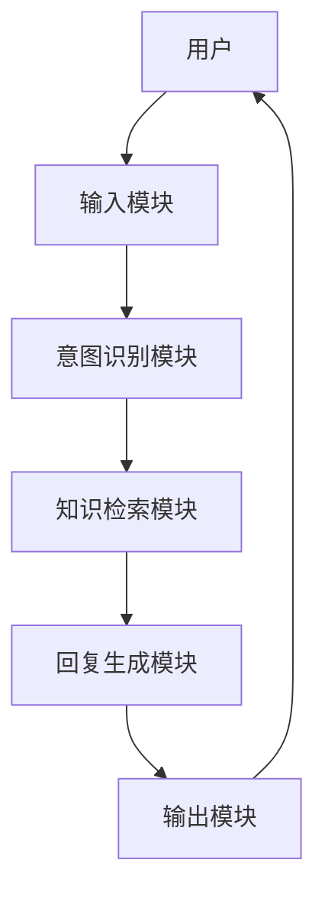
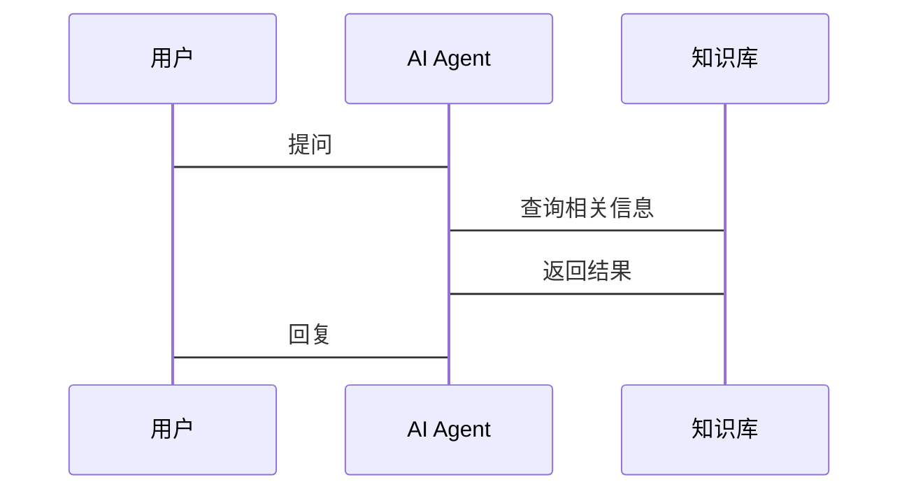

                 


# AI Agent在客户服务中的应用：提升响应速度与质量

## 关键词：AI Agent、客户服务、自然语言处理、机器学习、对话系统、响应速度、服务质量

## 摘要：  
AI Agent（人工智能代理）通过自然语言处理、机器学习和深度学习等技术，能够实现智能化的客户服务。本文详细探讨了AI Agent在客户服务中的应用，分析了其技术原理、系统架构、项目实现以及最佳实践，旨在为读者提供全面的技术指导和深度的行业洞察。

---

## 第一部分: AI Agent 在客户服务中的应用概述

### 第1章: AI Agent 的核心概念与背景

#### 1.1 AI Agent 的定义与特点
- **AI Agent 的定义**：AI Agent 是一种能够感知环境、理解用户需求并执行任务的智能系统，能够通过自然语言处理（NLP）与用户进行交互。
- **AI Agent 的特点**：
  - 智能性：能够理解上下文和用户意图。
  - 自适应性：能够根据对话历史和用户反馈进行调整。
  - 实时性：能够快速响应用户请求。

#### 1.2 客户服务的现状与挑战
- **传统客户服务的痛点**：
  - 响应速度慢：人工客服需要时间处理请求。
  - 服务质量不稳定：依赖人工经验，容易出现错误。
  - 成本高：需要大量人工投入。
- **客户对服务的需求**：
  - 24/7 的实时响应。
  - 高精度的问题解决。
  - 个性化服务体验。

#### 1.3 AI Agent 在客户服务中的应用价值
- **提升响应速度**：AI Agent 可以实时处理大量请求，减少等待时间。
- **提高服务质量**：通过自然语言处理和机器学习，AI Agent 能够准确理解用户需求，提供精准的解决方案。
- **降低企业成本**：自动化处理常见问题，减少人工客服的工作量。

### 第2章: AI Agent 的技术基础

#### 2.1 自然语言处理（NLP）基础
- **NLP 的基本概念**：NLP 是研究如何让计算机理解和生成人类语言的科学。
- **NLP 在客服中的应用**：
  - 分词：将用户输入的文本分割成词语。
  - 词性标注：识别词语的词性（如名词、动词）。
  - 意图识别：识别用户的意图（如查询订单、投诉问题）。

#### 2.2 机器学习与深度学习
- **机器学习的基本原理**：通过训练数据，机器学习模型能够自动提取特征并进行分类或回归。
- **深度学习的核心概念**：基于人工神经网络的多层次模型，能够自动提取复杂的特征。
- **机器学习在客服中的应用**：
  - 分类：将用户请求分类到不同的业务类别。
  - 预测：预测用户满意度或投诉的可能性。

#### 2.3 对话系统与知识图谱
- **对话系统的定义**：对话系统是指能够与用户进行自然语言交互的系统。
- **知识图谱的作用**：知识图谱是用于存储和管理知识的结构化数据，能够帮助AI Agent 更准确地回答问题。

---

## 第二部分: AI Agent 的算法原理与实现

### 第3章: AI Agent 的核心算法

#### 3.1 基于规则的对话系统
- **规则驱动的对话流程**：通过预定义的规则，系统能够根据输入的关键词触发相应的回复。
- **规则系统的优缺点**：
  - 优点：简单易懂，实现成本低。
  - 缺点：难以应对复杂场景，缺乏灵活性。

#### 3.2 基于机器学习的对话系统
- **基于统计的对话模型**：通过统计方法训练模型，预测下一个词的概率分布。
- **基于深度学习的对话模型**：使用循环神经网络（RNN）或变换器（Transformer）模型生成回复。
- **对话模型的训练方法**：
  - 监督学习：使用标注数据训练模型。
  - 对抗训练：通过生成器和判别器的对抗来提高生成质量。

#### 3.3 基于强化学习的对话优化
- **强化学习的基本原理**：通过奖励机制，优化对话策略。
- **强化学习在对话优化中的应用**：
  - 奖励函数的设计：根据对话的流畅性和准确性给予奖励。
  - 策略优化：通过强化学习算法（如PPO）优化对话策略。

### 第4章: AI Agent 的数学模型与公式

#### 4.1 语言模型的概率计算
- **语言模型的基本公式**：语言模型的目标是计算一个句子的概率。
  $$ P(w_1, w_2, \ldots, w_n) = \prod_{i=1}^{n} P(w_i | w_1, \ldots, w_{i-1}) $$
- **马尔可夫链的应用**：假设当前词的概率只依赖于前一个词，简化计算。
  $$ P(w_i | w_{i-1}) $$

#### 4.2 对话系统的损失函数
- **对话生成的损失函数**：交叉熵损失函数。
  $$ \text{Loss} = -\sum_{i=1}^{n} \log P(w_i | context) $$
- **强化学习的损失函数**：基于策略梯度的损失函数。
  $$ \text{Loss} = -\mathbb{E}[\log \pi(a|s) \cdot Q(s,a)] $$

---

## 第三部分: 系统分析与架构设计

### 第5章: AI Agent 的系统架构

#### 5.1 问题场景介绍
- **场景描述**：用户通过文字或语音与AI Agent交互，AI Agent根据用户需求提供服务。
- **系统功能**：
  - 用户输入：接收用户的文本或语音请求。
  - 意图识别：识别用户的意图。
  - 信息检索：从知识库中检索相关信息。
  - 生成回复：根据检索到的信息生成回复。

#### 5.2 系统架构设计
- **系统架构图**（使用Mermaid）：



#### 5.3 系统接口设计
- **输入接口**：接收用户的文本或语音输入。
- **输出接口**：将生成的回复返回给用户。
- **知识库接口**：与知识库进行交互，检索相关信息。

#### 5.4 系统交互流程
- **交互流程图**（使用Mermaid）：



---

## 第四部分: 项目实战

### 第6章: AI Agent 的实现与优化

#### 6.1 环境安装
- **安装Python**：Python 3.8+
- **安装NLP库**：如spaCy、jieba。
- **安装深度学习框架**：如TensorFlow、Keras。

#### 6.2 核心实现代码
- **意图识别代码**（基于机器学习）：

```python
import numpy as np
from sklearn.feature_extraction.text import TfidfVectorizer
from sklearn.svm import SVC

# 数据预处理
X = [...]  # 用户输入
y = [...]  # 标签

# 特征提取
vectorizer = TfidfVectorizer()
X_vec = vectorizer.fit_transform(X)

# 训练模型
model = SVC()
model.fit(X_vec, y)

# 预测
new_input = ["我需要查询订单"]
new_input_vec = vectorizer.transform(new_input)
print(model.predict(new_input_vec))
```

- **对话生成代码**（基于Transformer模型）：

```python
import tensorflow as tf
from tensorflow import keras

# 定义模型
def create_model():
    model = keras.Sequential()
    model.add(keras.layers.Embedding(input_dim=10000, output_dim=100))
    model.add(keras.layers.SpatialDropout1D(0.2))
    model.add(keras.layers.LSTM(64, return_sequences=True))
    model.add(keras.layers.Dropout(0.2))
    model.add(keras.layers.LSTM(32))
    model.add(keras.layers.Dense(10, activation='softmax'))
    return model

model = create_model()
model.compile(loss='sparse_categorical_crossentropy', optimizer='adam', metrics=['accuracy'])
model.fit(X_train, y_train, epochs=10, batch_size=32)
```

#### 6.3 实际案例分析
- **案例描述**：用户咨询订单状态。
- **代码实现**：
  - 用户输入：“我的订单号是12345，状态如何？”
  - 意图识别：识别出用户的意图是查询订单状态。
  - 知识检索：从知识库中检索订单状态信息。
  - 回复生成：生成回复：“您的订单号12345当前状态为已发货，预计将在3天内送达。”

---

## 第五部分: 最佳实践与总结

### 第7章: AI Agent 的最佳实践

#### 7.1 实践总结
- **算法选择**：根据需求选择合适的算法，如规则驱动适用于简单场景，深度学习适用于复杂场景。
- **数据质量**：确保数据的多样性和代表性，避免模型过拟合。
- **模型优化**：通过不断优化模型参数和增加训练数据，提升模型性能。

#### 7.2 注意事项
- **数据隐私**：保护用户数据，确保符合隐私保护法规。
- **系统稳定性**：确保系统在高并发情况下的稳定性。
- **用户体验**：设计友好的用户界面，提升用户体验。

#### 7.3 拓展阅读
- 推荐阅读《深度学习》（Ian Goodfellow 著）。
- 推荐学习框架：TensorFlow、PyTorch。

---

## 作者：AI天才研究院/AI Genius Institute & 禅与计算机程序设计艺术 /Zen And The Art of Computer Programming

---

本文通过详细分析AI Agent在客户服务中的应用，从技术原理到系统设计，再到项目实战，为读者提供了全面的指导。通过本文的学习，读者能够深入了解AI Agent的核心技术，并能够将其应用到实际的客户服务场景中，提升服务质量和响应速度。

