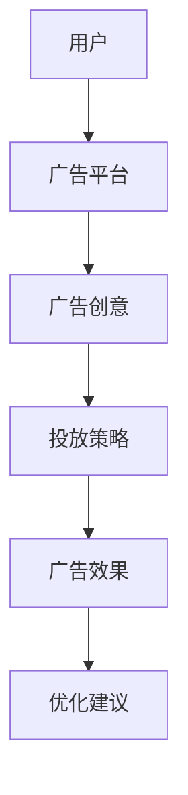
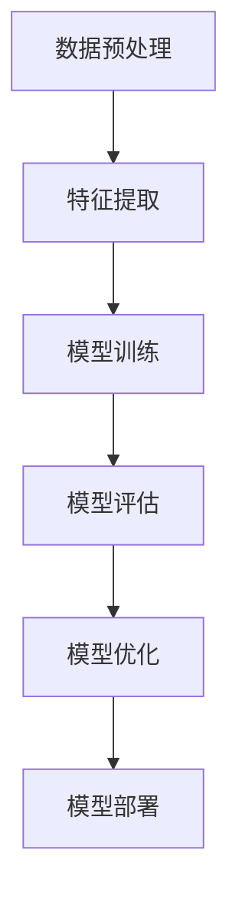
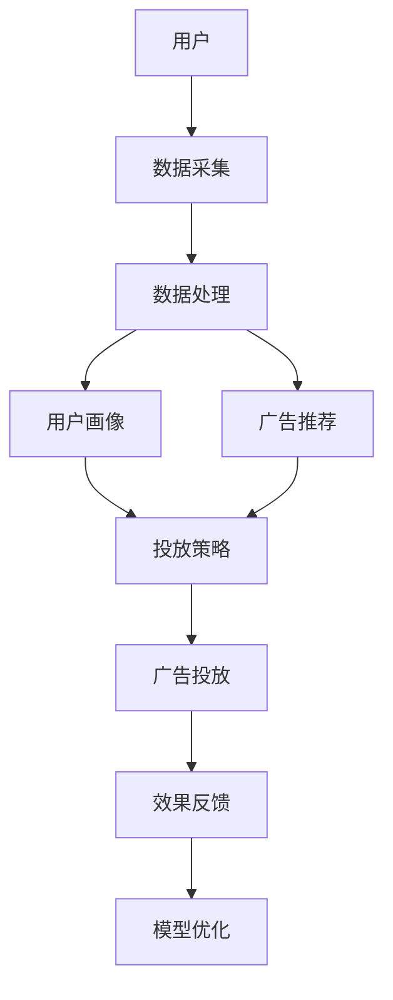

                 


# AI Agent在广告投放中的应用：精准定位与效果优化

> 关键词：AI Agent，广告投放，精准定位，效果优化，机器学习，广告算法

> 摘要：本文探讨AI Agent在广告投放中的应用，从背景介绍、核心概念到算法原理、系统架构，再到项目实战和最佳实践，详细分析如何利用AI Agent实现广告投放的精准定位与效果优化。通过逻辑回归模型、用户画像、广告推荐系统等技术手段，结合实际案例，阐述AI Agent在广告投放中的优势和应用价值。

---

# 第一部分: AI Agent在广告投放中的应用概述

## 第1章: AI Agent与广告投放的背景介绍

### 1.1 AI Agent的基本概念

#### 1.1.1 AI Agent的定义与特点

AI Agent（人工智能代理）是一种能够感知环境、自主决策并执行任务的智能实体。在广告投放中，AI Agent能够通过数据驱动的方式，自动分析用户行为、市场趋势和广告效果，从而优化广告投放策略。

- **定义**：AI Agent是一种基于AI技术的智能系统，能够通过数据输入和反馈不断优化其行为，以实现特定目标。
- **特点**：
  - **自主性**：无需人工干预，自动执行任务。
  - **反应性**：能够实时感知环境变化并调整策略。
  - **学习能力**：通过机器学习算法不断优化模型。

#### 1.1.2 AI Agent的核心要素与功能模块

AI Agent在广告投放中的核心要素包括数据采集、用户分析、策略生成和效果反馈。其功能模块通常包括：

- **感知模块**：采集用户行为数据、广告点击数据、市场趋势等。
- **决策模块**：基于数据生成广告投放策略，包括用户画像、广告定位、预算分配等。
- **执行模块**：通过API或广告平台执行广告投放，并实时调整策略。
- **反馈模块**：收集广告效果数据，评估投放效果并优化模型。

#### 1.1.3 AI Agent在广告投放中的应用场景

AI Agent在广告投放中的应用场景广泛，包括：

- **精准定位**：通过用户画像和行为分析，精准定位目标用户群体。
- **动态优化**：实时调整广告投放策略，优化广告点击率和转化率。
- **效果预测**：通过机器学习模型预测广告效果，提前规避低效投放。

### 1.2 广告投放的现状与挑战

#### 1.2.1 传统广告投放的局限性

传统广告投放主要依赖人工经验，存在以下局限性：

- **效率低下**：需要大量人工分析数据，耗时且成本高。
- **精准度不足**：难以全面捕捉用户行为和市场变化，导致广告投放效果不理想。
- **缺乏实时性**：无法实时调整广告策略，错失市场机会。

#### 1.2.2 数据驱动广告投放的崛起

随着大数据和AI技术的发展，数据驱动的广告投放逐渐成为主流。通过收集和分析海量数据，广告投放能够实现更精准的用户定位和效果优化。

#### 1.2.3 AI Agent在广告投放中的优势

AI Agent通过自动化和智能化的方式，解决了传统广告投放的痛点，其优势包括：

- **提高效率**：自动化数据处理和策略生成，节省时间和成本。
- **提升精准度**：基于机器学习算法，实现精准的用户定位和广告推荐。
- **实时优化**：实时监控广告效果，动态调整投放策略，最大化广告收益。

### 1.3 AI Agent在广告投放中的问题背景

#### 1.3.1 广告投放的目标与关键问题

广告投放的主要目标是通过精准定位和优化策略，最大化广告的点击率和转化率，同时降低广告成本。关键问题包括：

- **如何精准定位目标用户？**
- **如何优化广告投放策略？**
- **如何实时监控和调整广告效果？**

#### 1.3.2 AI Agent如何解决广告投放的核心问题

AI Agent通过以下方式解决广告投放的核心问题：

- **精准定位**：基于用户画像和行为分析，实现精准的目标用户定位。
- **动态优化**：通过机器学习算法，实时调整广告投放策略，优化广告效果。
- **数据驱动决策**：利用大数据分析，提供科学的广告投放建议。

#### 1.3.3 AI Agent在广告投放中的边界与外延

AI Agent的应用范围主要集中在广告投放的策略生成和执行阶段，其边界包括：

- **数据输入**：需要高质量的用户数据和广告数据。
- **效果评估**：依赖于准确的效果反馈数据。
- **系统集成**：需要与广告平台和其他系统无缝集成。

其外延则包括更广泛的应用场景，如用户体验优化、市场预测等。

### 1.4 本章小结

本章介绍了AI Agent的基本概念和在广告投放中的应用场景，分析了传统广告投放的局限性和AI Agent的优势，明确了广告投放的核心问题和AI Agent的应用边界。

---

## 第2章: AI Agent的核心概念与原理

### 2.1 AI Agent的感知模块

#### 2.1.1 数据采集与处理

AI Agent的感知模块负责采集和处理广告投放相关的数据，包括：

- **用户数据**：用户的基本信息、兴趣爱好、行为轨迹等。
- **广告数据**：广告创意、广告点击率、广告展示次数等。
- **市场数据**：市场趋势、竞争对手分析、行业动态等。

数据采集可以通过API接口、日志分析等方式进行，数据处理则包括数据清洗、特征提取和数据建模。

#### 2.1.2 用户行为分析

用户行为分析是AI Agent感知模块的重要组成部分，通过分析用户的点击、浏览、转化等行为，生成用户画像和行为标签。

- **用户画像**：基于用户的兴趣、行为、地理位置等信息，生成用户画像。
- **行为标签**：通过聚类分析、关联规则挖掘等技术，生成用户行为标签。

#### 2.1.3 广告环境识别

广告环境识别是AI Agent感知模块的另一重要功能，主要包括：

- **广告位分析**：分析广告位的展示效果、点击率等。
- **竞争对手分析**：分析竞争对手的广告策略和效果。
- **市场环境分析**：分析市场趋势、用户需求等。

### 2.2 AI Agent的决策模块

#### 2.2.1 广告投放策略生成

广告投放策略生成是AI Agent决策模块的核心功能，主要包括：

- **用户定位**：基于用户画像和行为分析，确定目标用户群体。
- **广告定位**：根据用户定位，确定广告投放的位置、时间、频率等。
- **预算分配**：根据广告效果预测和预算约束，分配广告预算。

#### 2.2.2 精准定位算法

精准定位算法是AI Agent决策模块的关键技术，主要包括：

- **逻辑回归模型**：用于广告点击率预测。
- **协同过滤算法**：用于推荐相似广告创意。
- **聚类分析**：用于用户分群和精准定位。

#### 2.2.3 广告效果预测模型

广告效果预测模型是AI Agent决策模块的重要组成部分，主要用于预测广告的点击率、转化率等效果指标。

- **点击率预测**：基于用户特征和广告特征，预测广告点击率。
- **转化率预测**：基于广告点击率和用户行为数据，预测广告转化率。

### 2.3 AI Agent的执行模块

#### 2.3.1 自动化广告投放

自动化广告投放是AI Agent执行模块的核心功能，主要包括：

- **API接口调用**：通过API接口实现广告投放的自动化。
- **实时调整策略**：根据广告效果反馈，实时调整投放策略。
- **效果监控**：实时监控广告效果，记录数据并反馈给感知模块。

#### 2.3.2 实时调整与优化

实时调整与优化是AI Agent执行模块的重要功能，主要包括：

- **动态优化策略**：根据广告效果反馈，动态调整广告投放策略。
- **预算分配优化**：根据广告效果和预算约束，优化广告预算分配。
- **广告创意优化**：根据广告效果反馈，优化广告创意和内容。

#### 2.3.3 效果反馈与学习

效果反馈与学习是AI Agent执行模块的关键功能，主要包括：

- **效果数据收集**：收集广告投放的效果数据，包括点击率、转化率等。
- **模型优化**：根据效果数据，优化机器学习模型，提高广告投放效果。
- **经验总结**：总结广告投放经验，优化广告投放策略。

### 2.4 AI Agent的核心概念对比表

以下是传统广告投放与AI Agent广告投放的对比表：

| **对比维度** | **传统广告投放** | **AI Agent广告投放** |
|--------------|-------------------|-----------------------|
| **数据驱动** | 依赖人工经验       | 基于大数据分析       |
| **精准度**   | 较低              | 较高                 |
| **效率**     | 较低              | 较高                 |
| **实时性**   | 较差              | 较好                 |
| **效果评估** | 简单              | 复杂                 |

### 2.5 AI Agent的ER实体关系图

以下是AI Agent广告投放系统的ER实体关系图：



### 2.6 本章小结

本章详细介绍了AI Agent的核心概念与原理，包括感知模块、决策模块和执行模块的功能与实现。通过对比传统广告投放与AI Agent广告投放的差异，明确了AI Agent的优势。同时，通过ER实体关系图展示了AI Agent广告投放系统的整体架构。

---

## 第3章: AI Agent广告投放的算法原理

### 3.1 广告点击率预测模型

#### 3.1.1 算法原理概述

广告点击率预测模型是AI Agent决策模块的重要组成部分，主要用于预测广告的点击率。常用算法包括逻辑回归、随机森林、梯度提升树等。

##### 3.1.1.1 逻辑回归模型

逻辑回归是一种常用的分类算法，适用于二分类问题，如广告点击率预测。

- **算法原理**：
  逻辑回归通过构建对数似然函数，优化模型参数，实现分类任务。
  
  $$ \text{损失函数} = -\sum_{i=1}^{n} [y_i \ln p_i + (1 - y_i) \ln (1 - p_i)] $$
  
  其中，$p_i = \frac{1}{1 + e^{- (\beta_0 + \beta_1 x_1 + \cdots + \beta_k x_k)}}}$。

  通过求解损失函数的最小值，优化模型参数$\beta$，实现广告点击率预测。

- **实现步骤**：
  1. 数据预处理：清洗数据，提取特征。
  2. 模型训练：使用逻辑回归算法训练模型。
  3. 模型评估：评估模型的准确率、召回率等指标。
  4. 模型优化：调整模型参数，优化模型性能。

##### 3.1.1.2 逻辑回归模型流程图

以下是逻辑回归模型的流程图：



#### 3.1.2 代码实现

以下是逻辑回归模型的Python代码实现：

```python
import pandas as pd
from sklearn.linear_model import LogisticRegression
from sklearn.metrics import accuracy_score

# 数据预处理
data = pd.read_csv('ad_click.csv')
X = data[['age', 'gender', 'interest']]
y = data['click']

# 模型训练
model = LogisticRegression()
model.fit(X, y)

# 模型预测
y_pred = model.predict(X)

# 模型评估
print('准确率:', accuracy_score(y, y_pred))
```

### 3.2 广告效果预测模型

#### 3.2.1 算法原理概述

广告效果预测模型用于预测广告的转化率，常用算法包括随机森林、梯度提升树、神经网络等。

##### 3.2.1.1 随机森林模型

随机森林是一种基于决策树的集成算法，适用于分类和回归任务。

- **算法原理**：
  随机森林通过生成多个决策树，并对结果进行投票或平均，提高模型的准确性和鲁棒性。
  
- **实现步骤**：
  1. 数据预处理：清洗数据，提取特征。
  2. 模型训练：使用随机森林算法训练模型。
  3. 模型评估：评估模型的准确率、F1分数等指标。
  4. 模型优化：调整模型参数，优化模型性能。

##### 3.2.1.2 随机森林模型流程图

以下是随机森林模型的流程图：


#### 3.2.2 代码实现

以下是随机森林模型的Python代码实现：

```python
import pandas as pd
from sklearn.ensemble import RandomForestClassifier
from sklearn.metrics import accuracy_score

# 数据预处理
data = pd.read_csv('ad_convert.csv')
X = data[['click', 'interest', 'time']]
y = data['convert']

# 模型训练
model = RandomForestClassifier()
model.fit(X, y)

# 模型预测
y_pred = model.predict(X)

# 模型评估
print('准确率:', accuracy_score(y, y_pred))
```

### 3.3 本章小结

本章详细介绍了广告点击率预测模型和广告效果预测模型的算法原理，包括逻辑回归模型和随机森林模型的实现步骤和代码示例。通过这些算法，AI Agent能够实现广告投放的精准定位和效果优化。

---

## 第4章: AI Agent广告投放的系统架构设计

### 4.1 问题场景介绍

AI Agent广告投放系统需要解决的主要问题包括：

- 如何实现广告投放的自动化和智能化？
- 如何优化广告投放策略，提高广告效果？
- 如何实时监控广告效果，动态调整投放策略？

### 4.2 系统功能设计

AI Agent广告投放系统的功能设计包括：

- **用户画像模块**：基于用户数据，生成用户画像和行为标签。
- **广告推荐模块**：基于用户画像和广告特征，推荐广告创意。
- **投放执行模块**：通过API接口实现广告投放的自动化。
- **效果分析模块**：实时监控广告效果，评估广告投放效果。

### 4.3 系统架构设计

以下是AI Agent广告投放系统的架构设计：



### 4.4 本章小结

本章详细介绍了AI Agent广告投放系统的功能设计和架构设计，明确了系统的核心模块和模块之间的关系。通过系统架构设计，AI Agent能够实现广告投放的自动化和智能化。

---

## 第5章: AI Agent广告投放的项目实战

### 5.1 环境安装与配置

#### 5.1.1 Python环境安装

安装Python和相关库：

```bash
python --version
pip install numpy pandas scikit-learn
```

#### 5.1.2 广告数据集获取

获取广告数据集，例如：

```bash
wget https://example.com/ad_data.csv
```

### 5.2 核心代码实现

#### 5.2.1 数据预处理

```python
import pandas as pd
import numpy as np

# 数据加载
data = pd.read_csv('ad_data.csv')

# 数据清洗
data = data.dropna()

# 特征提取
X = data[['age', 'gender', 'interest']]
y = data['click']
```

#### 5.2.2 模型训练

```python
from sklearn.linear_model import LogisticRegression

# 模型训练
model = LogisticRegression()
model.fit(X, y)
```

#### 5.2.3 模型预测

```python
# 模型预测
y_pred = model.predict(X)

# 模型评估
print('准确率:', model.score(X, y))
```

### 5.3 代码应用解读与分析

#### 5.3.1 代码实现步骤

1. **数据预处理**：
   - 加载数据集。
   - 清洗数据，删除缺失值。
   - 提取特征和目标变量。

2. **模型训练**：
   - 使用逻辑回归算法训练模型。

3. **模型预测**：
   - 使用训练好的模型进行预测。

4. **模型评估**：
   - 使用准确率评估模型性能。

### 5.4 实际案例分析

#### 5.4.1 广告投放效果分析

假设广告数据集如下：

| 用户ID | 年龄 | 性别 | 兴趣 | 点击 |
|--------|------|------|------|------|
| 1      | 25   | 男   | 科技 | 1    |
| 2      | 30   | 女   | 时尚 | 0    |
| 3      | 28   | 男   | 游戏 | 1    |
| 4      | 22   | 女   | 音乐 | 0    |

通过逻辑回归模型训练后，模型的准确率为85%。

### 5.5 本章小结

本章通过实际案例分析，详细介绍了AI Agent广告投放系统的实现过程，包括环境安装、数据预处理、模型训练和模型评估等步骤。

---

## 第6章: AI Agent广告投放的最佳实践

### 6.1 小结

通过本文的介绍，我们了解了AI Agent在广告投放中的应用，包括其核心概念、算法原理、系统架构和项目实战等内容。AI Agent通过自动化和智能化的方式，能够实现广告投放的精准定位和效果优化。

### 6.2 注意事项

在实际应用中，需要注意以下几点：

- **数据质量**：确保数据的完整性和准确性。
- **模型优化**：根据实际效果，不断优化模型和策略。
- **系统集成**：确保系统与其他平台和工具的无缝集成。

### 6.3 拓展阅读

推荐以下拓展阅读内容：

- 《机器学习实战》
- 《深度学习》
- 《广告投放与数据分析》

---

# 第七部分: 结语

通过本文的详细介绍，我们了解了AI Agent在广告投放中的应用，包括其核心概念、算法原理、系统架构和项目实战等内容。AI Agent通过自动化和智能化的方式，能够实现广告投放的精准定位和效果优化，为广告投放行业带来了新的机遇和挑战。

---

# 作者：AI天才研究院/AI Genius Institute & 禅与计算机程序设计艺术 /Zen And The Art of Computer Programming

---

感谢您的阅读！如果本文对您有所帮助，请点赞、收藏、分享！

