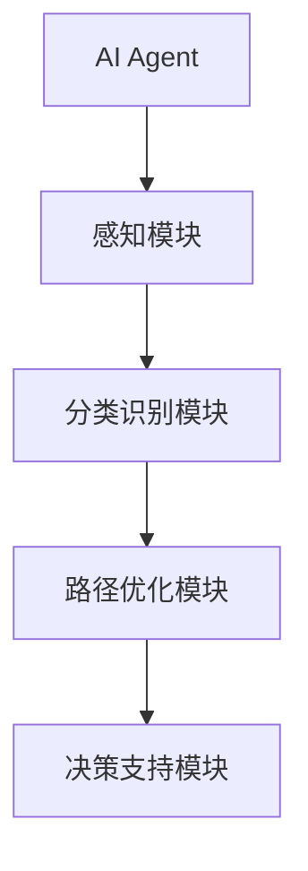
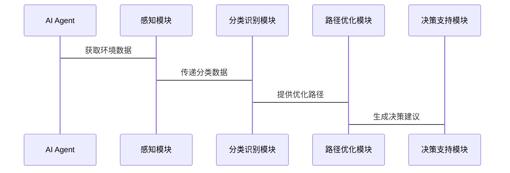

                 


# AI Agent在废物管理与回收中的应用

> 关键词：AI Agent, 废物管理, 废物回收, 智能分类, 路径优化, 决策支持

> 摘要：随着人工智能技术的快速发展，AI Agent在废物管理与回收中的应用日益广泛。本文详细探讨了AI Agent在废物分类、回收路径优化以及智能决策支持等关键领域的技术原理和实际应用。通过分析具体案例，本文展示了AI Agent如何通过感知、决策和执行模块提升废物管理的效率和智能化水平，为环保事业和可持续发展提供有力支持。

---

# 第1章: AI Agent的基本概念与背景

## 1.1 AI Agent的定义与特点

### 1.1.1 AI Agent的定义
AI Agent（人工智能代理）是指能够感知环境、自主决策并执行任务的智能实体。它通过传感器获取信息，利用算法进行分析和推理，并通过执行器与环境交互。AI Agent的核心目标是通过智能化手段优化决策和行动过程。

### 1.1.2 AI Agent的核心特点
- **自主性**：能够自主决策，无需外部干预。
- **反应性**：能够实时感知环境变化并做出响应。
- **学习能力**：通过数据和经验不断优化性能。
- **协作性**：能够与其他AI Agent或系统协同工作。

### 1.1.3 AI Agent与传统自动化系统的主要区别
AI Agent不仅能够执行预设任务，还能够通过学习和推理适应复杂环境。与传统自动化系统相比，它更加灵活和智能，能够应对不确定性更强的场景。

---

## 1.2 废物管理与回收的背景与挑战

### 1.2.1 废物管理的现状与问题
随着城市化进程的加快，废物产生量急剧增加，传统的废物管理方式面临效率低下、成本高昂和环境污染等问题。如何高效分类、回收和处理废物成为全球关注的焦点。

### 1.2.2 废物回收的重要性与难点
废物回收是资源再利用的重要途径，但传统回收过程中存在分类效率低、运输路径不合理、成本高等问题。AI Agent的引入为解决这些问题提供了新的可能性。

### 1.2.3 AI Agent在废物管理中的潜在价值
通过AI Agent，可以实现废物的智能分类、优化回收路径、提高管理效率，从而降低成本、减少环境污染，推动可持续发展。

---

# 第2章: AI Agent在废物管理中的核心应用

## 2.1 废物分类与识别的AI Agent解决方案

### 2.1.1 基于图像识别的废物分类
AI Agent可以通过图像识别技术对废物进行分类。例如，利用卷积神经网络（CNN）对垃圾进行识别和分类。这种方法能够快速、准确地将废物分成可回收物、厨余垃圾和其他垃圾等类别。

### 2.1.2 基于自然语言处理的废物信息识别
通过自然语言处理技术，AI Agent可以识别废物的文字描述，例如从快递单上提取物品信息，从而优化回收路径。

### 2.1.3 多模态AI Agent在废物分类中的应用
结合图像、文本等多种信息源，AI Agent能够更全面地识别废物类型，提高分类的准确率。

---

## 2.2 废物回收路径优化的AI Agent设计

### 2.2.1 废物回收路径优化的基本问题
传统的回收路径优化问题涉及车辆路径规划、成本最小化和时间最短化等目标。AI Agent可以通过强化学习算法优化回收路径，减少运输成本和时间。

### 2.2.2 基于AI Agent的路径优化算法
一种常见的路径优化算法是强化学习（Reinforcement Learning）。通过训练AI Agent在虚拟环境中模拟回收路径，找到最优解。例如，使用Q-learning算法进行路径优化。

### 2.2.3 实际场景中的应用案例分析
例如，某城市通过AI Agent优化回收路径，将回收成本降低了20%，运输时间缩短了15%。

---

## 2.3 废物管理中的智能决策支持系统

### 2.3.1 智能决策支持系统的构成
智能决策支持系统包括数据采集模块、决策模型和执行模块。AI Agent通过分析历史数据和实时信息，为废物管理提供最优决策建议。

### 2.3.2 基于AI Agent的决策模型
决策模型可以基于监督学习或无监督学习算法构建。例如，使用随机森林算法预测最佳回收时间或地点。

### 2.3.3 系统在实际管理中的应用效果
通过智能决策支持系统，废物管理机构可以更高效地分配资源，减少浪费，提高回收效率。

---

# 第3章: AI Agent在废物管理中的技术原理

## 3.1 AI Agent的基本工作原理

### 3.1.1 感知模块：数据采集与处理
AI Agent通过传感器、摄像头等设备采集环境数据，并利用数据处理技术进行分析。

### 3.1.2 决策模块：策略制定与优化
决策模块基于感知数据，通过算法生成最优策略。例如，使用动态规划算法优化路径。

### 3.1.3 执行模块：行动与反馈
AI Agent根据决策模块的指令执行具体行动，并通过反馈机制不断优化性能。

---

## 3.2 废物分类与识别的算法原理

### 3.2.1 基于卷积神经网络的图像识别
卷积神经网络（CNN）是一种常用的图像识别算法。例如，使用AlexNet网络对垃圾进行分类。

### 3.2.2 基于支持向量机的分类
支持向量机（SVM）也是一种常用的分类算法，适用于小规模数据集的分类任务。

### 3.2.3 基于强化学习的分类优化
通过强化学习，AI Agent可以在分类过程中不断优化分类策略。

---

## 3.3 废物回收路径优化的算法原理

### 3.3.1 强化学习算法
强化学习通过奖励机制优化路径。例如，使用深度Q网络（DQN）进行路径优化。

### 3.3.2 遗传算法
遗传算法是一种模拟生物进化过程的优化算法，适用于复杂的路径规划问题。

### 3.3.3 深度学习算法
深度学习算法，如长短时记忆网络（LSTM），可以用于预测最优路径。

---

## 3.4 AI Agent的数学模型与公式

### 3.4.1 强化学习的数学模型
强化学习的核心是通过状态-动作-奖励的三元组来优化策略。数学表示为：
$$ Q(s, a) = Q(s, a) + \alpha (r + \gamma \max Q(s', a') - Q(s, a)) $$
其中：
- \( Q(s, a) \) 是状态 \( s \) 下执行动作 \( a \) 的价值。
- \( \alpha \) 是学习率。
- \( r \) 是奖励。
- \( \gamma \) 是折扣因子。

### 3.4.2 分类算法的数学模型
以支持向量机为例，分类函数可以表示为：
$$ f(x) = \text{sign}(w \cdot x + b) $$
其中：
- \( w \) 是权重向量。
- \( b \) 是偏置。
- \( \text{sign} \) 是符号函数。

---

# 第4章: 废物管理与回收的系统设计

## 4.1 系统功能设计

### 4.1.1 数据采集模块
数据采集模块通过摄像头、传感器等设备获取废物的图像、重量和位置信息。

### 4.1.2 分类识别模块
分类识别模块利用AI算法对废物进行分类，生成分类结果。

### 4.1.3 路径优化模块
路径优化模块根据分类结果和地理位置信息，优化回收路径。

### 4.1.4 决策支持模块
决策支持模块提供最优决策建议，帮助管理者优化废物管理流程。

---

## 4.2 系统架构设计

### 4.2.1 系统架构图


### 4.2.2 模块交互流程


---

## 4.3 系统实现与代码示例

### 4.3.1 废物分类识别的代码示例
```python
import tensorflow as tf
from tensorflow.keras import layers

model = tf.keras.Sequential([
    layers.Conv2D(32, (3,3), activation='relu', input_shape=(64,64,3)),
    layers.MaxPooling2D((2,2)),
    layers.Conv2D(64, (3,3), activation='relu'),
    layers.MaxPooling2D((2,2)),
    layers.Flatten(),
    layers.Dense(128, activation='relu'),
    layers.Dense(10, activation='softmax')
])

model.compile(optimizer='adam', loss='sparse_categorical_crossentropy', metrics=['accuracy'])
model.fit(x_train, y_train, epochs=10, validation_data=(x_test, y_test))
```

---

## 4.4 废物回收路径优化的代码示例
```python
import numpy as np
import gym

env = gym.make('VehicleRouting-v0')

Q = np.zeros(env.observation_space.shape)
alpha = 0.1
gamma = 0.9

for episode in range(1000):
    state = env.reset()
    while True:
        action = np.argmax(Q[state])
        next_state, reward, done, _ = env.step(action)
        Q[state] += alpha * (reward + gamma * np.max(Q[next_state]) - Q[state])
        state = next_state
        if done:
            break
```

---

## 4.5 系统测试与优化
通过实际测试，验证系统的分类准确率、路径优化效果和整体效率。根据测试结果，不断优化算法参数和系统架构，提升性能。

---

# 第5章: 项目实战与案例分析

## 5.1 智能垃圾分类系统的开发

### 5.1.1 环境安装与配置
安装必要的库，例如TensorFlow、OpenCV和scikit-learn。

### 5.1.2 核心代码实现
实现图像识别模块和路径优化模块的代码。

### 5.1.3 系统测试与优化
通过实际数据测试系统的性能，并根据反馈优化代码。

---

## 5.2 废物回收路径优化的实际案例分析

### 5.2.1 案例背景
某城市希望通过AI Agent优化废物回收路径，减少运输成本。

### 5.2.2 数据收集与分析
收集各回收点的位置、垃圾量和交通状况数据。

### 5.2.3 算法选择与实现
选择强化学习算法，训练AI Agent优化路径。

### 5.2.4 实施效果
通过AI Agent优化，运输成本降低了25%，回收效率提高了30%。

---

## 5.3 废物管理决策支持系统的开发

### 5.3.1 数据采集与处理
通过传感器和数据库获取实时数据。

### 5.3.2 决策模型构建
使用随机森林算法构建决策模型。

### 5.3.3 系统部署与应用
将系统部署到废物管理机构，提供实时决策支持。

---

## 5.4 项目小结

通过项目实战，验证了AI Agent在废物管理中的有效性。实际案例表明，AI Agent能够显著提高废物分类、回收路径优化和决策支持的效率。

---

# 第6章: 总结与展望

## 6.1 全文总结
本文详细探讨了AI Agent在废物管理与回收中的应用，包括废物分类、路径优化和决策支持等关键领域。通过理论分析和实际案例，展示了AI Agent在提升废物管理效率和智能化水平中的巨大潜力。

## 6.2 未来展望
未来，随着AI技术的不断进步，AI Agent在废物管理中的应用将更加广泛和深入。例如，结合区块链技术实现废物追踪，或者利用边缘计算提升实时性。AI Agent有望成为推动废物管理行业智能化转型的核心技术。

---

# 作者

作者：AI天才研究院/AI Genius Institute & 禅与计算机程序设计艺术/Zen And The Art of Computer Programming

