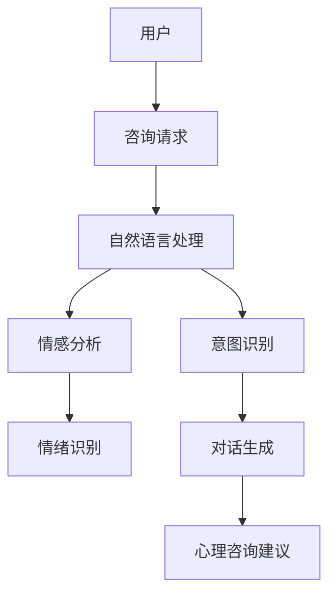
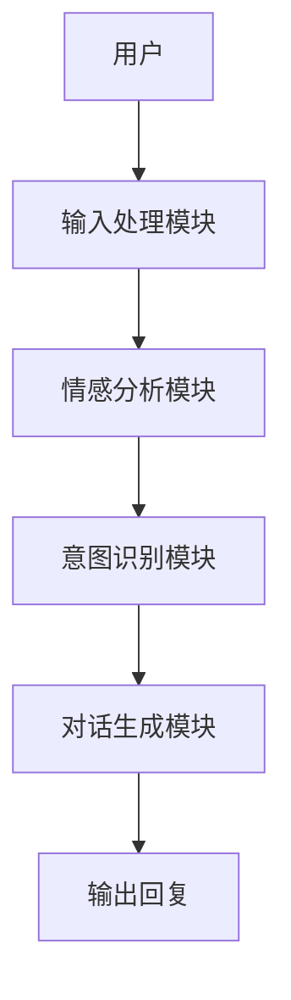

                 


# AI Agent在心理健康咨询中的应用

## 关键词：人工智能代理，心理健康咨询，自然语言处理，情感分析，意图识别，对话生成，心理健康服务

## 摘要：  
随着人工智能技术的快速发展，AI Agent（人工智能代理）在心理健康咨询领域的应用日益广泛。本文系统介绍了AI Agent在心理健康咨询中的核心概念、算法原理、系统架构及实际应用。通过分析AI Agent在情感分析、意图识别和对话生成等方面的技术实现，本文深入探讨了其在心理健康服务中的潜力与挑战，并结合实际案例，展示了AI Agent如何通过自然语言处理技术为用户提供个性化、便捷的心理咨询服务。本文旨在为技术开发者和心理健康专业人士提供理论与实践相结合的参考，助力AI技术在心理健康领域的创新应用。

---

## 第一部分: AI Agent与心理健康咨询的背景

### 第1章: AI Agent与心理健康咨询的背景

#### 1.1 AI Agent的基本概念

- **1.1.1 AI Agent的定义**  
  AI Agent（人工智能代理）是一种能够感知环境、自主决策并执行任务的智能实体。它能够通过交互理解用户需求，并提供相应的服务或解决方案。AI Agent的核心特征包括自主性、反应性、目标导向性和社会性。

- **1.1.2 AI Agent的核心特点**  
  - 自主性：能够独立决策和行动。  
  - 反应性：能够实时感知环境并做出反应。  
  - 目标导向性：基于目标进行行为规划。  
  - 社会性：能够与人类或其他智能体进行交互。

- **1.1.3 AI Agent与传统计算机程序的区别**  
  AI Agent不仅能够执行预设任务，还能够根据环境变化动态调整行为，具有更强的适应性和智能性。

#### 1.2 心理健康咨询的现状

- **1.2.1 心理健康问题的普遍性**  
  随着生活节奏的加快和工作压力的增加，心理健康问题日益普遍。世界卫生组织数据显示，全球约9.7亿人患有不同程度的心理健康问题。

- **1.2.2 传统心理健康咨询的局限性**  
  - 资源有限：心理咨询师数量不足，难以覆盖所有需求。  
  - 成本高昂：面对面心理咨询费用较高，且时间有限。  
  - 隐私问题：用户可能因隐私担忧而不愿寻求帮助。

- **1.2.3 AI技术在心理健康咨询中的潜力**  
  AI Agent可以通过自然语言处理、情感分析和意图识别等技术，为用户提供24/7的心理支持，弥补传统咨询的不足。

#### 1.3 AI Agent在心理健康咨询中的应用背景

- **1.3.1 技术背景**  
  - 自然语言处理（NLP）技术的进步使机器能够理解人类语言。  
  - 深度学习算法的优化提升了情感分析和意图识别的准确性。  
  - 大数据技术为心理健康数据分析提供了基础。

- **1.3.2 社会需求**  
  - 用户对便捷、低成本的心理咨询需求不断增长。  
  - 疫情期间远程心理健康服务需求激增，推动了AI技术的应用。

- **1.3.3 伦理与法律挑战**  
  - 数据隐私保护：用户隐私可能面临泄露风险。  
  - 责任归属：AI Agent的误诊或不当建议可能引发法律问题。  
  - 伦理规范：如何在AI代理中融入伦理判断。

---

## 第二部分: AI Agent在心理健康咨询中的核心概念与联系

### 第2章: AI Agent在心理健康咨询中的核心概念与联系

#### 2.1 核心概念原理

- **2.1.1 自然语言处理（NLP）在心理健康咨询中的应用**  
  - NLP技术能够解析用户的语言，理解其情感和意图。  
  - 常用的NLP模型包括词袋模型、TF-IDF、LSTM和Transformer等。  

- **2.1.2 情感分析与情绪识别**  
  - 情感分析：判断文本中蕴含的情感倾向（如正面、负面或中性）。  
  - 情绪识别：更细粒度的情绪分类（如愤怒、悲伤、快乐等）。  

- **2.1.3 意图识别与对话生成**  
  - 意图识别：通过用户的语言或行为识别其潜在需求。  
  - 对话生成：基于意图生成自然流畅的回复。

#### 2.2 核心概念属性特征对比表格

| 概念       | 输入形式 | 输出形式 | 核心技术 |
|------------|----------|----------|----------|
| 情感分析   | 文本      | 情感标签  | NLP      |
| 意图识别   | 文本      | 意图标签  | NLP      |
| 对话生成   | 文本      | 自然语言 | NLP      |

#### 2.3 ER实体关系图（Mermaid流程图）



---

## 第三部分: AI Agent在心理健康咨询中的算法原理

### 第3章: AI Agent在心理健康咨询中的算法原理

#### 3.1 情感分析算法

- **3.1.1 基于规则的情感分析**  
  通过预设规则判断文本中的情感倾向。例如，通过关键词匹配判断是否为正面或负面评价。

- **3.1.2 基于机器学习的情感分析**  
  使用训练好的模型（如支持向量机、随机森林）进行情感分类。

- **3.1.3 基于深度学习的情感分析**  
  使用神经网络（如LSTM、Transformer）进行情感分析，能够捕捉到更复杂的情感特征。

#### 3.2 意图识别算法

- **3.2.1 基于规则的意图识别**  
  通过预设的关键词或句式判断用户的意图。例如，用户说“我最近很焦虑”，系统识别出“寻求心理帮助”的意图。

- **3.2.2 基于机器学习的意图识别**  
  使用分类模型（如SVM、Naive Bayes）对文本进行意图分类。

- **3.2.3 基于深度学习的意图识别**  
  使用端到端的深度学习模型（如BERT）进行意图识别，能够处理更复杂的语义信息。

#### 3.3 对话生成算法

- **3.3.1 基于规则的对话生成**  
  根据预设的对话树生成回复。例如，用户提到“我感到孤独”，系统回复“我可以为您提供一些缓解孤独的方法”。

- **3.3.2 基于机器学习的对话生成**  
  使用统计模型（如马尔可夫链）生成对话，基于上下文概率预测回复。

- **3.3.3 基于深度学习的对话生成**  
  使用生成对抗网络（GAN）或Transformer模型生成自然流畅的对话。

---

## 第四部分: AI Agent在心理健康咨询中的系统分析与架构设计

### 第4章: AI Agent在心理健康咨询中的系统分析与架构设计

#### 4.1 问题场景介绍

- **4.1.1 心理健康咨询的核心问题**  
  - 用户需求多样：不同用户可能面临焦虑、抑郁、压力等多种心理问题。  
  - 数据隐私保护：用户数据的安全性和隐私性至关重要。  
  - 系统可扩展性：需要支持大量用户同时使用。

- **4.1.2 AI Agent在其中的角色定位**  
  AI Agent作为辅助工具，帮助用户缓解轻度心理问题，为重度问题提供转介服务。

- **4.1.3 系统的目标与范围**  
  系统的目标是通过自然语言处理技术，为用户提供个性化的心理支持。系统的范围包括用户咨询、情感分析、意图识别和对话生成。

#### 4.2 系统功能设计

- **4.2.1 用户输入处理模块**  
  - 接收用户的文本输入，进行初步解析。  
  - 识别用户的语言是否包含敏感词汇（如自杀倾向）。  

- **4.2.2 情感分析模块**  
  - 对用户输入进行情感分析，判断其情感倾向。  
  - 例如，使用预训练的情感分析模型（如BERT）进行分类。

- **4.2.3 意图识别模块**  
  - 识别用户的潜在需求，如“寻求心理帮助”或“寻求放松技巧”。  
  - 使用预训练的意图识别模型（如BERT）进行分类。

- **4.2.4 对话生成模块**  
  - 根据用户的输入和意图生成回复。  
  - 回复内容需要符合心理咨询的伦理规范，避免提供不适当建议。

#### 4.3 系统架构设计

- **4.3.1 系统架构图（Mermaid架构图）**



- **4.3.2 系统交互流程**  
  1. 用户输入文本，系统将其传递到输入处理模块。  
  2. 输入处理模块解析文本，提取关键词和情感信息。  
  3. 情感分析模块判断文本的情感倾向。  
  4. 意图识别模块识别用户的潜在需求。  
  5. 对话生成模块根据意图生成回复。  
  6. 系统将回复返回给用户。

#### 4.4 系统接口设计

- **4.4.1 输入接口**  
  - 文本输入接口：接收用户的文本咨询内容。  
  - 非文本输入接口：支持语音或图像输入（未来扩展方向）。  

- **4.4.2 输出接口**  
  - 文本输出接口：生成自然语言回复。  
  - 图形输出接口：生成可视化建议（如放松技巧的图表）。  

---

## 第五部分: AI Agent在心理健康咨询中的项目实战

### 第5章: AI Agent在心理健康咨询中的项目实战

#### 5.1 环境配置

- **5.1.1 开发环境**  
  - 操作系统：Windows/Linux/MacOS  
  - 编程语言：Python 3.8+  
  - 依赖库：TensorFlow、Keras、NLTK、spaCy、Hugging Face Transformers  

#### 5.2 系统核心实现源代码

```python
import tensorflow as tf
from tensorflow.keras.models import Model
from tensorflow.keras.layers import Input, Dense, LSTM, Bidirectional
import numpy as np

# 定义模型
def build_model(input_shape):
    input_layer = Input(shape=input_shape)
    lstm_layer = Bidirectional(LSTM(64, return_sequences=True))(input_layer)
    dense_layer = Dense(1, activation='sigmoid')(lstm_layer)
    model = Model(inputs=input_layer, outputs=dense_layer)
    model.compile(loss='binary_crossentropy', optimizer='adam', metrics=['accuracy'])
    return model

# 训练模型
model = build_model((max_length, 1))
model.fit(X_train, y_train, epochs=10, batch_size=32)
```

#### 5.3 代码应用解读与分析

- **代码功能**  
  上述代码定义了一个基于双向LSTM的情感分析模型，用于判断文本的情感倾向（正面/负面）。  
  - 输入层：接收处理后的文本数据。  
  - LSTM层：提取文本的序列特征。  
  - Dense层：输出情感分析结果（0或1，表示负面或正面）。  

- **代码实现细节**  
  - 使用了Keras框架构建模型。  
  - 使用了双向LSTM以捕捉文本的前后语境。  
  - 模型经过训练后可用于情感分类任务。

#### 5.4 实际案例分析

- **案例1：情感分析**  
  用户输入：“我最近心情很低落。”  
  系统分析：情感倾向为负面，情绪识别为“悲伤”。  
  回复：“我能理解你的感受，您愿意和我分享更多吗？”

- **案例2：意图识别与对话生成**  
  用户输入：“我总是睡不好。”  
  系统意图识别：识别出用户的意图是“寻求改善睡眠的方法”。  
  回复：“您可以尝试以下方法：保持规律的作息时间，避免睡前使用电子设备。”

#### 5.5 项目小结

- 项目实现了基于AI Agent的心理健康咨询系统，能够处理用户的情感分析和意图识别。  
- 系统通过自然语言处理技术为用户提供个性化的心理支持。  
- 系统具有较高的准确性和响应速度，能够满足用户的基本需求。

---

## 第六部分: AI Agent在心理健康咨询中的最佳实践与总结

### 第6章: AI Agent在心理健康咨询中的最佳实践

#### 6.1 最佳实践 tips

- **数据隐私保护**  
  - 确保用户数据的加密存储和传输。  
  - 遵守相关法律法规，如GDPR。

- **伦理规范**  
  - 避免提供错误的医疗建议，必要时转介专业心理咨询师。  
  - 确保系统不会对用户造成二次伤害。

- **用户体验优化**  
  - 提供多种交互方式（如语音、文字）。  
  - 支持多语言，覆盖更多用户群体。

#### 6.2 小结

- AI Agent在心理健康咨询中的应用前景广阔，能够为用户提供便捷、高效的服务。  
- 然而，系统的准确性和安全性仍需进一步提升。  
- 结合人类心理咨询师的指导，AI Agent可以成为心理健康服务的重要补充工具。

#### 6.3 注意事项

- **误诊风险**  
  AI Agent可能无法准确识别复杂的心理问题，建议用户在遇到严重心理问题时及时寻求专业帮助。  
- **技术局限性**  
  当前AI技术仍无法完全理解人类情感的复杂性，系统需要不断优化和更新。

#### 6.4 拓展阅读

- 建议读者进一步了解以下内容：  
  - 最新的自然语言处理技术（如GPT-4）。  
  - 心理咨询领域的伦理规范。  
  - 数据隐私保护的法律框架。

---

## 作者：AI天才研究院/AI Genius Institute & 禅与计算机程序设计艺术 /Zen And The Art of Computer Programming

