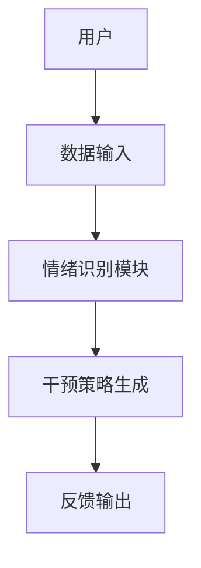
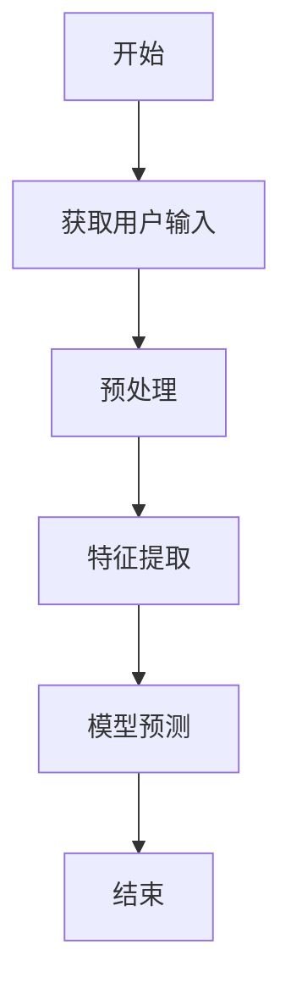
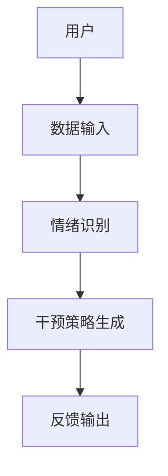

                 


# AI Agent在心理健康领域的应用：情绪支持与干预

> 关键词：AI Agent, 人工智能, 心理健康, 情绪支持, 干预策略, 自然语言处理, 情感分析

> 摘要：本文探讨AI Agent在心理健康领域的应用，重点分析情绪支持与干预的技术实现。通过详细讲解背景、核心概念、算法原理、系统架构及项目实战，提供全面的技术解读和实践指导。

---

## 第一部分：背景与概念

### 第1章：背景介绍

#### 1.1 问题背景
随着生活节奏的加快，心理健康问题日益突出，传统心理咨询方式存在效率低、覆盖面小的问题。AI Agent凭借其高效性和可扩展性，成为解决这一问题的重要工具。

#### 1.2 问题描述
用户在面对压力、焦虑等问题时，需要及时的心理支持。AI Agent能够通过自然语言处理和情感分析，识别用户情绪，并提供相应的干预策略。

#### 1.3 问题解决
AI Agent通过实时分析用户输入，识别情绪状态，提供个性化的支持和干预策略，帮助用户缓解心理压力。

#### 1.4 边界与外延
AI Agent的应用范围包括情绪识别、心理咨询、干预策略生成等。其外延涉及自然语言处理、情感分析、机器学习等多个技术领域。

#### 1.5 核心要素组成
- 数据输入：用户文本、语音、表情等
- 情绪识别：基于NLP和情感分析
- 干预策略：结合心理学知识生成建议

---

## 第二部分：核心概念与联系

### 第2章：AI Agent的核心概念

#### 2.1 核心原理
AI Agent通过处理用户输入，利用NLP技术提取情绪特征，结合预设的干预策略生成系统反馈。

#### 2.2 对比分析
| 特性 | 传统心理咨询 | AI Agent |
|------|--------------|----------|
| 及时性 | 较低          | 高       |
| 覆盖范围 | 有限          | 广泛     |
| 成本 | 较高          | 低       |

#### 2.3 实体关系图


---

## 第三部分：算法原理

### 第3章：情绪识别算法

#### 3.1 流程图


#### 3.2 代码实现
```python
def cosine_similarity(vec1, vec2):
    return dot_product(vec1, vec2) / (norm(vec1) * norm(vec2))

def dot_product(vec1, vec2):
    return sum(v1 * v2 for v1, v2 in zip(vec1, vec2))

def norm(vec):
    return sum(v**2 for v in vec)**0.5

# 示例向量
vector1 = [0.5, 0.2, 0.3]
vector2 = [0.4, 0.6, 0.1]
similarity = cosine_similarity(vector1, vector2)
print(similarity)
```

#### 3.3 数学模型
$$ \text{余弦相似度} = \frac{\vec{a} \cdot \vec{b}}{|\vec{a}| |\vec{b}|} $$

---

## 第四部分：系统分析与架构设计

### 第4章：系统架构

#### 4.1 功能模块
- 用户输入模块
- 情绪识别模块
- 干预策略生成模块
- 反馈输出模块

#### 4.2 系统架构图


#### 4.3 接口设计
- 输入接口：文本输入、语音识别
- 输出接口：文本反馈、语音输出

#### 4.4 交互流程图


---

## 第五部分：项目实战

### 第5章：环境安装与代码实现

#### 5.1 环境安装
- Python 3.8+
- pip install numpy nltk scikit-learn

#### 5.2 核心代码
```python
import numpy as np
from sklearn.feature_extraction.text import TfidfVectorizer
from sklearn.metrics.pairwise import cosine_similarity

def get_emotion_feedback(text):
    vectorizer = TfidfVectorizer()
    tfidf_matrix = vectorizer.fit_transform([text])
    similarity = cosine_similarity(tfidf_matrix[0], tfidf_matrix).flatten()[0]
    return "您的情绪相似度为{}，请注意调整心态。".format(similarity)

print(get_emotion_feedback("我感到非常焦虑"))
```

---

## 第六部分：最佳实践与总结

### 第6章：总结

#### 6.1 小结
AI Agent通过NLP和机器学习技术，有效支持心理健康干预，提升用户体验。

#### 6.2 注意事项
- 数据隐私保护
- 算法准确性
- 用户接受度

#### 6.3 拓展阅读
- 自然语言处理书籍
- 机器学习在心理健康中的应用

---

作者：AI天才研究院/AI Genius Institute & 禅与计算机程序设计艺术/Zen And The Art of Computer Programming

