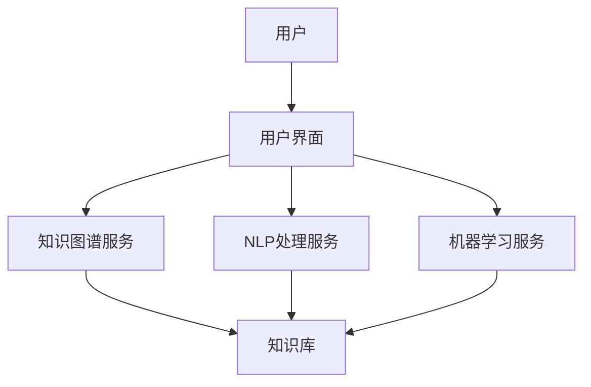
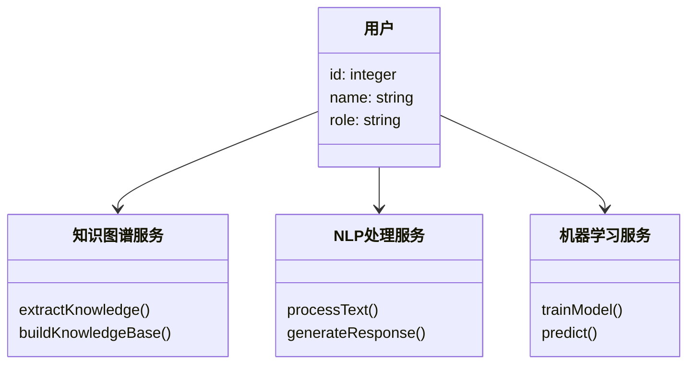

                 


# AI Agent在教育领域的创新应用

## 关键词
AI Agent, 教育, 人工智能, 自然语言处理, 知识图谱, 机器学习

## 摘要
AI Agent在教育领域的应用正逐渐改变传统的教学模式，通过个性化学习、智能教学管理和虚拟教育助手等创新方式，提升教育效率和学习效果。本文详细探讨了AI Agent的核心概念、技术原理及其在教育中的具体应用，结合实际案例和系统设计，为教育领域的技术革新提供了新的视角和解决方案。

---

# 第1章: AI Agent的定义与核心概念

## 1.1 AI Agent的基本定义

### 1.1.1 AI Agent的定义与特点
AI Agent（人工智能代理）是指能够感知环境、自主决策并执行任务的智能体。其特点包括：
- **自主性**：能够在没有外部干预的情况下运行。
- **反应性**：能够实时感知环境并做出响应。
- **学习能力**：通过数据和经验不断优化自身行为。

### 1.1.2 AI Agent的核心属性与特征
AI Agent的核心属性包括：
1. **感知能力**：通过传感器或数据输入感知环境。
2. **决策能力**：基于感知信息做出决策。
3. **执行能力**：通过执行器或输出模块完成任务。
4. **学习能力**：通过机器学习算法优化自身行为。

### 1.1.3 AI Agent与传统教育技术的区别
AI Agent与传统教育技术的区别主要体现在智能化和自主性上。传统教育技术依赖于固定的规则和流程，而AI Agent能够根据环境和用户反馈动态调整行为，提供更加个性化的服务。

---

## 1.2 AI Agent在教育中的应用背景

### 1.2.1 教育领域的数字化转型趋势
随着信息技术的快速发展，教育领域正在经历数字化转型，AI技术的应用为教育带来了新的机遇。

### 1.2.2 AI技术在教育中的潜在价值
AI技术能够通过数据分析和个性化推荐，提升教学效果和学习体验。

### 1.2.3 AI Agent在教育中的独特优势
AI Agent在教育中的独特优势在于其能够提供实时、个性化的服务，帮助学生和教师更高效地完成教学任务。

---

# 第2章: AI Agent在教育中的应用场景

## 2.1 教育领域的核心问题与挑战

### 2.1.1 学生个性化学习需求
学生之间的学习能力和兴趣点存在差异，传统教学模式难以满足个性化需求。

### 2.1.2 教师教学效率提升
教师需要花费大量时间进行备课和作业批改，影响教学效率。

### 2.1.3 教育资源优化配置
教育资源的不均衡分配问题亟待解决，尤其是在偏远地区。

## 2.2 AI Agent在教育中的典型应用

### 2.2.1 个性化学习助手
AI Agent可以根据学生的学习情况，提供个性化的学习建议和资源推荐。

### 2.2.2 智能教学管理
AI Agent可以帮助教师进行课程安排、作业批改和学生表现分析，提升教学效率。

### 2.2.3 虚拟教育助手
AI Agent可以扮演虚拟助教的角色，为学生提供即时答疑和学习指导。

---

# 第3章: AI Agent的核心技术与算法原理

## 3.1 自然语言处理技术

### 3.1.1 NLP模型的训练与优化
自然语言处理模型的训练过程包括数据预处理、模型选择、参数调优等步骤。

### 3.1.2 常见NLP模型与工具
常用的NLP模型包括BERT、GPT等，这些模型可以通过预训练和微调任务适应教育领域的特定需求。

## 3.2 知识图谱构建

### 3.2.1 知识图谱的定义与构建方法
知识图谱是一种结构化的数据表示方式，用于描述实体及其关系。构建知识图谱需要进行数据采集、清洗、抽取和建模等步骤。

### 3.2.2 教育领域知识图谱的构建
在教育领域，知识图谱可以用于构建学科知识体系，支持学生学习路径规划和教师教学资源推荐。

## 3.3 机器学习与深度学习

### 3.3.1 机器学习的基本原理
机器学习通过训练数据模型，使其能够从数据中学习特征并进行预测或分类。

### 3.3.2 深度学习在教育中的应用
深度学习技术可以应用于学生行为分析、学习效果预测等领域，为教育决策提供数据支持。

---

# 第4章: AI Agent的自然语言处理技术

## 4.1 NLP模型的训练与优化

### 4.1.1 模型训练流程
NLP模型的训练流程包括数据预处理、模型选择、参数调优和模型评估等步骤。

### 4.1.2 模型优化策略
通过数据增强、模型集成和超参数优化等方法，可以提升NLP模型的性能。

## 4.2 NLP在教育中的具体应用

### 4.2.1 学生作文自动评分
AI Agent可以通过NLP技术对学生的作文进行自动评分，提供改进建议。

### 4.2.2 教材内容自动解析
AI Agent可以自动解析教材内容，提取关键知识点并生成教学大纲。

---

# 第5章: AI Agent的知识图谱构建与应用

## 5.1 知识图谱的构建方法

### 5.1.1 数据采集与预处理
知识图谱的构建需要从多种数据源采集数据，并进行清洗和预处理。

### 5.1.2 知识抽取与表示
通过文本挖掘和信息抽取技术，从数据中提取实体及其关系，并表示为结构化的知识图谱。

## 5.2 知识图谱在教育中的应用

### 5.2.1 学生知识盲点分析
通过知识图谱分析学生的知识掌握情况，识别学习中的盲点。

### 5.2.2 教学资源推荐系统
基于知识图谱，AI Agent可以推荐适合学生学习进度的教学资源。

---

# 第6章: AI Agent的机器学习算法与优化

## 6.1 机器学习算法的选择与优化

### 6.1.1 常见机器学习算法
常用的机器学习算法包括支持向量机（SVM）、随机森林（Random Forest）和神经网络等。

### 6.1.2 算法优化策略
通过交叉验证、超参数调优和模型集成等方法，可以提升机器学习模型的性能。

## 6.2 深度学习在教育中的应用

### 6.2.1 学生行为分析
深度学习可以分析学生的行为数据，预测其学习效果和潜在需求。

### 6.2.2 学习效果预测
通过深度学习模型，可以预测学生的学习效果，并提供个性化的学习建议。

---

# 第7章: AI Agent在教育中的系统设计与实现

## 7.1 系统架构设计

### 7.1.1 系统功能模块
AI Agent教育系统的功能模块包括用户管理、知识图谱构建、NLP处理和机器学习模型等。

### 7.1.2 系统架构图
以下是系统架构图的Mermaid表示：



## 7.2 系统功能设计

### 7.2.1 领域模型
以下是领域模型的Mermaid类图：



---

# 第8章: AI Agent的项目实战

## 8.1 环境安装

### 8.1.1 安装Python
```bash
python --version
pip install --upgrade pip
```

### 8.1.2 安装必要的库
```bash
pip install numpy
pip install pandas
pip install spacy
pip install tensorflow
```

## 8.2 核心代码实现

### 8.2.1 NLP处理代码
```python
import spacy

nlp = spacy.load("en_core_web_sm")

def process_text(text):
    doc = nlp(text)
    return [token.text for token in doc]
```

### 8.2.2 知识图谱构建代码
```python
from networkx import Graph

def build_knowledge_graph():
    graph = Graph()
    graph.add_edge("学生", "学习")
    graph.add_edge("学习", "知识点")
    return graph
```

## 8.3 案例分析与实际应用

### 8.3.1 学生个性化学习案例
AI Agent可以根据学生的学习历史和当前表现，推荐适合的学习资源和练习题。

### 8.3.2 教师教学管理案例
AI Agent可以帮助教师分析学生的作业情况，快速生成反馈报告。

---

# 第9章: 总结与展望

## 9.1 小结
本文详细探讨了AI Agent在教育领域的创新应用，包括其核心技术、系统设计和实际案例。

## 9.2 未来展望
随着AI技术的不断发展，AI Agent在教育中的应用将更加广泛，进一步提升教育效率和学习效果。

## 9.3 最佳实践Tips
- 在实施AI Agent教育系统时，需确保数据的准确性和隐私性。
- 定期更新和优化模型，以适应教育需求的变化。

---

# 作者

作者：AI天才研究院 & 禅与计算机程序设计艺术

