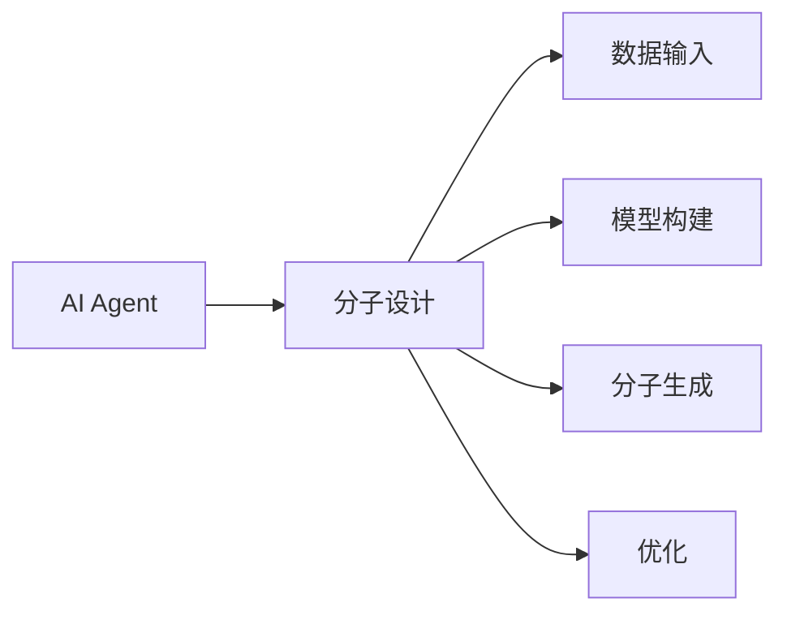
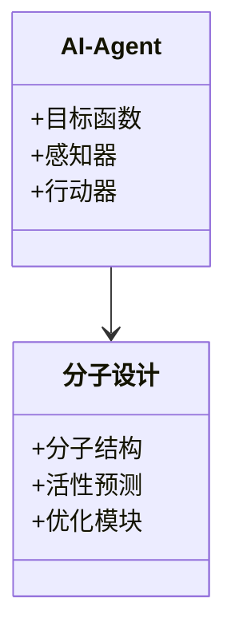
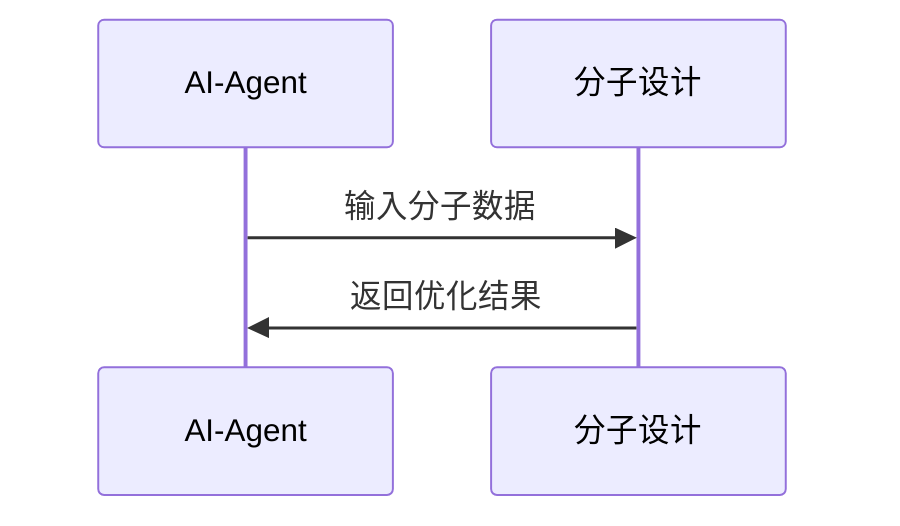
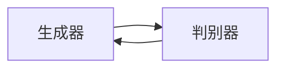

                 

# AI Agent在新药研发中的分子设计应用

> 关键词：AI Agent, 新药研发, 分子设计, 生成模型, 强化学习, 分子对接

> 摘要：本文详细探讨了AI Agent在新药研发中的分子设计应用，从背景介绍、核心概念、算法原理到系统架构和项目实战，全面分析了AI Agent如何通过生成模型、强化学习和分子对接等技术推动药物研发的创新与优化。

---

# 第1章: AI Agent与新药研发的背景介绍

## 1.1 AI Agent的基本概念
### 1.1.1 AI Agent的定义与特点
AI Agent（人工智能代理）是指能够感知环境并采取行动以实现目标的智能实体。其特点包括自主性、反应性、目标导向性和社会性。

### 1.1.2 AI Agent的核心要素与功能
- **自主性**：AI Agent能够独立决策，无需外部干预。
- **反应性**：能够实时感知环境变化并做出响应。
- **目标导向性**：通过目标驱动行动，优化决策过程。
- **社会性**：能够与其他Agent或人类进行交互协作。

### 1.1.3 AI Agent在药物研发中的应用潜力
AI Agent可以通过模拟和预测分子行为，辅助药物研发中的分子设计、优化和筛选过程。

---

## 1.2 新药研发的现状与挑战
### 1.2.1 新药研发的传统流程
新药研发通常包括药物发现、临床前研究、临床试验和审批上市等阶段，耗时长、成本高且不确定性大。

### 1.2.2 当前新药研发的主要挑战
- **高成本**：传统试错法研发投入巨大。
- **低效率**：分子筛选和优化过程繁琐。
- **数据爆炸**：海量数据处理难度大。
- **精准性不足**：传统方法难以精确预测分子行为。

### 1.2.3 AI技术在新药研发中的作用
AI技术能够通过数据分析、模型构建和智能优化，显著提高研发效率和精准度。

---

## 1.3 AI Agent在分子设计中的应用背景
### 1.3.1 分子设计的基本概念
分子设计是指通过计算方法设计具有特定功能的分子结构，是药物研发的核心环节。

### 1.3.2 AI Agent在分子设计中的优势
- **高效性**：AI Agent能够快速生成和优化分子结构。
- **精确性**：通过机器学习模型预测分子活性。
- **创新性**：能够发现传统方法难以察觉的新分子。

### 1.3.3 当前研究的热点与未来趋势
当前研究主要集中在生成模型和强化学习的应用，未来将向多模态AI和人机协作方向发展。

---

# 第2章: AI Agent在分子设计中的核心概念与联系

## 2.1 AI Agent与分子设计的核心概念
### 2.1.1 AI Agent的基本原理
AI Agent通过感知输入数据，利用模型生成输出，实现目标。

### 2.1.2 分子设计的基本原理
分子设计基于化学知识和计算模型，预测分子结构与活性。

### 2.1.3 AI Agent与分子设计的结合点
AI Agent能够通过数据驱动的方式，辅助分子生成、优化和筛选。

---

## 2.2 AI Agent在分子设计中的核心要素
### 2.2.1 数据驱动的分子生成
通过生成模型（如GAN）生成新分子结构。

### 2.2.2 智能优化算法
利用强化学习优化分子活性和药代动力学性质。

### 2.2.3 分子活性预测模型
通过机器学习模型预测分子的生物活性。

---

## 2.3 AI Agent与分子设计的关系图解
### 2.3.1 Mermaid流程图：AI Agent与分子设计的关系

### 2.3.2 核心概念对比表格
| 概念 | 特性 | 优势 |
|------|------|------|
| AI Agent | 数据驱动 | 高效性 |
| 分子设计 | 计算驱动 | 精确性 |

---

## 2.4 系统分析与架构设计

### 2.4.1 系统架构设计

### 2.4.2 接口与交互设计

---

# 第3章: AI Agent在分子设计中的算法原理

## 3.1 基于生成模型的分子设计
### 3.1.1 生成模型的基本原理
生成模型（如GAN）通过生成器和判别器的对抗训练，生成逼真的分子结构。

### 3.1.2 GAN在分子生成中的应用

### 3.1.3 分子生成的数学模型
$$ G_{\theta}(z) = \text{生成分子结构} $$
$$ D_{\phi}(x) = \text{判别分子结构是否为真实数据} $$

---

## 3.2 基于强化学习的分子优化
### 3.2.1 强化学习的基本原理
强化学习通过奖励函数优化分子活性。

### 3.2.2 分子优化的强化学习框架
$$ R(s, a) = \text{奖励函数} $$

---

## 3.3 基于分子对接的AI Agent设计
### 3.3.1 分子对接的基本原理
分子对接是研究分子间相互作用的重要方法。

### 3.3.2 基于AI的分子对接

---

# 小结
通过以上分析，AI Agent在分子设计中的应用潜力巨大，能够显著提高新药研发的效率和精准度。

