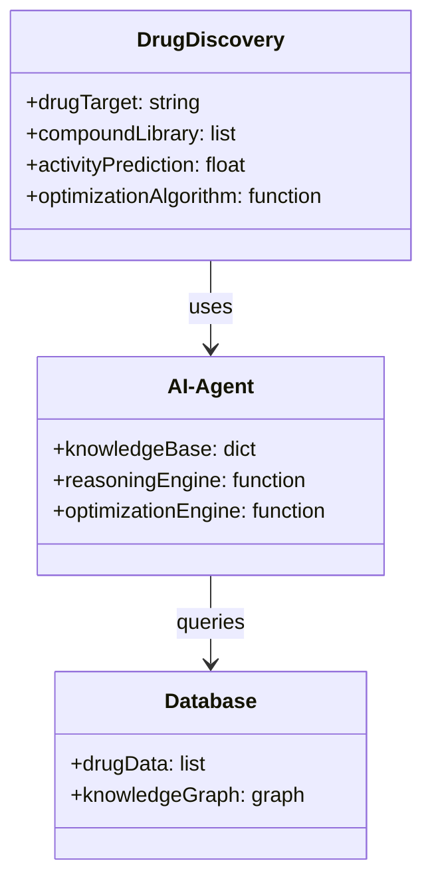
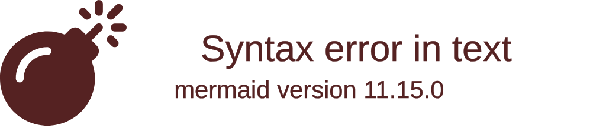
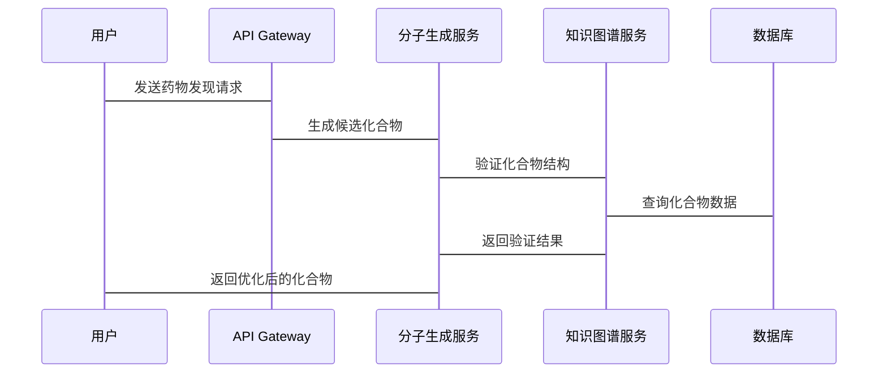

                 


# AI Agent在新药研发中的应用实践

## 关键词：AI Agent，新药研发，药物发现，机器学习，智能体

## 摘要：AI Agent作为人工智能领域的前沿技术，在新药研发中展现出巨大潜力。本文系统阐述了AI Agent的核心概念、算法原理及其在药物发现、筛选和临床试验等环节中的具体应用，通过实际案例展示了其在提高研发效率和降低成本方面的优势。文章还探讨了AI Agent在新药研发中的系统设计、工具选择以及未来发展趋势，为研究人员提供了深入的技术见解和实践指导。

---

# 第1章 AI Agent与新药研发的背景介绍

## 1.1 AI Agent的基本概念

### 1.1.1 AI Agent的定义
AI Agent（智能体）是指在计算机系统中能够感知环境并采取行动以实现目标的实体。它可以是一个软件程序，也可以是嵌入硬件的智能系统。AI Agent的核心特征包括自主性、反应性、目标导向和社会能力。

### 1.1.2 AI Agent的核心属性
- **自主性**：能够独立决策和行动。
- **反应性**：能够实时感知环境并做出反应。
- **目标导向**：具备明确的目标，并采取行动以实现目标。
- **社会能力**：能够与其他智能体或人类进行有效协作。

### 1.1.3 AI Agent与传统AI的区别
传统AI主要关注数据处理和模式识别，而AI Agent强调与环境的交互和自主决策。AI Agent能够动态适应环境变化，而传统AI则更多依赖预设规则。

## 1.2 新药研发的基本流程

### 1.2.1 药物发现阶段
- **目标识别**：寻找潜在的药物靶点。
- **化合物库构建**：生成大量候选化合物。
- **初步筛选**：通过体外实验筛选活性化合物。

### 1.2.2 临床前研究阶段
- **动物实验**：评估化合物的安全性和有效性。
- **药代动力学研究**：研究药物在体内的吸收、分布、代谢和排泄。

### 1.2.3 临床试验阶段
- **I期临床试验**：评估药物的安全性和耐受性。
- **II期临床试验**：评估药物的有效性和不良反应。
- **III期临床试验**：大规模验证药物的有效性和安全性。

### 1.2.4 药品上市与监控阶段
- **上市申请**：向监管机构提交上市申请。
- **上市后监测**：收集药物在市场上的安全性和有效性数据。

## 1.3 AI Agent在新药研发中的应用背景

### 1.3.1 新药研发的高成本与低效率问题
新药研发的平均成本约为26亿美元，耗时12年，且成功率仅为10%。传统方法依赖大量试错，效率低下。

### 1.3.2 AI技术在生命科学领域的潜力
AI技术在数据处理、模式识别和决策优化方面的优势，为新药研发提供了新的可能性。

### 1.3.3 AI Agent在新药研发中的独特优势
AI Agent能够通过动态交互和自主学习，优化药物研发的各个环节，显著提高效率并降低成本。

---

# 第2章 AI Agent的核心概念与原理

## 2.1 AI Agent的基本原理

### 2.1.1 知识表示与推理
知识表示是将问题转化为计算机可处理的形式，如逻辑表达式或知识图谱。推理是通过逻辑规则从已知事实中推导出新结论。

### 2.1.2 问题求解与规划
问题求解是通过搜索算法找到问题的最优解，而规划则是生成实现目标的行动序列。

### 2.1.3 多智能体协作
多智能体协作是指多个智能体协同工作，共同完成复杂任务。协作机制包括任务分配、信息共享和协调同步。

## 2.2 AI Agent在药物研发中的应用场景

### 2.2.1 药物分子设计
AI Agent可以通过生成模型设计新药分子，优化其物理化学性质和药代动力学特性。

### 2.2.2 药物筛选与优化
AI Agent可以自动筛选化合物库，预测化合物的活性和毒性，从而优化药物筛选过程。

### 2.2.3 临床试验设计与管理
AI Agent可以帮助设计临床试验方案，优化受试者招募和数据收集过程。

## 2.3 AI Agent与新药研发的结合点

### 2.3.1 数据驱动的药物发现
AI Agent可以通过分析大量数据，发现潜在的药物靶点和化合物结构。

### 2.3.2 知识图谱与药物研发
知识图谱整合了生物医学知识，AI Agent可以通过图推理发现新的药物机制。

### 2.3.3 自动化实验设计
AI Agent可以自动化设计实验方案，优化实验参数，提高实验效率。

---

# 第3章 AI Agent在新药研发中的具体应用

## 3.1 分子设计与优化

### 3.1.1 基于AI Agent的分子生成
利用生成模型（如GANS和VAEs）生成新药分子，并优化其药代动力学特性。

### 3.1.2 药物分子优化算法
通过强化学习优化分子结构，最大化药物活性和选择性。

### 3.1.3 实际案例分析
案例：AI Agent生成具有高活性的激酶抑制剂。

## 3.2 药物筛选与活性预测

### 3.2.1 基于AI Agent的虚拟筛选
利用机器学习模型预测化合物的活性，减少实验成本。

### 3.2.2 药物活性预测模型
构建深度学习模型，预测化合物的药代动力学和毒性特性。

### 3.2.3 实际案例分析
案例：利用虚拟筛选发现新型抗生素。

## 3.3 临床试验设计与管理

### 3.3.1 AI Agent在临床试验设计中的应用
优化临床试验方案，提高试验成功率。

### 3.3.2 临床试验数据的智能分析
利用AI Agent分析临床数据，预测试验结果。

### 3.3.3 实际案例分析
案例：AI Agent优化抗癌药物的临床试验设计。

---

# 第4章 AI Agent在新药研发中的算法与工具

## 4.1 基于强化学习的AI Agent

### 4.1.1 强化学习的基本原理
强化学习通过试错机制优化策略，最大化奖励函数。

### 4.1.2 在药物研发中的应用
用于分子生成和药物优化。

## 4.2 基于生成模型的AI Agent

### 4.2.1 生成模型的基本原理
生成模型通过学习数据分布生成新的数据样本。

### 4.2.2 在分子设计中的应用
生成具有特定性质的药物分子。

## 4.3 基于知识图谱的AI Agent

### 4.3.1 知识图谱的基本原理
知识图谱通过结构化数据表示知识，支持图推理。

### 4.3.2 在药物研发中的应用
发现新的药物机制和潜在靶点。

## 4.4 开源工具与平台

### 4.4.1 常见AI Agent工具介绍
- **TensorFlow**：用于构建机器学习模型。
- **Keras**：用于快速搭建深度学习模型。
- **RDKit**：用于药物分子的计算和分析。

### 4.4.2 开源药物研发平台介绍
- **Open Drug Discovery Toolkit (ODDT)**：用于药物发现的开源工具。
- **Docking software**：用于分子对接的开源工具。

---

# 第5章 AI Agent在新药研发中的系统设计

## 5.1 问题场景介绍
设计一个基于AI Agent的新药研发系统，优化药物发现和筛选过程。

## 5.2 系统功能设计

### 5.2.1 领域模型（Mermaid类图）


### 5.2.2 系统架构设计（Mermaid架构图）


### 5.2.3 系统接口设计
- **API接口**：提供分子生成、活性预测和知识推理的接口。
- **数据库接口**：与知识图谱和实验数据进行交互。

### 5.2.4 系统交互（Mermaid序列图）


---

# 第6章 项目实战：基于AI Agent的药物分子设计

## 6.1 环境安装

### 6.1.1 安装Python和相关库
```bash
pip install python tensorflow keras rdkit
```

### 6.1.2 安装RDKit和Open Drug Discovery Toolkit
```bash
pip install rdkit
git clone https://github.com/oddt/Open-Drug-Discovery-Toolkit.git
cd Open-Drug-Discovery-Toolkit && setup.py install
```

## 6.2 系统核心实现源代码

### 6.2.1 分子生成代码（基于生成模型）
```python
import tensorflow as tf
from tensorflow.keras import layers
import numpy as np

# 定义生成模型
def build_generator():
    model = tf.keras.Sequential([
        layers.Dense(256, activation='relu', input_dim=100),
        layers.Dense(64, activation='relu'),
        layers.Dense(32, activation='relu'),
        layers.Dense(1, activation='sigmoid')
    ])
    return model

# 定义判别模型
def build_discriminator():
    model = tf.keras.Sequential([
        layers.Dense(32, activation='relu', input_dim=1),
        layers.Dense(16, activation='relu'),
        layers.Dense(1, activation='sigmoid')
    ])
    return model

# 定义GANS模型
class GAN:
    def __init__(self, generator, discriminator):
        self.generator = generator
        self.discriminator = discriminator
        # 定义损失函数
        self.g_opt = tf.keras.optimizers.Adam(0.0002)
        self.d_opt = tf.keras.optimizers.Adam(0.0002)
        self.g_loss = tf.keras.losses.binary_crossentropy
        self.d_loss = tf.keras.losses.binary_crossentropy

    def train(self, X_train, epochs=100, batch_size=32):
        for epoch in range(epochs):
            for _ in range(2):
                # 训练判别器
                noise = np.random.randn(batch_size, 100)
                generated = self.generator.predict(noise)
                real_labels = np.ones((batch_size, 1))
                fake_labels = np.zeros((batch_size, 1))
                d_loss_real = self.discriminator.train_on_batch(X_train, real_labels)
                d_loss_fake = self.discriminator.train_on_batch(generated, fake_labels)
                d_loss = (d_loss_real + d_loss_fake) / 2

                # 训练生成器
                noise = np.random.randn(batch_size, 100)
                g_labels = np.ones((batch_size, 1))
                g_loss = self.generator.train_on_batch(noise, g_labels)
            print(f"Epoch {epoch+1}, G loss: {g_loss}, D loss: {d_loss}")
```

### 6.2.2 药物分子优化代码（基于强化学习）
```python
import gym
import numpy as np

# 自定义药物分子优化环境
class DrugOptEnv(gym.Env):
    def __init__(self):
        super().__init__()
        self.state_space = ...  # 定义状态空间
        self.action_space = ...  # 定义动作空间
        self.reward_function = ...  # 定义奖励函数

    def reset(self):
        # 初始化环境
        return self.state_space.sample()

    def step(self, action):
        # 执行动作，返回新的状态、奖励和终止标志
        return new_state, reward, done, info

# 定义强化学习策略
from stable_baselines3 import PPO
model = PPO("MlpPolicy", DrugOptEnv(), learning_rate=0.0001, n_steps=2048)

# 训练模型
model.learn(total_timesteps=10000)
```

## 6.3 代码应用解读与分析
- **分子生成代码**：利用生成对抗网络生成具有特定性质的药物分子。
- **强化学习代码**：通过强化学习优化药物分子的药代动力学特性。

## 6.4 实际案例分析
案例：利用生成模型设计新型激酶抑制剂，优化其亲和力和选择性。

## 6.5 项目小结
通过项目实战，展示了AI Agent在药物分子设计中的应用，验证了其在提高药物研发效率方面的潜力。

---

# 第7章 总结与展望

## 7.1 总结
AI Agent在新药研发中的应用涵盖了药物发现、筛选和临床试验等多个环节，通过数据驱动和智能优化，显著提高了研发效率。

## 7.2 未来挑战
- **数据质量**：需要高质量的生物医学数据支持AI模型的训练。
- **模型解释性**：需要提高AI模型的可解释性，确保决策的透明性。
- **伦理与监管**：需要制定相关政策和法规，规范AI在药物研发中的应用。

## 7.3 未来趋势
- **多模态AI Agent**：结合视觉、听觉等多种感知方式，提升智能体的综合能力。
- **人机协作**：AI Agent与人类专家协同工作，充分发挥各自优势。
- **边缘计算与实时分析**：通过边缘计算实现实时数据分析，提高研发效率。

## 7.4 最佳实践 tips
- **数据预处理**：确保数据的完整性和准确性。
- **模型调优**：通过交叉验证和超参数优化提高模型性能。
- **多团队协作**：AI专家与生物医学专家紧密合作，共同推动技术创新。

---

# 附录

## 附录A 常用工具与平台

### 附录A.1 开源AI Agent工具
- **TensorFlow**：https://tensorflow.google.cn/
- **Keras**：https://keras.io/
- **PyTorch**：https://pytorch.org/

### 附录A.2 开源药物研发平台
- **Open Drug Discovery Toolkit**：https://github.com/oddt/Open-Drug-Discovery-Toolkit
- **RDKit**：https://github.com/rdkit/rdkit

## 附录B 参考文献

### 附录B.1 书籍
- Goodfellow, I., Bengio, Y., & Courville, A. (2016). *Deep Learning*. MIT Press.
- Russell, S. J., & Norvig, P. (2010). *Artificial Intelligence: A Modern Approach.

