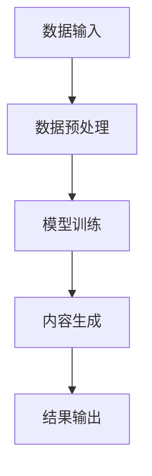

                 


# AI Agent在新闻媒体中的内容生成应用

## 关键词：AI Agent，新闻媒体，内容生成，生成式AI，新闻标题生成

## 摘要：本文深入探讨了AI Agent在新闻媒体内容生成中的应用，从核心算法到系统架构，再到实际案例，全面解析了AI Agent如何提升新闻内容的生成效率和质量。文章内容涵盖AI Agent的基本概念、技术原理、系统设计、项目实战及最佳实践，为读者提供全面的技术指导。

---

## 第1章 AI Agent的基本概念与新闻媒体的结合

### 1.1 AI Agent的定义与核心原理

#### 1.1.1 AI Agent的定义

AI Agent（人工智能代理）是指能够感知环境、执行任务以实现目标的智能系统。在新闻媒体中，AI Agent通常用于内容生成、数据分析和个性化推荐等领域。

#### 1.1.2 AI Agent的核心原理

AI Agent通过数据输入、信息处理和结果输出完成任务。其核心原理包括数据解析、内容生成和优化、以及结果反馈。

#### 1.1.3 AI Agent与传统内容生成的区别

传统内容生成依赖人工创作，而AI Agent通过算法自动生成内容，速度快、效率高，且可以根据数据进行优化。

### 1.2 新闻媒体中的AI Agent应用背景

#### 1.2.1 新闻行业的数字化转型

新闻行业正逐步从人工创作向自动化、智能化方向转型，AI Agent成为这一转型的重要工具。

#### 1.2.2 AI技术在新闻内容生成中的潜力

AI Agent可以通过大数据分析和自然语言处理技术生成高质量的新闻内容，满足用户多样化的需求。

#### 1.2.3 当前新闻生产中的痛点与挑战

传统新闻生产效率低、成本高，且难以满足个性化需求。AI Agent的应用可以有效解决这些问题。

### 1.3 AI Agent在新闻媒体中的应用场景

#### 1.3.1 新闻标题自动生成

AI Agent可以根据新闻内容生成吸引人的标题，提高点击率。

#### 1.3.2 新闻摘要生成

AI Agent可以快速生成新闻摘要，帮助读者快速获取关键信息。

#### 1.3.3 新闻内容推荐

AI Agent可以根据用户偏好推荐相关内容，提升用户阅读体验。

#### 1.3.4 个性化新闻生成

AI Agent可以根据用户兴趣生成个性化新闻内容，满足不同用户的需求。

---

## 第2章 AI Agent的核心概念与工作原理

### 2.1 AI Agent的核心概念

#### 2.1.1 智能体的基本定义

AI Agent是一种能够感知环境、执行任务的智能系统。

#### 2.1.2 AI Agent的分类与特点

AI Agent可以分为基于规则的代理和基于模型的代理，具有智能性、适应性和自主性等特点。

#### 2.1.3 AI Agent在新闻媒体中的角色定位

AI Agent在新闻媒体中主要作为内容生成工具，辅助记者完成新闻创作。

### 2.2 AI Agent的工作流程

#### 2.2.1 数据输入与解析

AI Agent首先接收新闻数据，进行解析和处理。

#### 2.2.2 内容生成与优化

AI Agent利用算法生成新闻内容，并进行优化调整。

#### 2.2.3 结果输出与反馈

AI Agent将生成的内容输出，并根据反馈进行改进。

### 2.3 AI Agent与新闻媒体的结合模型

#### 2.3.1 数据流分析

AI Agent通过数据流分析确定新闻内容的关键要素。

#### 2.3.2 生成过程中的关键环节

AI Agent在生成过程中需要进行数据解析、内容生成和优化调整。

#### 2.3.3 输出结果的评估与优化

AI Agent通过评估生成内容的质量，进行优化调整。

---

## 第3章 AI Agent的核心算法与数学模型

### 3.1 基于Transformer的AI Agent模型

#### 3.1.1 Transformer模型的基本结构

Transformer模型由编码器和解码器组成，通过自注意力机制进行信息处理。

#### 3.1.2 多头注意力机制的数学公式

多头注意力机制通过并行处理多个注意力头，提高模型的表达能力。

$$
\text{Attention}(Q, K, V) = \text{softmax}\left(\frac{QK^T}{\sqrt{d_k}}\right)V
$$

#### 3.1.3 解码器的结构

解码器通过自注意力机制和前馈网络生成最终的输出。

---

## 第4章 系统架构设计与实现

### 4.1 项目实战：新闻标题生成系统

#### 4.1.1 系统模块划分

新闻标题生成系统包括数据输入、模型训练、内容生成和结果输出四个模块。

#### 4.1.2 核心代码实现

```python
def generate_headline(text):
    # 数据预处理
    processed_text = preprocess(text)
    # 生成标题
    headline = model.generate(processed_text)
    return headline
```

#### 4.1.3 系统架构图



---

## 第5章 案例分析与总结

### 5.1 实际案例分析

#### 5.1.1 突发事件报道中的AI Agent应用

AI Agent可以快速生成突发事件的标题和摘要，帮助记者快速发布新闻。

#### 5.1.2 财经新闻中的AI Agent应用

AI Agent可以通过数据分析生成财经新闻，提供及时的市场动态。

#### 5.1.3 深度报道中的AI Agent应用

AI Agent可以辅助记者整理大量数据，生成深度报道的内容框架。

### 5.2 总结与展望

AI Agent在新闻媒体中的应用前景广阔，但需要解决数据隐私和内容准确性等问题。

---

## 作者：AI天才研究院 & 禅与计算机程序设计艺术

---

这篇文章全面介绍了AI Agent在新闻媒体中的内容生成应用，从理论到实践，详细阐述了AI Agent的核心算法、系统架构和实际案例，为读者提供了深入的技术指导。

