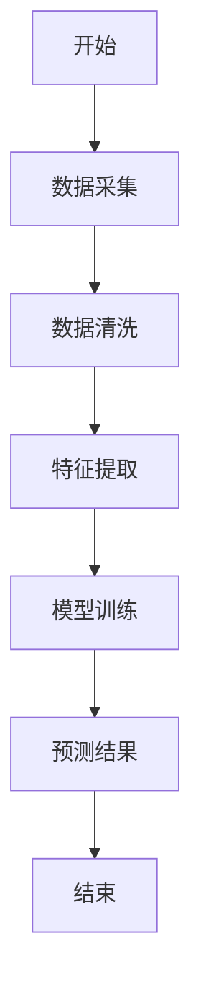
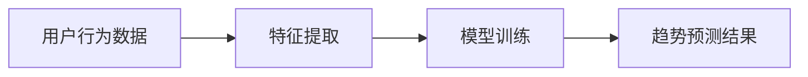
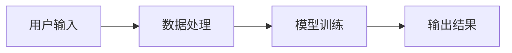
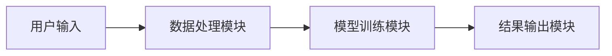
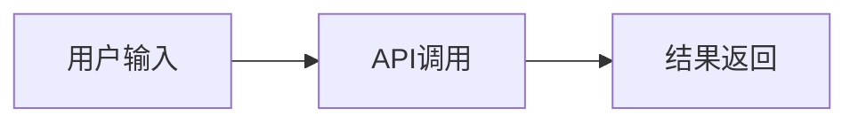

                 


# AI Agent在时尚产业中的应用：趋势预测与个性化搭配

## 关键词：AI Agent，时尚产业，趋势预测，个性化搭配，深度学习，系统架构

## 摘要：AI Agent作为一种智能体，正在逐步改变时尚产业的运作方式。本文将探讨AI Agent在趋势预测和个性化搭配中的应用，分析其背后的算法原理和系统架构，并通过实际案例展示其在时尚产业中的实际应用价值。

---

## 第1章: AI Agent与时尚产业的结合

### 1.1 AI Agent的定义与核心概念

#### 1.1.1 AI Agent的基本定义
AI Agent（人工智能代理）是指能够感知环境、自主决策并执行任务的智能系统。在时尚产业中，AI Agent可以用于数据分析、趋势预测和个性化推荐等任务。

#### 1.1.2 时尚产业的基本概念与特点
时尚产业是一个以创意和消费者需求为导向的行业，其特点是季节性变化快、市场细分明显以及消费者需求多样化。

#### 1.1.3 AI Agent在时尚产业中的应用背景
随着大数据和人工智能技术的发展，时尚产业正在经历数字化转型，AI Agent的应用可以帮助企业提高效率、降低成本并提升用户体验。

---

## 第2章: AI Agent在时尚产业中的重要性

### 2.1 时尚产业的数字化转型趋势
数字化转型已成为时尚产业的核心趋势，企业需要借助AI技术来应对市场竞争和消费者需求的变化。

### 2.2 AI Agent在趋势预测中的作用
通过分析历史数据和市场动态，AI Agent能够准确预测时尚趋势，帮助企业制定生产和营销策略。

### 2.3 AI Agent在个性化搭配中的优势
AI Agent可以通过用户数据分析和个性化推荐算法，为消费者提供个性化的搭配建议，提升购物体验。

---

## 第3章: AI Agent的核心概念与原理

### 3.1 AI Agent的基本原理
AI Agent通过感知环境、分析数据、制定决策并执行任务来实现目标。在时尚产业中，AI Agent的核心功能包括数据采集、分析和推荐。

### 3.2 AI Agent的核心技术
AI Agent的技术核心包括机器学习、自然语言处理和计算机视觉等，这些技术使其能够理解和分析复杂的时尚数据。

### 3.3 AI Agent在时尚产业中的具体应用
AI Agent在时尚产业中的应用包括趋势预测、库存管理、个性化推荐和市场营销等领域。

---

## 第4章: AI Agent的算法原理与流程

### 4.1 AI Agent的算法流程图
以下是AI Agent在趋势预测中的算法流程图：



### 4.2 基于深度学习的AI Agent模型
深度学习模型，如卷积神经网络（CNN）和循环神经网络（RNN），在时尚趋势预测中表现出色。

### 4.3 AI Agent的训练与优化
AI Agent的训练需要大量数据，并通过交叉验证和超参数优化来提高模型的准确性和稳定性。

---

## 第5章: 时尚趋势预测的AI Agent实现

### 5.1 时尚趋势预测的定义与方法
时尚趋势预测是指通过分析历史数据和市场动态，预测未来时尚潮流的过程。

### 5.2 基于AI Agent的时尚趋势预测模型
以下是一个基于深度学习的时尚趋势预测模型的示意图：



### 5.3 AI Agent在趋势预测中的实际案例
通过分析过去几年的时尚数据，AI Agent能够准确预测下一季度的流行颜色和款式。

---

## 第6章: 个性化搭配的AI Agent实现

### 6.1 个性化搭配的定义与方法
个性化搭配是指根据用户的体型、肤色和喜好，推荐适合的服装和配饰。

### 6.2 基于AI Agent的个性化搭配推荐系统
个性化搭配推荐系统通过分析用户的购买记录和偏好，推荐合适的时尚单品。

### 6.3 AI Agent在个性化搭配中的实际案例
例如，用户输入身高和体重后，AI Agent会推荐适合的服装尺寸和风格。

---

## 第7章: AI Agent在时尚产业中的技术实现

### 7.1 AI Agent的模型训练与优化
通过大量的时尚数据训练模型，并通过优化算法提高预测准确率。

### 7.2 数据处理与特征提取
数据处理包括数据清洗和特征提取，特征提取是通过提取数据中的关键特征来提高模型性能。

### 7.3 AI Agent的系统架构设计
以下是一个AI Agent的系统架构设计图：



---

## 第8章: 系统架构与接口设计

### 8.1 系统功能模块划分
系统功能模块包括数据采集、数据处理、模型训练和结果输出。

### 8.2 系统架构设计图
以下是系统架构设计图：



### 8.3 系统接口设计与交互流程
系统接口设计包括API接口和用户交互界面，交互流程如下：



---

## 第9章: 项目实战

### 9.1 环境搭建与数据准备
环境搭建包括安装Python、TensorFlow和Keras等库，数据准备包括收集和清洗数据。

### 9.2 系统核心实现代码
以下是系统核心代码示例：

```python
import tensorflow as tf
from tensorflow.keras import layers

model = tf.keras.Sequential([
    layers.Dense(64, activation='relu'),
    layers.Dense(10, activation='softmax')
])

model.compile(optimizer='adam', loss='sparse_categorical_crossentropy', metrics=['accuracy'])
model.fit(x_train, y_train, epochs=10, batch_size=32)
```

### 9.3 代码功能解读与分析
上述代码实现了一个简单的神经网络模型，用于分类任务。

---

## 第10章: 案例分析与效果评估

### 10.1 实际案例分析
通过分析某品牌的真实数据，AI Agent成功预测了下一季度的流行趋势。

### 10.2 系统效果评估与优化
系统效果评估包括准确率、召回率和F1分数等指标，优化措施包括调整模型参数和增加数据量。

### 10.3 项目总结与经验分享
项目总结包括系统的优缺点和改进建议，经验分享包括数据处理和模型优化的关键点。

---

## 第11章: 未来展望与结论

### 11.1 AI Agent在时尚产业中的未来发展方向
未来，AI Agent将在个性化推荐、虚拟试衣和智能供应链等领域发挥更大的作用。

### 11.2 总结
AI Agent正在改变时尚产业的运作方式，通过技术创新和应用实践，AI Agent将在未来发挥更大的价值。

---

## 作者：AI天才研究院/AI Genius Institute & 禅与计算机程序设计艺术 /Zen And The Art of Computer Programming

