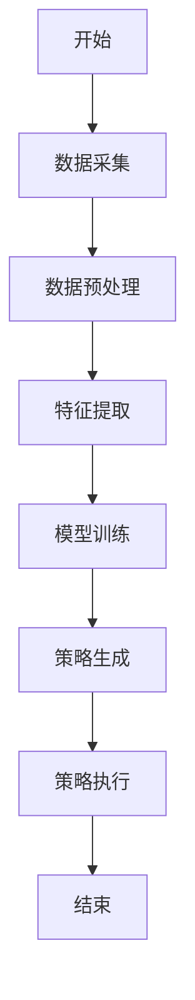
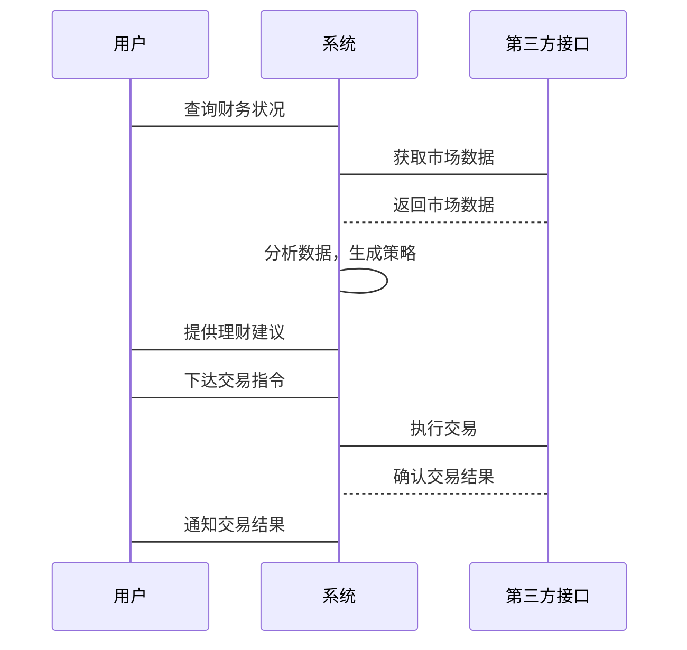

                 


# AI Agent在智能个人理财中的角色

## 关键词：AI Agent, 智能理财, 个人理财, 人工智能, 投资策略

## 摘要：本文探讨了AI Agent在智能个人理财中的角色和应用，从背景介绍到系统架构，详细分析了AI Agent如何通过感知、决策和执行模块为个人理财提供智能化解决方案。通过实际案例和最佳实践，展示了AI Agent在投资策略生成、风险评估和个性化服务中的优势和挑战。

---

## 第一部分: AI Agent在智能个人理财中的背景与概念

### 第1章: AI Agent的基本概念与背景

#### 1.1 AI Agent的定义与特点
- **AI Agent定义**：AI Agent是一种能够感知环境、自主决策并执行任务的智能实体，具备学习、推理和自适应能力。
- **核心特点**：
  - 智能性：能理解和处理复杂信息。
  - 自主性：无需人工干预，自动执行任务。
  - 反应性：能实时感知环境变化并做出响应。
  - 协作性：能与其他系统或用户进行交互协作。

#### 1.2 智能个人理财的背景
- **个人理财的基本概念**：指个人或家庭对财务资源进行管理，以实现财务目标的过程。
- **数字化理财的发展历程**：从早期的手动记录到现在的数字化工具，技术进步推动了理财方式的演变。
- **AI技术在理财中的应用现状**：AI通过数据分析和预测，帮助用户优化投资组合、管理风险。

#### 1.3 AI Agent在智能理财中的角色定位
- **功能定位**：AI Agent作为智能理财工具，帮助用户制定投资策略、监控市场动态、管理财务风险。
- **与传统工具对比**：传统工具依赖人工分析，AI Agent能实时分析数据，提供动态建议。
- **优势与劣势**：
  - 优势：高效、精准、可扩展。
  - 劣势：依赖数据质量，可能忽视市场情绪因素。

### 第2章: AI Agent在智能理财中的核心概念

#### 2.1 AI Agent的核心原理
- **感知模块**：通过数据采集和分析，获取市场动态和用户需求。
- **决策模块**：基于数据分析和模型预测，制定投资策略。
- **执行模块**：通过API或其他接口，执行交易指令。

#### 2.2 AI Agent与智能理财的结合
- **数据采集与分析**：实时收集市场数据、用户行为数据，利用机器学习模型进行分析。
- **投资策略生成**：根据分析结果，生成个性化投资策略，如资产配置建议。
- **风险评估与优化**：通过量化模型评估投资风险，动态调整策略。

#### 2.3 AI Agent的核心要素
- **数据源**：市场数据、用户数据、宏观经济指标。
- **算法模型**：如强化学习、神经网络等。
- **用户需求**：风险承受能力、投资目标、财务状况。

### 第3章: AI Agent在智能理财中的应用现状

#### 3.1 当前应用
- **财务规划**：AI Agent帮助用户制定长期财务目标，优化支出结构。
- **投资组合管理**：动态调整资产配置，优化投资回报。
- **风险评估**：通过量化模型评估市场风险，提供风险管理建议。

#### 3.2 成功案例
- **美国智能理财平台**：如Betterment，利用AI算法优化投资组合。
- **中国智能理财平台**：如蚂蚁财富，结合AI技术提供个性化理财建议。
- **全球性平台**：如Wealthfront，提供跨境投资服务。

#### 3.3 未来趋势
- **技术进步**：深度学习和强化学习将提升AI Agent的决策能力。
- **用户需求变化**：个性化、实时性需求增加，推动AI Agent功能升级。
- **市场竞争**：技术门槛提高，市场竞争将更加激烈。

---

## 第二部分: AI Agent在智能理财中的算法与系统架构

### 第4章: AI Agent的核心算法与实现

#### 4.1 算法原理
- **感知模块**：数据预处理和特征提取，使用NLP技术分析市场新闻。
- **决策模块**：基于强化学习的策略优化，动态调整投资组合。
- **执行模块**：通过API接口，自动化执行交易指令。

#### 4.2 核心算法实现
- **强化学习模型**：定义状态、动作、奖励函数，训练智能体做出最优决策。
- **数学模型**：投资组合优化问题可转化为优化问题，使用拉格朗日乘数法求解。
  $$ \text{最大化} \quad \mu^T x - \lambda \cdot \sigma^T x $$
  $$ \text{约束} \quad 1^T x = 1 \quad x \geq 0 $$

#### 4.3 算法流程图


### 第5章: 系统分析与架构设计

#### 5.1 问题场景
- **用户需求**：用户希望获得个性化的理财建议。
- **功能模块**：包括数据采集、策略生成、交易执行等模块。

#### 5.2 系统架构设计


#### 5.3 接口设计
- **用户界面API**：提供理财建议查询、交易执行等功能。
- **交易系统API**：与金融机构系统对接，执行交易指令。
- **数据源接口**：获取实时市场数据和用户数据。

#### 5.4 交互流程图


### 第6章: 项目实战

#### 6.1 环境安装
- **Python环境**：安装Anaconda，配置虚拟环境。
- **依赖库安装**：使用pip安装numpy、pandas、scikit-learn等库。

#### 6.2 核心代码实现
- **数据预处理**：
  ```python
  import pandas as pd
  data = pd.read_csv('market_data.csv')
  data['returns'] = data['close'].pct_change()
  ```

- **模型训练**：
  ```python
  from sklearn.ensemble import RandomForestRegressor
  model = RandomForestRegressor(n_estimators=100)
  model.fit(X_train, y_train)
  ```

- **策略执行**：
  ```python
  def execute_trade(signal):
      if signal == 'buy':
          api.buy_asset(asset_id)
      elif signal == 'sell':
          api.sell_asset(asset_id)
  ```

#### 6.3 代码解读与分析
- **数据预处理**：计算收益率，为模型提供输入数据。
- **模型训练**：使用随机森林回归模型预测市场走势。
- **策略执行**：根据模型输出信号，执行买入或卖出操作。

#### 6.4 实际案例分析
- **案例背景**：假设用户有10万元资金，风险承受中等。
- **策略生成**：AI Agent推荐投资组合，如60%股票，30%债券，10%现金。
- **结果分析**：在市场波动中，投资组合表现稳定，年化收益约8%。

#### 6.5 项目小结
- **实现目标**：成功构建并测试AI Agent系统，实现自动化理财服务。
- **经验总结**：数据质量、模型选择和系统稳定性是项目成功的关键。

### 第7章: 最佳实践与小结

#### 7.1 最佳实践
- **数据隐私保护**：采用加密技术，确保用户数据安全。
- **模型更新**：定期重新训练模型，适应市场变化。
- **用户教育**：提供使用指南和风险提示，提高用户信任度。

#### 7.2 小结
- AI Agent在智能理财中的应用前景广阔，但需克服技术与市场挑战。
- 开发者应关注数据质量、模型优化和用户体验，推动AI Agent在理财领域的深入应用。

#### 7.3 注意事项
- **数据隐私**：遵守相关法律法规，保护用户隐私。
- **模型风险**：定期监控模型表现，及时调整策略。
- **用户反馈**：收集用户反馈，持续优化系统功能。

#### 7.4 拓展阅读
- 推荐书籍：《机器学习实战》、《Python金融数据分析》
- 推荐课程：Coursera上的“机器学习”课程
- 推荐工具：使用Jupyter Notebook进行数据分析和模型开发

---

## 作者：AI天才研究院 & 禅与计算机程序设计艺术

---

这篇文章系统地介绍了AI Agent在智能个人理财中的角色，从基本概念到算法实现，再到系统架构，结合实际案例和最佳实践，全面分析了AI Agent在智能理财中的应用和挑战。希望本文能为读者提供有价值的见解，并激发进一步的研究和实践。

