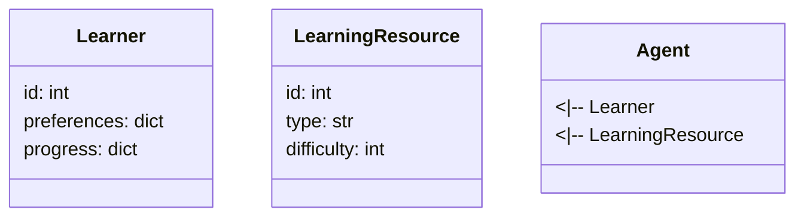
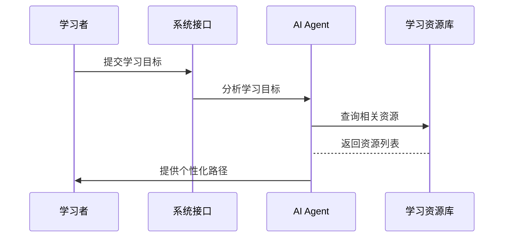

                 


# AI Agent在智能个性化学习路径规划中的应用

> 关键词：AI Agent, 智能教育, 个性化学习, 学习路径规划, 强化学习, 多智能体系统

> 摘要：  
随着人工智能技术的快速发展，AI Agent（智能体）在教育领域的应用日益广泛。个性化学习路径规划作为教育技术的重要组成部分，旨在根据学习者的个性化特征、学习目标和学习进度，动态调整学习计划和资源推荐。本文将从AI Agent的基本概念出发，深入探讨其在智能个性化学习路径规划中的核心原理、算法实现、系统架构以及实际应用。通过分析强化学习、多智能体系统等技术，结合实际案例，阐述如何利用AI Agent实现高效、个性化的学习路径规划，为教育技术的发展提供新的思路。

---

## 第一部分: AI Agent与智能个性化学习路径规划基础

### 第1章: AI Agent的基本概念与技术基础

#### 1.1 AI Agent的定义与特点

##### 1.1.1 AI Agent的定义
AI Agent（智能体）是指在环境中能够感知并自主行动以实现目标的实体。它具备以下核心特点：
- **自主性**：能够在没有外部干预的情况下自主决策。
- **反应性**：能够实时感知环境并做出响应。
- **目标导向**：通过目标驱动来优化行动策略。
- **学习能力**：能够通过经验改进自身行为。

##### 1.1.2 AI Agent的核心特点
- **动态适应性**：能够根据环境变化调整行为。
- **多模态交互**：支持文本、语音、视觉等多种交互方式。
- **分布式协作**：能够在多智能体系统中协同工作。

##### 1.1.3 AI Agent与传统算法的区别
传统的算法（如决策树、随机森林）通常需要明确的规则和数据特征，而AI Agent能够通过与环境的交互主动优化自身行为，具有更强的适应性和动态性。

---

#### 1.2 智能个性化学习的背景与需求

##### 1.2.1 个性化学习的定义与重要性
个性化学习是指根据学习者的兴趣、能力、学习风格等因素，提供定制化的学习方案。其重要性体现在：
- 提高学习效率。
- 增强学习者的兴趣和参与度。
- 适应不同学习者的差异化需求。

##### 1.2.2 当前学习路径规划的痛点
- **学习资源分散**：学习者难以找到最适合自己的资源。
- **学习进度不一致**：不同学习者的学习速度差异较大。
- **缺乏动态调整**：传统学习路径规划难以实时优化。

##### 1.2.3 AI Agent在学习路径规划中的作用
AI Agent能够通过实时数据分析和动态调整，为学习者提供个性化的学习建议和路径规划。

---

### 第2章: AI Agent在教育领域的应用背景

#### 2.1 教育技术的发展历程

##### 2.1.1 从传统教育到现代教育技术的演变
- **传统教育**：基于教师讲授和书本知识。
- **电子教育**：引入多媒体技术，如电子书、在线课程。
- **智能教育**：结合人工智能技术，实现个性化学习。

##### 2.1.2 AI技术在教育中的应用现状
- **智能推荐系统**：根据学习者的行为推荐学习资源。
- **自然语言处理**：用于智能问答和学习反馈。
- **计算机视觉**：用于学习行为分析和表情识别。

#### 2.2 个性化学习的理论基础

##### 2.2.1 学习者特征分析
- **学习目标**：学习者的核心需求是什么？
- **学习风格**：学习者偏好哪种学习方式？
- **知识水平**：学习者的知识储备如何？

##### 2.2.2 学习目标与路径规划的理论模型
- **目标分解**：将学习目标分解为具体的小目标。
- **路径优化**：通过算法找到最优的学习路径。

#### 2.3 AI Agent在个性化学习中的优势

##### 2.3.1 数据驱动的个性化分析
- 通过收集学习者的行为数据，分析其学习偏好和效果。
- 基于数据驱动的分析，为学习者提供个性化的学习建议。

##### 2.3.2 自适应学习路径的动态调整
- 根据学习者的实时反馈，动态调整学习计划。
- 在不同阶段优化学习路径，确保学习效率最大化。

##### 2.3.3 多模态数据的融合分析
- 结合文本、语音、图像等多种数据，全面分析学习者的学习状态。

---

## 第二部分: AI Agent的核心原理与算法实现

### 第3章: AI Agent的核心原理

#### 3.1 多智能体系统与协作学习

##### 3.1.1 多智能体系统的基本概念
多智能体系统是由多个智能体组成的协作系统，每个智能体负责不同的任务。

##### 3.1.2 多智能体在学习路径规划中的应用
- **任务分配**：将学习任务分配给不同的智能体。
- **协作学习**：智能体之间协同工作，优化学习路径。

##### 3.1.3 多智能体协作的机制与挑战
- **通信机制**：智能体之间如何通信？
- **协作策略**：如何确保协作的效率和效果？

#### 3.2 强化学习与决策树算法

##### 3.2.1 强化学习的基本原理
- **奖励机制**：通过奖励函数引导智能体的行为。
- **状态转移**：智能体根据当前状态采取行动，进入新的状态。

##### 3.2.2 决策树算法在学习路径规划中的应用
- **特征选择**：根据学习者特征构建决策树。
- **路径优化**：通过决策树找到最优学习路径。

##### 3.2.3 基于强化学习的路径优化算法
- **Q-learning算法**：通过状态-动作-奖励-状态（SARSA）循环优化路径。
- **数学模型**：定义状态空间、动作空间和奖励函数。

---

### 第4章: AI Agent的算法实现与数学模型

#### 4.1 强化学习算法的数学模型

##### 4.1.1 Q-learning算法的数学公式
$$ Q(s, a) = Q(s, a) + \alpha (r + \max_{a'} Q(s', a') - Q(s, a)) $$
其中：
- \( Q(s, a) \)：状态 \( s \) 下采取动作 \( a \) 的价值。
- \( \alpha \)：学习率。
- \( r \)：奖励值。
- \( s' \)：下一状态。

##### 4.1.2 状态转移矩阵的构建
- 状态转移矩阵描述了从当前状态转移到下一状态的概率。

##### 4.1.3 奖励函数的设计与实现
- 奖励函数需要根据学习目标和学习者行为设计。

#### 4.2 聚类算法与个性化特征提取

##### 4.2.1 K-means聚类算法的实现
- 将学习者分成不同的簇，每个簇代表一种学习特征。

##### 4.2.2 用户特征向量的构建与分析
- 将学习者的特征转化为向量，便于算法处理。

##### 4.2.3 基于聚类的学习路径分组策略
- 根据特征向量聚类结果，为每个簇设计个性化学习路径。

#### 4.3 算法实现的代码示例

##### 4.3.1 强化学习算法的Python实现
```python
import numpy as np

class QLearning:
    def __init__(self, state_space_size, action_space_size, alpha=0.1, gamma=0.9):
        self.Q = np.zeros((state_space_size, action_space_size))
        self.alpha = alpha
        self.gamma = gamma

    def choose_action(self, state, epsilon=0.1):
        if np.random.random() < epsilon:
            return np.random.randint(0, self.Q.shape[1])
        else:
            return np.argmax(self.Q[state])

    def update(self, current_state, action, reward, next_state):
        self.Q[current_state, action] = self.Q[current_state, action] + self.alpha * (reward + self.gamma * np.max(self.Q[next_state]) - self.Q[current_state, action])
```

---

## 第三部分: 系统分析与架构设计

### 第5章: 系统分析与架构设计

#### 5.1 问题场景介绍
- **学习者需求**：个性化学习路径规划。
- **系统目标**：构建一个基于AI Agent的智能学习路径规划系统。

#### 5.2 系统功能设计

##### 5.2.1 领域模型mermaid类图


#### 5.3 系统架构设计

##### 5.3.1 系统架构mermaid架构图
```mermaid
div
    组件: AI Agent
    组件: 学习者
    组件: 学习资源库
    组件: 系统接口
    组件: 数据存储
```

#### 5.4 系统接口设计

##### 5.4.1 学习者接口
- **输入**：学习者的基本信息和学习目标。
- **输出**：个性化学习路径。

##### 5.4.2 系统接口
- **API接口**：供其他系统调用。

#### 5.5 系统交互设计

##### 5.5.1 系统交互mermaid序列图


---

## 第四部分: 项目实战

### 第6章: 项目实战

#### 6.1 环境安装与配置

##### 6.1.1 环境要求
- Python 3.8+
- TensorFlow、Keras等深度学习库。

#### 6.2 系统核心实现

##### 6.2.1 AI Agent的核心实现
```python
def plan_learning_path(learner_profile):
    # 根据学习者特征构建决策树
    # 返回最优学习路径
    pass
```

##### 6.2.2 学习路径优化
- 基于强化学习算法，动态优化学习路径。

#### 6.3 代码应用解读与分析
- 解释代码的功能和实现逻辑。

#### 6.4 实际案例分析
- 通过实际案例分析AI Agent在学习路径规划中的应用效果。

#### 6.5 项目小结
- 总结项目的实现过程和成果。

---

## 第五部分: 总结与展望

### 第7章: 总结与展望

#### 7.1 核心内容总结
- AI Agent在智能个性化学习路径规划中的核心原理和算法实现。

#### 7.2 未来展望
- 探讨AI Agent在教育领域的未来发展方向。

#### 7.3 注意事项与建议
- 在实际应用中，需注意数据隐私和算法的可解释性。

---

## 作者：AI天才研究院/AI Genius Institute & 禅与计算机程序设计艺术 /Zen And The Art of Computer Programming

---

**结语**：  
AI Agent在智能个性化学习路径规划中的应用，不仅能够提升学习者的学习效率，还能够为教育技术的发展注入新的活力。通过不断优化算法和系统架构，未来将实现更加智能化、个性化的学习体验。

