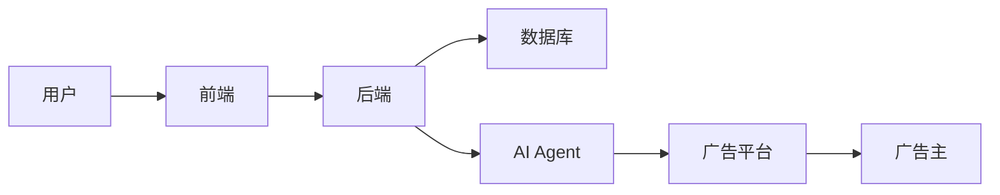
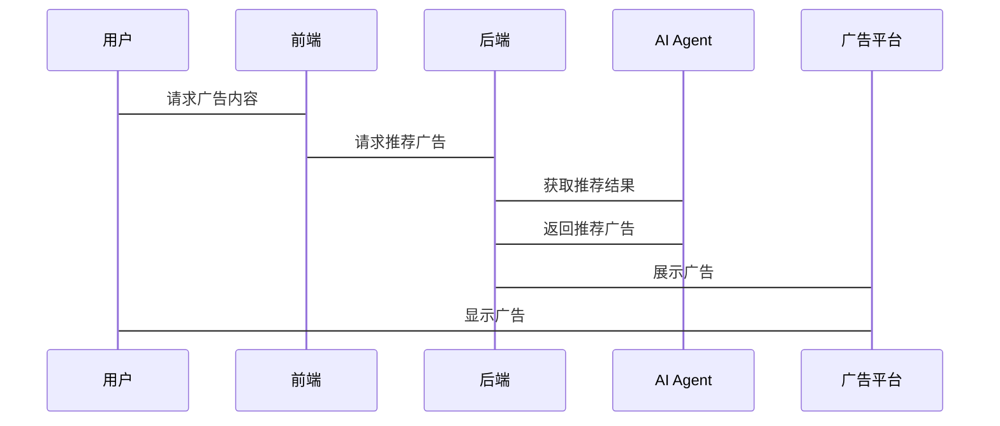

                 


# AI Agent在智能个性化广告投放中的应用

> 关键词：AI Agent, 个性化广告, 智能广告投放, 强化学习, 推荐系统, 算法原理, 系统架构

> 摘要：本文深入探讨了AI Agent在智能个性化广告投放中的应用，从背景、概念、算法原理到系统架构和项目实战，全面分析了AI Agent如何提升广告投放的效率和效果。通过详细的技术分析和实际案例，本文为读者提供了全面的理解和实践指导。

---

## 第一部分: AI Agent与智能个性化广告投放的背景与概念

### 第1章: AI Agent与广告投放的背景介绍

#### 1.1 AI Agent的基本概念

- **1.1.1 AI Agent的定义**
  AI Agent（人工智能代理）是指能够感知环境并采取行动以实现目标的智能实体。在广告投放中，AI Agent可以自动化决策广告的展示位置、受众选择和投放策略。

- **1.1.2 AI Agent的核心特征**
  - **自主性**：能够独立决策，无需人工干预。
  - **反应性**：能够实时感知环境变化并调整策略。
  - **目标导向**：以最大化广告效果为目标。
  - **学习能力**：通过数据反馈不断优化自身模型。

- **1.1.3 AI Agent与传统广告投放的区别**
  传统广告投放依赖人工经验或简单的规则引擎，而AI Agent能够利用机器学习和大数据分析，实现更精准和个性化的广告投放。

#### 1.2 智能个性化广告投放的背景

- **1.2.1 广告投放的现状与挑战**
  - 广告投放的规模越来越大，用户需求日益多样化。
  - 传统广告投放方式难以满足个性化需求，转化率低下。
  - 数据量爆炸式增长，人工分析成本高昂。

- **1.2.2 个性化广告的需求与重要性**
  - 用户需求的精准匹配提高了广告点击率和转化率。
  - 个性化广告能够提升用户体验，增强品牌忠诚度。
  - 个性化广告是实现精准营销和提高广告效率的关键。

- **1.2.3 AI Agent在广告投放中的应用前景**
  - AI Agent能够实时分析用户行为，动态调整广告策略。
  - 通过机器学习和深度学习技术，AI Agent能够预测用户需求，实现超精准投放。
  - AI Agent的应用将推动广告投放从“粗放式”向“精细化”转变。

### 第2章: AI Agent在广告投放中的核心概念

#### 2.1 AI Agent与广告投放的关系

- **2.1.1 AI Agent在广告投放中的角色**
  - **数据收集与分析**：AI Agent通过收集用户行为数据，构建用户画像。
  - **广告推荐**：基于用户画像，AI Agent推荐最相关的广告内容。
  - **动态优化**：实时监控广告效果，动态调整投放策略。

- **2.1.2 广告投放的流程与AI Agent的结合**
  - 数据收集：通过埋点技术收集用户行为数据。
  - 数据分析：利用机器学习模型分析数据，生成用户画像。
  - 广告推荐：基于用户画像和历史数据，推荐最优广告内容。
  - 投放优化：实时调整广告投放策略，提升转化率。

#### 2.2 核心概念与联系

- **2.2.1 AI Agent的核心原理**
  - AI Agent通过感知环境和数据驱动决策，实现广告的精准投放。
  - 通过强化学习和推荐系统，AI Agent能够不断优化广告策略。

- **2.2.2 广告投放中的关键要素**
  - 用户画像：基于用户行为、兴趣和偏好的数据构建。
  - 广告内容：根据用户需求和市场趋势推荐广告内容。
  - 投放策略：动态调整广告展示位置和投放时间。

- **2.2.3 ER实体关系图**
```mermaid
er
    actor 用户
    actor 广告主
    actor 广告平台
    actor AI Agent
    entity 用户画像
    entity 广告内容
    entity 投放策略

    用户 --> 用户画像: 提供行为数据
    广告主 --> 广告内容: 提供广告信息
    广告平台 --> AI Agent: 提供数据和平台支持
    AI Agent --> 用户: 展示个性化广告
    AI Agent --> 广告内容: 推荐广告内容
    AI Agent --> 投放策略: 优化投放策略
```

---

## 第二部分: AI Agent在广告投放中的算法原理

### 第3章: AI Agent在广告投放中的算法原理

#### 3.1 强化学习算法

- **3.1.1 强化学习的基本原理**
  - 强化学习是一种通过试错机制，学习策略以最大化累计奖励的算法。
  - 在广告投放中，强化学习可以用于动态调整广告策略，以提高点击率和转化率。

- **3.1.2 广告点击率预测的数学模型**
  $$ P(\text{点击}|x) = \sigma(w \cdot x + b) $$
  其中，$x$ 是广告特征向量，$w$ 是权重向量，$b$ 是偏置，$\sigma$ 是sigmoid函数。

- **3.1.3 强化学习在广告投放中的应用**
  ```mermaid
  graph LR
      A[用户] --> B[广告平台]
      B --> C[AI Agent]
      C --> D[广告内容]
      C --> E[调整策略]
      E --> F[结果反馈]
  ```

  - **代码实现示例：**
  ```python
  import numpy as np
  from sklearn.linear_model import LogisticRegression

  # 示例数据
  X = np.array([[1, 0], [0, 1], [1, 1], [0, 0]])
  y = np.array([0, 0, 1, 0])

  # 训练模型
  model = LogisticRegression()
  model.fit(X, y)

  # 预测点击概率
  def predict_click_probability(x):
      return model.predict_proba(x)[:, 1]

  print(predict_click_probability([[1, 1]]))  # 输出概率
  ```

- **算法优化建议：**
  - 使用更深的神经网络模型，如DNN或Transformer，以提高模型的表达能力。
  - 结合实时数据流，动态更新模型参数，以适应用户行为的变化。

#### 3.2 推荐系统算法

- **3.2.1 基于协同过滤的推荐算法**
  - 协同过滤通过分析用户行为相似性，推荐用户可能感兴趣的广告内容。
  - 在广告投放中，协同过滤可以用于相似用户的广告推荐。

- **3.2.2 基于内容的推荐算法**
  - 基于广告内容的特征，如标题、描述和标签，推荐相关的广告内容。
  - 使用自然语言处理技术，提取广告内容的语义特征。

- **3.2.3 深度学习推荐算法**
  - 使用深度学习模型，如DeepFM和BERT，提取广告内容和用户行为的高阶特征。
  - 通过多任务学习，同时优化多个广告效果指标，如点击率和转化率。

- **推荐系统优化建议：**
  - 结合多目标学习，优化广告投放的多个效果指标。
  - 使用实时反馈机制，动态调整推荐策略。

---

## 第三部分: AI Agent在广告投放中的系统分析与架构设计

### 第4章: 系统分析与架构设计

#### 4.1 广告投放的场景描述

- **用户行为分析**：用户在网站或应用程序上的行为，如浏览、点击、购买等。
- **广告内容管理**：广告主提供的广告内容，包括图片、视频、文本等。
- **投放策略优化**：根据用户行为和广告效果，动态调整广告的展示位置和时间。

#### 4.2 系统功能设计

- **用户画像模块**：
  - 收集用户行为数据，构建用户画像。
  - 分析用户的兴趣和偏好，生成用户标签。

- **广告推荐模块**：
  - 基于用户画像和广告内容，推荐最相关的广告。
  - 使用推荐算法，如协同过滤和深度学习模型。

- **投放优化模块**：
  - 动态调整广告的展示位置和时间。
  - 根据实时反馈，优化广告投放策略。

#### 4.3 系统架构设计

- **系统架构图**：


- **前端设计**：
  - 用户界面展示广告内容。
  - 收集用户行为数据，如点击、浏览等。

- **后端设计**：
  - 处理用户请求，调用AI Agent进行广告推荐。
  - 管理广告内容和用户画像。

- **数据库设计**：
  - 存储用户行为数据、广告内容和投放策略。
  - 使用分布式数据库，提高数据访问效率。

#### 4.4 接口设计与交互流程图

- **API接口**：
  - `/api/users/`：管理用户数据。
  - `/api/advertisements/`：管理广告内容。
  - `/api/agent/`：调用AI Agent进行广告推荐。

- **交互流程图**：


---

## 第四部分: AI Agent在广告投放中的项目实战

### 第5章: 项目实战

#### 5.1 环境安装

- **安装Python和相关库**：
  ```bash
  pip install numpy scikit-learn tensorflow pandas
  ```

- **安装广告投放平台**：
  - 使用云服务，如AWS或阿里云，部署广告投放系统。

#### 5.2 系统核心实现

- **用户画像模块**：
  ```python
  import pandas as pd
  from sklearn.preprocessing import StandardScaler

  # 示例数据
  data = pd.DataFrame({
      '用户ID': [1, 2, 3, 4],
      '年龄': [25, 35, 45, 30],
      '性别': ['男', '女', '男', '女'],
      '兴趣': ['科技', '时尚', '游戏', '教育']
  })

  # 数据预处理
  scaler = StandardScaler()
  numeric_features = data.select_dtypes(include=['int64', 'float64']).columns
  data[numeric_features] = scaler.fit_transform(data[numeric_features])
  ```

- **广告推荐模块**：
  ```python
  from sklearn.neighbors import NearestNeighbors

  # 训练协同过滤模型
  model = NearestNeighbors(n_neighbors=3, algorithm='brute')
  model.fit(data)
  ```

- **投放优化模块**：
  ```python
  import numpy as np
  import tensorflow as tf

  # 示例强化学习模型
  def policy_network(input_shape):
      model = tf.keras.Sequential([
          tf.keras.layers.Dense(64, activation='relu', input_shape=input_shape),
          tf.keras.layers.Dense(1, activation='sigmoid')
      ])
      return model

  model = policy_network((input_dim,))
  ```

#### 5.3 项目小结

- **项目实现的关键点**：
  - 数据收集与预处理。
  - AI Agent的算法实现与优化。
  - 系统架构设计与部署。

- **项目总结**：
  - AI Agent能够显著提高广告投放的精准度和效率。
  - 通过不断优化算法和系统架构，可以进一步提升广告效果。

---

## 第五部分: AI Agent在广告投放中的总结与展望

### 第6章: 总结与展望

#### 6.1 最佳实践 tips

- **数据隐私与安全**：在收集和处理用户数据时，必须遵守相关法律法规，保护用户隐私。
- **模型调优**：定期监控模型表现，及时调整参数，保持模型的高精度。
- **实时反馈机制**：建立实时反馈机制，动态优化广告投放策略。

#### 6.2 未来的研究方向

- **多模态推荐**：结合文本、图像和视频等多种模态信息，提升推荐系统的准确度。
- **强化学习优化**：研究更高效的强化学习算法，提高广告投放的决策能力。
- **联邦学习**：通过联邦学习技术，实现跨平台的广告投放优化。

---

## 作者

作者：AI天才研究院/AI Genius Institute & 禅与计算机程序设计艺术 /Zen And The Art of Computer Programming

---

通过以上内容，您可以全面了解AI Agent在智能个性化广告投放中的应用，从基础概念到算法实现，再到系统设计和项目实战，每一步都得到了详细的讲解和实践指导。希望这篇文章能够帮助您更好地理解AI Agent在广告投放中的重要性，并为实际应用提供参考和启发。

