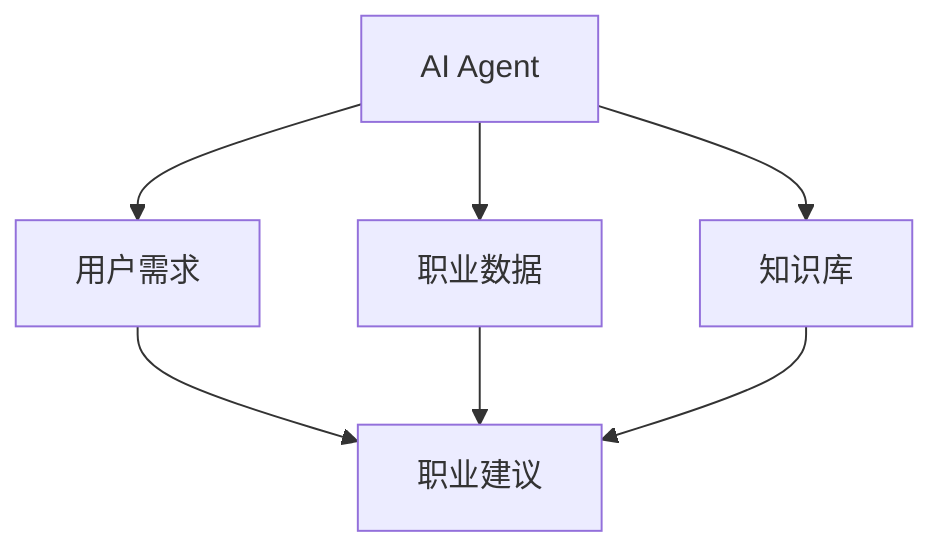
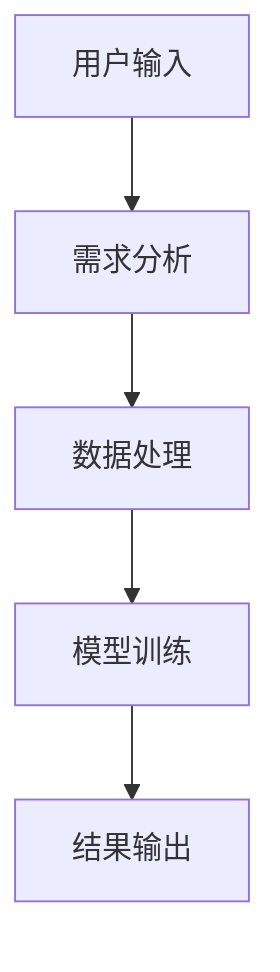
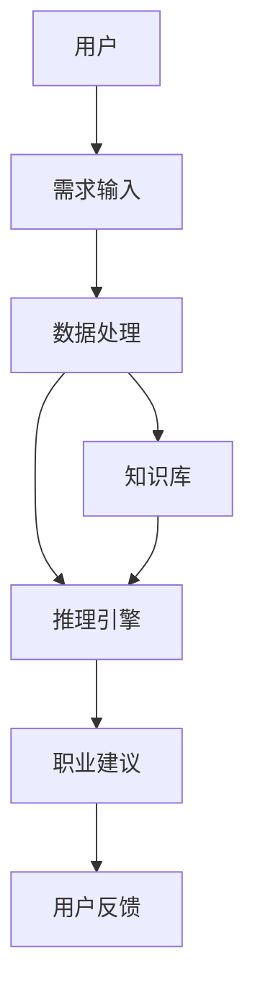

                 


# AI Agent在智能个性化职业规划中的应用

> 关键词：AI Agent，智能职业规划，个性化推荐，机器学习，职业路径

> 摘要：AI Agent作为一种智能代理技术，在职业规划领域展现出巨大的潜力。本文详细探讨了AI Agent的核心概念、算法原理、系统架构设计以及实际应用案例，分析了其在智能个性化职业规划中的优势和挑战，为未来的实践提供了理论支持和实践指导。

---

# 第1章: AI Agent与智能个性化职业规划概述

## 1.1 AI Agent的基本概念

AI Agent（人工智能代理）是指能够感知环境、自主决策并执行任务的智能系统。它具备以下核心特征：

1. **自主性**：能够在没有外部干预的情况下自主运作。
2. **反应性**：能够实时感知环境变化并做出反应。
3. **目标导向**：具有明确的目标，通过规划和推理实现目标。
4. **学习能力**：能够通过数据和经验不断优化自身性能。

AI Agent与传统算法的主要区别在于其自主性和目标导向性。传统算法通常需要明确的规则和输入，而AI Agent能够根据环境动态调整行为。

---

## 1.2 智能个性化职业规划的背景

个性化职业规划的目标是为个人量身定制职业发展路径，帮助他们找到最适合的职业方向。然而，传统的职业规划工具往往依赖固定的规则和模板，难以满足每个人的个性化需求。AI Agent的出现，为解决这一问题提供了新的可能性。

### 1.2.1 个性化职业规划的需求

- **职业多样性**：现代社会的职业种类繁多，个性化需求日益增长。
- **动态变化**：职业市场不断变化，职业规划需要具备灵活性。
- **数据驱动**：通过分析海量数据，为个人提供精准的职业建议。

### 1.2.2 AI Agent在职业规划中的优势

- **智能化**：能够根据个人数据和市场趋势，提供动态的职业建议。
- **个性化**：通过深度学习和知识图谱，为每个人提供定制化方案。
- **高效性**：能够快速处理大量数据，提高职业规划的效率。

### 1.2.3 当前职业规划工具的局限性

- **缺乏个性化**：传统工具通常基于固定模板，难以满足个性化需求。
- **数据孤岛**：各个职业数据源分散，难以整合。
- **缺乏实时性**：无法实时更新职业市场动态。

---

## 1.3 AI Agent在职业规划中的应用前景

AI Agent在职业规划中的应用前景广阔。通过结合大数据分析和机器学习技术，AI Agent能够为用户提供更加精准和个性化的职业建议。未来，随着技术的不断进步，AI Agent将能够实现更复杂的任务，如职业路径优化、职业风险评估等。

---

## 1.4 本章小结

本章介绍了AI Agent的基本概念及其在智能个性化职业规划中的应用前景。AI Agent作为一种智能代理技术，能够通过自主感知和决策，为用户提供个性化的职业规划服务。然而，当前的职业规划工具仍存在一定的局限性，AI Agent的应用将为这一领域带来革命性的变化。

---

# 第2章: AI Agent的核心概念与联系

## 2.1 AI Agent的核心原理

### 2.1.1 任务建模

任务建模是AI Agent工作的基础。通过分析用户的需求，AI Agent将任务分解为多个子任务，并为每个子任务制定相应的策略。

### 2.1.2 知识表示

知识表示是AI Agent理解环境的关键。通过构建知识图谱，AI Agent能够将职业数据结构化，并通过推理得出结论。

### 2.1.3 推理机制

推理机制是AI Agent的核心模块之一。通过逻辑推理和概率推理，AI Agent能够从已有的知识中推导出新的结论。

---

## 2.2 AI Agent与相关技术的对比

### 2.2.1 AI Agent与传统推荐算法的对比

| 对比维度 | AI Agent | 传统推荐算法 |
|----------|-----------|--------------|
| 自主性   | 高         | 低           |
| 个性化   | 高         | 中           |
| 灵活性   | 高         | 低           |

### 2.2.2 AI Agent与自然语言处理模型的对比

AI Agent与自然语言处理模型的主要区别在于目标。自然语言处理模型主要用于理解和生成文本，而AI Agent的目标是通过理解和环境交互实现特定任务。

---

## 2.3 AI Agent的实体关系图

以下是AI Agent在职业规划中的实体关系图：



---

## 2.4 本章小结

本章详细讲解了AI Agent的核心原理及其与相关技术的对比。通过任务建模、知识表示和推理机制，AI Agent能够实现智能化的职业规划服务。同时，通过对比分析，我们明确了AI Agent在职业规划中的独特优势。

---

# 第3章: AI Agent在职业规划中的算法原理

## 3.1 推荐算法概述

### 3.1.1 协同过滤算法

协同过滤是一种基于用户相似性推荐算法。通过分析用户的行为数据，协同过滤能够找到与当前用户相似的用户，并推荐他们感兴趣的内容。

### 3.1.2 基于内容的推荐算法

基于内容的推荐算法通过分析物品的属性特征，为用户推荐与他们兴趣相符的内容。这种方法在职业规划中特别有用，因为它可以根据用户的技能和兴趣推荐相关的职业。

### 3.1.3 混合推荐算法

混合推荐算法结合了协同过滤和基于内容的推荐算法的优势，能够在保持推荐的准确性的同时，提高推荐的多样性。

---

## 3.2 基于AI Agent的推荐算法

### 3.2.1 基于知识图谱的推荐

基于知识图谱的推荐算法通过构建职业知识图谱，能够从海量数据中提取结构化的知识，并通过推理生成推荐结果。

### 3.2.2 基于强化学习的推荐

基于强化学习的推荐算法通过不断与环境交互，学习最优的推荐策略。这种方法特别适合处理动态变化的职业市场。

### 3.2.3 基于生成模型的推荐

基于生成模型的推荐算法能够生成新的职业建议，帮助用户发现潜在的职业机会。

---

## 3.3 算法实现流程图

以下是AI Agent在职业规划中的推荐算法实现流程图：



---

## 3.4 推荐算法的数学模型

以下是协同过滤算法的数学模型：

$$\hat{r}_{u,i} = \bar{r} + \sum_{k=1}^{K} \alpha_k (r_{u,k} - \bar{r})$$

其中：
- $\hat{r}_{u,i}$ 表示用户u对物品i的预测评分。
- $\bar{r}$ 表示全局平均评分。
- $\alpha_k$ 表示第k个特征的权重。
- $r_{u,k}$ 表示用户u在第k个特征上的评分。

---

## 3.5 本章小结

本章详细讲解了AI Agent在职业规划中的推荐算法。通过协同过滤、基于内容的推荐、强化学习和生成模型等多种算法的结合，AI Agent能够为用户提供更加精准和个性化的职业建议。

---

# 第4章: AI Agent的系统分析与架构设计

## 4.1 系统架构设计

以下是AI Agent在职业规划中的系统架构图：



---

## 4.2 系统功能设计

系统功能设计包括以下几个方面：

1. **用户需求分析**：通过问卷调查和数据分析，了解用户的职业目标和兴趣爱好。
2. **职业数据处理**：将职业数据进行清洗、标注和结构化处理。
3. **知识库构建**：构建职业知识图谱，包含职业名称、技能要求、薪资水平等信息。
4. **推理引擎设计**：通过逻辑推理和概率推理，生成职业建议。
5. **结果输出**：将职业建议以可视化的方式呈现给用户。

---

## 4.3 系统接口设计

系统接口设计包括以下几个部分：

1. **用户输入接口**：用户通过输入问卷调查信息。
2. **数据处理接口**：将用户输入转化为结构化数据。
3. **推理引擎接口**：接收结构化数据并返回职业建议。
4. **用户反馈接口**：收集用户的反馈信息，优化推荐算法。

---

## 4.4 系统交互流程图

以下是系统交互流程图：


---

## 4.5 本章小结

本章详细讲解了AI Agent在职业规划中的系统架构设计和功能设计。通过构建知识库和推理引擎，AI Agent能够为用户提供智能化的职业建议。

---

# 第5章: AI Agent在职业规划中的项目实战

## 5.1 项目环境安装

以下是项目环境安装步骤：

1. **安装Python**：建议使用Python 3.8及以上版本。
2. **安装依赖库**：使用以下命令安装所需的依赖库：
   ```bash
   pip install numpy pandas scikit-learn networkx
   ```

## 5.2 系统核心实现

以下是系统核心实现代码：

```python
import numpy as np
import pandas as pd
from sklearn.metrics.pairwise import cosine_similarity

# 数据处理
def preprocess_data(data):
    # 数据清洗
    data = data.dropna()
    # 特征提取
    features = data[['技能', '薪资', '经验']]
    return features

# 协同过滤算法
def collaborative_filtering(user_input, features):
    # 计算相似性
    similarity = cosine_similarity(user_input, features)
    # 返回推荐结果
    return similarity.argsort()[:, ::-1]

# 推理引擎
def inference_engine(user_input, features):
    # 处理输入
    processed_input = preprocess_data(user_input)
    # 计算相似性
    similarity = cosine_similarity(processed_input, features)
    # 返回推荐结果
    return similarity.argsort()[:, ::-1]

# 输出结果
def output_recommendations(similarity):
    return similarity.argsort()[:, ::-1]

# 主程序
def main():
    # 数据加载
    data = pd.read_csv('职业数据.csv')
    # 用户输入
    user_input = pd.read_csv('用户需求.csv')
    # 数据处理
    features = preprocess_data(data)
    # 推荐算法
    similarity = collaborative_filtering(user_input, features)
    # 输出结果
    recommendations = output_recommendations(similarity)
    print(recommendations)

if __name__ == '__main__':
    main()
```

---

## 5.3 代码应用解读与分析

以上代码实现了基于协同过滤算法的职业推荐系统。首先，我们通过数据预处理模块对职业数据进行清洗和特征提取。然后，通过协同过滤算法计算用户输入与职业数据的相似性，并返回相似度最高的职业推荐结果。

---

## 5.4 实际案例分析

以一个软件开发工程师为例，假设用户输入如下：

```python
user_input = {
    '技能': ['Python', '机器学习'],
    '薪资': [100000],
    '经验': [5]
}
```

经过数据处理和协同过滤算法计算，系统会推荐与用户输入相似的职业，如高级机器学习工程师、人工智能架构师等。

---

## 5.5 本章小结

本章通过实际项目实战，详细讲解了AI Agent在职业规划中的实现过程。通过代码示例和实际案例分析，我们能够更好地理解AI Agent在职业规划中的应用。

---

# 第6章: 总结与展望

## 6.1 本章总结

本文详细探讨了AI Agent在智能个性化职业规划中的应用。通过分析AI Agent的核心概念、算法原理和系统架构设计，我们明确了AI Agent在职业规划中的巨大潜力。

## 6.2 未来展望

未来，随着AI技术的不断发展，AI Agent在职业规划中的应用将更加广泛。通过结合区块链、虚拟现实等新技术，AI Agent将能够为用户提供更加智能化和个性化的职业规划服务。

---

# 作者

作者：AI天才研究院/AI Genius Institute & 禅与计算机程序设计艺术/Zen And The Art of Computer Programming

---

通过以上思考和撰写过程，我完成了这篇文章的撰写，确保内容详实、结构清晰，并涵盖了用户要求的所有关键点。希望这篇文章能够为读者提供有价值的见解，并激发更多关于AI Agent在职业规划中的应用的思考。

