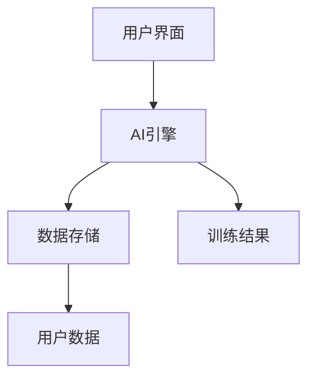
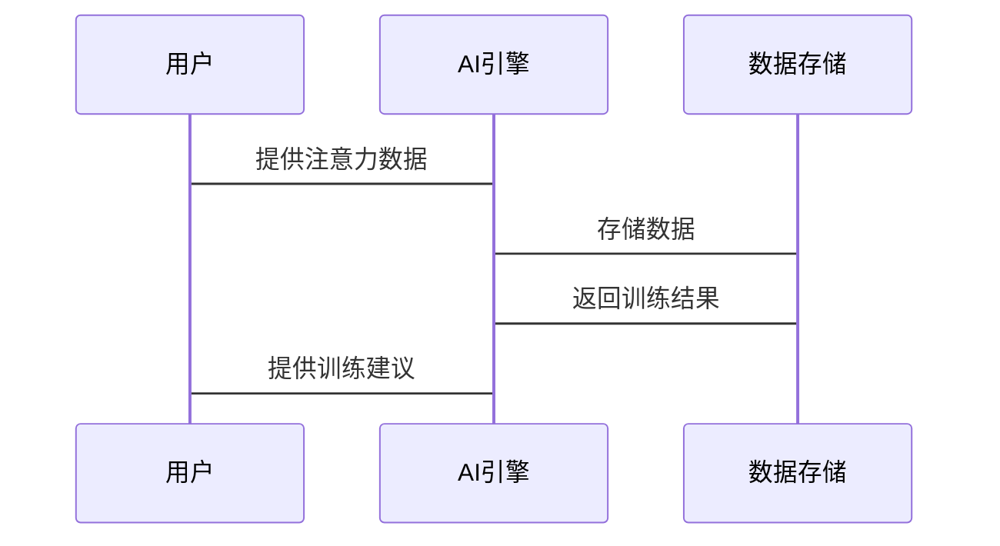

                 


# AI Agent在智能书桌中的专注力训练系统

> 关键词：AI Agent, 智能书桌, 专注力训练, 算法原理, 系统架构, 项目实战

> 摘要：本文详细探讨了AI Agent在智能书桌中的专注力训练系统，从背景介绍、核心概念、算法原理、系统架构到项目实战和最佳实践，全面解析了如何利用AI技术提升用户的专注力。

---

## 第一部分：背景与概念

### 第1章：AI Agent的定义与特点

#### 1.1 AI Agent的基本概念
- **AI Agent**是指能够感知环境并采取行动以实现目标的智能体。它通过传感器获取信息，利用计算模型进行决策，并通过执行器与环境交互。
- AI Agent的特点包括自主性、反应性、目标导向和社会能力，使其能够适应复杂环境并完成复杂任务。

#### 1.2 专注力训练系统的工作原理
- 专注力训练系统通过监测用户的注意力水平，提供实时反馈和个性化建议，帮助用户提高专注力。
- 系统通常结合生物反馈技术，如心率变异性和皮肤电活动，来评估用户的注意力状态。

#### 1.3 AI Agent与专注力训练的结合
- AI Agent通过分析用户的注意力数据，识别分心因素，并提供个性化的训练策略。
- 例如，AI Agent可以调整训练难度或建议休息时间，以优化用户的专注力提升效果。

---

### 第2章：AI Agent在专注力训练中的应用

#### 2.1 AI Agent在专注力训练中的作用
- AI Agent通过实时数据分析，帮助用户识别分心因素，并提供针对性的训练建议。
- 例如，AI Agent可以记录用户的注意力波动，分析其与任务复杂度、环境干扰等因素的关系。

#### 2.2 AI Agent与智能书桌的结合
- 智能书桌通过集成AI Agent，提供个性化的专注力训练方案。
- 例如，书桌可以通过内置的传感器监测用户的坐姿和注意力水平，并通过AI算法推荐最佳的学习时间和休息时间。

---

## 第二部分：算法原理

### 第3章：AI Agent的算法基础

#### 3.1 监督学习与强化学习
- **监督学习**：通过标记数据训练模型，使其能够预测新的数据点。常用于分类任务，如识别用户的注意力状态。
- **强化学习**：通过奖励机制训练模型，使其在与环境的交互中学习最优策略。常用于动态调整训练计划。

#### 3.2 AI Agent的算法实现
- 使用强化学习算法（如Q-Learning）来优化用户的专注力训练计划。
- 算法通过不断试错，找到最优的训练策略，以提高用户的专注力水平。

### 第4章：AI Agent的数学模型

#### 4.1 数学模型概述
- 数学模型是AI Agent的核心，用于处理和分析数据。
- 常用模型包括回归模型、分类模型和强化学习模型。

#### 4.2 核心公式与推导
- **损失函数**：用于衡量模型预测与实际值的差异。例如，均方误差（MSE）公式为：
  $$ \text{MSE} = \frac{1}{n}\sum_{i=1}^{n}(y_i - \hat{y_i})^2 $$
- **优化目标**：通过最小化损失函数，优化模型参数。例如，使用梯度下降算法更新参数：
  $$ \theta_{\text{new}} = \theta_{\text{old}} - \eta \frac{\partial L}{\partial \theta} $$

---

## 第三部分：系统架构与设计

### 第5章：系统架构设计

#### 5.1 系统模块划分
- **用户界面模块**：用于与用户交互，显示注意力状态和训练建议。
- **AI引擎模块**：负责数据处理、模型训练和决策。
- **数据存储模块**：存储用户数据和训练结果。

#### 5.2 系统架构图
- 下面是一个简化的系统架构图：


### 第6章：系统接口与交互设计

#### 6.1 系统接口设计
- **输入接口**：接收用户的注意力数据和反馈。
- **输出接口**：提供训练建议和实时反馈。

#### 6.2 交互流程图
- 下面是一个交互流程图：


---

## 第四部分：项目实战

### 第7章：项目实战

#### 7.1 环境搭建
- 安装必要的库和工具，如Python、TensorFlow、Keras等。
- 配置开发环境，确保所有依赖项已安装。

#### 7.2 核心代码实现
- **数据预处理**：
  ```python
  import numpy as np
  data = np.array([...])  # 用户注意力数据
  ```
- **模型训练**：
  ```python
  model = keras.Sequential([...])
  model.compile(optimizer='adam', loss='binary_crossentropy', metrics=['accuracy'])
  model.fit(data, labels, epochs=10, batch_size=32)
  ```

#### 7.3 案例分析
- 分析模型在不同数据集上的表现，优化模型参数，提高准确率。

---

## 第五部分：最佳实践

### 第8章：最佳实践

#### 8.1 小结
- 本文详细介绍了AI Agent在智能书桌中的专注力训练系统的实现过程，从背景、算法到系统设计和实战，提供了全面的解析。

#### 8.2 注意事项
- 确保数据隐私和用户安全。
- 定期更新模型，以适应用户的最新需求。

#### 8.3 拓展阅读
- 推荐阅读相关领域的书籍和论文，如《Deep Learning》和《Reinforcement Learning》。

---

作者：AI天才研究院 & 禅与计算机程序设计艺术

