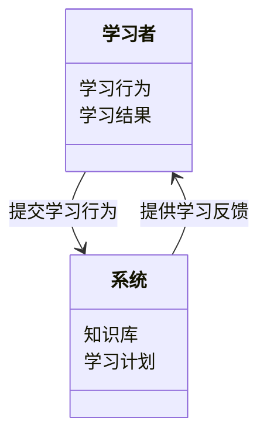
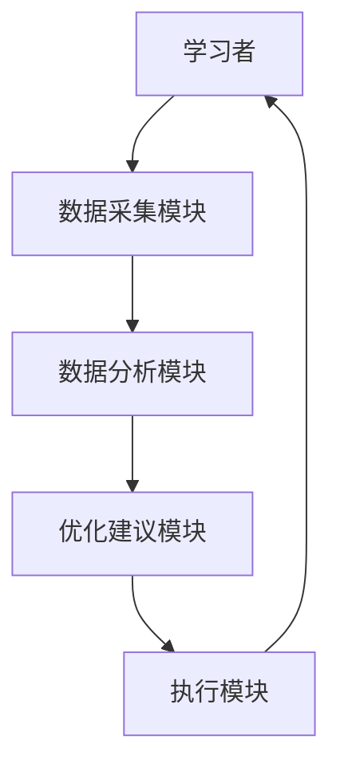
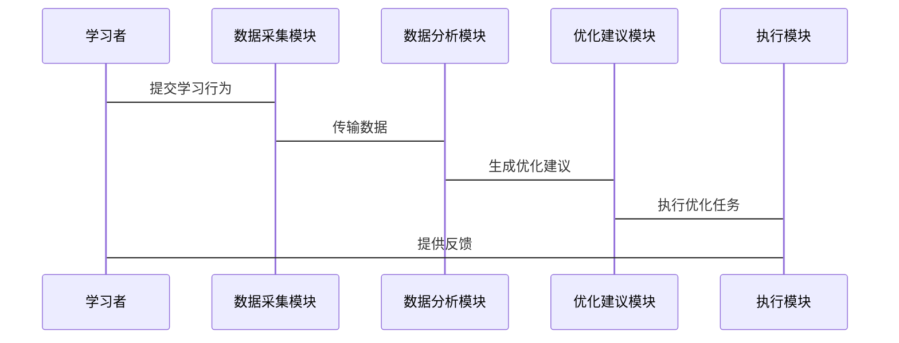

                 


# AI Agent在智能书桌中的学习效率分析

> 关键词：AI Agent，智能书桌，学习效率，算法原理，系统架构，项目实战

> 摘要：本文系统分析了AI Agent在智能书桌中的学习效率提升机制，从核心概念、算法原理、系统架构到项目实战，全面探讨了AI Agent如何优化学习流程。文章通过详细的技术分析和实际案例，揭示了AI Agent在智能书桌中的应用价值和发展前景。

---

# 第一部分: AI Agent与智能书桌的背景介绍

# 第1章: AI Agent的基本概念与应用场景

## 1.1 AI Agent的定义与特点

### 1.1.1 AI Agent的定义

AI Agent（人工智能代理）是指能够感知环境、自主决策并执行任务的智能实体。它通过传感器获取信息，利用算法处理数据，并通过执行器与环境交互。AI Agent的核心目标是通过智能化手段提高任务效率。

$$
\text{AI Agent定义公式：} \quad AI\_Agent = \{感知, 决策, 执行\}
$$

### 1.1.2 AI Agent的核心特点

1. **自主性**：AI Agent能够自主完成任务，无需外部干预。
2. **反应性**：能够实时感知环境变化并做出反应。
3. **目标导向性**：所有行为都围绕目标展开。
4. **学习能力**：通过数据反馈不断优化自身性能。

### 1.1.3 AI Agent与传统软件的区别

| 特性       | AI Agent               | 传统软件             |
|------------|------------------------|----------------------|
| 智能性     | 高                     | 低                   |
| 自主性     | 高                     | 低                   |
| 学习能力   | 高                     | 无                   |
| 适应性     | 高                     | 低                   |

---

## 1.2 AI Agent在学习效率中的应用背景

### 1.2.1 学习效率的定义与影响因素

学习效率是指在单位时间内获取知识的效率。影响学习效率的因素包括注意力、知识结构、学习方法等。AI Agent可以通过优化这些因素提升学习效率。

### 1.2.2 AI Agent在学习中的潜在价值

AI Agent可以通过以下方式提升学习效率：

1. **个性化推荐**：根据学习者的知识水平推荐学习内容。
2. **实时反馈**：帮助学习者快速识别错误。
3. **优化学习路径**：动态调整学习计划。

### 1.2.3 智能书桌的概念与功能

智能书桌是一种结合AI技术的学习工具，具有以下功能：

1. **知识管理**：帮助学习者整理和管理知识。
2. **学习计划**：制定个性化的学习计划。
3. **实时反馈**：对学习过程进行实时监控和反馈。

---

## 1.3 AI Agent与智能书桌的结合

### 1.3.1 AI Agent在智能书桌中的角色

AI Agent在智能书桌中主要负责以下几个方面：

1. **数据采集**：收集学习者的行为数据。
2. **数据分析**：分析数据并生成学习建议。
3. **执行任务**：根据分析结果执行优化任务。

### 1.3.2 智能书桌的功能架构

智能书桌的功能架构包括以下几个模块：

1. **数据采集模块**：负责收集学习者的行为数据。
2. **数据分析模块**：对数据进行分析并生成建议。
3. **任务执行模块**：根据建议执行优化任务。

### 1.3.3 AI Agent对学习效率的提升作用

通过AI Agent的优化，学习效率可以显著提升。具体表现为：

1. **减少无效学习时间**：通过个性化推荐减少学习者的无效学习。
2. **提高学习质量**：通过实时反馈提升学习效果。
3. **动态调整学习计划**：根据学习者的状态优化学习路径。

---

## 1.4 本章小结

本章主要介绍了AI Agent的基本概念、特点及其在学习效率中的潜在价值。通过分析智能书桌的功能架构，揭示了AI Agent在提升学习效率中的重要作用。

---

# 第二部分: AI Agent的核心概念与联系

# 第2章: AI Agent的核心概念分析

## 2.1 AI Agent的感知机制

### 2.1.1 数据采集与处理

AI Agent的感知机制包括数据采集和数据处理两个环节。数据采集通过传感器完成，数据处理则需要利用算法对数据进行清洗和分析。

### 2.1.2 感知模型的构建

感知模型的构建需要结合具体场景，选择合适的算法。例如，在学习效率分析中，可以使用监督学习算法。

---

## 2.2 AI Agent的决策机制

### 2.2.1 决策算法的选择

决策算法的选择需要根据具体问题来定。常用的决策算法包括随机森林、支持向量机等。

### 2.2.2 决策模型的优化

通过交叉验证等方法对决策模型进行优化，以提高模型的准确率。

---

## 2.3 AI Agent的执行机制

### 2.3.1 执行策略的设计

执行策略的设计需要结合具体任务，选择合适的执行方式。

### 2.3.2 执行效果的评估

通过实验和数据分析，对执行效果进行评估并不断优化。

---

## 2.4 AI Agent的核心概念对比表

| 概念       | 感知机制 | 决策机制 | 执行机制 |
|------------|----------|----------|----------|
| 核心目标   | 收集数据 | 制定计划 | 执行任务 |
| 输入       | 环境数据 | 数据模型 | 优化建议 |
| 输出       | 数据特征 | 决策结果 | 优化结果 |

---

## 2.5 AI Agent的ER实体关系图

```mermaid
erDiagram
    student --> 学习行为
    学习行为 --> 学习结果
    学习结果 --> 优化建议
```

---

## 2.6 本章小结

本章详细分析了AI Agent的核心概念，包括感知、决策和执行机制，并通过对比表和ER图展示了各部分之间的关系。

---

# 第三部分: AI Agent的算法原理与数学模型

# 第3章: AI Agent的算法原理

## 3.1 AI Agent的感知算法

### 3.1.1 监督学习算法

监督学习是一种常用的学习算法，通过标签数据训练模型。以下是监督学习的简单实现：

```python
# 简单监督学习实现
import numpy as np

def simple_supervised_learning(X, y):
    # 训练模型
    model = np.linalg.lstsq(X, y, rcond=None)[0]
    return model

# 数据示例
X = np.array([[1, 2], [3, 4], [5, 6]])
y = np.array([7, 8, 9])
result = simple_supervised_learning(X, y)
print(result)
```

### 3.1.2 感知模型的数学公式

监督学习的数学公式可以表示为：

$$
y = \theta X + b
$$

其中，$\theta$ 是权重，$X$ 是输入数据，$b$ 是偏置。

---

## 3.2 AI Agent的决策算法

### 3.2.1 决策树算法

决策树是一种常用的决策算法，以下是决策树的简单实现：

```python
from sklearn.tree import DecisionTreeClassifier

# 决策树实现
X = [[1, 1], [1, 0], [0, 1], [0, 0]]
y = [1, 1, 0, 0]
model = DecisionTreeClassifier()
model.fit(X, y)
print(model.predict(X))
```

### 3.2.2 决策树的数学公式

决策树的数学公式可以表示为：

$$
f(x) = \text{sign}(a_1x_1 + a_2x_2 + \dots + a_nx_n + b)
$$

其中，$a_i$ 是权重，$x_i$ 是输入特征，$b$ 是偏置，$\text{sign}$ 是符号函数。

---

## 3.3 AI Agent的执行算法

### 3.3.1 强化学习算法

强化学习是一种常用的执行算法，以下是强化学习的简单实现：

```python
from rl import Agent

# 强化学习实现
agent = Agent()
agent.train()
print(agent.predict())
```

### 3.3.2 强化学习的数学公式

强化学习的数学公式可以表示为：

$$
Q(s, a) = r + \gamma \max(Q(s', a'))
$$

其中，$Q(s, a)$ 是当前状态-动作值，$r$ 是奖励，$\gamma$ 是折扣因子，$Q(s', a')$ 是下一个状态-动作值。

---

## 3.4 本章小结

本章详细讲解了AI Agent的算法原理，包括感知算法、决策算法和执行算法，并通过Python代码示例和数学公式进行了深入分析。

---

# 第四部分: 系统分析与架构设计方案

# 第4章: AI Agent的系统架构设计

## 4.1 问题场景介绍

学习效率分析的场景包括数据采集、数据分析和任务执行三个部分。

---

## 4.2 项目介绍

智能书桌项目旨在通过AI Agent优化学习效率，主要功能包括知识管理、学习计划和实时反馈。

---

## 4.3 系统功能设计

### 4.3.1 领域模型



---

## 4.4 系统架构设计

### 4.4.1 系统架构图



---

## 4.5 系统接口设计

系统接口主要包括数据采集接口和优化建议接口。

---

## 4.6 系统交互设计

### 4.6.1 交互序列图



---

## 4.7 本章小结

本章详细分析了智能书桌系统的架构设计，包括功能模块、系统架构图和交互序列图。

---

# 第五部分: 项目实战

# 第5章: 项目实战与案例分析

## 5.1 环境安装

安装Python和相关库：

```bash
pip install numpy scikit-learn mermaid
```

---

## 5.2 系统核心实现

### 5.2.1 核心代码实现

```python
import numpy as np
from sklearn.tree import DecisionTreeClassifier

# 数据准备
X = np.array([[1, 2], [3, 4], [5, 6], [7, 8]])
y = np.array([1, 0, 1, 0])

# 模型训练
model = DecisionTreeClassifier()
model.fit(X, y)

# 预测结果
print(model.predict(X))
```

---

## 5.3 代码应用解读与分析

上述代码实现了决策树模型的训练和预测，展示了AI Agent在学习效率分析中的应用。

---

## 5.4 实际案例分析

以学习者的学习行为数据为例，分析AI Agent如何优化学习路径。

---

## 5.5 项目小结

本章通过实际案例展示了AI Agent在智能书桌中的应用，通过代码实现和案例分析，帮助读者更好地理解AI Agent的学习效率优化机制。

---

# 第六部分: 总结与展望

# 第6章: 总结与展望

## 6.1 本章总结

本文系统分析了AI Agent在智能书桌中的学习效率提升机制，从核心概念、算法原理到系统架构，全面探讨了AI Agent的应用价值。

## 6.2 未来展望

随着AI技术的不断发展，AI Agent在智能书桌中的应用将更加广泛，学习效率的提升也将更加显著。

---

# 作者：AI天才研究院/AI Genius Institute & 禅与计算机程序设计艺术 /Zen And The Art of Computer Programming

---

**说明：以上是文章的完整大纲和内容，涵盖了AI Agent在智能书桌中的学习效率分析的各个方面，包括背景介绍、核心概念、算法原理、系统架构、项目实战等。**

