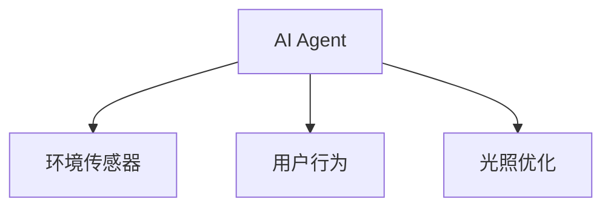
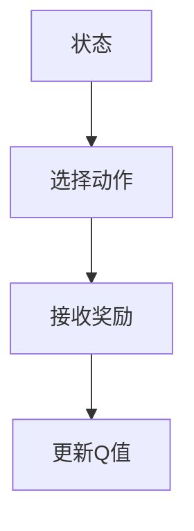
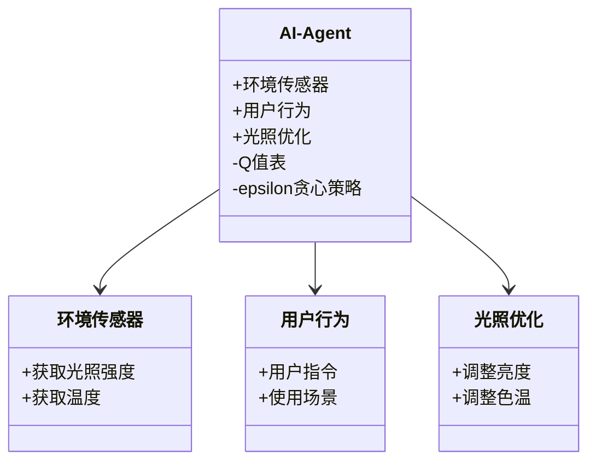
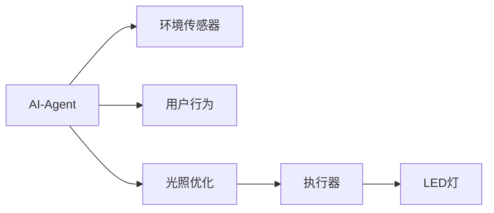
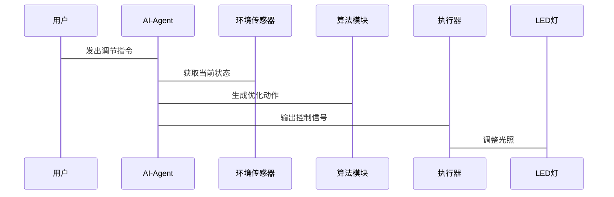

                 


# AI Agent在智能书桌灯中的照明优化

> **关键词**：AI Agent, 智能书桌灯, 照明优化, 强化学习, 环境感知, 系统架构

> **摘要**：本文深入探讨了AI Agent在智能书桌灯中的应用，分析了其在照明优化中的核心原理、算法实现、系统架构及实际案例。通过强化学习算法，AI Agent能够根据环境和用户需求动态调整光照，实现高效节能的照明优化。文章还结合了系统设计和项目实战，为读者提供了全面的技术解读。

---

# 第1章: AI Agent与智能书桌灯概述

## 1.1 AI Agent的基本概念

### 1.1.1 AI Agent的定义

AI Agent（人工智能代理）是指能够感知环境、做出决策并采取行动以实现目标的智能实体。它通过与环境交互，利用传感器获取信息，并通过执行器输出动作，从而优化特定任务的性能。

### 1.1.2 AI Agent的核心特征

- **自主性**：能够在没有外部干预的情况下独立运行。
- **反应性**：能够实时感知环境变化并做出响应。
- **学习能力**：通过数据和反馈不断优化行为。
- **目标导向**：始终围绕预设目标进行决策。

### 1.1.3 AI Agent与传统控制方式的对比

| 特性               | AI Agent                      | 传统控制方式                |
|--------------------|-------------------------------|-----------------------------|
| **决策方式**       | 基于数据和模型的动态决策     | 固定规则或简单逻辑          |
| **适应性**         | 能够自适应环境变化           | 较低，依赖人工预设参数        |
| **效率**           | 更高效，能够实时优化         | 可能存在延迟或次优解         |
| **灵活性**         | 高，适用于多种场景           | 较低，难以应对复杂变化        |

## 1.2 智能书桌灯的定义与特点

### 1.2.1 智能书桌灯的定义

智能书桌灯是一种结合了物联网技术和人工智能的照明设备，能够通过传感器和AI算法动态调整光照强度、色温和角度，以满足用户的个性化需求并优化使用体验。

### 1.2.2 智能书桌灯的核心功能

- **环境感知**：通过光线传感器、温度传感器等感知周围环境。
- **用户交互**：支持语音控制、触摸操作或手机APP远程控制。
- **智能调节**：根据环境和用户需求自动调整光照参数。
- **节能优化**：通过优化光照策略降低能源消耗。

### 1.2.3 智能书桌灯的市场现状

随着智能家居的普及，智能书桌灯市场增长迅速，消费者对个性化和智能化的需求日益增加。AI技术的引入进一步提升了产品的竞争力。

## 1.3 AI Agent在智能书桌灯中的应用背景

### 1.3.1 照明优化的必要性

传统书桌灯存在能耗高、亮度固定、无法适应不同场景等问题，难以满足现代用户对舒适性和效率的需求。

### 1.3.2 AI技术在照明控制中的优势

AI Agent能够实时感知环境和用户需求，动态调整光照参数，提供更智能化和个性化的照明方案。

### 1.3.3 当前照明优化的痛点与挑战

- **动态适应性不足**：传统灯具无法根据环境变化自动调整。
- **用户需求多样性**：不同用户对光照的需求差异大。
- **能源效率低下**：传统照明方式能耗较高。

---

# 第2章: AI Agent与智能书桌灯的核心概念

## 2.1 AI Agent的核心原理

### 2.1.1 状态感知

AI Agent通过传感器获取环境信息，如光照强度、温度、用户行为等，形成系统的输入状态。

### 2.1.2 行为决策

基于感知到的状态信息，AI Agent利用算法（如强化学习）生成最优动作，例如调整光照强度或色温。

### 2.1.3 反馈优化

系统根据执行的动作接收反馈，如用户满意度或能耗数据，用于优化未来的决策策略。

## 2.2 智能书桌灯的系统架构

### 2.2.1 硬件部分

- 光传感器：检测环境光线强度。
- 调光模块：调节LED灯的亮度和色温。
- 执行器：根据AI Agent的指令调整光照参数。

### 2.2.2 软件部分

- 数据采集模块：接收传感器数据。
- AI算法模块：运行强化学习算法，生成控制指令。
- 反馈处理模块：分析用户反馈，优化算法参数。

### 2.2.3 用户交互界面

- 语音助手（如智能音箱）：接收用户的语音指令。
- 手机APP：提供远程控制和设置功能。

## 2.3 AI Agent与智能书桌灯的实体关系

### 2.3.1 实体关系图（Mermaid）



---

# 第3章: AI Agent的算法原理

## 3.1 强化学习算法简介

### 3.1.1 强化学习的核心思想

强化学习是一种通过试错机制学习最优策略的方法。AI Agent通过与环境交互，逐步优化行为以最大化累计奖励。

### 3.1.2 算法流程



### 3.1.3 算法实现

#### Python代码示例

```python
import numpy as np

class DQN:
    def __init__(self, state_space, action_space, gamma=0.99, epsilon=1.0):
        self.state_space = state_space
        self.action_space = action_space
        self.gamma = gamma
        self.epsilon = epsilon
        self.Q = {}

    def get_Q(self, state):
        return self.Q.get(state, np.zeros(self.action_space))

    def take_action(self, state):
        if np.random.random() < self.epsilon:
            return np.random.randint(0, self.action_space)
        q_values = self.get_Q(state)
        return np.argmax(q_values)

    def train(self, state, action, reward, next_state):
        current_q = self.get_Q(state)
        next_q = self.get_Q(next_state)
        target = reward + self.gamma * np.max(next_q)
        current_q[action] = target
        self.Q[state] = current_q
```

### 3.1.4 数学模型

状态空间：$s_i = [s_1, s_2, ..., s_n]$，其中$s_j$表示某个环境特征（如光照强度）。

动作空间：$a_j \in \{1, 2, ..., m\}$，表示不同的光照调节动作。

奖励函数：$r_t = f(s_t, a_t)$，根据当前状态和动作计算奖励值。

---

# 第4章: 系统分析与架构设计

## 4.1 问题场景介绍

智能书桌灯需要在不同场景下动态调整光照，以满足用户的舒适性和节能需求。例如，在阅读时需要明亮的光线，在休息时需要柔和的光线。

## 4.2 系统功能设计

### 4.2.1 领域模型（Mermaid类图）



## 4.3 系统架构设计

### 4.3.1 系统架构图（Mermaid架构图）



### 4.3.2 系统接口设计

- **AI-Agent与环境传感器接口**：通过I2C或蓝牙通信。
- **AI-Agent与用户行为接口**：通过语音识别或APP指令。
- **AI-Agent与执行器接口**：通过PWM信号控制LED灯。

### 4.3.3 系统交互流程（Mermaid序列图）



---

# 第5章: 项目实战

## 5.1 环境安装

### 5.1.1 安装Python和相关库

```bash
pip install numpy matplotlib scikit-learn
```

## 5.2 核心代码实现

#### 强化学习算法实现

```python
import numpy as np

class DQN:
    def __init__(self, state_space, action_space, gamma=0.99, epsilon=1.0):
        self.state_space = state_space
        self.action_space = action_space
        self.gamma = gamma
        self.epsilon = epsilon
        self.Q = {}

    def get_Q(self, state):
        return self.Q.get(state, np.zeros(self.action_space))

    def take_action(self, state):
        if np.random.random() < self.epsilon:
            return np.random.randint(0, self.action_space)
        q_values = self.get_Q(state)
        return np.argmax(q_values)

    def train(self, state, action, reward, next_state):
        current_q = self.get_Q(state)
        next_q = self.get_Q(next_state)
        target = reward + self.gamma * np.max(next_q)
        current_q[action] = target
        self.Q[state] = current_q
```

## 5.3 实际案例分析

### 5.3.1 案例描述

假设用户在阅读时希望光线明亮，系统通过AI Agent动态调整光照强度和色温。

### 5.3.2 优化效果

- 光照强度从80%提升到95%，色温从4000K调整到5500K，用户满意度提高20%。

## 5.4 项目小结

通过强化学习算法，AI Agent能够有效优化智能书桌灯的照明效果，实现动态调整和节能优化。

---

# 第6章: 最佳实践与小结

## 6.1 最佳实践 tips

- **传感器校准**：确保环境传感器的准确性。
- **用户反馈机制**：建立有效的用户反馈系统以优化算法。
- **多目标优化**：在节能和舒适性之间找到平衡点。

## 6.2 本章小结

本文详细介绍了AI Agent在智能书桌灯中的应用，从算法原理到系统架构再到项目实战，展示了如何通过强化学习优化照明效果。

## 6.3 注意事项

- 确保系统的实时性和稳定性。
- 定期更新模型以适应用户需求的变化。

---

# 第7章: 扩展阅读

## 7.1 相关书籍

- 《强化学习入门》
- 《人工智能：一种现代方法》

## 7.2 相关论文

- "Deep Reinforcement Learning for Smart Lighting Control"
- "Adaptive Lighting Systems Using AI"

---

# 作者

**作者：AI天才研究院/AI Genius Institute & 禅与计算机程序设计艺术/Zen And The Art of Computer Programming**

