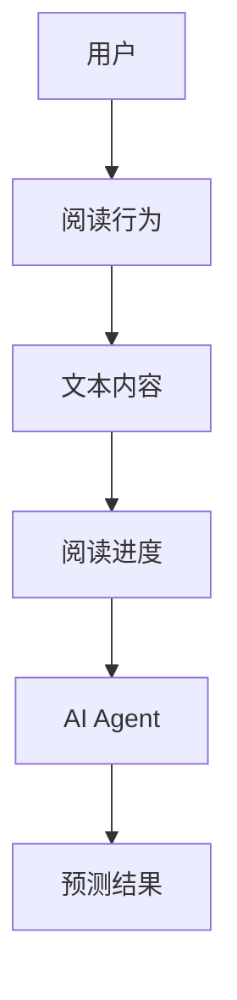
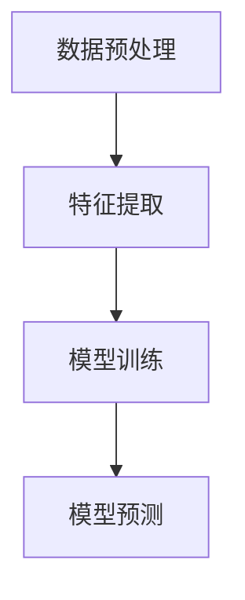
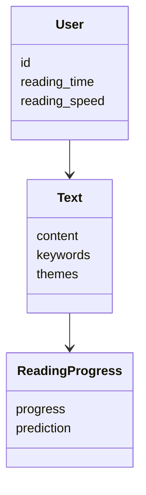
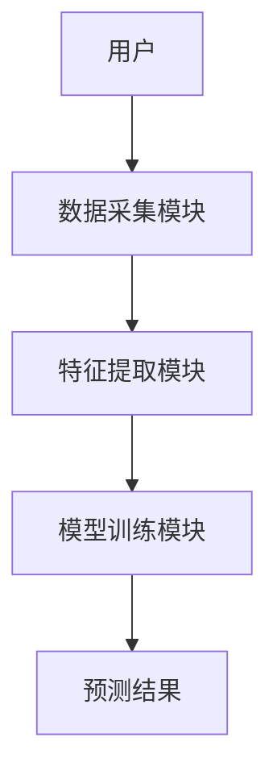
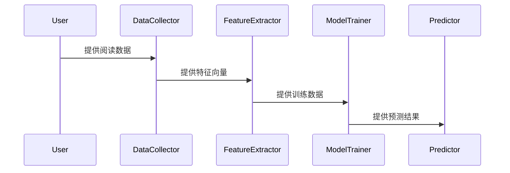

                 


# AI Agent在智能书立中的阅读进度追踪

> 关键词：AI Agent，阅读进度追踪，智能书架，机器学习，深度学习，数据模型

> 摘要：本文详细探讨了AI Agent在智能书架中阅读进度追踪的应用，从背景、核心概念、算法原理到系统设计与项目实战，全面分析了AI Agent在阅读进度追踪中的关键技术和实现方案。

---

# 第一部分: AI Agent与智能书架的背景与概念

## 第1章: AI Agent与智能书架的背景介绍

### 1.1 AI Agent的基本概念

#### 1.1.1 人工智能代理（AI Agent）的定义
人工智能代理（AI Agent）是指能够感知环境、自主决策并执行任务的智能体。AI Agent可以是软件程序或物理设备，能够通过传感器或数据输入获取信息，并通过算法处理信息，执行目标任务。

#### 1.1.2 AI Agent的核心特征
- **自主性**：AI Agent能够在没有外部干预的情况下自主运行。
- **反应性**：能够实时感知环境变化并做出响应。
- **目标导向**：具有明确的目标，并通过行动实现目标。
- **学习能力**：能够通过经验改进自身的性能。

#### 1.1.3 AI Agent与智能书架的关系
AI Agent是智能书架的核心组成部分，负责处理用户的阅读行为数据、分析文本内容，并预测用户的阅读进度。

### 1.2 阅读进度追踪的背景与问题

#### 1.2.1 阅读进度追踪的定义
阅读进度追踪是指通过技术手段，记录和分析用户的阅读行为，以量化用户的阅读进展。常见的指标包括阅读速度、阅读深度、阅读完成率等。

#### 1.2.2 当前阅读进度追踪的主要挑战
- **数据获取困难**：如何准确获取用户的阅读行为数据。
- **数据处理复杂**：需要处理大量异构数据，并提取有用的特征。
- **预测精度不足**：现有的阅读进度预测模型精度有限，难以满足实际需求。

#### 1.2.3 AI Agent在阅读进度追踪中的作用
AI Agent能够通过机器学习算法，实时分析用户的阅读行为数据，预测用户的阅读进度，并提供个性化的阅读建议。

### 1.3 智能书架的定义与特点

#### 1.3.1 智能书架的定义
智能书架是一种结合了人工智能技术的数字化书架，能够通过AI Agent实时分析用户的阅读行为，并提供智能化的阅读管理服务。

#### 1.3.2 智能书架的核心功能
- **阅读行为记录**：记录用户的阅读时间、阅读位置、阅读速度等。
- **阅读内容分析**：分析文本内容，提取关键词、主题等信息。
- **阅读进度预测**：预测用户的阅读进度，并提供个性化的阅读建议。

#### 1.3.3 智能书架与传统书架的主要区别
- **智能化**：智能书架能够通过AI技术提供智能化的阅读管理服务。
- **数据驱动**：智能书架依赖于大量用户行为数据和文本数据，通过数据驱动的方式提供服务。
- **实时性**：智能书架能够实时分析用户的阅读行为，并做出响应。

### 1.4 本章小结
本章介绍了AI Agent的基本概念、阅读进度追踪的背景与问题，以及智能书架的定义与特点。通过本章的介绍，读者可以理解AI Agent在智能书架中的核心作用，以及阅读进度追踪的重要性和挑战。

---

# 第二部分: AI Agent在阅读进度追踪中的核心概念

## 第2章: AI Agent的核心概念与原理

### 2.1 AI Agent的核心算法原理

#### 2.1.1 基于规则的AI Agent
基于规则的AI Agent通过预定义的规则和逻辑，对用户的阅读行为进行分析和处理。例如，当用户的阅读速度低于某个阈值时，AI Agent会提醒用户加快阅读速度。

#### 2.1.2 基于机器学习的AI Agent
基于机器学习的AI Agent能够通过训练数据，学习用户的阅读行为模式，并预测用户的阅读进度。常用的算法包括随机森林、支持向量机（SVM）等。

#### 2.1.3 基于深度学习的AI Agent
基于深度学习的AI Agent通过神经网络模型，学习用户的阅读行为数据，提取深层次的特征，并预测用户的阅读进度。常用的模型包括卷积神经网络（CNN）和循环神经网络（RNN）。

### 2.2 阅读进度追踪的数据模型

#### 2.2.1 用户阅读行为数据模型
用户阅读行为数据模型包括用户的阅读时间、阅读位置、阅读速度、阅读深度等指标。

#### 2.2.2 文本内容特征提取模型
文本内容特征提取模型包括文本的主题、关键词、情感倾向等。

#### 2.2.3 阅读进度预测模型
阅读进度预测模型通过整合用户阅读行为数据和文本内容特征，预测用户的阅读进度。

### 2.3 AI Agent与阅读进度追踪的实体关系



### 2.4 本章小结
本章详细介绍了AI Agent的核心算法原理，以及阅读进度追踪的数据模型和实体关系。通过本章的介绍，读者可以理解AI Agent在阅读进度追踪中的技术实现和数据处理流程。

---

## 第3章: AI Agent的算法原理

### 3.1 基于机器学习的阅读进度预测算法

#### 3.1.1 数据预处理
数据预处理包括数据清洗、特征提取、数据归一化等步骤。

#### 3.1.2 特征提取
特征提取是将用户的阅读行为数据和文本内容特征转化为数值化的特征向量。

#### 3.1.3 模型训练
模型训练是通过机器学习算法，训练一个阅读进度预测模型。

#### 3.1.4 模型预测
模型预测是通过训练好的模型，预测用户的阅读进度。

### 3.2 基于深度学习的阅读进度预测算法

#### 3.2.1 神经网络模型
神经网络模型包括卷积神经网络（CNN）和循环神经网络（RNN）等。

#### 3.2.2 模型训练流程
模型训练流程包括数据预处理、模型构建、模型训练、模型评估等步骤。

#### 3.2.3 模型优化
模型优化包括调整模型参数、优化算法、增加数据增强等方法。

### 3.3 AI Agent的算法实现

#### 3.3.1 算法流程图


#### 3.3.2 核心代码实现
```python
import pandas as pd
from sklearn.ensemble import RandomForestRegressor
from sklearn.metrics import mean_absolute_error

# 数据加载
data = pd.read_csv('reading_progress.csv')

# 特征工程
features = data[['reading_time', 'reading_speed', 'reading_depth']]
target = data['progress_prediction']

# 模型训练
model = RandomForestRegressor()
model.fit(features, target)

# 模型预测
 predictions = model.predict(features)
```

### 3.4 本章小结
本章详细介绍了基于机器学习和深度学习的阅读进度预测算法，包括数据预处理、特征提取、模型训练和预测的实现过程。

---

## 第4章: 系统分析与架构设计

### 4.1 问题场景介绍
本系统的目标是通过AI Agent实现智能书架中的阅读进度追踪功能。

### 4.2 系统功能设计

#### 4.2.1 领域模型设计


#### 4.2.2 系统架构设计


#### 4.2.3 系统接口设计
系统接口包括数据采集接口、特征提取接口、模型训练接口和预测结果接口。

#### 4.2.4 系统交互设计


### 4.3 本章小结
本章详细介绍了系统分析与架构设计，包括领域模型、系统架构、接口设计和系统交互设计。

---

## 第5章: 项目实战

### 5.1 环境安装

#### 5.1.1 安装Python环境
安装Python 3.8及以上版本，并安装必要的库：
```bash
pip install numpy pandas scikit-learn
```

### 5.2 系统核心实现

#### 5.2.1 核心代码实现
```python
import pandas as pd
from sklearn.ensemble import RandomForestRegressor
from sklearn.metrics import mean_absolute_error

# 数据加载
data = pd.read_csv('reading_progress.csv')

# 特征工程
features = data[['reading_time', 'reading_speed', 'reading_depth']]
target = data['progress_prediction']

# 模型训练
model = RandomForestRegressor()
model.fit(features, target)

# 模型预测
 predictions = model.predict(features)

# 模型评估
print(mean_absolute_error(target, predictions))
```

#### 5.2.2 代码应用解读与分析
上述代码实现了基于随机森林算法的阅读进度预测模型，通过数据预处理、特征提取、模型训练和预测，展示了AI Agent在阅读进度追踪中的实际应用。

### 5.3 案例分析与详细讲解

#### 5.3.1 案例分析
假设我们有一个用户，其阅读时间为1小时，阅读速度为每分钟500字，阅读深度为80%。通过模型预测，用户的阅读进度为75%。

#### 5.3.2 详细讲解
通过上述案例，展示了AI Agent如何通过机器学习算法，预测用户的阅读进度，并为用户提供个性化的阅读建议。

### 5.4 本章小结
本章通过项目实战，展示了AI Agent在智能书架中的阅读进度追踪的实现过程，包括环境安装、核心代码实现、案例分析与详细讲解。

---

## 第6章: 最佳实践与总结

### 6.1 最佳实践 Tips
- **数据质量**：确保数据的准确性和完整性。
- **模型优化**：通过交叉验证和超参数调优，提高模型的预测精度。
- **系统集成**：将AI Agent与智能书架无缝集成，提供智能化的阅读管理服务。

### 6.2 小结
通过本文的介绍，读者可以全面理解AI Agent在智能书架中的阅读进度追踪的应用，包括背景、核心概念、算法原理、系统设计和项目实战。

### 6.3 注意事项
- **数据隐私**：在实际应用中，需要注意用户数据的隐私保护。
- **模型可解释性**：模型的可解释性对于实际应用非常重要。
- **系统稳定性**：系统的稳定性和可靠性是确保阅读进度追踪功能正常运行的关键。

### 6.4 拓展阅读
- 《机器学习实战》
- 《深度学习入门》
- 《自然语言处理入门》

---

# 作者：AI天才研究院/AI Genius Institute & 禅与计算机程序设计艺术 /Zen And The Art of Computer Programming

