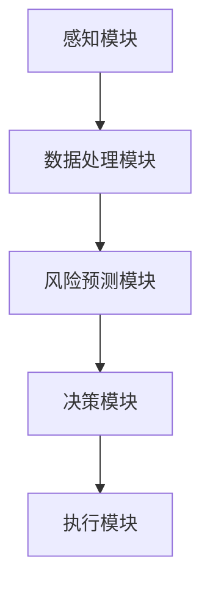
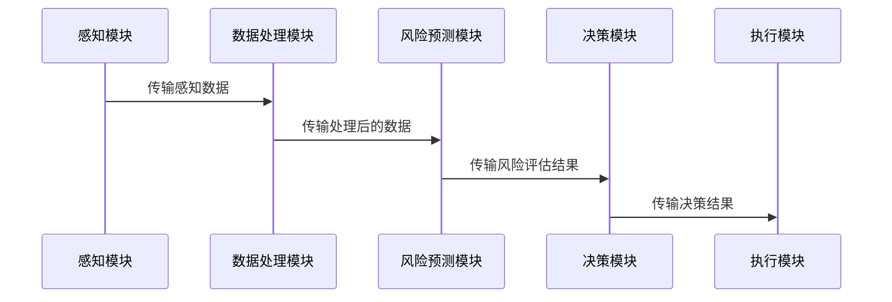
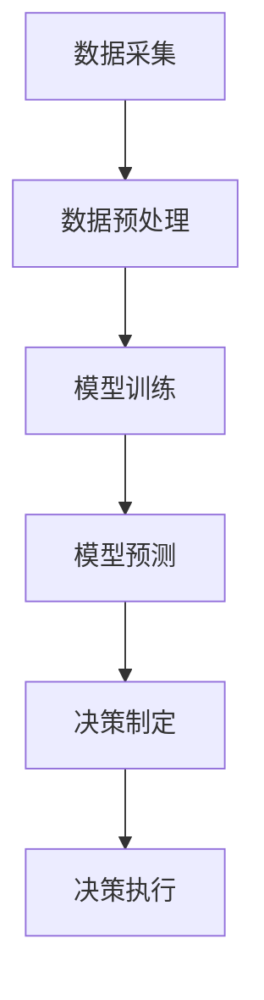

                 


# AI Agent在智能交通事故预防中的实践

## 关键词：AI Agent，交通事故预防，智能交通系统，人工智能，算法实现

## 摘要：AI Agent在智能交通事故预防中的实践

随着人工智能技术的飞速发展，AI Agent（智能体）在交通事故预防中的应用日益广泛。本文系统地探讨了AI Agent在智能交通事故预防中的核心概念、技术基础、系统架构、算法实现以及实际应用。通过详细分析AI Agent的工作原理、关键技术及其在交通事故预防中的应用场景，本文为读者提供了全面的理论基础和实践指导。同时，本文还结合实际案例，详细讲解了AI Agent在交通事故预防中的系统设计与实现过程，并展望了未来的发展方向。

---

# 第1章: AI Agent概述

## 1.1 AI Agent的基本概念

### 1.1.1 AI Agent的定义与特点

AI Agent（智能体）是指在计算机系统中，能够感知环境并采取行动以实现目标的实体。AI Agent在智能交通事故预防中的核心特点包括：

- **自主性**：能够在没有外部干预的情况下自主决策。
- **反应性**：能够实时感知环境并做出快速反应。
- **学习能力**：通过数据学习和优化算法，不断提升预测和决策的准确性。
- **协作性**：能够与其他系统、设备或AI Agent协同工作，实现更高效的交通管理。

### 1.1.2 交通事故预防中的问题背景

交通事故是全球范围内严重的社会问题之一。根据统计，每年因交通事故导致的人员伤亡和财产损失巨大。传统交通事故预防手段主要依赖于交通规则和交警执法，但面对复杂多变的交通环境，这些方法存在明显的局限性：

- **实时性不足**：交警无法实时监控所有交通状况。
- **反应速度慢**：人工处理交通事故往往滞后。
- **数据利用低效**：交通数据的采集和分析效率较低。

### 1.1.3 AI Agent在交通事故预防中的作用

AI Agent通过实时感知、分析和决策，能够在交通事故发生的苗头阶段就采取干预措施，从而有效预防事故发生。具体作用包括：

- **实时监测**：通过传感器和摄像头实时监测交通状况。
- **预测风险**：基于历史数据和实时信息，预测潜在的交通事故风险。
- **快速反应**：在检测到危险情况时，迅速采取行动，如发出预警或自动刹车。

---

## 1.2 交通事故的现状与挑战

### 1.2.1 交通事故的主要类型与统计数据

根据统计，交通事故的主要类型包括：

- **追尾事故**：占比最高，通常由于驾驶员疲劳驾驶或车距过近导致。
- **交叉路口事故**：由于驾驶员视线受阻或判断失误导致。
- **超速行驶事故**：超速是交通事故的重要诱因之一。
- **酒驾或疲劳驾驶事故**：人为因素导致的交通事故占比显著。

### 1.2.2 传统交通事故预防的局限性

传统交通事故预防手段存在以下主要问题：

- **依赖人工执法**：交警执法效率低，覆盖面有限。
- **技术手段单一**：传统交通监控设备功能单一，无法进行深度分析。
- **数据孤岛**：交通数据分散在不同系统中，难以实现有效整合和利用。

### 1.2.3 AI Agent在智能交通系统中的潜力

AI Agent通过整合多种先进技术，能够显著提升交通事故预防的效率和效果：

- **多源数据融合**：整合交通传感器、摄像头、车载设备等多源数据，提升监测精度。
- **智能决策**：基于实时数据和历史信息，AI Agent能够做出最优决策。
- **实时响应**：通过快速分析和反应，AI Agent能够在事故发生前采取预防措施。

---

## 1.3 AI Agent的核心功能与应用场景

### 1.3.1 AI Agent的核心功能模块

AI Agent在交通事故预防中的核心功能模块包括：

- **感知模块**：通过摄像头、雷达等传感器感知交通环境。
- **决策模块**：基于感知数据和历史信息，预测风险并制定决策。
- **执行模块**：通过车载系统或其他设备执行决策，如发出预警或控制车辆。

### 1.3.2 AI Agent在交通事故预防中的应用场景

AI Agent可以在多种场景中应用，以预防交通事故的发生：

- **实时监测与预警**：通过实时监测交通流量和车辆行为，提前预警潜在风险。
- **交通流量优化**：通过分析交通数据，优化交通信号灯配时，减少拥堵和事故发生概率。
- **自动驾驶辅助**：在自动驾驶系统中，AI Agent可以辅助车辆做出决策，提高行驶安全性。

### 1.3.3 AI Agent与传统交通管理技术的结合

AI Agent可以与传统交通管理技术相结合，形成更高效的交通管理系统：

- **与交通信号灯系统的结合**：通过AI Agent实时调整信号灯配时，优化交通流量。
- **与交通监控系统的结合**：通过AI Agent分析监控视频，实时发现交通异常情况。
- **与车载系统的结合**：通过AI Agent与车载系统的协同工作，实现车辆间的协同行驶。

---

## 1.4 本章小结

本章详细介绍了AI Agent的基本概念、交通事故的现状与挑战，以及AI Agent在交通事故预防中的核心功能与应用场景。通过分析，我们可以看到AI Agent在交通事故预防中的巨大潜力，同时也为后续章节的技术实现奠定了基础。

---

# 第2章: AI Agent的核心概念与技术基础

## 2.1 AI Agent的核心原理

### 2.1.1 AI Agent的工作原理

AI Agent的核心原理可以分为以下几个步骤：

1. **感知环境**：通过传感器、摄像头等设备感知交通环境。
2. **数据处理**：对感知数据进行预处理和分析，提取有用信息。
3. **决策制定**：基于分析结果，制定最优决策。
4. **执行行动**：通过执行机构（如车载系统）实施决策。

### 2.1.2 AI Agent的感知、决策与执行机制

AI Agent的感知机制主要依赖于多源数据的融合，包括：

- **视觉感知**：通过摄像头识别交通标志、车辆、行人等。
- **雷达感知**：通过雷达检测车辆之间的距离和相对速度。
- **激光雷达感知**：通过激光雷达（LiDAR）获取高精度的三维环境信息。

决策机制通常基于机器学习算法，如：

- **监督学习**：通过标记数据训练模型，预测潜在风险。
- **强化学习**：通过模拟环境训练智能体，使其在不断试错中优化决策。
- **深度学习**：通过神经网络提取高维特征，提升预测精度。

执行机制则依赖于车辆的控制系统，如：

- **自动驾驶系统**：通过车载电脑控制车辆的转向、加速和刹车。
- **交通管理系统**：通过调整信号灯配时或发布预警信息，引导交通流量。

### 2.1.3 AI Agent与传统控制系统的区别

与传统控制系统相比，AI Agent具有以下显著区别：

| **特性**         | **传统控制系统**                     | **AI Agent**                          |
|------------------|------------------------------------|------------------------------------|
| **自主性**       | 依赖于预设程序，缺乏自主性           | 具有自主决策能力，能够根据环境变化自适应调整行为 |
| **学习能力**     | 无法学习，依赖于固定规则             | 具备学习能力，能够通过数据优化决策策略 |
| **实时性**       | 反应速度较慢，依赖于人工干预         | 反应速度快，能够在短时间内做出决策并执行 |

---

## 2.2 AI Agent的关键技术

### 2.2.1 人工智能技术

人工智能技术是AI Agent的核心，主要包括：

- **深度学习**：通过神经网络提取高维特征，提升模型的预测精度。
- **强化学习**：通过试错机制优化决策策略。
- **自然语言处理**：通过NLP技术处理交通相关的文本信息。

### 2.2.2 计算机视觉

计算机视觉技术在AI Agent中的应用主要体现在：

- **目标检测**：通过摄像头识别道路上的车辆、行人等目标。
- **图像分割**：将交通场景中的各个物体进行分割，便于后续处理。
- **视觉跟踪**：跟踪目标物体的运动轨迹，预测其未来的运动方向。

### 2.2.3 数据融合与实时处理技术

数据融合技术能够将来自不同传感器的数据进行融合，提升感知的准确性和可靠性。实时处理技术则确保AI Agent能够快速响应交通环境的变化。

---

## 2.3 AI Agent的数据来源与处理

### 2.3.1 数据来源

AI Agent的数据来源主要包括：

- **传感器数据**：如雷达、激光雷达、摄像头等。
- **交通管理系统数据**：如交通信号灯、交通流量数据等。
- **车载设备数据**：如车载电脑、导航系统等。

### 2.3.2 数据预处理

数据预处理是AI Agent工作流程中的关键步骤，主要包括：

1. **数据清洗**：去除噪声数据，确保数据的准确性。
2. **数据归一化**：将不同来源的数据统一到相同的尺度，便于后续处理。
3. **特征提取**：从原始数据中提取有助于模型预测的特征。

### 2.3.3 数据分析与建模

数据分析与建模是AI Agent的核心环节，主要包括：

- **特征选择**：选择对预测有重要影响的特征。
- **模型训练**：使用训练数据训练机器学习模型。
- **模型评估**：通过验证数据评估模型的性能，调整参数优化模型。

---

## 2.4 本章小结

本章详细介绍了AI Agent的核心原理、关键技术以及数据处理流程。通过分析，我们可以看到AI Agent在交通事故预防中的技术基础，这也为后续章节的系统设计和算法实现奠定了基础。

---

# 第3章: AI Agent的系统架构设计

## 3.1 系统设计原则

AI Agent的系统设计需要遵循以下原则：

1. **模块化设计**：将系统划分为多个模块，每个模块负责特定的功能。
2. **实时性要求**：确保系统能够实时感知和响应交通环境的变化。
3. **可扩展性**：系统设计应具有良好的可扩展性，便于后续功能的添加和升级。
4. **安全性**：确保系统运行的安全性和可靠性，避免因系统故障导致交通事故。

---

## 3.2 系统功能设计

### 3.2.1 系统功能模块

AI Agent的系统功能模块主要包括：

- **感知模块**：负责收集交通环境数据。
- **决策模块**：负责分析数据并制定决策。
- **执行模块**：负责执行决策，如控制车辆或发出预警。
- **通信模块**：负责与其他系统或设备进行数据交互。

### 3.2.2 系统功能流程

系统的功能流程可以分为以下几个步骤：

1. **数据采集**：通过传感器、摄像头等设备采集交通环境数据。
2. **数据处理**：对采集到的数据进行预处理和分析。
3. **风险预测**：基于分析结果预测潜在的交通事故风险。
4. **决策制定**：根据风险评估结果制定相应的决策。
5. **决策执行**：通过执行模块实施决策，如发出预警或控制车辆。

---

## 3.3 系统架构设计

### 3.3.1 系统架构图

以下是AI Agent的系统架构设计图：



### 3.3.2 系统接口设计

系统接口设计需要确保各个模块之间的数据交互顺畅。常见的系统接口包括：

- **感知模块接口**：与传感器、摄像头等设备进行数据交互。
- **数据处理模块接口**：与数据库或其他处理模块进行数据交互。
- **决策模块接口**：与执行模块进行决策结果的传递。

### 3.3.3 系统交互流程图

以下是系统交互流程图：



---

## 3.4 本章小结

本章详细介绍了AI Agent的系统架构设计，包括系统设计原则、功能模块设计以及系统架构图。通过系统的架构设计，我们可以更好地理解AI Agent在交通事故预防中的工作流程和实现方式。

---

# 第4章: AI Agent的算法实现

## 4.1 算法原理

### 4.1.1 算法选择

在AI Agent的算法实现中，通常选择深度学习和强化学习作为核心算法。深度学习用于目标检测和风险预测，强化学习用于决策优化。

### 4.1.2 算法流程

以下是AI Agent算法实现的流程图：



### 4.1.3 算法实现步骤

1. **数据采集**：通过传感器、摄像头等设备采集交通环境数据。
2. **数据预处理**：对采集到的数据进行清洗、归一化等处理。
3. **模型训练**：使用训练数据训练机器学习模型。
4. **模型预测**：基于训练好的模型，预测潜在的交通事故风险。
5. **决策制定**：根据预测结果制定相应的决策。
6. **决策执行**：通过执行模块实施决策，如发出预警或控制车辆。

---

## 4.2 算法优化

### 4.2.1 模型优化

模型优化是提升AI Agent性能的关键步骤，主要包括：

- **参数调整**：通过调整模型参数优化模型性能。
- **特征选择**：选择对预测有重要影响的特征，提升模型的准确性。
- **模型融合**：将多个模型的结果进行融合，提升预测的准确性和稳定性。

### 4.2.2 算法的数学公式

以下是常用的算法数学公式：

1. **损失函数**：用于衡量模型预测值与真实值之间的差异。
   $$ L = \frac{1}{2} (y_{\text{真实}} - y_{\text{预测}})^2 $$

2. **优化算法**：如梯度下降算法，用于更新模型参数。
   $$ \theta = \theta - \eta \cdot \frac{\partial L}{\partial \theta} $$

3. **决策函数**：用于根据模型预测结果制定决策。
   $$ D(x) = \begin{cases} 
   \text{采取行动} & \text{如果 } P(x) > \text{阈值} \\
   \text{不采取行动} & \text{否则}
   \end{cases} $$

---

## 4.3 本章小结

本章详细介绍了AI Agent的算法实现，包括算法选择、实现步骤以及算法优化。通过优化算法，我们可以显著提升AI Agent在交通事故预防中的性能和效果。

---

# 第5章: AI Agent的项目实战

## 5.1 环境配置

### 5.1.1 系统环境

建议使用以下系统环境进行AI Agent的开发：

- **操作系统**：Linux（推荐）或Windows。
- **编程语言**：Python（推荐）或其他支持AI开发的语言。
- **开发工具**：Jupyter Notebook、PyCharm等。

### 5.1.2 硬件需求

硬件需求如下：

- **处理器**：Intel或AMD多核处理器。
- **内存**：建议16GB及以上。
- **存储**：至少100GB的可用空间。
- **显卡**：支持GPU加速的NVIDIA显卡（如NVIDIA Tesla系列）。

---

## 5.2 系统核心实现

### 5.2.1 感知模块实现

以下是感知模块的实现代码：

```python
import cv2
import numpy as np

def detect_objects(image):
    # 使用YOLO算法进行目标检测
    net = cv2.dnn.readNet("yolov4.cfg", "yolov4.weights")
    layers = net.getLayerNames()
    outputlayers = [layers[i] for i in range(net.getOutputsShape()[0][0]-1, -1, -1)]
    blob = cv2.dnn.blobFromImage(image, 0.00392, (416, 416), swapRB=True, crop=False)
    net.setInput(blob)
    outputs = net.forward(outputlayers)
    class_ids = []
    confidences = []
    boxes = []
    for output in outputs:
        for detection in output:
            scores = detection[5:]
            class_id = np.argmax(scores)
            confidence = scores[class_id]
            if confidence > 0.5:
                class_ids.append(class_id)
                confidences.append(confidence)
                x1, y1, x2, y2 = int(detection[0]), int(detection[1]), int(detection[2]), int(detection[3])
                boxes.append([x1, y1, x2, y2])
    return boxes, class_ids, confidences
```

### 5.2.2 决策模块实现

以下是决策模块的实现代码：

```python
def make_decision(boxes, class_ids, confidences, current_speed):
    # 基于感知结果和当前速度制定决策
    risk_level = 0
    for i in range(len(boxes)):
        if class_ids[i] == 3:  # 假设3表示车辆
            distance = calculate_distance(boxes[i])
            if distance < 20:
                risk_level = 5  # 高风险
                break
            elif distance < 50:
                risk_level = 3  # 中风险
    if risk_level > 0:
        return "减速或停车"
    else:
        return "正常行驶"
```

---

## 5.3 案例分析与代码解读

### 5.3.1 案例分析

以一个典型的交通事故预防场景为例：

- **场景描述**：一辆汽车在高速公路上行驶，前方突然出现障碍物。
- **感知模块**：通过摄像头检测到障碍物，并识别出障碍物的类型和位置。
- **决策模块**：基于障碍物的位置和速度，计算出风险等级，并制定相应的决策。

### 5.3.2 代码实现

以下是完整的代码实现：

```python
import cv2
import numpy as np

def detect_objects(image):
    # 使用YOLO算法进行目标检测
    net = cv2.dnn.readNet("yolov4.cfg", "yolov4.weights")
    layers = net.getLayerNames()
    outputlayers = [layers[i] for i in range(net.getOutputsShape()[0][0]-1, -1, -1)]
    blob = cv2.dnn.blobFromImage(image, 0.00392, (416, 416), swapRB=True, crop=False)
    net.setInput(blob)
    outputs = net.forward(outputlayers)
    class_ids = []
    confidences = []
    boxes = []
    for output in outputs:
        for detection in output:
            scores = detection[5:]
            class_id = np.argmax(scores)
            confidence = scores[class_id]
            if confidence > 0.5:
                class_ids.append(class_id)
                confidences.append(confidence)
                x1, y1, x2, y2 = int(detection[0]), int(detection[1]), int(detection[2]), int(detection[3])
                boxes.append([x1, y1, x2, y2])
    return boxes, class_ids, confidences

def calculate_distance(box):
    # 计算障碍物与车辆的距离
    x1, y1, x2, y2 = box
    distance = (y2 - y1) * 10  # 假设垂直方向的像素与距离的比例为10
    return distance

def make_decision(boxes, class_ids, confidences, current_speed):
    # 基于感知结果和当前速度制定决策
    risk_level = 0
    for i in range(len(boxes)):
        if class_ids[i] == 3:  # 假设3表示车辆
            distance = calculate_distance(boxes[i])
            if distance < 20:
                risk_level = 5  # 高风险
                break
            elif distance < 50:
                risk_level = 3  # 中风险
    if risk_level > 0:
        return "减速或停车"
    else:
        return "正常行驶"

# 主程序
image = cv2.imread("highway.jpg")
boxes, class_ids, confidences = detect_objects(image)
decision = make_decision(boxes, class_ids, confidences, current_speed=100)
print("决策结果:", decision)
```

---

## 5.4 本章小结

本章通过实际案例详细讲解了AI Agent的项目实战，包括环境配置、核心模块的实现以及案例分析。通过实际代码的解读，读者可以更好地理解AI Agent在交通事故预防中的实现过程。

---

# 第6章: 总结与未来展望

## 6.1 总结

通过本文的详细讲解，我们可以看到AI Agent在智能交通事故预防中的巨大潜力。AI Agent通过实时感知、分析和决策，能够在事故发生前采取干预措施，显著降低交通事故的发生概率。本文还详细介绍了AI Agent的核心概念、技术基础、系统架构以及算法实现，并通过实际案例展示了AI Agent的应用场景和实现过程。

---

## 6.2 未来展望

尽管AI Agent在交通事故预防中的应用已经取得了显著的成果，但仍然存在一些挑战和改进的空间：

1. **技术挑战**：如何进一步提升AI Agent的感知精度和决策能力，是未来研究的重要方向。
2. **数据挑战**：如何高效地处理和利用多源数据，是AI Agent系统优化的关键。
3. **安全挑战**：如何确保AI Agent系统的安全性和可靠性，是未来研究的重要课题。
4. **伦理挑战**：如何处理AI Agent在决策中的伦理问题，如自动驾驶中的伦理决策，是需要深入探讨的问题。

随着人工智能技术的不断发展，AI Agent在交通事故预防中的应用前景将更加广阔。未来的研究可以进一步探索AI Agent与其他交通管理技术的结合，如与智慧城市、智能交通系统的深度融合，以实现更高效的交通管理。

---

# 作者

作者：AI天才研究院/AI Genius Institute & 禅与计算机程序设计艺术/Zen And The Art of Computer Programming

