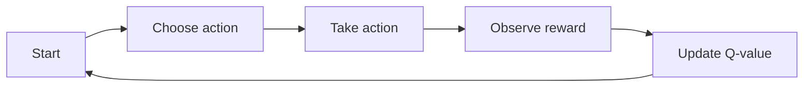
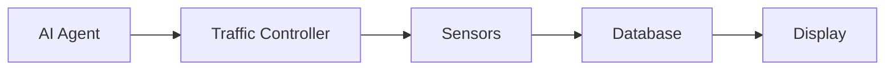

                 


# AI Agent在智能交通流量优化中的角色

## 关键词：AI Agent, 智能交通系统, 交通流量优化, 强化学习, 遗传算法

## 摘要：  
随着城市化进程的加快，交通拥堵问题日益严重，传统的交通管理方法已经难以应对复杂的交通状况。AI Agent（人工智能代理）作为一种具有自主决策和学习能力的智能体，正在成为解决交通流量优化问题的重要工具。本文将从AI Agent的基本概念、核心算法原理、系统架构设计以及实际应用案例等方面，全面探讨AI Agent在智能交通流量优化中的角色和作用，分析其优势和挑战，并展望未来的发展方向。

---

# 第1章: AI Agent与智能交通系统概述

## 1.1 AI Agent的基本概念  
AI Agent是一种能够感知环境、自主决策并执行任务的智能体。它具备以下核心特点：  
1. **自主性**：能够在没有外部干预的情况下独立运行。  
2. **反应性**：能够实时感知环境并做出反应。  
3. **学习能力**：通过数据和经验不断优化自身的决策能力。  
4. **社交能力**：能够与其他AI Agent或人类进行交互和协作。  

AI Agent在智能交通系统中的应用，主要体现在交通信号控制、路径规划、流量预测等领域。  

## 1.2 智能交通系统的现状与挑战  
智能交通系统（ITS）通过整合传感器、摄像头、GPS等技术，实时监控和管理交通流量。然而，传统的方法存在以下问题：  
1. **局部最优，全局次优**：传统交通信号控制算法通常基于局部信息，难以实现全局最优。  
2. **动态变化**：交通流量受天气、事故、事件等多种因素影响，具有高度动态性。  
3. **复杂性**：城市交通网络规模庞大，优化问题涉及多目标、多约束条件。  

AI Agent的引入，为解决这些问题提供了新的思路。  

## 1.3 AI Agent在交通优化中的作用与优势  
AI Agent的核心优势在于其学习能力和自适应性：  
1. **实时优化**：通过实时数据和强化学习，AI Agent能够快速调整信号控制策略。  
2. **全局优化**：AI Agent能够综合考虑全局交通网络的状态，制定最优的流量分配方案。  
3. **自适应性**：面对交通流量的变化，AI Agent能够快速调整策略，适应新的环境。  

---

# 第2章: AI Agent在交通流量优化中的核心概念

## 2.1 AI Agent的基本原理  
AI Agent在交通流量优化中的决策过程主要包括以下几个步骤：  
1. **感知环境**：通过传感器、摄像头等设备获取交通网络的实时状态。  
2. **知识表示**：将感知到的信息转化为可计算的数学模型。  
3. **行为决策**：基于模型和策略，制定最优的决策方案。  
4. **执行与反馈**：将决策方案执行，并根据反馈不断优化模型。  

## 2.2 交通流量优化的数学模型  
交通流量优化问题可以表示为一个多目标优化问题，目标函数通常包括以下几项：  
1. **平均等待时间**：最小化车辆的等待时间。  
2. **延误时间**：最小化车辆的延误时间。  
3. **排放量**：最小化交通拥堵产生的碳排放。  

数学模型通常采用以下形式：  
$$ \min \sum_{i=1}^{n} w_i x_i $$  
其中，$w_i$为权重系数，$x_i$为决策变量。  

## 2.3 AI Agent与交通系统的实体关系图  
```mermaid
er
actor(AI Agent) {
  id
  knowledge_base
  decision_rule
}
actor(Traffic System) {
  id
  traffic_signal
  vehicle_position
}
```

---

# 第3章: AI Agent的算法原理与实现

## 3.1 强化学习算法在AI Agent中的应用  
### 3.1.1 Q-learning算法  
Q-learning是一种经典的强化学习算法，其核心思想是通过Q值表记录状态-动作对的奖励值，并通过以下公式更新Q值：  
$$ Q(s, a) = Q(s, a) + \alpha [r + \gamma \max Q(s', a')] $$  



### 3.1.2 DQN算法的基本原理  
DQN（Deep Q-Network）算法通过深度神经网络近似Q值函数，实现端到端的强化学习。  

## 3.2 遗传算法在交通优化中的应用  
### 3.2.1 遗传算法的基本步骤  
遗传算法通过以下步骤优化交通流量：  
1. **编码**：将问题转化为基因序列。  
2. **选择**：选择适应度高的个体进行繁殖。  
3. **交叉**：通过基因交叉产生新的个体。  
4. **变异**：随机改变基因序列，增加多样性。  

### 3.2.2 遗传算法在路径优化中的实现  
路径优化问题可以表示为旅行商问题（TSP），遗传算法通过不断优化路径长度，找到最优解。  

## 3.3 算法实现的Python代码示例  
### 3.3.1 Q-learning算法实现  
```python
class QLearning:
    def __init__(self, state_space, action_space):
        self.q_table = np.zeros([state_space, action_space])
        
    def choose_action(self, state, epsilon):
        if np.random.random() < epsilon:
            return np.random.randint(action_space)
        else:
            return np.argmax(self.q_table[state])
```

---

# 第4章: 系统分析与架构设计方案

## 4.1 问题场景介绍  
本章以一个典型的交通信号控制问题为例，设计一个基于AI Agent的优化方案。  

## 4.2 系统功能设计  
系统功能包括：  
1. **数据采集**：通过传感器采集交通流量数据。  
2. **状态识别**：识别交通信号灯的状态和车辆位置。  
3. **决策控制**：基于AI算法优化信号灯配时。  
4. **反馈优化**：根据实际效果调整优化策略。  

## 4.3 系统架构设计  


---

# 第5章: 项目实战

## 5.1 环境搭建与代码实现  
### 5.1.1 环境搭建  
安装Python、TensorFlow、OpenCV等开发环境。  

### 5.1.2 核心功能实现  
实现Q-learning算法的信号灯优化功能。  

## 5.2 案例分析与代码解读  
通过具体案例分析AI Agent如何优化交通信号灯配时，减少交通拥堵。  

## 5.3 实验结果与分析  
展示实验结果，对比传统方法和AI Agent方法的优化效果。  

---

# 第6章: 最佳实践与展望

## 6.1 最佳实践  
1. **数据质量**：确保数据的实时性和准确性。  
2. **算法选择**：根据具体场景选择合适的算法。  
3. **系统维护**：定期更新模型和优化策略。  

## 6.2 本章小结  
AI Agent在智能交通流量优化中的应用前景广阔，但也面临数据隐私、算法效率等挑战。未来的研究方向包括更高效的算法设计、多Agent协作优化等。  

---

# 参考文献  
1. Russell, S., & Norvig, P. (2010). *Artificial Intelligence: A Modern Approach*.  
2. Mnih, V., et al. (2015). *Human-level control through deep reinforcement learning*.  
3. 李志军, 等. (2020). *智能交通系统中的优化算法研究*.  

---

# 作者  
**作者：AI天才研究院/AI Genius Institute & 禅与计算机程序设计艺术 /Zen And The Art of Computer Programming**  
邮箱：contact@aicourse.com  
网址：https://www.aicourse.com

