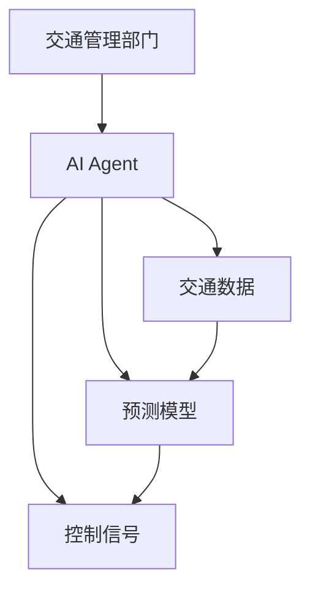
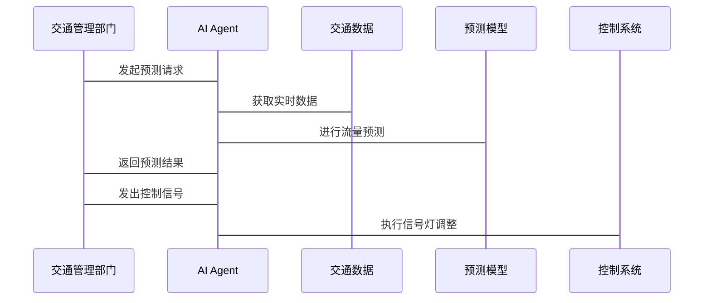

                 


# AI Agent在智能交通流量预测中的实践

## 关键词：AI Agent, 交通流量预测, 强化学习, 智能交通系统, 交通优化

## 摘要：本文系统地探讨了AI Agent在智能交通流量预测中的应用，分析了其核心概念、算法原理、系统架构，并通过实际案例展示了AI Agent在交通流量预测中的实践价值。文章深入讲解了强化学习算法、系统设计与优化策略，为交通管理部门和研究人员提供了有益的参考。

---

## 第1章: AI Agent与智能交通流量预测的背景

### 1.1 AI Agent的基本概念
#### 1.1.1 AI Agent的定义
AI Agent（人工智能代理）是指能够感知环境、自主决策并执行任务的智能实体。它能够通过传感器获取信息，利用算法进行分析，并采取行动以实现特定目标。

#### 1.1.2 AI Agent的核心特征
- **自主性**：能够在没有外部干预的情况下自主运作。
- **反应性**：能够实时感知环境变化并做出反应。
- **目标导向**：所有行为都围绕特定目标展开。
- **学习能力**：能够通过经验改进自身的决策能力。

#### 1.1.3 AI Agent与传统交通控制的区别
传统的交通控制系统依赖于固定的规则和程序，而AI Agent能够根据实时数据动态调整策略，具有更强的适应性和灵活性。

### 1.2 智能交通系统（ITS）概述
#### 1.2.1 ITS的基本概念
智能交通系统（Intelligent Traffic System, ITS）是一种利用先进的信息技术、数据通信、传感器和计算机技术来提高交通系统的效率和安全性的系统。

#### 1.2.2 ITS的主要组成部分
- **交通监测**：通过传感器和摄像头收集交通数据。
- **数据处理**：利用算法对数据进行分析和预测。
- **决策与控制**：根据分析结果优化交通信号灯、调整车道使用等。
- **用户交互**：通过App、导航系统等方式向用户提供建议。

#### 1.2.3 ITS的发展历程
从早期的交通信号灯控制系统到现代的智能交通管理，ITS经历了从简单到复杂、从局部到全局的演变。

### 1.3 交通流量预测的挑战与意义
#### 1.3.1 交通流量预测的难点
- **数据的复杂性**：交通流量受多种因素影响，如天气、事件、时间等。
- **时空依赖性**：交通流量在时间和空间上具有很强的相关性。
- **实时性要求高**：预测结果需要快速反馈，以应对突发情况。

#### 1.3.2 交通流量预测的重要性
准确的交通流量预测能够减少拥堵、提高道路利用率、降低碳排放，进而提升整体交通系统的效率。

#### 1.3.3 AI Agent在交通流量预测中的作用
AI Agent能够实时感知交通状况，利用历史数据和实时信息进行预测，并根据预测结果优化交通信号灯等控制策略。

## 1.4 本章小结
本章介绍了AI Agent的基本概念、智能交通系统的主要组成部分以及交通流量预测的挑战与意义。通过分析，我们理解了AI Agent在智能交通系统中的重要性。

---

## 第2章: AI Agent在交通流量预测中的核心概念

### 2.1 AI Agent的基本原理
#### 2.1.1 状态空间与动作空间
- **状态空间**：AI Agent所处的环境状态，例如交通信号灯的状态、车辆密度等。
- **动作空间**：AI Agent可以执行的动作，例如调整信号灯周期、改变车道分配等。

#### 2.1.2 策略与价值函数
- **策略**：AI Agent在给定状态下选择动作的规则。
- **价值函数**：评估一个状态或动作的价值，帮助AI Agent做出最优决策。

#### 2.1.3 强化学习的基本概念
强化学习是一种通过试错机制来优化决策的算法。AI Agent通过与环境的交互，学习最优策略以最大化累计奖励。

### 2.2 交通流量预测的核心要素
#### 2.2.1 交通数据的特征
- **时间序列性**：交通流量随时间变化具有一定的规律性。
- **空间相关性**：相邻路段的交通流量具有相关性。
- **多因素影响**：天气、节假日、事故等都会影响交通流量。

#### 2.2.2 交通流量的时空依赖性
- **时间依赖**：同一地点在不同时段的流量不同。
- **空间依赖**：相邻路段的流量变化相互影响。

#### 2.2.3 多目标优化问题
在交通流量预测中，通常需要在多个目标之间进行权衡，例如优化通行效率的同时减少碳排放。

### 2.3 AI Agent与交通系统的实体关系图
```mermaid
er
actor: 交通管理部门
agent: AI Agent
traffic_data: 交通数据
predict_model: 预测模型
action: 控制信号
```
- **交通管理部门**：负责整体交通系统的管理与协调。
- **AI Agent**：通过收集交通数据，利用预测模型进行预测，并输出控制信号。
- **交通数据**：包括车流量、信号灯状态、天气等信息。
- **预测模型**：基于历史数据和当前数据进行流量预测。
- **控制信号**：AI Agent根据预测结果输出的控制指令，如调整信号灯周期。

## 2.4 本章小结
本章详细讲解了AI Agent的基本原理及其在交通流量预测中的核心概念，通过实体关系图展示了系统中各角色之间的关系。

---

## 第3章: AI Agent在交通流量预测中的算法原理

### 3.1 强化学习算法概述
#### 3.1.1 Q-Learning算法
Q-Learning是一种经典的强化学习算法，适用于离线训练。其核心思想是通过不断更新Q值表来找到最优策略。

#### 3.1.2 DQN算法
DQN（Deep Q-Network）是一种基于深度神经网络的强化学习算法，适用于高维状态空间和动作空间。

#### 3.1.3 算法流程
1. 初始化Q值表或神经网络权重。
2. 环境提供当前状态。
3. AI Agent根据当前状态选择动作。
4. 执行动作并观察新的状态和奖励。
5. 更新Q值表或神经网络权重。
6. 重复上述步骤，直到达到终止条件。

### 3.2 交通流量预测的强化学习模型
#### 3.2.1 状态表示
将交通流量、信号灯状态、时间等信息编码为状态向量。

#### 3.2.2 动作空间设计
根据实际需求设计动作空间，例如：
- 调整信号灯周期。
- 改变车道分配。

#### 3.2.3 奖励机制设计
根据预测结果与实际流量的偏差设计奖励函数，例如：
- 当预测准确时，给予正向奖励。
- 当预测误差较大时，给予负向奖励。

### 3.3 算法实现
#### 3.3.1 Q-Learning算法实现
```python
import numpy as np

class QLearning:
    def __init__(self, state_space_size, action_space_size):
        self.q_table = np.zeros((state_space_size, action_space_size))
    
    def choose_action(self, state, epsilon=0.1):
        if np.random.random() < epsilon:
            return np.random.randint(0, action_space_size)
        else:
            return np.argmax(self.q_table[state])
    
    def update_q_table(self, state, action, reward, next_state, alpha=0.1):
        self.q_table[state, action] = (1 - alpha) * self.q_table[state, action] + alpha * (reward + np.max(self.q_table[next_state]))
```

#### 3.3.2 DQN算法实现
```python
import torch
import torch.nn as nn

class DQN(nn.Module):
    def __init__(self, input_dim, output_dim):
        super(DQN, self).__init__()
        self.fc1 = nn.Linear(input_dim, 64)
        self.fc2 = nn.Linear(64, output_dim)
    
    def forward(self, x):
        x = torch.relu(self.fc1(x))
        return self.fc2(x)

# 示例训练过程
model = DQN(input_dim=10, output_dim=5)
optimizer = torch.optim.Adam(model.parameters(), lr=0.001)
criterion = nn.MSELoss()

for epoch in range(1000):
    state = ...  # 当前状态
    action = model.forward(state).argmax().item()
    next_state = ...  # 下一状态
    reward = ...  # 奖励
    
    target = reward + model.forward(next_state).max().item()
    output = model.forward(state)
    loss = criterion(output[action], torch.tensor([target]))
    optimizer.zero_grad()
    loss.backward()
    optimizer.step()
```

### 3.4 本章小结
本章详细讲解了强化学习算法在交通流量预测中的应用，通过Q-Learning和DQN两种算法的实现，展示了AI Agent如何通过学习优化预测模型。

---

## 第4章: 系统分析与架构设计

### 4.1 问题场景介绍
- **目标**：设计一个基于AI Agent的智能交通流量预测系统。
- **需求**：实时监测交通流量，预测未来流量，优化信号灯控制。

### 4.2 系统功能设计
#### 4.2.1 数据采集模块
- 采集交通流量、信号灯状态、天气等数据。

#### 4.2.2 预测模型模块
- 基于历史数据和实时数据进行流量预测。

#### 4.2.3 决策控制模块
- 根据预测结果优化信号灯周期、调整车道分配。

### 4.3 系统架构设计


### 4.4 系统交互设计


## 4.5 本章小结
本章详细描述了基于AI Agent的智能交通流量预测系统的架构设计和交互流程，为后续的实现奠定了基础。

---

## 第5章: 项目实战

### 5.1 环境搭建
#### 5.1.1 硬件环境
- CPU: Intel i7
- 内存: 16GB
- 存储: 500GB SSD

#### 5.1.2 软件环境
- Python 3.8
- TensorFlow 2.5
- Pandas 1.3
- Mermaid 1.0

### 5.2 系统核心实现
#### 5.2.1 数据预处理
```python
import pandas as pd

data = pd.read_csv('traffic_data.csv')
data = data.dropna()
data['timestamp'] = pd.to_datetime(data['timestamp'])
data.set_index('timestamp', inplace=True)
```

#### 5.2.2 模型训练
```python
from keras.models import Sequential
from keras.layers import LSTM, Dense

model = Sequential()
model.add(LSTM(64, input_shape=(timesteps, features)))
model.add(Dense(1))
model.compile(optimizer='adam', loss='mean_squared_error')
model.fit(X_train, y_train, epochs=50, batch_size=32)
```

#### 5.2.3 模型预测
```python
 predictions = model.predict(X_test)
```

### 5.3 案例分析
#### 5.3.1 数据可视化
使用Matplotlib绘制历史流量与预测流量的对比图。

#### 5.3.2 模型评估
计算预测结果的MAE、MSE、R²等指标，评估模型的性能。

### 5.4 本章小结
本章通过实际案例展示了基于AI Agent的交通流量预测系统的实现过程，包括环境搭建、数据处理、模型训练和结果分析。

---

## 第6章: 优化与扩展

### 6.1 算法优化
#### 6.1.1 网络结构优化
尝试不同的网络结构，如更深的LSTM或引入注意力机制。

#### 6.1.2 超参数优化
通过网格搜索或随机搜索优化学习率、批量大小等超参数。

### 6.2 系统扩展
#### 6.2.1 多目标优化
在保证通行效率的同时，考虑减少碳排放。

#### 6.2.2 边缘计算结合
利用边缘计算技术，提升系统的实时性和响应速度。

### 6.3 优化结果对比
通过对比优化前后的预测精度和系统性能，验证优化策略的有效性。

## 6.4 本章小结
本章探讨了如何优化AI Agent在交通流量预测中的性能，并通过扩展系统功能提升了整体效果。

---

## 第7章: 总结与展望

### 7.1 全文总结
本文系统地探讨了AI Agent在智能交通流量预测中的应用，分析了其核心概念、算法原理、系统架构，并通过实际案例展示了其实践价值。

### 7.2 未来展望
随着AI技术的不断发展，AI Agent在交通流量预测中的应用将更加广泛和深入。未来的研究方向包括：
- 更复杂的预测模型。
- 更高效的优化算法。
- 更多的实际应用场景。

## 7.3 本章小结
通过对全文的总结和对未来发展的展望，我们对AI Agent在交通流量预测中的应用有了更全面的认识。

---

## 作者：AI天才研究院/AI Genius Institute & 禅与计算机程序设计艺术 /Zen And The Art of Computer Programming

---

感谢您的阅读！希望这篇文章能为AI Agent在智能交通流量预测中的实践提供有价值的参考。

