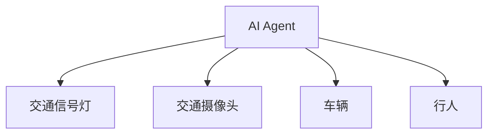
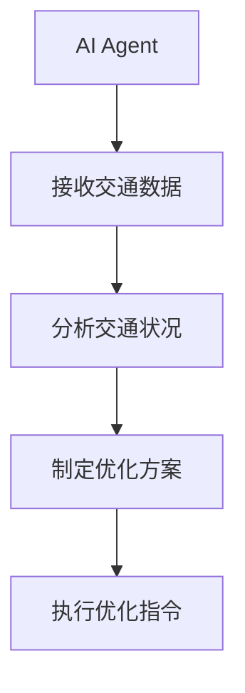

                 


# AI Agent在智能交通管制中的实践

> 关键词：AI Agent, 智能交通管制, 强化学习, Q-learning, 交通优化

> 摘要：本文系统地探讨了AI Agent在智能交通管制中的实践应用，从理论基础到算法实现，再到系统设计和项目实战，全面解析了AI Agent如何提升交通管理的效率和智能化水平。通过具体案例分析和代码实现，本文展示了AI Agent在智能交通管制中的实际价值和未来发展方向。

---

# 第一部分: AI Agent与智能交通管制的背景与概念

## 第1章: AI Agent的基本概念与应用

### 1.1 AI Agent的定义与特征

#### 1.1.1 AI Agent的定义
AI Agent（人工智能代理）是指一种能够感知环境、自主决策并执行任务的智能实体。它通过传感器获取信息，利用推理机制分析数据，并通过执行器与环境交互。AI Agent的核心目标是通过优化决策过程，实现特定任务的目标。

#### 1.1.2 AI Agent的核心特征
- **自主性**：AI Agent能够在没有外部干预的情况下独立运行。
- **反应性**：能够实时感知环境变化并做出快速响应。
- **目标导向性**：基于预设目标或动态目标进行决策和行动。
- **学习能力**：通过机器学习算法不断优化自身的决策模型。

#### 1.1.3 AI Agent与传统程序的区别
AI Agent与传统程序的主要区别在于其智能化和自主性。传统程序依赖预设规则和流程，而AI Agent能够通过学习和推理动态调整行为，适应复杂环境的变化。

| 特性 | AI Agent | 传统程序 |
|------|----------|----------|
| 决策方式 | 基于环境数据动态决策 | 基于预设规则静态执行 |
| 学习能力 | 具备学习和优化能力 | 无学习能力 |
| 适应性 | 能够适应环境变化 | 无法适应环境变化 |

### 1.2 AI Agent的分类与应用场景

#### 1.2.1 分类: 知识型、反应型、基于模型的AI Agent
- **知识型AI Agent**：基于知识库进行推理和决策，适用于需要大量领域知识的任务。
- **反应型AI Agent**：根据实时感知做出反应，适用于动态环境中的任务。
- **基于模型的AI Agent**：通过构建环境模型进行决策，适用于复杂系统的优化任务。

#### 1.2.2 应用场景: 交通、医疗、金融等领域的AI Agent
- **交通领域**：用于交通流量预测、信号优化、路径规划等。
- **医疗领域**：用于疾病诊断、治疗方案优化、患者监护等。
- **金融领域**：用于股票交易、风险评估、投资组合优化等。

### 1.3 智能交通管制的定义与目标

#### 1.3.1 智能交通管制的定义
智能交通管制是指通过智能化技术手段，对交通系统中的车辆、行人、道路等要素进行实时监控和优化管理，以提高交通效率、减少拥堵和事故发生。

#### 1.3.2 智能交通管制的核心目标
- 提高交通系统的运行效率。
- 减少交通拥堵和事故发生。
- 提升用户体验，降低出行时间。

#### 1.3.3 智能交通管制的实现手段
- **AI Agent**：用于实时决策和优化。
- **大数据分析**：用于交通流量预测和模式识别。
- **物联网技术**：用于实时感知和数据采集。

---

## 第2章: AI Agent在智能交通管制中的问题背景

### 2.1 传统交通管制的局限性

#### 2.1.1 传统交通管制的效率问题
传统交通管制系统依赖人工操作或固定规则，难以应对复杂的交通环境变化，导致效率低下。

#### 2.1.2 传统交通管制的资源浪费问题
由于缺乏智能化管理，交通信号灯、摄像头等设备的利用率较低，造成资源浪费。

#### 2.1.3 传统交通管制的响应延迟问题
传统系统在面对突发交通事件时，往往存在响应延迟，无法及时调整交通信号。

### 2.2 AI Agent解决交通管制问题的优势

#### 2.2.1 实时数据分析能力
AI Agent能够实时分析交通数据，快速识别交通瓶颈并制定优化方案。

#### 2.2.2 自适应决策能力
AI Agent可以根据实时数据动态调整决策策略，适应复杂的交通环境。

#### 2.2.3 多目标优化能力
AI Agent能够同时优化多个目标，例如减少拥堵、提高通行效率、降低碳排放等。

### 2.3 智能交通管制的边界与外延

#### 2.3.1 智能交通管制的边界
智能交通管制的边界包括交通信号灯、交通摄像头、车辆、行人等交通系统中的要素。

#### 2.3.2 智能交通管制的外延
智能交通管制的外延包括与交通相关的数据源、通信网络、云平台等支持系统。

#### 2.3.3 智能交通管制与其他交通管理系统的区别
智能交通管制与传统交通管理系统的主要区别在于智能化和自主性。智能交通管制系统能够自主决策和优化，而传统系统依赖人工干预。

---

## 第3章: AI Agent与智能交通管制的核心概念联系

### 3.1 AI Agent在智能交通管制中的角色

#### 3.1.1 AI Agent作为决策者
AI Agent可以作为交通信号灯的决策者，根据实时交通数据调整信号灯的配时。

#### 3.1.2 AI Agent作为协调者
AI Agent可以协调不同交通信号灯、摄像头等设备的工作，确保交通系统的协调运行。

#### 3.1.3 AI Agent作为优化者
AI Agent可以优化交通流量分配，减少拥堵和延误。

### 3.2 AI Agent与智能交通管制系统的实体关系



### 3.3 AI Agent与智能交通管制系统的交互流程



---

# 第二部分: AI Agent在智能交通管制中的算法原理

## 第4章: AI Agent的算法原理

### 4.1 强化学习在AI Agent中的应用

#### 4.1.1 强化学习的基本原理
强化学习是一种通过试错机制来优化决策模型的算法。AI Agent通过与环境交互，获得奖励或惩罚，从而优化自身的决策策略。

#### 4.1.2 Q-learning算法的数学模型
$$ Q(s, a) = r + \gamma \max_{a'} Q(s', a') $$

其中：
- \( Q(s, a) \) 表示在状态 \( s \) 下采取动作 \( a \) 的价值。
- \( r \) 是立即奖励。
- \( \gamma \) 是折扣因子，用于平衡当前奖励和未来奖励。
- \( s' \) 是下一个状态。

#### 4.1.3 Deep Q-Networks (DQN)的实现

```python
class QNetwork:
    def __init__(self, state_size, action_size, learning_rate):
        self.state_size = state_size
        self.action_size = action_size
        self.learning_rate = learning_rate
        self.model = self.build_model()
    
    def build_model(self):
        model = Sequential()
        model.add(Dense(24, activation='relu', input_dim=self.state_size))
        model.add(Dense(24, activation='relu'))
        model.add(Dense(self.action_size, activation='linear'))
        model.compile(loss='mse', optimizer=Adam(lr=self.learning_rate))
        return model
    
    def remember(self, state, action, reward, next_state):
        self.memory.append((state, action, reward, next_state))
    
    def replay(self, batch_size):
        # 从记忆库中随机抽取一批样本进行训练
        mini_batch = random.sample(self.memory, batch_size)
        states = np.array([sample[0] for sample in mini_batch])
        actions = np.array([sample[1] for sample in mini_batch])
        rewards = np.array([sample[2] for sample in mini_batch])
        next_states = np.array([sample[3] for sample in mini_batch])
        
        # 预测当前Q值
        q_current = self.model.predict(states)
        # 预测下一个Q值
        q_next = self.model.predict(next_states)
        
        # 更新Q值
        q_current[range(batch_size), actions] = rewards + gamma * np.max(q_next, axis=1)
        
        # 训练模型
        self.model.fit(states, q_current, epochs=1, verbose=0)
```

---

## 第5章: AI Agent在智能交通管制中的系统设计

### 5.1 系统分析与设计

#### 5.1.1 问题场景介绍
我们以一个城市主干道的交通信号灯优化为例，设计一个基于AI Agent的智能交通管制系统。

#### 5.1.2 系统功能设计
- **交通数据采集**：通过摄像头、传感器等设备采集交通流量、车辆速度等数据。
- **数据处理与分析**：对采集到的数据进行清洗、特征提取和模式识别。
- **AI Agent决策**：基于强化学习算法，AI Agent实时制定交通信号灯的配时策略。
- **系统执行与反馈**：根据AI Agent的决策执行交通信号灯控制，并实时反馈执行结果。

#### 5.1.3 系统架构设计


#### 5.1.4 系统接口设计
- **输入接口**：接收交通数据和用户指令。
- **输出接口**：发送交通信号灯控制指令和优化结果。

#### 5.1.5 系统交互流程


---

## 第6章: AI Agent在智能交通管制中的项目实战

### 6.1 环境安装与配置

#### 6.1.1 安装Python和相关库
```bash
pip install numpy
pip install keras
pip install tensorflow
pip install matplotlib
pip install scikit-learn
```

#### 6.1.2 安装交通模拟工具
使用SUMO（Simulation of Urban Mobility）或其他交通模拟工具进行实验。

### 6.2 系统核心实现

#### 6.2.1 AI Agent的核心代码实现

```python
class TrafficAgent:
    def __init__(self, num_states, num_actions, learning_rate=0.01, gamma=0.99, epsilon=1.0):
        self.num_states = num_states
        self.num_actions = num_actions
        self.learning_rate = learning_rate
        self.gamma = gamma
        self.epsilon = epsilon
        self.qnetwork = QNetwork(num_states, num_actions, learning_rate)
        self.memory = deque(maxlen=1000)
    
    def get_action(self, state):
        if random.random() < self.epsilon:
            return random.randint(0, self.num_actions - 1)
        else:
            q_values = self.qnetwork.model.predict(np.array([state]))[0]
            return np.argmax(q_values)
    
    def train(self, batch_size=32):
        if len(self.memory) < batch_size:
            return
        self.qnetwork.replay(batch_size)
    
    def decay_epsilon(self, epsilon_decay=0.99):
        self.epsilon = max(0.01, self.epsilon * epsilon_decay)
```

#### 6.2.2 交通信号灯优化的案例分析
假设我们有一个两路口的交通信号灯优化问题，AI Agent通过强化学习不断优化信号灯的配时策略。

### 6.3 系统优化与性能分析

#### 6.3.1 系统优化
- **算法优化**：通过调整强化学习的参数（如学习率、折扣因子）提升系统的优化效果。
- **模型优化**：引入更深的神经网络结构，提高模型的表达能力。

#### 6.3.2 性能分析
- **实验结果**：通过模拟实验，验证AI Agent在智能交通管制中的优化效果。
- **对比分析**：将AI Agent优化后的交通系统与传统交通管制系统进行对比，评估其性能提升。

---

## 第7章: 总结与展望

### 7.1 总结
本文系统地探讨了AI Agent在智能交通管制中的实践应用，从理论基础到算法实现，再到系统设计和项目实战，全面解析了AI Agent如何提升交通管理的效率和智能化水平。

### 7.2 展望
未来，随着AI技术的不断发展，AI Agent在智能交通管制中的应用将更加广泛和深入。我们可以期待更多基于强化学习、深度学习等技术的智能交通管理系统，为城市交通管理带来更大的便利和效率提升。

---

## 第8章: 最佳实践 tips

### 8.1 小结
AI Agent在智能交通管制中的应用是一项复杂的系统工程，需要从算法设计、系统架构、数据采集等多个方面进行全面考虑。

### 8.2 注意事项
- **数据质量**：确保交通数据的准确性和实时性。
- **系统稳定性**：保证AI Agent的决策系统稳定运行。
- **安全性**：确保AI Agent的决策不会对交通系统造成安全风险。

### 8.3 拓展阅读
- 推荐阅读《强化学习入门》、《深度学习与神经网络》等相关书籍。
- 关注交通管理领域的最新研究和技术动态。

---

作者：AI天才研究院/AI Genius Institute & 禅与计算机程序设计艺术 /Zen And The Art of Computer Programming

