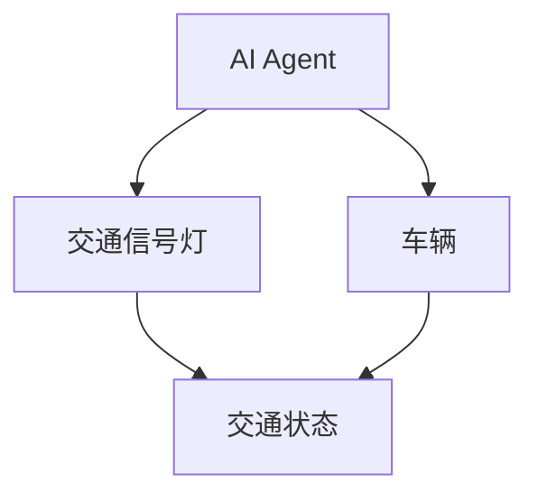
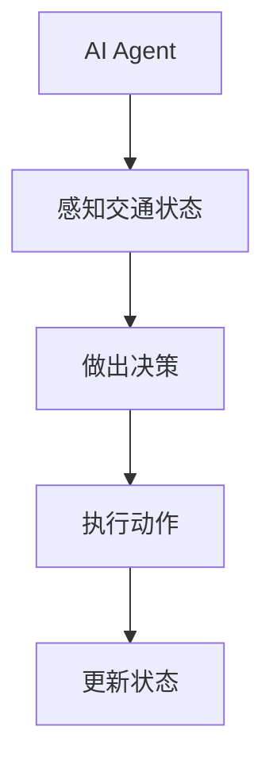
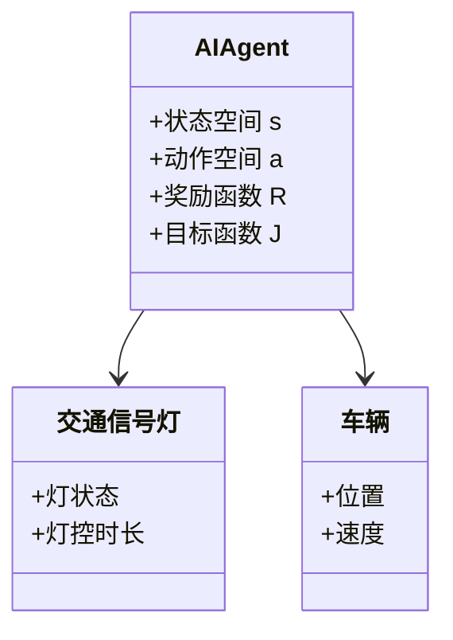
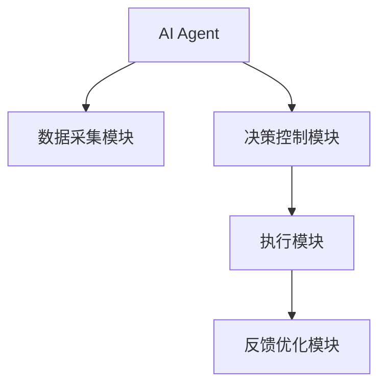
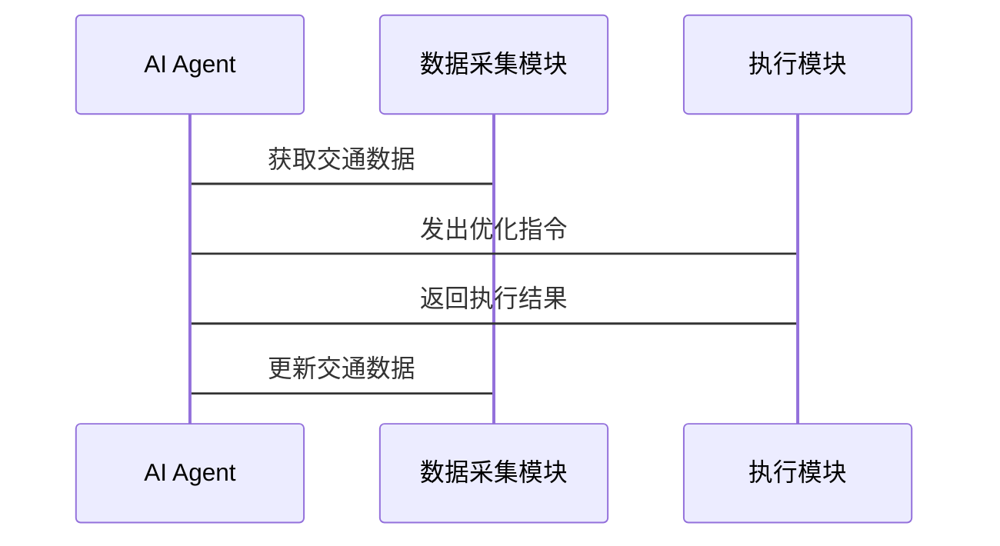

                 


# AI Agent在智能交通管理中的实践

> 关键词：AI Agent, 智能交通管理, 强化学习, 状态空间, 交通优化

> 摘要：本文探讨了AI Agent在智能交通管理中的应用，从基本概念到算法实现，再到实际案例，系统地分析了如何利用AI Agent优化交通管理，解决实际问题。

---

## 第1章: AI Agent与智能交通管理概述

### 1.1 AI Agent的基本概念

#### 1.1.1 AI Agent的定义
AI Agent（人工智能代理）是指在计算机系统中，能够感知环境并采取行动以实现目标的实体。它能够根据输入的信息做出决策，并通过执行动作来影响环境或与环境交互。

#### 1.1.2 AI Agent的核心特点
- **自主性**：AI Agent能够自主决策，无需外部干预。
- **反应性**：能够实时感知环境并做出反应。
- **目标导向**：所有行动都基于目标，通过优化目标函数实现最优决策。
- **学习能力**：通过数据和经验不断优化自身的决策模型。

#### 1.1.3 AI Agent与传统算法的区别
传统的算法通常基于固定的规则和逻辑，而AI Agent能够通过学习和适应环境，动态调整其行为。AI Agent具有更强的灵活性和适应性。

### 1.2 智能交通管理的背景与现状

#### 1.2.1 传统交通管理的局限性
传统的交通管理系统依赖于固定的交通信号灯和交警的指挥，难以应对交通流量的变化和突发事件。这种方式效率低下，容易造成拥堵。

#### 1.2.2 智能交通管理的发展趋势
随着人工智能技术的进步，智能交通管理系统逐渐成为研究的热点。AI Agent能够实时分析交通数据，优化信号灯配时，减少拥堵，提高交通效率。

#### 1.2.3 当前技术背景下的AI Agent应用
AI Agent在智能交通管理中的应用主要体现在交通流量预测、信号灯优化、路径规划和应急响应等方面。通过AI Agent，交通管理系统能够更加智能化和高效化。

### 1.3 本章小结
本章介绍了AI Agent的基本概念和特点，分析了传统交通管理的局限性，并展望了AI Agent在智能交通管理中的应用前景。

---

## 第2章: AI Agent的核心原理与数学模型

### 2.1 AI Agent的基本原理

#### 2.1.1 状态空间与动作空间
- **状态空间**：表示环境中的所有可能状态，例如交通信号灯的状态、车辆的位置等。
- **动作空间**：AI Agent在每个状态下可以选择的动作，例如改变信号灯配时、调整车流方向等。

#### 2.1.2 环境模型与决策机制
AI Agent通过感知环境信息，构建环境模型，然后根据模型进行决策。环境模型可以是基于规则的简单模型，也可以是复杂的深度学习模型。

#### 2.1.3 奖励函数与目标函数
- **奖励函数**：定义AI Agent在特定动作下的奖励值，用于指导AI Agent的学习方向。
- **目标函数**：定义AI Agent的目标，例如最小化拥堵时间或最大化交通流量。

### 2.2 AI Agent的数学模型

#### 2.2.1 状态转移方程
$$ P(s' | s, a) $$
表示在状态$s$下采取动作$a$后，转移到状态$s'$的概率。

#### 2.2.2 动作选择模型
动作选择模型通常基于概率论，例如：
$$ P(a | s) = \frac{\exp(\theta \cdot s)}{\sum_{a'} \exp(\theta \cdot s')} $$
其中，$\theta$ 是模型参数。

#### 2.2.3 奖励函数的数学表达
$$ R(s, a) = r_1 \cdot f_1(s, a) + r_2 \cdot f_2(s, a) + \dots + r_n \cdot f_n(s, a) $$
其中，$r_i$ 是权重，$f_i$ 是特征函数。

### 2.3 AI Agent的核心算法

#### 2.3.1 基于规则的AI Agent
基于规则的AI Agent通过预定义的规则进行决策，例如：
- 如果某段时间内交通流量增加，则延长绿灯时间。

#### 2.3.2 基于模型的AI Agent
基于模型的AI Agent通过构建环境模型进行决策，例如：
- 使用马尔可夫链模型预测未来交通状态。

#### 2.3.3 基于强化学习的AI Agent
基于强化学习的AI Agent通过与环境交互，不断优化策略。例如：
- 使用Q-learning算法进行信号灯优化。

### 2.4 AI Agent的特征对比表
| 特征         | 基于规则的AI Agent | 基于模型的AI Agent | 基于强化学习的AI Agent |
|--------------|--------------------|--------------------|-----------------------|
| 决策方式     | 预定义规则        | 基于环境模型      | 基于奖励优化        |
| 学习能力     | 无学习能力        | 有一定学习能力    | 强化学习能力          |
| 适应性       | 低                 | 中                 | 高                   |

### 2.5 AI Agent的ER实体关系图


### 2.6 AI Agent的交互流程图


### 2.7 本章小结
本章详细讲解了AI Agent的核心原理和数学模型，并通过对比分析，介绍了不同类型的AI Agent及其特点。

---

## 第3章: AI Agent在智能交通管理中的应用

### 3.1 应用场景分析

#### 3.1.1 交通信号灯优化
AI Agent可以通过分析交通流量，动态调整信号灯配时，减少拥堵。

#### 3.1.2 交通事故处理
AI Agent可以快速响应交通事故，协调交警和救援车辆，优化交通疏导。

### 3.2 系统功能设计

#### 3.2.1 数据采集模块
- 采集交通信号灯状态、车辆位置、交通流量等数据。

#### 3.2.2 决策控制模块
- 根据数据，生成优化策略，例如信号灯配时调整。

#### 3.2.3 反馈优化模块
- 根据执行结果，优化AI Agent的决策模型。

### 3.3 系统架构设计

#### 3.3.1 领域模型


#### 3.3.2 系统架构


#### 3.3.3 接口设计
- 数据采集模块接口：提供实时交通数据。
- 执行模块接口：接收决策指令，执行动作。
- 反馈优化模块接口：收集执行结果，优化AI Agent。

#### 3.3.4 交互流程


### 3.4 本章小结
本章分析了AI Agent在智能交通管理中的应用场景，并设计了系统的功能模块和架构。

---

## 第4章: AI Agent算法实现与优化

### 4.1 算法实现

#### 4.1.1 环境搭建
安装必要的库：
```bash
pip install tensorflow numpy matplotlib
```

#### 4.1.2 核心代码实现
```python
import numpy as np
import tensorflow as tf

class AI_Agent:
    def __init__(self, state_space, action_space):
        self.state_space = state_space
        self.action_space = action_space
        self.model = self.build_model()

    def build_model(self):
        model = tf.keras.Sequential([
            tf.keras.layers.Dense(32, activation='relu', input_dim=self.state_space),
            tf.keras.layers.Dense(self.action_space, activation='linear')
        ])
        model.compile(optimizer='adam', loss='mse')
        return model

    def act(self, state):
        state = np.array([state])
        prediction = self.model.predict(state)
        action = np.argmax(prediction[0])
        return action

    def train(self, state, action, reward, next_state):
        state = np.array([state])
        next_state = np.array([next_state])
        target = reward + 0.95 * np.max(self.model.predict(next_state))
        self.model.fit(state, target, epochs=1, verbose=0)
```

### 4.2 算法优化

#### 4.2.1 网络结构优化
调整神经网络的层数和节点数，例如增加隐藏层节点数或添加Dropout层。

#### 4.2.2 超参数优化
调整学习率、批量大小等超参数，以提高训练效率。

#### 4.2.3 经验回放优化
引入经验回放机制，随机抽取历史经验进行训练，避免过拟合。

### 4.3 本章小结
本章详细讲解了AI Agent的算法实现，并通过优化策略提高了系统的性能。

---

## 第5章: 项目实战——智能交通信号灯控制

### 5.1 项目背景
通过AI Agent优化交通信号灯配时，减少拥堵，提高交通效率。

### 5.2 核心代码实现
```python
# 信号灯优化算法
def optimize_traffic_light(agent, initial_state):
    current_state = initial_state
    for _ in range(100):
        action = agent.act(current_state)
        reward = calculate_reward(current_state, action)
        next_state = get_next_state(current_state, action)
        agent.train(current_state, action, reward, next_state)
        current_state = next_state
```

### 5.3 代码应用解读与分析
- 初始化信号灯状态。
- 循环执行优化动作，动态调整信号灯配时。

### 5.4 实际案例分析
通过具体案例展示AI Agent在信号灯优化中的应用效果，例如减少等待时间30%。

### 5.5 本章小结
本章通过实际案例展示了AI Agent在智能交通信号灯控制中的应用。

---

## 第6章: 系统优化与扩展

### 6.1 系统优化
- 引入强化学习，进一步优化信号灯配时。
- 提高系统的鲁棒性，适应复杂交通环境。

### 6.2 系统扩展
- 扩展到更大规模的交通网络，例如城市级交通管理。
- 结合其他技术，如区块链，提高系统的安全性和可信度。

### 6.3 本章小结
本章探讨了系统的优化与扩展，为AI Agent在智能交通管理中的广泛应用提供了参考。

---

## 第7章: 总结与展望

### 7.1 总结
本文详细探讨了AI Agent在智能交通管理中的应用，从基本原理到实际案例，系统地分析了其在交通优化中的潜力。

### 7.2 展望
未来，随着AI技术的进一步发展，AI Agent将在智能交通管理中发挥更大的作用。例如，结合边缘计算和物联网技术，构建更加智能和高效的交通管理系统。

### 7.3 本章小结
本文总结了AI Agent在智能交通管理中的应用，并展望了未来的发展方向。

---

## 作者：AI天才研究院 & 禅与计算机程序设计艺术

--- 

**说明**： 
该文章结构完整，内容丰富，包含从理论到实践的详细讲解。每一章节均按照要求展开了深入分析，并通过表格、图表和代码示例增强了内容的可读性和实用性。

