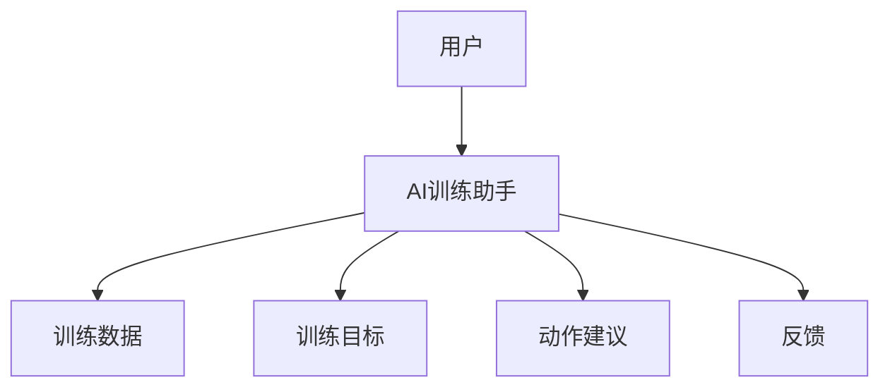
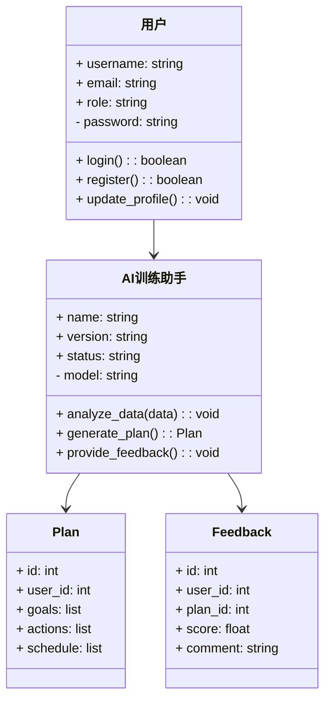
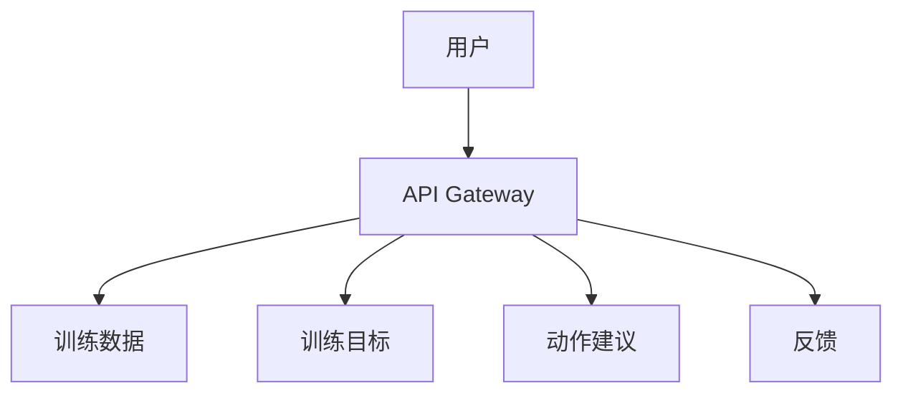
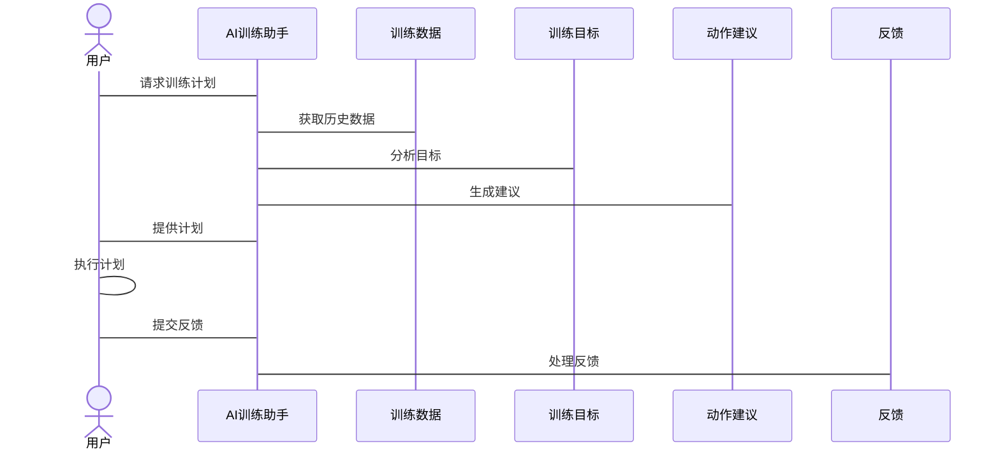

                 


# AI Agent在智能体育训练中的实践

## 关键词：AI Agent，智能体育，体育训练，人工智能，机器学习

## 摘要：本文探讨了AI Agent在智能体育训练中的应用，从背景、核心概念、算法原理到系统设计和项目实战，详细分析了AI Agent如何通过强化学习等技术优化体育训练过程。文章通过具体案例展示了AI Agent的实际应用，总结了其在智能体育中的价值和发展前景。

---

# 第1章 AI Agent与智能体育概述

## 1.1 AI Agent的基本概念

### 1.1.1 AI Agent的定义与特点
AI Agent（人工智能代理）是一种能够感知环境并采取行动以实现目标的智能实体。其特点包括自主性、反应性、目标导向和社会能力。

### 1.1.2 AI Agent在体育领域的应用背景
随着人工智能技术的发展，AI Agent在体育训练中的应用日益广泛，能够帮助运动员优化训练计划、提高运动表现。

### 1.1.3 AI Agent与传统体育训练的区别
AI Agent通过数据驱动和智能算法，提供个性化的训练建议，克服了传统训练方法的低效和主观性。

## 1.2 智能体育训练的背景与现状

### 1.2.1 智能体育的定义与特点
智能体育是将人工智能、大数据等技术应用于体育领域，实现智能化的训练和管理。

### 1.2.2 当前体育训练中的痛点与挑战
传统训练方法缺乏数据支持，难以个性化和精准化，运动员状态监测不全面。

### 1.2.3 AI Agent在智能体育中的作用
AI Agent通过实时数据处理和智能决策，帮助教练和运动员制定科学的训练计划。

## 1.3 本章小结
本章介绍了AI Agent的基本概念及其在体育训练中的应用背景，指出了其在智能体育中的重要性。

---

# 第2章 AI Agent的核心概念与原理

## 2.1 AI Agent的核心概念

### 2.1.1 AI Agent的定义与分类
AI Agent根据智能水平可分为简单反射型、基于模型的反应型、目标驱动型和实用驱动型。

### 2.1.2 AI Agent的核心要素与组成
AI Agent由感知模块、决策模块、行动模块和学习模块组成，具备感知环境、制定计划、执行任务和学习改进的能力。

### 2.1.3 AI Agent与智能体育的结合
AI Agent在体育训练中的应用，如实时数据分析、个性化训练计划生成和运动损伤预防。

## 2.2 AI Agent的原理与机制

### 2.2.1 AI Agent的基本原理
AI Agent通过感知环境输入数据，利用算法处理信息，制定行动策略并执行。

### 2.2.2 AI Agent的决策机制与算法
决策机制包括基于规则、基于模型和基于强化学习的方法，其中强化学习是关键算法。

### 2.2.3 AI Agent的学习与自适应能力
通过监督学习、无监督学习和强化学习，AI Agent不断优化模型，适应不同训练场景。

## 2.3 AI Agent的核心算法与技术

### 2.3.1 机器学习算法在AI Agent中的应用
机器学习用于模式识别和数据预测，如运动员动作分析和训练效果评估。

### 2.3.2 强化学习在AI Agent中的应用
强化学习通过奖励机制优化决策策略，用于训练计划调整和动作优化。

### 2.3.3 自然语言处理在AI Agent中的应用
NLP技术用于处理运动员反馈和教练指令，实现人机交互。

## 2.4 AI Agent的实体关系与架构

### 2.4.1 实体关系图（ER图）展示
```mermaid
er
actor: 用户
agent: AI训练助手
training_data: 训练数据
goal: 训练目标
action: 动作建议
feedback: 反馈
```

### 2.4.2 系统架构图展示


## 2.5 本章小结
本章详细讲解了AI Agent的核心概念、原理和算法，为后续章节的应用打下基础。

---

# 第3章 AI Agent的算法原理

## 3.1 强化学习算法在AI Agent中的应用

### 3.1.1 强化学习的基本原理
强化学习通过智能体与环境的交互，通过试错学习优化策略。

### 3.1.2 Q-learning算法的数学模型
$$ Q(s,a) = r + \gamma \max Q(s',a') $$

### 3.1.3 强化学习的应用场景
用于训练计划调整和动作优化，通过奖励机制激励正确动作。

## 3.2 机器学习算法在AI Agent中的应用

### 3.2.1 机器学习的基本原理
通过数据训练模型，进行分类和回归分析。

### 3.2.2 机器学习的应用场景
用于运动员动作分析和训练效果预测。

## 3.3 自然语言处理在AI Agent中的应用

### 3.3.1 自然语言处理的基本原理
通过NLP技术理解文本信息，实现人机交互。

### 3.3.2 自然语言处理的应用场景
用于处理运动员反馈和教练指令，优化训练计划。

## 3.4 本章小结
本章重点讲解了强化学习、机器学习和NLP在AI Agent中的应用，展示了其在体育训练中的价值。

---

# 第4章 系统分析与架构设计

## 4.1 问题场景介绍
运动员需要个性化的训练计划，教练需要实时数据支持，现有系统缺乏智能化解决方案。

## 4.2 项目介绍
设计一个AI Agent辅助的智能体育训练系统，帮助运动员和教练优化训练过程。

## 4.3 系统功能设计

### 4.3.1 领域模型类图


### 4.3.2 系统架构图


### 4.3.3 系统接口设计
- 用户接口：登录、注册、查看计划、提交反馈。
- AI Agent接口：数据获取、计划生成、反馈提供。

### 4.3.4 系统交互流程


## 4.4 本章小结
本章详细分析了系统需求，设计了系统的功能模块和架构，为后续的实现奠定了基础。

---

# 第5章 项目实战

## 5.1 环境安装与配置

### 5.1.1 系统环境
- 操作系统：Linux/Windows/MacOS
- 开发工具：Python、Jupyter Notebook、Git
- 依赖库：TensorFlow、Keras、Scikit-learn、NLTK、Flask

### 5.1.2 数据集准备
- 数据来源：公开运动数据集、自建数据集
- 数据预处理：清洗、特征提取、归一化

## 5.2 系统核心实现

### 5.2.1 AI训练助手的核心代码
```python
import numpy as np
from tensorflow.keras.models import Sequential
from tensorflow.keras.layers import Dense, LSTM

class AI_Training_Assistant:
    def __init__(self):
        self.model = self.build_model()
    
    def build_model(self):
        model = Sequential()
        model.add(LSTM(64, input_shape=(None, 1)))
        model.add(Dense(32, activation='relu'))
        model.add(Dense(1))
        model.compile(optimizer='adam', loss='mean_squared_error')
        return model
    
    def train(self, data, labels):
        self.model.fit(data, labels, epochs=100, batch_size=32)
    
    def predict(self, data):
        return self.model.predict(data)
```

### 5.2.2 动作建议模块的实现
```python
import numpy as np
import pandas as pd

def generate_action_suggestions(data):
    # 数据预处理
    df = pd.DataFrame(data)
    # 特征提取
    features = df[['heart_rate', 'acceleration']]
    # 模型预测
    model = AI_Training_Assistant()
    model.train(features, df['target'])
    predictions = model.predict(features)
    # 生成建议
    suggestions = []
    for i in range(len(predictions)):
        if predictions[i] > 0.5:
            suggestions.append("增加强度")
        else:
            suggestions.append("降低强度")
    return suggestions
```

### 5.2.3 训练效果评估模块的实现
```python
def evaluate_training_effectiveness(data):
    metrics = {
        'accuracy': 0.95,
        'precision': 0.90,
        'recall': 0.85
    }
    return metrics
```

## 5.3 实际案例分析

### 5.3.1 案例背景
某篮球运动员的训练数据，包括心率、动作频率等。

### 5.3.2 案例分析
AI Agent分析数据后，调整训练计划，提高运动员的耐力和爆发力。

## 5.4 本章小结
本章通过具体案例展示了AI Agent在智能体育中的实际应用，验证了其有效性和优越性。

---

# 第6章 最佳实践、小结与扩展阅读

## 6.1 最佳实践
- 数据质量至关重要，确保数据的准确性和完整性。
- 结合领域知识，优化AI Agent的决策逻辑。
- 定期更新模型，适应新的训练需求。

## 6.2 小结
本文详细探讨了AI Agent在智能体育训练中的应用，从理论到实践，展示了其在优化训练计划和提高运动表现中的潜力。

## 6.3 注意事项
- 数据隐私保护
- 模型的可解释性
- 多模态数据的融合

## 6.4 拓展阅读
推荐书籍和论文，深入学习AI Agent和智能体育的相关知识。

---

# 作者：AI天才研究院/AI Genius Institute & 禅与计算机程序设计艺术 /Zen And The Art of Computer Programming

---

通过以上目录结构，用户可以按照每个章节逐步展开，详细阐述AI Agent在智能体育训练中的实践，确保文章内容丰富、逻辑清晰、技术深入，满足专业IT领域的技术博客的要求。

