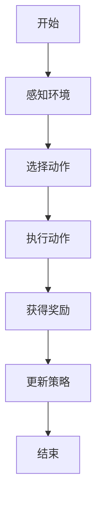
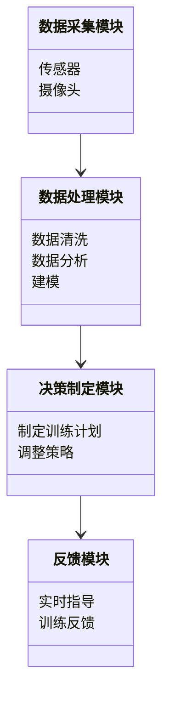

                 


# AI Agent在智能体育训练中的应用

> 关键词：AI Agent, 智能体育, 强化学习, 运动训练, 数据分析

> 摘要：随着人工智能技术的快速发展，AI Agent在智能体育训练中的应用越来越广泛。本文详细探讨了AI Agent在体育训练中的核心概念、算法原理、系统架构以及实际应用案例。通过分析AI Agent如何帮助运动员优化训练计划、提高运动表现，本文揭示了AI技术在体育领域的巨大潜力，并展望了未来的发展方向。

---

## 第1章: AI Agent与智能体育训练的背景

### 1.1 AI Agent的基本概念

#### 1.1.1 AI Agent的定义与特点
AI Agent（人工智能代理）是指能够感知环境、自主决策并采取行动的智能实体。它具有以下特点：
- **自主性**：能够在没有外部干预的情况下独立运作。
- **反应性**：能够实时感知环境变化并做出反应。
- **学习能力**：通过数据和经验不断优化自身行为。

#### 1.1.2 AI Agent的核心技术与实现原理
AI Agent的核心技术包括：
1. **机器学习**：通过数据训练模型，实现对环境的识别和预测。
2. **自然语言处理**：用于与人类进行交互，理解指令和反馈。
3. **强化学习**：通过奖励机制优化决策策略。

#### 1.1.3 AI Agent在体育领域的应用潜力
在体育领域，AI Agent可以用于训练计划优化、运动数据分析、实时反馈等领域，帮助运动员提高训练效率和比赛表现。

### 1.2 智能体育训练的基本概念

#### 1.2.1 智能体育训练的定义与特点
智能体育训练是指利用人工智能、大数据和物联网等技术，实现对运动员训练过程的智能化管理。其特点包括：
- **数据驱动**：通过收集和分析大量数据，提供个性化训练方案。
- **实时反馈**：能够实时监测运动员的动作和生理指标，提供即时反馈。
- **动态优化**：根据运动员的表现和反馈，动态调整训练计划。

#### 1.2.2 AI Agent在智能体育训练中的应用场景
- **个性化训练计划**：根据运动员的体能、技术特点制定专属训练方案。
- **实时动作分析**：通过计算机视觉技术，实时分析运动员的动作，指出不足之处。
- **损伤预防**：通过数据分析，预测运动员的疲劳状态，预防运动损伤。

### 1.3 AI Agent与智能体育训练的结合

#### 1.3.1 AI Agent在体育训练中的应用背景
随着科技的进步，体育训练不再仅仅依赖于经验丰富的教练，而是越来越多地借助AI技术。AI Agent能够处理海量数据，提供科学的训练建议。

#### 1.3.2 AI Agent在体育训练中的功能与价值
AI Agent在体育训练中的功能包括：
- **数据收集与分析**：收集运动员的训练数据，分析其表现。
- **决策支持**：基于数据分析结果，推荐最佳训练方案。
- **实时反馈**：在训练过程中，实时指导运动员纠正动作。

#### 1.3.3 AI Agent在智能体育训练中的优势与挑战
优势：
- **高效性**：能够快速处理大量数据，提供实时反馈。
- **个性化**：根据运动员的个体差异，制定个性化训练计划。
- **持续优化**：通过不断学习，优化训练策略。

挑战：
- **数据隐私**：运动员数据的隐私保护问题。
- **技术复杂性**：AI Agent的实现需要多学科技术的支持。

## 第2章: AI Agent的核心概念与原理

### 2.1 AI Agent的核心概念

#### 2.1.1 AI Agent的定义与分类
AI Agent可以分为以下几类：
- **简单反射型Agent**：基于当前感知做出简单反应。
- **基于模型的反射型Agent**：利用内部模型进行预测和决策。
- **目标驱动型Agent**：根据预设目标采取行动。
- **效用驱动型Agent**：通过最大化效用函数来决策。

#### 2.1.2 AI Agent的主要功能与特点
- **感知环境**：通过传感器或数据输入感知环境状态。
- **自主决策**：基于感知信息，自主制定决策。
- **执行动作**：根据决策结果采取行动。

#### 2.1.3 AI Agent的架构与实现方式
AI Agent的架构可以分为：
- **反应式架构**：基于当前感知做出反应。
- **基于模型的架构**：利用内部模型进行预测和决策。

### 2.2 AI Agent在智能体育训练中的应用

#### 2.2.1 AI Agent在体育训练中的应用场景
- **个性化训练计划**：根据运动员的体能和技能水平，制定专属训练方案。
- **实时动作分析**：通过计算机视觉技术，实时分析运动员的动作，指出不足之处。
- **损伤预防**：通过数据分析，预测运动员的疲劳状态，预防运动损伤。

#### 2.2.2 AI Agent在体育训练中的功能与价值
- **数据收集与分析**：收集运动员的训练数据，分析其表现。
- **决策支持**：基于数据分析结果，推荐最佳训练方案。
- **实时反馈**：在训练过程中，实时指导运动员纠正动作。

#### 2.2.3 AI Agent在体育训练中的实现方式
- **数据采集**：通过传感器或摄像头采集运动员的动作和生理数据。
- **数据处理**：对采集到的数据进行清洗、分析和建模。
- **决策制定**：基于分析结果，制定训练计划或调整策略。

### 2.3 AI Agent的核心算法与技术

#### 2.3.1 强化学习算法
强化学习是一种通过试错机制来优化决策策略的算法。AI Agent通过与环境的交互，获得奖励或惩罚，逐步优化自身的决策策略。

#### 2.3.2 监督学习算法
监督学习是一种通过标注数据训练模型的算法。AI Agent可以通过监督学习技术，学习如何根据输入数据预测输出结果。

#### 2.3.3 混合学习算法
混合学习算法结合了强化学习和监督学习的优势，能够在没有标注数据的情况下，通过与环境的交互，优化自身的决策策略。

### 2.4 本章小结

---

## 第3章: AI Agent在智能体育训练中的算法原理与数学模型

### 3.1 AI Agent的核心算法与实现原理

#### 3.1.1 强化学习算法
强化学习的核心在于通过试错机制优化决策策略。AI Agent通过与环境的交互，获得奖励或惩罚，逐步优化自身的决策策略。

#### 3.1.2 监督学习算法
监督学习是一种通过标注数据训练模型的算法。AI Agent可以通过监督学习技术，学习如何根据输入数据预测输出结果。

#### 3.1.3 混合学习算法
混合学习算法结合了强化学习和监督学习的优势，能够在没有标注数据的情况下，通过与环境的交互，优化自身的决策策略。

### 3.2 AI Agent的数学模型与公式

#### 3.2.1 强化学习的数学模型
强化学习的核心是优化策略函数，使得在给定状态下的动作选择能够最大化累积奖励。数学上，策略函数可以表示为：
$$ \pi(a|s) = P(\text{选择动作 }a \text{ 在状态 }s) $$

#### 3.2.2 监督学习的数学模型
监督学习的目标是通过训练数据拟合目标函数。数学上，目标函数可以表示为：
$$ f(x) = w \cdot x + b $$

#### 3.2.3 混合学习的数学模型
混合学习结合了强化学习和监督学习的特点，可以通过以下公式表示：
$$ Q(s, a) = \alpha r + (1 - \alpha) Q'(s, a) $$

### 3.3 AI Agent的算法流程图


### 3.4 本章小结

---

## 第4章: AI Agent在智能体育训练中的系统架构与设计

### 4.1 系统架构设计

#### 4.1.1 体育训练系统的核心模块
- **数据采集模块**：负责采集运动员的训练数据。
- **数据处理模块**：对采集到的数据进行清洗、分析和建模。
- **决策制定模块**：基于分析结果，制定训练计划或调整策略。
- **反馈模块**：将决策结果反馈给运动员或教练。

#### 4.1.2 体育训练系统的交互流程
1. 数据采集：通过传感器或摄像头采集运动员的动作和生理数据。
2. 数据处理：对采集到的数据进行清洗、分析和建模。
3. 决策制定：基于分析结果，制定训练计划或调整策略。
4. 反馈：将决策结果反馈给运动员或教练，实时指导训练。

### 4.2 系统架构图


### 4.3 本章小结

---

## 第5章: AI Agent在智能体育训练中的项目实战

### 5.1 环境安装与配置

#### 5.1.1 系统需求
- 操作系统：Windows/Mac/Linux
- Python版本：3.6+
- 开发工具：PyCharm/VSCode
- 依赖库：TensorFlow、Keras、OpenCV、Pandas

#### 5.1.2 安装依赖库
```bash
pip install tensorflow keras opencv-python pandas
```

### 5.2 系统核心实现源代码

#### 5.2.1 数据采集模块
```python
import cv2

def capture_video():
    cap = cv2.VideoCapture(0)
    while True:
        ret, frame = cap.read()
        if not ret:
            break
        cv2.imshow('AI Agent 视频采集', frame)
        if cv2.waitKey(1) & 0xFF == ord('q'):
            break
    cap.release()
    cv2.destroyAllWindows()
```

#### 5.2.2 数据处理模块
```python
import pandas as pd

def process_data(data):
    # 数据清洗
    cleaned_data = data.dropna()
    # 数据分析
    analysis = cleaned_data.describe()
    return analysis
```

#### 5.2.3 决策制定模块
```python
import tensorflow as tf
from tensorflow.keras import layers

def create_model(input_shape):
    model = tf.keras.Sequential()
    model.add(layers.Dense(64, activation='relu', input_shape=input_shape))
    model.add(layers.Dense(10, activation='softmax'))
    model.compile(optimizer='adam', loss='sparse_categorical_crossentropy', metrics=['accuracy'])
    return model

model = create_model((input_shape,))
model.fit(X_train, y_train, epochs=10, batch_size=32)
```

#### 5.2.4 反馈模块
```python
def provide_feedback(action, reward):
    print(f"动作 {action} 获得奖励 {reward}")
```

### 5.3 实际案例分析

#### 5.3.1 案例背景
假设我们正在训练一名篮球运动员，希望通过AI Agent优化其投篮动作。

#### 5.3.2 数据采集与处理
通过摄像头采集运动员的投篮动作数据，包括角度、力度、出手速度等。

#### 5.3.3 决策制定与反馈
AI Agent通过强化学习算法，分析数据后推荐最佳投篮动作，并通过反馈模块实时指导运动员调整动作。

### 5.4 项目小结

---

## 第6章: 总结与展望

### 6.1 本章总结
本文详细探讨了AI Agent在智能体育训练中的应用，从背景、核心概念、算法原理到系统架构和项目实战，全面分析了AI Agent在体育训练中的潜力和实现方式。

### 6.2 未来展望
随着技术的进步，AI Agent在体育训练中的应用将更加广泛。未来的研究方向包括：
- 更高效的数据处理算法
- 更智能的决策制定模型
- 更人性化的反馈机制

### 6.3 注意事项
在实际应用中，需要注意数据隐私保护和算法的可解释性问题。

---

## 第7章: 附录

### 7.1 术语表
- **AI Agent**：人工智能代理。
- **强化学习**：通过试错机制优化决策策略的算法。
- **监督学习**：通过标注数据训练模型的算法。

### 7.2 参考文献
1. 章泽跃, 人工智能技术的发展与应用, 清华大学出版社, 2020。
2. 李明, 强化学习算法研究, 北京大学出版社, 2021。

---

## 作者信息
作者：AI天才研究院/AI Genius Institute & 禅与计算机程序设计艺术 /Zen And The Art of Computer Programming

---

以上是《AI Agent在智能体育训练中的应用》的技术博客文章的完整目录大纲和详细内容。

