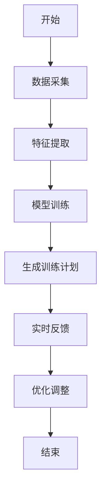
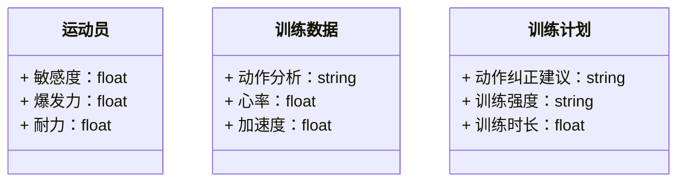
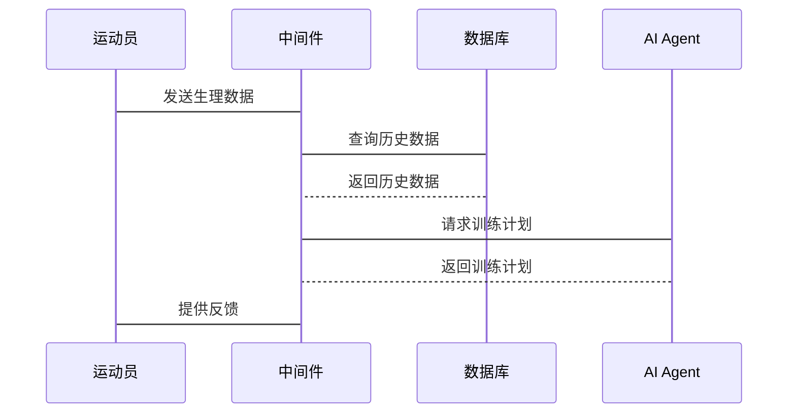

                 


# AI Agent在智能体育训练系统中的应用

## 关键词：
AI Agent、智能体育训练系统、人工智能、运动数据分析、个性化训练

## 摘要：
随着人工智能技术的飞速发展，AI Agent在体育训练中的应用日益广泛。本文系统地探讨了AI Agent在智能体育训练系统中的核心概念、算法原理、系统架构及实际应用。通过分析AI Agent在个性化训练计划制定、实时运动数据分析与反馈、运动员状态监测等方面的作用，本文为体育训练的智能化提供了理论支持和实践指导。同时，文章结合实际案例，展示了AI Agent在体育训练中的潜力和应用前景。

---

## 第一部分: AI Agent在智能体育训练系统中的应用概述

### 第1章: AI Agent与智能体育训练系统概述

#### 1.1 AI Agent的基本概念
##### 1.1.1 AI Agent的定义与特征
AI Agent（人工智能代理）是一种能够感知环境、自主决策并执行任务的智能实体。其核心特征包括：
- **自主性**：能够在没有外部干预的情况下独立运作。
- **反应性**：能够实时感知环境并做出响应。
- **目标导向**：具备明确的目标，并能够采取最优路径实现目标。
- **学习能力**：能够通过数据和经验不断优化自身性能。

##### 1.1.2 AI Agent的核心功能与应用场景
AI Agent在体育训练中的应用场景包括：
- **个性化训练计划生成**：基于运动员的体能、技术特点和目标，生成定制化的训练方案。
- **实时运动数据分析**：通过传感器和AI算法，实时分析运动员的动作、姿态和运动数据，提供即时反馈。
- **运动员状态监测与优化**：通过分析运动员的生理数据和训练表现，动态调整训练强度和内容。

##### 1.1.3 AI Agent与传统计算机程序的区别
AI Agent与传统计算机程序的主要区别在于：
- **自主性**：AI Agent能够自主决策，而传统程序需要明确的指令。
- **学习能力**：AI Agent能够通过数据和经验不断优化性能，而传统程序无法自主改进。
- **适应性**：AI Agent能够适应环境的变化，而传统程序需要人工干预才能调整。

#### 1.2 智能体育训练系统的背景与意义
##### 1.2.1 体育训练的数字化与智能化趋势
随着科技的发展，体育训练逐渐从经验驱动转向数据驱动。通过AI技术，体育训练能够实现精准化、个性化和科学化。

##### 1.2.2 AI Agent在体育训练中的应用价值
AI Agent能够显著提升体育训练的效率和效果，具体体现在：
- **提高训练效率**：通过实时数据分析，快速发现训练中的问题并提出优化建议。
- **降低运动损伤风险**：通过分析运动员的技术动作和生理数据，预防运动损伤。
- **提升竞技水平**：通过个性化训练计划和实时反馈，帮助运动员达到最佳竞技状态。

##### 1.2.3 智能体育训练系统的边界与外延
智能体育训练系统的边界包括：
- **输入**：运动员的生理数据、运动数据、训练目标。
- **输出**：个性化训练计划、实时反馈、训练效果评估。
- **外延**：与运动装备、教练系统、健康监测系统的集成。

#### 1.3 AI Agent在体育训练中的核心问题
##### 1.3.1 个性化训练计划的制定
个性化训练计划的制定需要考虑运动员的体能水平、技术特点、训练目标和恢复能力。

##### 1.3.2 实时运动数据分析与反馈
实时数据分析需要处理大量的传感器数据，包括加速度、心率、姿态等，以提供即时反馈。

##### 1.3.3 运动员状态监测与优化
运动员状态监测需要综合分析生理数据和运动表现，动态调整训练计划。

---

## 第二部分: AI Agent的核心概念与算法原理

### 第2章: AI Agent与智能体育训练系统的核心概念

#### 2.1 AI Agent的基本原理
##### 2.1.1 知识表示与推理
知识表示是AI Agent理解和处理信息的基础。常见的知识表示方法包括：
- **谓词逻辑**：通过谓词和事实表示知识。
- **语义网络**：通过节点和边表示概念及其关系。
- **规则表示法**：通过条件语句表示知识。

##### 2.1.2 感知与决策
AI Agent的感知系统通过传感器和数据处理算法获取环境信息。常见的感知算法包括：
- **特征提取**：通过卷积神经网络提取图像特征。
- **数据融合**：通过加权融合处理多源数据。
- **决策树**：通过树状结构进行决策。

##### 2.1.3 学习与自适应
AI Agent的学习能力使其能够不断优化自身性能。常见的学习算法包括：
- **监督学习**：通过标注数据进行模型训练。
- **无监督学习**：通过聚类算法发现数据中的潜在结构。
- **强化学习**：通过奖励机制优化决策策略。

#### 2.2 智能体育训练系统的功能模块
##### 2.2.1 数据采集与处理
数据采集模块通过传感器和设备获取运动员的生理数据和运动数据。

##### 2.2.2 训练计划生成
训练计划生成模块基于运动员的数据和目标，生成个性化训练方案。

##### 2.2.3 实时反馈与优化
实时反馈模块通过分析运动员的运动数据，提供即时反馈并优化训练计划。

#### 2.3 AI Agent与智能体育训练系统的实体关系图
```mermaid
er
actor: 运动员
actor: 教练
actor: 系统管理员
entity: 训练数据
entity: 训练计划
entity: 反馈结果
```

### 第3章: AI Agent在体育训练中的算法原理

#### 3.1 基于模型的AI Agent算法
##### 3.1.1 逻辑推理算法
逻辑推理算法通过谓词逻辑和规则推理实现知识表示和推理。

##### 3.1.2 专家系统算法
专家系统算法通过领域知识库和推理引擎进行决策。

##### 3.1.3 决策树算法
决策树算法通过树状结构进行分类和回归分析。

#### 3.2 基于数据驱动的AI Agent算法
##### 3.2.1 机器学习算法
- **随机森林**：通过集成学习提高模型鲁棒性。
- **神经网络**：通过深度学习提取复杂特征。

##### 3.2.2 深度学习算法
- **RNN**：通过循环神经网络处理序列数据。
- **CNN**：通过卷积神经网络处理图像数据。

##### 3.2.3 强化学习算法
- **Q-Learning**：通过强化学习优化决策策略。

#### 3.3 AI Agent在体育训练中的算法流程图


---

## 第三部分: 智能体育训练系统的架构与实现

### 第4章: 系统分析与架构设计

#### 4.1 问题场景介绍
智能体育训练系统的应用场景包括：
- **运动员训练**：个性化训练计划和实时反馈。
- **教练辅助**：数据驱动的训练指导。
- **运动损伤预防**：通过数据分析降低运动损伤风险。

#### 4.2 项目介绍
本项目旨在开发一个基于AI Agent的智能体育训练系统，实现个性化训练计划生成和实时运动数据分析。

#### 4.3 系统功能设计
##### 4.3.1 领域模型类图


#### 4.4 系统架构设计
##### 4.4.1 系统架构图


##### 4.4.2 系统交互序列图


#### 4.5 系统接口设计
系统接口设计包括：
- **数据接口**：与传感器和设备的数据交互。
- **用户接口**：与运动员和教练的交互界面。
- **API接口**：与其他系统的集成接口。

---

## 第四部分: 项目实战与案例分析

### 第5章: 项目实战

#### 5.1 环境安装
项目环境包括：
- **硬件**：传感器、计算机、网络设备。
- **软件**：Python、TensorFlow、Keras。

#### 5.2 系统核心实现源代码
##### 5.2.1 数据采集模块
```python
import numpy as np

def collect_data(sensors):
    data = []
    for sensor in sensors:
        data.append(sensor.read())
    return np.array(data)
```

##### 5.2.2 AI Agent算法实现
```python
class AI-Agent:
    def __init__(self):
        self.model = self.build_model()

    def build_model(self):
        # 网络结构定义
        pass

    def train(self, data, labels):
        # 模型训练
        pass

    def predict(self, data):
        # 预测输出
        pass
```

#### 5.3 实际案例分析
案例分析包括：
- **案例1**：篮球运动员的投篮动作优化。
- **案例2**：长跑运动员的耐力提升训练。

---

## 第五部分: 总结与展望

### 第6章: 总结与展望

#### 6.1 总结
本文详细探讨了AI Agent在智能体育训练系统中的应用，从理论到实践，系统地分析了AI Agent的核心概念、算法原理和系统架构。

#### 6.2 展望
未来的研究方向包括：
- **多模态数据融合**：结合视觉、听觉等多种数据源。
- **强化学习应用**：通过强化学习优化训练计划。
- **边缘计算**：通过边缘计算实现低延迟的实时反馈。

---

## 参考文献
[1] Russell, S., & Norvig, P. (2010). Artificial Intelligence: A Modern Approach. Pearson Education.

[2] 李航. (2018). 人工智能: 一种现代的方法. 清华大学出版社.

作者：AI天才研究院/AI Genius Institute & 禅与计算机程序设计艺术 /Zen And The Art of Computer Programming

