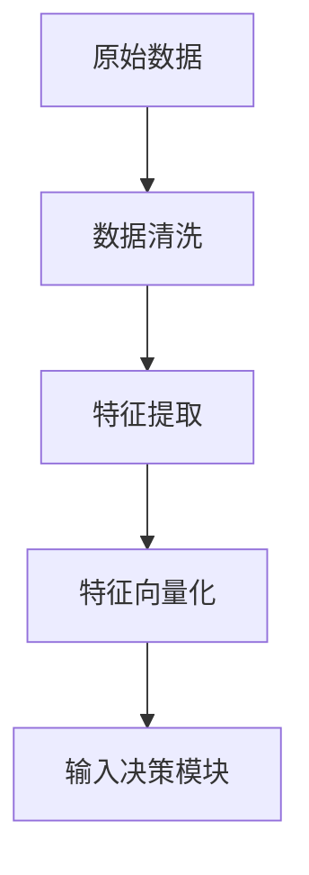
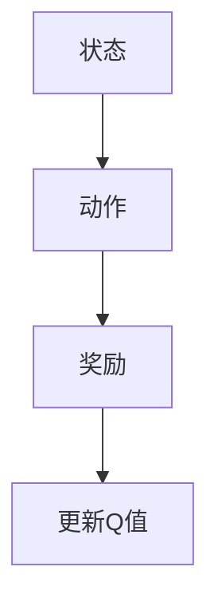
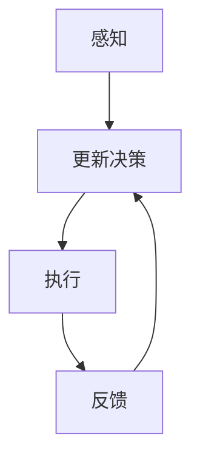
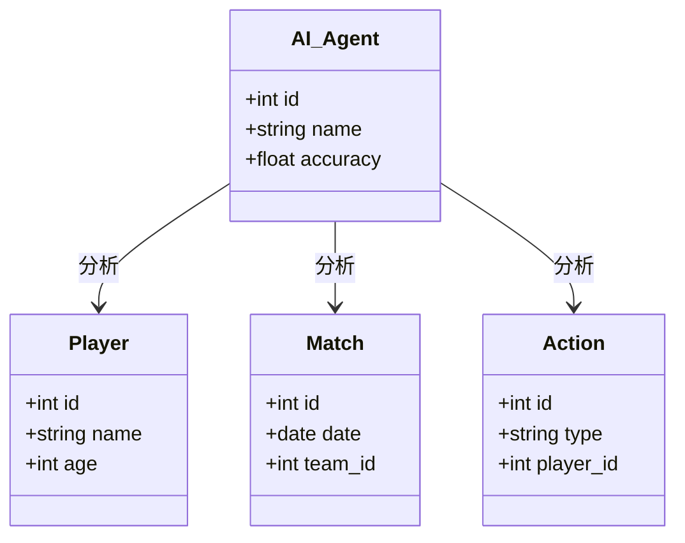
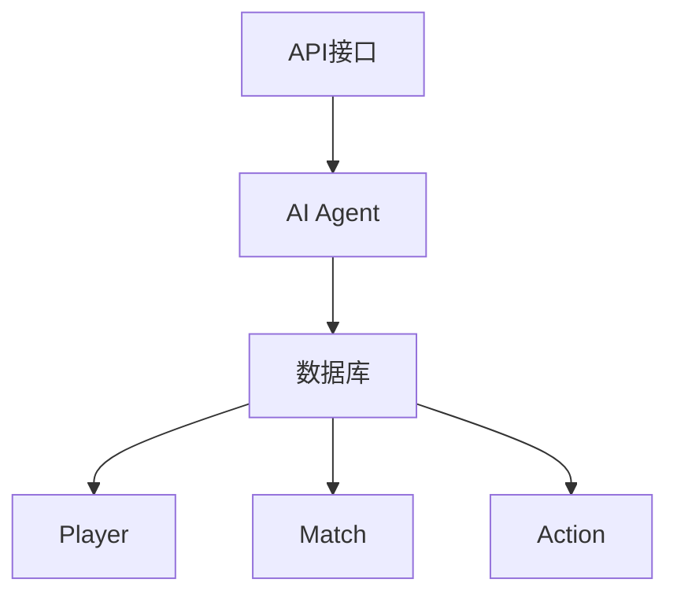

                 


# AI Agent在智能体育赛事分析中的角色

> 关键词：AI Agent，智能体育，赛事分析，人工智能，体育数据分析

> 摘要：本文深入探讨了AI Agent在智能体育赛事分析中的角色，从核心概念到算法原理，从系统架构到项目实战，全面解析AI Agent如何助力体育赛事分析的智能化转型。

---

## 第1章: AI Agent的基本概念与背景

### 1.1 AI Agent的定义与核心概念
AI Agent（人工智能代理）是指具有感知环境、做出决策并执行动作的智能实体。其核心概念包括：
- **感知模块**：通过传感器或数据源获取信息。
- **决策模块**：基于感知信息做出最优决策。
- **执行模块**：根据决策执行具体动作。

**对比表：AI Agent与其他智能系统的核心区别**

| 智能系统类型 | 感知能力 | 决策能力 | 执行能力 |
|--------------|----------|----------|----------|
| 传统算法     | 无       | 有       | 无       |
| AI Agent     | 有       | 有       | 有       |

**ER实体关系图：AI Agent在体育赛事分析中的核心实体关系**

```mermaid
erDiagram
    player[球员] {
        +int id
        +string name
        +int age
    }
    match[比赛] {
        +int id
        +date match_date
        +int team_id
    }
    action[动作] {
        +int id
        +string type
        +int player_id
    }
    AI_Agent[AI Agent] {
        +int id
        +string name
        +float accuracy
    }
    AI_Agent -- player: 分析的球员
    AI_Agent -- match: 分析的比赛
    AI_Agent -- action: 分析的动作
```

---

## 第2章: AI Agent的核心概念与原理

### 2.1 AI Agent的感知模块
**感知模块的作用**：通过收集和处理数据，为决策提供依据。

**数据预处理流程图**



**Python代码示例：特征提取**

```python
import numpy as np
from sklearn.feature_extraction import DictVectorizer

# 示例数据
data = [{'player_age': 25, 'team_rating': 85}, 
         {'player_age': 30, 'team_rating': 88}]

# 特征提取
vectorizer = DictVectorizer()
X = vectorizer.fit_transform(data)
print(X.toarray())
```

---

### 2.2 AI Agent的决策模块
**决策模块的数学模型**：基于强化学习的策略优化。

**Q-learning算法公式**

$$ Q(s, a) = Q(s, a) + \alpha [r + \max Q(s', a') - Q(s, a)] $$

**决策流程图**



---

### 2.3 AI Agent的执行模块
**执行模块的反馈机制**：通过实时反馈优化策略。

**动作规划流程图**



---

## 第3章: AI Agent的算法原理与数学模型

### 3.1 感知模块的算法实现
**基于深度学习的特征提取**

$$ f(x) = \sigma(wx + b) $$

其中，$\sigma$ 是激活函数，$w$ 和 $b$ 是权重和偏置。

**代码示例：深度学习模型**

```python
import torch
import torch.nn as nn

class Perceptron(nn.Module):
    def __init__(self, input_dim):
        super(Perceptron, self).__init__()
        self.linear = nn.Linear(input_dim, 1)
        self.sigmoid = nn.Sigmoid()

    def forward(self, x):
        out = self.linear(x)
        out = self.sigmoid(out)
        return out

# 初始化模型
model = Perceptron(5)
print(model)
```

---

### 3.2 决策模块的算法实现
**基于Q-learning的策略优化**

**Q-learning更新公式**

$$ Q(s, a) = Q(s, a) + \alpha [r + \max Q(s', a') - Q(s, a)] $$

**代码示例：Q-learning实现**

```python
import numpy as np

class QLearning:
    def __init__(self, state_num, action_num, alpha=0.1, gamma=0.9):
        self.q_table = np.zeros((state_num, action_num))
        self.alpha = alpha
        self.gamma = gamma

    def choose_action(self, state, epsilon=0.1):
        if np.random.random() < epsilon:
            return np.random.randint(action_num)
        else:
            return np.argmax(self.q_table[state])

    def update_q_table(self, state, action, reward, next_state):
        self.q_table[state][action] = self.q_table[state][action] + self.alpha * (reward + self.gamma * np.max(self.q_table[next_state]) - self.q_table[state][action])

# 示例使用
ql = QLearning(10, 5)
action = ql.choose_action(0)
ql.update_q_table(0, action, reward=1, next_state=1)
```

---

## 第4章: 系统分析与架构设计

### 4.1 系统架构设计
**领域模型类图**



**系统架构图**



---

## 第5章: 项目实战

### 5.1 环境安装与配置
**安装依赖**

```bash
pip install numpy pandas scikit-learn torch
```

### 5.2 核心代码实现
**AI Agent核心代码**

```python
import torch
import torch.nn as nn
import torch.optim as optim

class AI_Agent(nn.Module):
    def __init__(self, input_dim):
        super(AI_Agent, self).__init__()
        self.fc1 = nn.Linear(input_dim, 64)
        self.fc2 = nn.Linear(64, 32)
        self.fc3 = nn.Linear(32, 1)

    def forward(self, x):
        x = torch.relu(self.fc1(x))
        x = torch.relu(self.fc2(x))
        x = torch.sigmoid(self.fc3(x))
        return x

# 初始化模型
model = AI_Agent(5)
criterion = nn.MSELoss()
optimizer = optim.Adam(model.parameters(), lr=0.001)
```

### 5.3 代码解读与分析
**模型训练流程**

1. 数据预处理
2. 模型前向传播
3. 计算损失
4. 反向传播与优化

### 5.4 案例分析
**案例：足球比赛中球员最佳传球路径分析**

1. 数据采集：球员位置、速度、传球成功率
2. 特征提取：距离、角度、防守压力
3. 模型训练：预测最佳传球路径
4. 结果分析：优化传球策略

---

## 第6章: 最佳实践与总结

### 6.1 小结
AI Agent通过感知、决策和执行模块，实现了体育赛事分析的智能化。其核心优势在于实时数据分析和优化决策。

### 6.2 注意事项
- 数据质量直接影响分析结果
- 模型需要持续优化与更新
- 需要考虑伦理与隐私问题

### 6.3 拓展阅读
- 《强化学习：原理与应用》
- 《人工智能在体育中的创新应用》
- 《深度学习实战：体育数据分析》

---

## 作者：AI天才研究院 & 禅与计算机程序设计艺术

---

**注**：以上内容为简化版本，完整文章将包含更多细节和代码示例。

