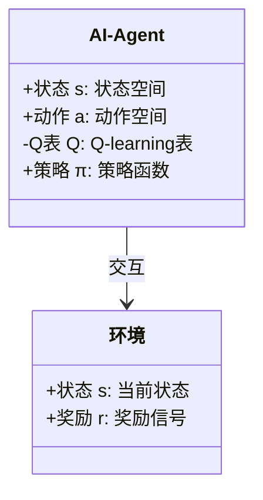
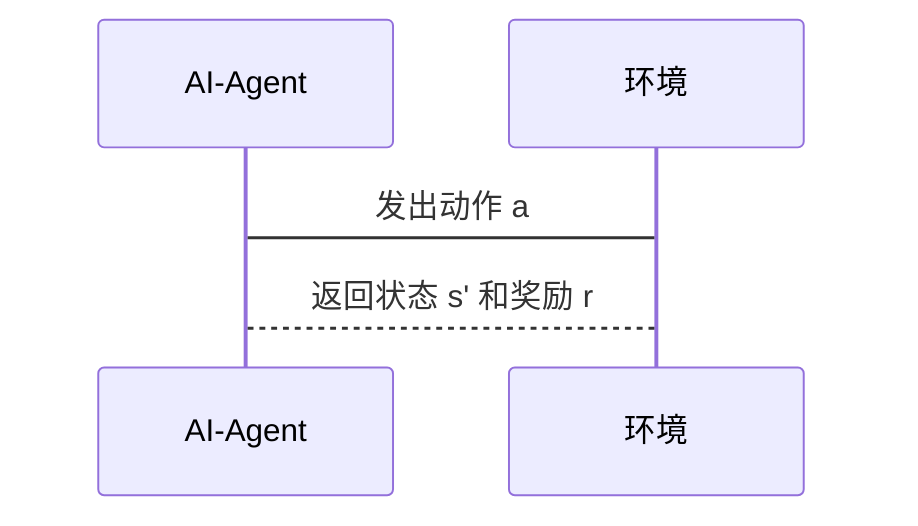

                 


# AI Agent在智能供应链优化决策中的应用

> 关键词：AI Agent，智能供应链，供应链优化，强化学习，数学模型，系统架构，项目实战

> 摘要：本文探讨了AI Agent在智能供应链优化中的应用，通过分析AI Agent的核心原理、数学模型、系统架构，以及实际项目案例，展示了如何利用AI技术提升供应链的效率和决策能力。文章从背景、理论、算法、系统设计到实战，全面解析了AI Agent在供应链优化中的潜力和实现方法。

---

## 第一章: AI Agent与智能供应链优化概述

### 1.1 AI Agent的基本概念
- **1.1.1 AI Agent的定义**
  AI Agent是一种智能实体，能够感知环境、自主决策并执行任务，具备学习和适应能力。
- **1.1.2 AI Agent的核心特征**
  包括自主性、反应性、目标导向和社会性。
- **1.1.3 AI Agent与传统自动化的区别**
  AI Agent具备学习和自适应能力，而传统自动化基于固定的规则执行任务。

### 1.2 智能供应链优化的背景与挑战
- **1.2.1 供应链优化的定义与目标**
  供应链优化旨在通过协调供应链各环节，提高效率、降低成本。
- **1.2.2 当前供应链优化中的主要挑战**
  包括需求预测不准确、库存管理复杂、物流调度困难等。
- **1.2.3 AI技术在供应链优化中的应用前景**
  AI技术能够通过数据驱动的决策优化供应链的各个环节。

### 1.3 AI Agent在供应链优化中的应用案例
- **1.3.1 智能库存管理**
  AI Agent通过实时数据分析优化库存水平，减少过剩库存和缺货情况。
- **1.3.2 智能需求预测**
  利用机器学习模型预测市场需求，提高供应链的响应速度。
- **1.3.3 智能物流调度**
  AI Agent优化运输路线和资源分配，降低物流成本。

### 1.4 本章小结
本章介绍了AI Agent的基本概念及其在供应链优化中的应用，为后续章节奠定了基础。

---

## 第二章: AI Agent的核心原理

### 2.1 多智能体系统
- **2.1.1 多智能体系统的定义与特点**
  多智能体系统由多个相互作用的智能体组成，共同完成复杂任务。
- **2.1.2 多智能体系统中的通信与协作**
  智能体之间通过信息交换协作，实现任务目标。
- **2.1.3 多智能体系统的优缺点**
  优点：分布式计算能力强；缺点：复杂性高，通信开销大。

### 2.2 强化学习在AI Agent中的应用
- **2.2.1 强化学习的基本原理**
  强化学习通过试错机制学习最优策略，适用于动态环境下的决策问题。
- **2.2.2 Q-learning算法**
  Q-learning是一种经典的强化学习算法，适用于离散动作空间。
- **2.2.3 强化学习在供应链优化中的应用**
  例如，优化库存补货策略，提高订单满足率。

### 2.3 推荐系统与决策优化
- **2.3.1 推荐系统的定义与分类**
  推荐系统根据用户行为和数据，推荐相关产品或服务。
- **2.3.2 基于协同过滤的推荐算法**
  通过用户行为相似性推荐商品。
- **2.3.3 基于深度学习的推荐算法**
  使用神经网络捕捉数据中的复杂模式，提高推荐准确率。

### 2.4 本章小结
本章详细讲解了AI Agent的核心原理，包括多智能体系统、强化学习和推荐系统的应用。

---

## 第三章: AI Agent的数学模型与算法实现

### 3.1 强化学习的数学模型
- **3.1.1 状态空间与动作空间的定义**
  状态空间是智能体所处环境的描述，动作空间是智能体可执行的动作集合。
- **3.1.2 Q值的更新公式**
  $$ Q(s, a) = Q(s, a) + \alpha (r + \gamma \max Q(s', a') - Q(s, a)) $$
  其中，$\alpha$是学习率，$\gamma$是折扣因子。
- **3.1.3 策略函数的表示**
  策略函数将状态映射到动作，常用概率分布表示。

### 3.2 遗传算法的数学模型
- **3.2.1 初始化种群**
  随机生成一组初始解。
- **3.2.2 适应度函数的定义**
  适应度函数衡量解的优劣。
- **3.2.3 选择、交叉和变异操作的数学表示**
  选择：如轮盘赌选择；
  交叉：如单点交叉；
  变异：如随机变异。

### 3.3 蒙特卡洛树搜索的数学模型
- **3.3.1 树的构建**
  蒙特卡洛树通过模拟构建可能的决策路径，选择最优动作。

### 3.4 本章小结
本章详细推导了AI Agent的核心算法的数学模型，为后续实现奠定了理论基础。

---

## 第四章: AI Agent的系统架构设计

### 4.1 问题场景介绍
供应链优化涉及供应商、制造商、分销商和零售商等多个环节，优化目标包括成本最小化、效率最大化等。

### 4.2 系统功能设计
- **领域模型（Mermaid类图）**


### 4.3 系统架构设计
- **系统架构图（Mermaid架构图）**


### 4.4 系统接口设计
- **交互流程（Mermaid序列图）**


### 4.5 本章小结
本章通过系统架构设计展示了AI Agent在供应链优化中的应用场景和交互流程。

---

## 第五章: 项目实战——AI Agent在供应链优化中的应用

### 5.1 环境安装
- 安装Python、TensorFlow、Scikit-learn等依赖库。

### 5.2 系统核心实现
- **强化学习实现代码示例**
```python
import numpy as np
import gym

# 初始化环境
env = gym.make('CartPole-v0')
env.seed(42)

# 初始化Q表
Q = np.zeros([env.observation_space.shape[0], env.action_space.n])

# 参数设置
alpha = 0.1
gamma = 0.99

# Q-learning算法
for episode in range(1000):
    state = env.reset()
    for _ in range(1000):
        # 选择动作
        if np.max(Q[state]) == 0:
            action = env.action_space.sample()
        else:
            action = np.argmax(Q[state])
        
        # 执行动作
        next_state, reward, done, _ = env.step(action)
        
        # 更新Q值
        Q[state, action] += alpha * (reward + gamma * np.max(Q[next_state]) - Q[state, action])
        
        state = next_state
        if done:
            break
```

### 5.3 案例分析
- **库存管理优化案例**
  使用强化学习优化库存补货策略，降低库存成本和缺货风险。

### 5.4 本章小结
本章通过实际项目展示了AI Agent在供应链优化中的应用，验证了理论的有效性。

---

## 第六章: 最佳实践与未来趋势

### 6.1 最佳实践
- 数据质量至关重要，确保数据的完整性和准确性。
- 模型部署后需持续监控和优化。
- 团队协作：结合AI专家和供应链专家的知识。

### 6.2 未来趋势
- **边缘计算**：实时优化决策。
- **强化学习的深化应用**：解决更复杂的供应链问题。
- **人机协作**：结合人类专家的经验和AI的优势。

### 6.3 本章小结
本章总结了AI Agent在供应链优化中的应用经验，并展望了未来的发展方向。

---

## 作者：AI天才研究院 & 禅与计算机程序设计艺术

---

这篇文章系统地探讨了AI Agent在智能供应链优化中的应用，从理论到实践，全面解析了AI技术如何提升供应链的效率和决策能力。希望对读者在供应链优化和AI Agent的应用方面有所帮助。

