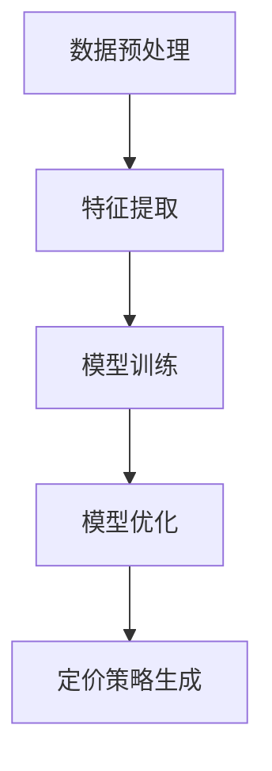
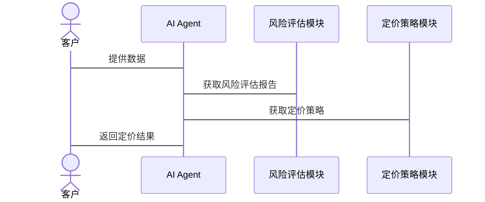

                 


# AI Agent在智能保险定价中的应用

> 关键词：AI Agent，智能保险定价，保险定价，人工智能，机器学习，强化学习

> 摘要：随着人工智能技术的快速发展，AI Agent在保险行业的应用越来越广泛。本文详细探讨了AI Agent在智能保险定价中的应用，从背景介绍、核心概念、算法原理、系统架构到项目实战和最佳实践，全面分析了AI Agent如何通过数据驱动的方法优化保险定价策略，为保险公司和消费者带来双赢的局面。

---

# 第1章: 智能保险定价的背景与挑战

## 1.1 保险定价的基本原理

### 1.1.1 保险定价的核心要素
保险定价的核心要素包括风险评估、保费计算和市场策略。风险评估是通过分析客户的年龄、职业、健康状况等因素，评估其在未来发生保险事故的概率。保费计算则基于风险评估结果和市场供需关系，确定最终的保费金额。市场策略则影响定价的灵活性，例如不同地区的保费可能不同。

### 1.1.2 传统保险定价的局限性
传统保险定价依赖于经验丰富的精算师，这种方法存在以下问题：
- 数据依赖性强：需要大量的历史数据来支持定价决策，缺乏实时数据的处理能力。
- 个性化不足：传统定价方法难以满足个性化需求，特别是在客户需求多样化的今天。
- 计算效率低：复杂的定价模型需要大量的人工计算和调整，效率较低。

### 1.1.3 智能保险定价的必要性
随着大数据和人工智能技术的发展，智能保险定价成为可能。智能定价可以实时处理海量数据，提供更精准的定价策略，满足客户的个性化需求，同时提高定价效率。

---

## 1.2 AI Agent的基本概念

### 1.2.1 什么是AI Agent
AI Agent（人工智能代理）是指能够感知环境并采取行动以实现目标的智能体。它能够通过传感器获取信息，利用推理和学习能力做出决策，并通过执行器与环境交互。

### 1.2.2 AI Agent的核心特征
AI Agent的核心特征包括：
- **自主性**：能够在没有外部干预的情况下独立运作。
- **反应性**：能够实时感知环境并做出反应。
- **学习能力**：通过机器学习算法不断优化自身的决策能力。
- **协作性**：能够与其他AI Agent或系统协同工作。

### 1.2.3 AI Agent与传统算法的区别
AI Agent与传统算法的主要区别在于其自主性和适应性。传统算法通常需要明确的规则和输入，而AI Agent能够根据环境动态调整其行为，并通过学习不断优化自身的决策能力。

---

## 1.3 AI Agent在保险定价中的应用场景

### 1.3.1 风险评估与定价
AI Agent可以通过分析客户的健康数据、生活习惯等信息，精准评估客户的保险风险，并根据风险水平动态调整保费。

### 1.3.2 客户行为分析
通过分析客户的购买行为、理赔记录等数据，AI Agent可以预测客户的保险需求，优化保险产品的设计和推广策略。

### 1.3.3 个性化定价策略
AI Agent可以根据客户的个性化需求和市场变化，实时调整定价策略，提供更具竞争力的保费。

---

## 1.4 本章小结
本章介绍了智能保险定价的背景、传统定价的局限性以及AI Agent的基本概念和应用场景。AI Agent通过其自主性、反应性和学习能力，为保险定价带来了新的可能性。

---

# 第2章: AI Agent的核心概念与联系

## 2.1 AI Agent的核心概念

### 2.1.1 多智能体系统
多智能体系统是指多个AI Agent协同工作的系统。在保险定价中，多个AI Agent可以分别负责风险评估、客户画像和定价策略，协同完成复杂的定价任务。

### 2.1.2 强化学习与决策树
强化学习是一种机器学习方法，通过试错和奖励机制优化决策策略。决策树是一种数据结构，用于表示可能的决策路径。AI Agent可以通过强化学习优化决策树，提高定价的准确性。

### 2.1.3 知识图谱与语义理解
知识图谱是一种结构化的数据表示方法，用于表示实体之间的关系。语义理解是通过自然语言处理技术理解文本的深层含义。AI Agent可以通过知识图谱和语义理解技术，分析客户的保险需求，优化定价策略。

---

## 2.2 AI Agent的核心属性特征对比

| 特性                | AI Agent                          | 传统算法                          |
|---------------------|------------------------------------|------------------------------------|
| 自主性              | 高                                | 低                                |
| 反应性              | 高                                | 低                                |
| 学习能力            | 高                                | 无                                |
| 适应性              | 高                                | 低                                |

---

## 2.3 AI Agent的ER实体关系图

```mermaid
er
actor: 客户
agent: AI Agent
product: 保险产品
risk: 风险评估
pricing: 定价策略

actor -|> agent: 提供数据
agent -|> risk: 生成风险评估报告
agent -|> pricing: 生成定价策略
pricing -|> product: 优化保险产品
```

---

## 2.4 本章小结
本章详细介绍了AI Agent的核心概念和其在保险定价中的应用场景。通过多智能体系统、强化学习和知识图谱等技术，AI Agent能够更精准地进行风险评估和定价策略优化。

---

# 第3章: AI Agent的算法原理

## 3.1 AI Agent的算法流程



---

## 3.2 AI Agent的数学模型

### 3.2.1 概率论基础
保险定价的核心是风险评估，而风险评估通常基于概率模型。例如，可以使用贝叶斯定理来计算客户发生保险事故的概率：

$$ P(A|B) = \frac{P(B|A) \cdot P(A)}{P(B)} $$

其中，$P(A|B)$ 表示在条件B下事件A发生的概率，$P(B|A)$ 是事件A发生时B发生的概率，$P(A)$ 是事件A的先验概率，$P(B)$ 是事件B的全概率。

### 3.2.2 优化算法
为了优化定价策略，通常使用梯度下降算法来最小化损失函数。损失函数可以表示为：

$$ L = \sum_{i=1}^{n} (y_i - \hat{y}_i)^2 $$

其中，$y_i$ 是实际保费，$\hat{y}_i$ 是预测保费，$n$ 是样本数量。

### 3.2.3 聚类与分类算法
聚类算法可以用于客户分群，分类算法可以用于风险评估。例如，使用K-means算法对客户进行分群，然后对每个群组使用逻辑回归模型进行风险评估。

---

## 3.3 AI Agent的数学公式

### 3.3.1 概率公式
$$ P(\text{事故}| \text{年龄} = x) = \frac{P(\text{年龄}=x | \text{事故}) \cdot P(\text{事故})}{P(\text{年龄}=x)} $$

### 3.3.2 优化公式
$$ \theta = \theta - \alpha \cdot \frac{\partial L}{\partial \theta} $$

其中，$\theta$ 是模型参数，$\alpha$ 是学习率，$\frac{\partial L}{\partial \theta}$ 是损失函数对参数的梯度。

---

## 3.4 本章小结
本章详细介绍了AI Agent的算法流程和数学模型。通过概率论、优化算法和机器学习算法，AI Agent能够精准地进行风险评估和定价策略优化。

---

# 第4章: AI Agent的系统架构与设计

## 4.1 系统功能设计

### 4.1.1 风险评估模块
风险评估模块负责分析客户的健康数据、生活习惯等信息，生成风险评估报告。

### 4.1.2 客户画像模块
客户画像模块通过分析客户的购买行为、理赔记录等数据，生成客户的画像，用于个性化定价。

### 4.1.3 定价策略模块
定价策略模块根据风险评估和客户画像，生成个性化的定价策略。

---

## 4.2 系统架构设计

### 4.2.1 分层架构
分层架构包括数据层、计算层和应用层。数据层负责数据存储和管理，计算层负责模型训练和优化，应用层负责与用户交互。

### 4.2.2 微服务架构
微服务架构将系统分解为多个独立的服务，例如风险评估服务、客户画像服务和定价策略服务，每个服务独立运行并相互协作。

### 4.2.3 数据流设计
数据流从客户输入开始，经过数据预处理、特征提取、模型训练和优化，最终生成定价策略。

---

## 4.3 系统交互设计



---

## 4.4 本章小结
本章详细介绍了AI Agent的系统架构与设计。通过分层架构和微服务架构，AI Agent能够高效地进行风险评估和定价策略优化。

---

# 第5章: 项目实战

## 5.1 环境安装
首先，需要安装Python和相关库，例如Pandas、Scikit-learn和TensorFlow。

```bash
pip install pandas scikit-learn tensorflow
```

---

## 5.2 核心代码实现

### 5.2.1 数据预处理
```python
import pandas as pd

# 读取数据
data = pd.read_csv('insurance.csv')

# 数据清洗
data.dropna(inplace=True)
```

### 5.2.2 模型训练
```python
from sklearn.model import DecisionTreeRegressor

# 训练模型
model = DecisionTreeRegressor()
model.fit(data[['age', 'gender', 'health']], data['premium'])
```

### 5.2.3 模型预测
```python
# 预测保费
predictions = model.predict([[30, 'male', 'good']])
print(predictions)
```

---

## 5.3 案例分析
以一个30岁的男性客户为例，假设其健康状况良好，预测其保费为1000元。通过AI Agent的分析，可以根据其风险评估结果动态调整保费。

---

## 5.4 本章小结
本章通过实际案例展示了AI Agent在保险定价中的应用。通过数据预处理、模型训练和模型预测，AI Agent能够提供精准的定价策略。

---

# 第6章: 最佳实践与小结

## 6.1 最佳实践
- **数据质量**：确保数据的准确性和完整性。
- **模型优化**：定期更新模型，避免过时。
- **隐私保护**：保护客户的隐私数据，遵守相关法律法规。

## 6.2 小结
AI Agent通过其自主性、反应性和学习能力，为智能保险定价带来了新的可能性。通过数据驱动的方法，AI Agent能够精准地进行风险评估和定价策略优化，为保险公司和消费者带来双赢的局面。

## 6.3 注意事项
- AI Agent的决策依赖于数据质量和模型的准确性，需要注意数据偏差和模型过拟合的问题。
- 在实际应用中，需要考虑客户的隐私保护和数据安全问题。

## 6.4 拓展阅读
- 《机器学习实战》
- 《人工智能：一种现代方法》

---

# 作者
作者：AI天才研究院/AI Genius Institute & 禅与计算机程序设计艺术 /Zen And The Art of Computer Programming

