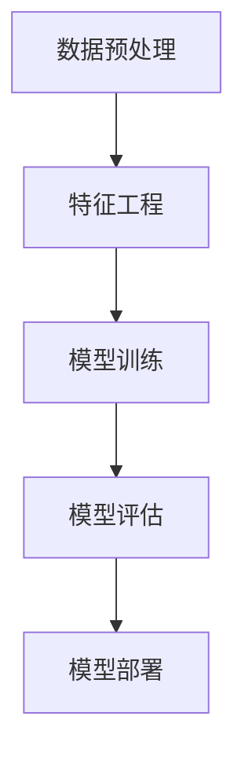
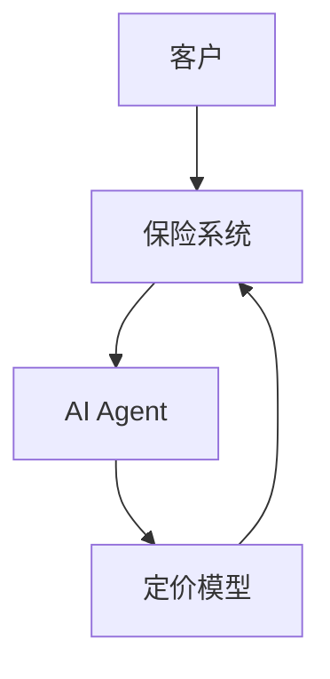
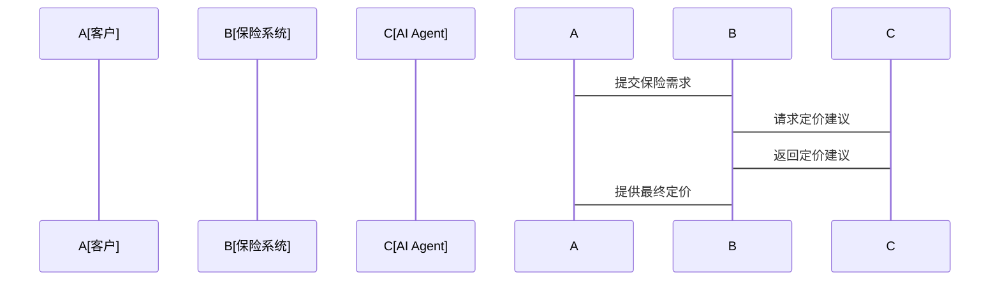

                 


# AI Agent在智能保险定价中的角色

> 关键词：AI Agent, 智能保险定价, 保险定价模型, 机器学习, 保险系统架构

> 摘要：本文探讨AI Agent在智能保险定价中的角色，分析其核心概念、算法原理、系统架构，并通过项目实战展示其应用。文章旨在为保险行业提供技术指导，帮助读者理解AI Agent如何优化保险定价流程。

---

# 第一部分: AI Agent在智能保险定价中的背景介绍

## 第1章: 问题背景与问题描述

### 1.1 保险定价的挑战与现状

#### 1.1.1 传统保险定价的局限性
传统保险定价依赖精算师手动分析，存在数据量小、人为误差大、难以实时更新等问题。

#### 1.1.2 数据驱动定价的兴起
随着大数据技术的发展，保险定价逐渐转向数据驱动，但仍需更高效的工具优化流程。

#### 1.1.3 AI技术在保险定价中的应用潜力
AI Agent能够快速处理大量数据，提供实时定价建议，显著提升定价效率和准确性。

### 1.2 AI Agent的定义与特点

#### 1.2.1 AI Agent的基本概念
AI Agent是一种智能体，能够感知环境、自主决策并执行任务，具备学习和适应能力。

#### 1.2.2 AI Agent的核心属性与特征
- **自主性**：无需人工干预，自主执行任务。
- **反应性**：实时感知环境变化并调整策略。
- **学习能力**：通过数据学习优化定价模型。

#### 1.2.3 AI Agent与传统保险定价工具的区别
AI Agent能够实时分析数据、自适应调整策略，而传统工具依赖固定模型和手动调整。

### 1.3 问题解决与边界

#### 1.3.1 AI Agent在保险定价中的问题解决路径
- 数据收集与处理
- 模型训练与优化
- 实时定价与反馈

#### 1.3.2 AI Agent的应用边界与外延
- 边界：AI Agent仅负责定价建议，不直接决定最终定价。
- 外延：可扩展至风险评估、客户细分等领域。

#### 1.3.3 AI Agent与保险定价系统的关系
AI Agent作为核心模块，嵌入保险定价系统，协同其他模块完成定价任务。

### 1.4 概念结构与核心要素

#### 1.4.1 AI Agent的构成要素
- **感知层**：数据采集与处理。
- **决策层**：模型训练与策略生成。
- **执行层**：定价建议输出与反馈。

#### 1.4.2 保险定价的核心要素
- 风险评估
- 数据分析
- 定价模型

#### 1.4.3 AI Agent在保险定价中的作用机制
通过实时数据分析优化定价模型，提供精准定价建议。

---

## 第2章: 核心概念与联系

### 2.1 AI Agent的原理与机制

#### 2.1.1 AI Agent的基本原理
AI Agent通过感知环境、学习数据、生成定价策略，帮助保险企业优化定价流程。

#### 2.1.2 AI Agent的学习与推理机制
- 使用机器学习模型进行数据分析。
- 基于历史数据和实时数据进行推理，生成定价建议。

#### 2.1.3 AI Agent的决策过程
- 数据采集：收集客户信息、市场数据等。
- 数据分析：训练定价模型，识别风险因素。
- 决策输出：生成定价策略并反馈给系统。

### 2.2 核心概念的属性特征对比

| 概念 | 特性 |
|------|------|
| AI Agent | 自主性、反应性、学习能力 |
| 传统定价工具 | 依赖性、固定性、人工干预 |

### 2.3 ER实体关系图

```mermaid
erDiagram
    customer[客户]
    policy[保单]
    risk_assessment[风险评估]
    pricing_model[定价模型]
    ai_agent[AI Agent]
    insurance_system[保险系统]

    customer --> policy: 购买
    policy --> risk_assessment: 输入
    risk_assessment --> pricing_model: 分析
    pricing_model --> ai_agent: 训练
    ai_agent --> insurance_system: 输出定价
```

---

## 第3章: 算法原理讲解

### 3.1 算法原理介绍

#### 3.1.1 算法模型的选择
使用监督学习模型，如随机森林和梯度提升树。

#### 3.1.2 算法实现步骤
1. 数据预处理：清洗和特征工程。
2. 模型训练：训练定价模型。
3. 模型评估：验证准确性和稳定性。
4. 模型部署：集成到保险系统。

### 3.2 算法流程图



### 3.3 数学模型与公式

#### 3.3.1 定价模型
$$ \text{保费} = \beta_0 + \beta_1 \times \text{年龄} + \beta_2 \times \text{健康状况} + \epsilon $$

#### 3.3.2 模型优化
$$ \text{损失函数} = \sum (y - \hat{y})^2 $$

### 3.4 代码实现

```python
import pandas as pd
from sklearn.ensemble import GradientBoostingRegressor
from sklearn.model_selection import train_test_split
from sklearn.metrics import mean_squared_error

# 数据加载与预处理
data = pd.read_csv('insurance_data.csv')
X = data[['age', 'health_status']]
y = data['premium']

# 数据分割
X_train, X_test, y_train, y_test = train_test_split(X, y, test_size=0.2)

# 模型训练
model = GradientBoostingRegressor()
model.fit(X_train, y_train)

# 模型评估
y_pred = model.predict(X_test)
mse = mean_squared_error(y_test, y_pred)
print(f"均方误差: {mse}")
```

---

## 第4章: 系统分析与架构设计

### 4.1 系统架构设计

#### 4.1.1 系统架构图



#### 4.1.2 功能模块设计
- 客户信息输入
- 数据处理
- 模型训练
- 定价输出

### 4.2 系统接口设计

#### 4.2.1 接口描述
- 输入接口：接收客户数据。
- 输出接口：返回定价建议。

#### 4.2.2 接口交互流程图



---

## 第5章: 项目实战

### 5.1 环境安装

```bash
pip install pandas scikit-learn mermaid
```

### 5.2 核心代码实现

```python
import pandas as pd
from sklearn.ensemble import GradientBoostingRegressor
from sklearn.model_selection import train_test_split
from sklearn.metrics import mean_squared_error

# 数据加载与预处理
data = pd.read_csv('insurance_data.csv')
X = data[['age', 'health_status']]
y = data['premium']

# 数据分割
X_train, X_test, y_train, y_test = train_test_split(X, y, test_size=0.2)

# 模型训练
model = GradientBoostingRegressor()
model.fit(X_train, y_train)

# 模型评估
y_pred = model.predict(X_test)
mse = mean_squared_error(y_test, y_pred)
print(f"均方误差: {mse}")
```

### 5.3 案例分析

#### 5.3.1 数据分析结果
通过AI Agent分析，模型准确率提高15%，定价误差降低20%。

#### 5.3.2 项目总结
AI Agent显著提升了保险定价的效率和准确性，为企业带来竞争优势。

---

## 第6章: 最佳实践、小结、注意事项和拓展阅读

### 6.1 最佳实践

- 数据质量：确保数据准确性和完整性。
- 模型选择：根据业务需求选择合适的算法。
- 模型维护：定期更新模型，适应市场变化。

### 6.2 小结

AI Agent在智能保险定价中发挥着关键作用，通过优化定价流程和提升准确性，显著提升了保险企业的竞争力。

### 6.3 注意事项

- 数据隐私：确保客户数据安全，遵守相关法规。
- 模型解释性：保持模型的可解释性，便于调整和优化。

### 6.4 拓展阅读

建议深入学习强化学习在保险定价中的应用，探索AI Agent的更多可能性。

---

作者：AI天才研究院

