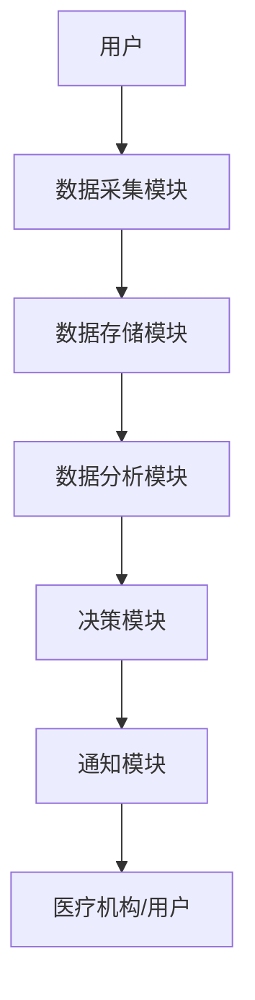

                 


# AI Agent在智能健康监测中的实践

## 关键词：AI Agent, 智能健康监测, 机器学习, 强化学习, 系统架构设计

## 摘要：本文详细探讨了AI Agent在智能健康监测中的应用，从基本概念到算法实现，再到系统架构设计，结合实际案例分析，深入剖析了AI Agent在健康数据采集、分析、评估及风险预测中的重要作用和实现方法。

---

# 第1章: AI Agent与智能健康监测概述

## 1.1 AI Agent的基本概念

### 1.1.1 AI Agent的定义
AI Agent（人工智能代理）是指能够感知环境、自主决策并执行任务的智能实体。它可以是一个软件程序，也可以是嵌入在硬件中的智能模块，具备以下核心特征：
- **自主性**：能够独立执行任务，无需外部干预。
- **反应性**：能感知环境并实时响应。
- **目标导向**：为了实现特定目标而行动。
- **学习能力**：通过数据和经验提升性能。

### 1.1.2 AI Agent的核心特征
| 特征 | 描述 |
|------|------|
| 自主性 | 能够独立决策和行动 |
| 反应性 | 实时感知环境变化并响应 |
| 目标导向 | 以实现预设目标为核心 |
| 学习能力 | 通过数据和经验优化性能 |

### 1.1.3 AI Agent与传统软件的区别
| 方面 | AI Agent | 传统软件 |
|------|---------|-----------|
| 决策能力 | 具备自主决策能力 | 依赖预设规则 |
| 学习能力 | 可通过数据学习优化 | 无法自我优化 |
| 环境适应性 | 能够适应动态环境 | 需人工调整 |

## 1.2 智能健康监测的背景与意义

### 1.2.1 健康监测的发展历程
健康监测技术经历了从简单的医疗设备到智能系统的演变：
1. **传统医疗设备**：如体温计、血压计等，仅能测量单一指标。
2. **单点监测**：如心电图机，专注于单一生理指标。
3. **多参数监测**：现代医院使用的多参数监护仪，整合心率、血压、血氧等数据。
4. **智能健康监测**：通过AI Agent实现多模态数据融合、实时分析和个性化健康评估。

### 1.2.2 智能健康监测的现状
- **技术进步**：AI、物联网（IoT）和5G技术推动了智能健康监测的发展。
- **应用场景**：从医院扩展到家庭、可穿戴设备和移动应用。
- **目标人群**：覆盖普通用户、慢性病患者和高危人群。

### 1.2.3 AI Agent在健康监测中的作用
AI Agent通过实时数据采集、分析和决策，帮助实现：
- **预防性健康管理**：提前发现潜在健康问题。
- **个性化医疗**：根据个体特征定制健康方案。
- **高效医疗资源分配**：优化医疗资源配置，降低医疗成本。

## 1.3 本章小结
本章介绍了AI Agent的基本概念和核心特征，并分析了智能健康监测的背景、现状及AI Agent在其中的重要作用，为后续章节的深入探讨奠定了基础。

---

# 第2章: AI Agent的核心概念与工作原理

## 2.1 AI Agent的组成与功能

### 2.1.1 感知层
感知层负责采集和处理环境中的数据，包括：
- **数据采集**：通过传感器获取生理数据（如心率、体温）和行为数据（如运动量、睡眠质量）。
- **数据预处理**：消除噪声，提取有效特征。
- **数据融合**：整合多源数据，提升准确性。

### 2.1.2 决策层
决策层基于感知层提供的数据，通过算法生成决策：
- **基于规则的决策**：根据预设规则（如心率超过一定值触发警报）。
- **基于机器学习的决策**：利用训练好的模型进行预测和分类。
- **基于强化学习的决策**：通过试错优化决策策略。

### 2.1.3 执行层
执行层根据决策层的指令执行具体操作，例如：
- 调整智能设备（如调节空调温度）。
- 发送通知或建议（如提醒用户休息）。

## 2.2 AI Agent的决策机制

### 2.2.1 基于规则的决策
基于规则的决策系统通过预设规则进行判断，例如：
- 如果心率 > 100 次/分钟，发送警报。
- 如果血压 < 90，建议测量其他指标。

### 2.2.2 基于机器学习的决策
机器学习模型通过训练数据生成决策规则，例如：
- 使用随机森林模型预测健康风险。
- 用支持向量机（SVM）分类健康状态。

### 2.2.3 基于强化学习的决策
强化学习通过试错优化决策策略，例如：
- 使用Q-learning算法优化健康干预策略。
- 通过Deep Q-Networks（DQN）实现更复杂的决策过程。

## 2.3 AI Agent的通信与协作

### 2.3.1 多智能体系统
多智能体系统通过协作实现更复杂的任务，例如：
- 智能健康监测系统中的多个AI Agent协同工作，分别负责数据采集、分析和反馈。

### 2.3.2 智能体间的通信协议
通信协议确保智能体之间的高效协作，例如：
- 使用HTTP API进行数据交换。
- 利用消息队列（如Kafka）实现异步通信。

### 2.3.3 智能体协作的挑战与解决方案
- **挑战**：通信延迟、数据同步、隐私保护。
- **解决方案**：优化通信协议、采用分布式架构、强化隐私保护机制。

## 2.4 本章小结
本章详细阐述了AI Agent的组成与功能，重点分析了决策机制和通信协作，为后续章节的实现提供了理论基础。

---

# 第3章: AI Agent在健康监测中的应用

## 3.1 健康数据的采集与处理

### 3.1.1 数据采集方式
健康数据采集方式包括：
- **可穿戴设备**：如智能手表、智能手环。
- **医疗设备**：如心电图机、血压计。
- **移动应用**：通过手机传感器采集数据。

### 3.1.2 数据预处理技术
数据预处理是确保数据质量的关键步骤，包括：
- **去噪处理**：消除传感器噪声。
- **归一化处理**：将数据标准化，便于模型训练。

### 3.1.3 数据特征提取
特征提取是从原始数据中提取有用信息的过程，例如：
- 提取心率变异性（HRV）作为心脏健康的指标。

## 3.2 健康状态的分析与评估

### 3.2.1 基于机器学习的健康评估
机器学习模型可以用于健康评估，例如：
- 使用逻辑回归模型预测慢性病风险。

### 3.2.2 基于深度学习的健康分析
深度学习模型能够处理复杂的健康数据，例如：
- 使用卷积神经网络（CNN）分析医学影像。

### 3.2.3 多模态数据融合技术
多模态数据融合技术整合多种数据源，提升准确性，例如：
- 结合心率、血压和睡眠数据进行综合评估。

## 3.3 健康风险预测与干预

### 3.3.1 健康风险预测模型
健康风险预测模型可以预测潜在健康问题，例如：
- 使用随机森林模型预测心血管疾病风险。

### 3.3.2 风险干预策略
风险干预策略包括：
- 根据预测结果，发送健康建议或通知医疗机构。

### 3.3.3 个性化健康建议生成
个性化健康建议基于个体数据生成，例如：
- 根据用户的运动习惯和饮食习惯，提供定制化的锻炼计划。

## 3.4 本章小结
本章分析了AI Agent在健康监测中的具体应用，从数据采集到风险预测，展现了其在智能健康监测中的重要作用。

---

# 第4章: AI Agent的算法与实现

## 4.1 AI Agent的核心算法

### 4.1.1 机器学习算法

#### 监督学习
监督学习通过标记数据训练模型，例如：
- 使用线性回归模型预测健康指标。
- 用支持向量机（SVM）进行分类。

#### 无监督学习
无监督学习适用于未标记数据，例如：
- 使用K-means算法进行健康数据聚类。

#### 半监督学习
半监督学习结合标记和未标记数据，例如：
- 使用半监督SVM进行健康数据分类。

### 4.1.2 强化学习算法

#### Q-learning
Q-learning是一种基于值函数的强化学习算法，通过试错优化决策。

#### Deep Q-Networks (DQN)
DQN结合深度神经网络和Q-learning，适用于复杂环境。

#### Policy Gradient Methods
Policy Gradient Methods直接优化策略，适用于连续动作空间。

## 4.2 算法实现

### 4.2.1 机器学习实现示例
```python
import pandas as pd
from sklearn.model_selection import train_test_split
from sklearn.linear_model import LogisticRegression

# 数据加载与预处理
data = pd.read_csv('health_data.csv')
X = data.drop('label', axis=1)
y = data['label']

# 划分训练集和测试集
X_train, X_test, y_train, y_test = train_test_split(X, y, test_size=0.2)

# 模型训练
model = LogisticRegression()
model.fit(X_train, y_train)

# 模型预测
print(model.predict(X_test))
```

### 4.2.2 强化学习实现示例
```python
import gym
from gym import spaces
import numpy as np

class HealthEnv(gym.Env):
    def __init__(self):
        super().__init__()
        self.observation_space = spaces.Box(low=0, high=100, shape=(1,))
        self.action_space = spaces.Discrete(3)

    def step(self, action):
        # 简单的健康决策环境
        observation = np.random.random(1)
        reward = 1 if action == 1 else 0
        done = True if action == 2 else False
        info = {}
        return observation, reward, done, info

    def reset(self):
        return np.random.random(1)

# 初始化环境
env = HealthEnv()
observation = env.reset()

# Q-learning实现
Q = np.zeros((env.observation_space.shape[0], env.action_space.n))

for _ in range(100):
    action = np.argmax(Q[observation])
    new_observation, reward, done, info = env.step(action)
    Q[observation][action] += reward
    observation = new_observation
    if done:
        break

print(Q)
```

### 4.2.3 算法数学模型
#### 机器学习模型
$$ P(y|x) = \frac{e^{\beta_0 + \beta_1 x_1 + \cdots + \beta_n x_n}}{1 + e^{\beta_0 + \beta_1 x_1 + \cdots + \beta_n x_n}} $$
其中，$x_i$是输入特征，$\beta_i$是模型参数。

#### 强化学习模型
$$ Q(s, a) = Q(s, a) + \alpha [r + \max Q(s', a') - Q(s, a)] $$
其中，$\alpha$是学习率，$r$是奖励，$s'$是下一状态。

## 4.3 本章小结
本章详细讲解了AI Agent的核心算法，包括机器学习和强化学习，并通过Python代码示例展示了算法实现，为后续章节的系统设计奠定了基础。

---

# 第5章: 系统分析与架构设计

## 5.1 系统功能设计

### 5.1.1 功能模块划分
健康监测系统主要功能模块包括：
- 数据采集模块：负责采集健康数据。
- 数据分析模块：对数据进行处理和分析。
- 决策模块：生成健康评估和干预建议。
- 通知模块：将结果通知给用户或医疗机构。

### 5.1.2 系统功能流程
1. 数据采集模块接收传感器数据。
2. 数据分析模块进行预处理和特征提取。
3. 决策模块基于机器学习模型生成评估结果。
4. 通知模块将结果发送给用户。

## 5.2 系统架构设计

### 5.2.1 系统架构图


### 5.2.2 接口设计
- 数据采集模块接口：`/api/data/post`
- 数据分析模块接口：`/api/analysis/post`
- 决策模块接口：`/api/decision/post`
- 通知模块接口：`/api/notification/post`

## 5.3 本章小结
本章分析了智能健康监测系统的功能设计和架构设计，为系统的具体实现提供了指导。

---

# 第6章: 项目实战

## 6.1 项目背景与目标

### 6.1.1 项目背景
本项目旨在开发一个基于AI Agent的智能健康监测系统，实现对用户健康的实时监测和智能管理。

### 6.1.2 项目目标
- 实现实时健康数据采集。
- 提供健康评估和风险预测。
- 自动生成个性化健康建议。

## 6.2 环境配置

### 6.2.1 系统环境
- 操作系统：Linux/Windows/MacOS
- 开发工具：Python、Jupyter Notebook
- 依赖库：TensorFlow、Keras、Scikit-learn

### 6.2.2 数据准备
- 数据来源：公开健康数据集（如Kaggle上的健康数据）。
- 数据格式：CSV格式。

## 6.3 系统核心实现

### 6.3.1 数据采集模块
```python
import pandas as pd
import numpy as np
import time

def collect_data(interval=1):
    # 模拟数据采集
    data = {
        'heart_rate': np.random.normal(70, 5),
        'temperature': np.random.normal(36.5, 0.2)
    }
    time.sleep(interval)
    return data

# 数据采集与存储
data_list = []
for _ in range(10):
    data = collect_data()
    data_list.append(data)
    
# 转换为DataFrame
df = pd.DataFrame(data_list)
df.to_csv('health_data.csv', index=False)
```

### 6.3.2 数据分析模块
```python
from sklearn.model_selection import train_test_split
from sklearn.ensemble import RandomForestClassifier

# 加载数据
data = pd.read_csv('health_data.csv')
X = data.drop('label', axis=1)
y = data['label']

# 划分训练集和测试集
X_train, X_test, y_train, y_test = train_test_split(X, y, test_size=0.2)

# 模型训练
model = RandomForestClassifier()
model.fit(X_train, y_train)

# 预测与评估
print(model.score(X_test, y_test))
```

## 6.4 实际案例分析

### 6.4.1 案例背景
假设一位用户长期佩戴智能手环，系统采集了他的心率、步数和睡眠数据。

### 6.4.2 数据分析
- 心率：平均值75次/分钟，波动较大。
- 步数：日均5000步，低于推荐值。
- 睡眠：浅睡时间较长，深睡时间不足。

### 6.4.3 健康评估
- 心率波动较大可能与压力有关。
- 步数不足可能导致体质下降。
- 睡眠质量差可能影响第二天的精神状态。

### 6.4.4 风险预测
模型预测该用户在未来三个月内患高血压的概率为65%。

### 6.4.5 个性化建议
- 每天增加运动量至10000步。
- 优化睡眠环境，提高睡眠质量。
- 定期监测血压，预防高血压。

## 6.5 本章小结
本章通过一个实际案例展示了AI Agent在智能健康监测中的应用，从数据采集到分析再到结果输出，详细说明了系统的实现过程。

---

# 第7章: 最佳实践与总结

## 7.1 最佳实践

### 7.1.1 数据质量管理
- 确保数据的准确性和完整性。
- 定期校准传感器，避免数据偏差。

### 7.1.2 模型优化
- 使用交叉验证优化模型参数。
- 定期更新模型，确保性能。

### 7.1.3 系统安全性
- 加强数据加密，确保用户隐私。
- 设计完善的权限管理机制。

## 7.2 小结
AI Agent在智能健康监测中的应用前景广阔，通过实时数据分析和智能决策，能够有效提升健康管理的效率和精准度。

## 7.3 注意事项

- **数据隐私**：严格遵守数据隐私保护法规。
- **模型可解释性**：确保模型结果可解释，便于用户理解和信任。
- **系统稳定性**：确保系统在高负载下的稳定性。

## 7.4 拓展阅读

- 《Hands-On Machine Learning with Scikit-Learn and TensorFlow》
- 《Deep Learning》
- 《Reinforcement Learning: Theory and Algorithms》

---

# 作者
作者：AI天才研究院 & 禅与计算机程序设计艺术

