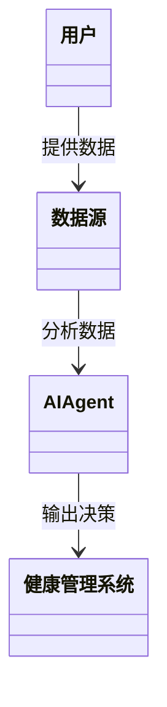
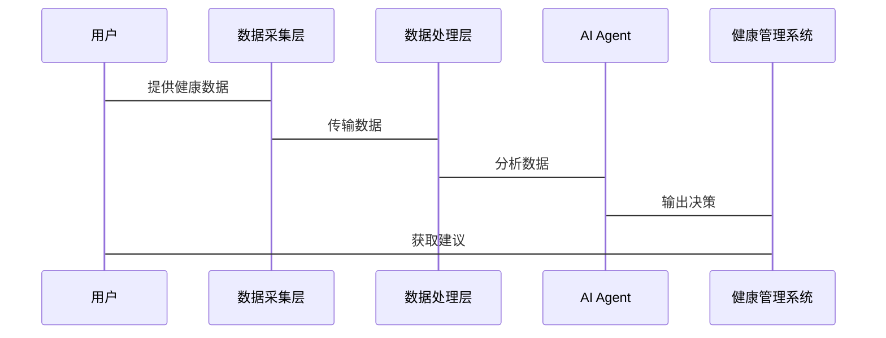

                 


# AI Agent在智能健康管理中的角色

> 关键词：AI Agent, 智能健康管理, 人工智能, 健康管理, 机器学习

> 摘要：AI Agent在智能健康管理中扮演着越来越重要的角色，通过分析健康数据、优化决策流程和提供个性化服务，显著提升了健康管理的效率和精准度。本文深入探讨了AI Agent的核心概念、技术原理、系统架构及其在智能健康管理中的实际应用，旨在为相关领域的研究者和实践者提供有价值的参考。

---

# 第1章 AI Agent的基本概念与背景

## 1.1 AI Agent的定义与特点

### 1.1.1 AI Agent的定义

AI Agent（人工智能代理）是一种能够感知环境、自主决策并执行任务的智能实体。它通过传感器获取信息，利用算法进行分析，并通过执行器与环境交互。AI Agent的关键在于其自主性和智能性，能够适应动态变化的环境。

$$
\text{AI Agent定义：一种具有感知、决策和执行能力的智能实体}
$$

### 1.1.2 AI Agent的核心特点

- **自主性**：无需外部干预，自主完成任务。
- **反应性**：能够实时感知环境并做出反应。
- **学习能力**：通过数据不断优化自身的决策模型。
- **协作性**：能够与其他系统或用户协同工作。

### 1.1.3 AI Agent与传统AI的区别

传统的AI系统通常是在特定环境中执行预定义的任务，而AI Agent则具有更强的自主性和适应性，能够在动态环境中主动调整策略。

---

## 1.2 智能健康管理的背景

### 1.2.1 健康管理的发展历程

健康管理经历了从简单的医疗记录管理到基于数据的个性化健康管理的演变。随着技术的进步，AI和大数据技术的应用使健康管理更加智能化和个性化。

### 1.2.2 当前健康管理的挑战

- 数据量大且分散，难以有效整合。
- 个性化需求强烈，传统方法难以满足。
- 需要实时监控和快速响应。

### 1.2.3 AI技术在健康管理中的应用前景

AI技术可以通过分析海量数据，提供个性化的健康建议和预测，帮助用户更好地管理健康状况。

---

## 1.3 AI Agent在智能健康管理中的作用

### 1.3.1 AI Agent在健康管理中的角色

AI Agent作为智能健康管理的核心组件，负责数据的采集、分析和决策，提供个性化的健康建议。

### 1.3.2 AI Agent的优势与局限性

- **优势**：高效、精准、适应性强。
- **局限性**：依赖数据质量，可能存在隐私问题。

### 1.3.3 AI Agent与健康管理系统的结合

AI Agent通过与健康管理系统的集成，实现了从数据采集到决策执行的闭环管理。

---

## 1.4 本章小结

本章介绍了AI Agent的基本概念、特点及其在智能健康管理中的作用，为后续内容奠定了基础。

---

# 第2章 AI Agent的核心概念与原理

## 2.1 AI Agent的类型与分类

### 2.1.1 知识驱动型AI Agent

依赖于预定义的知识库进行推理和决策。

### 2.1.2 数据驱动型AI Agent

基于大量数据进行训练，通过机器学习模型进行预测和决策。

### 2.1.3 混合驱动型AI Agent

结合知识驱动和数据驱动的优势，综合考虑知识和数据进行决策。

---

## 2.2 AI Agent的工作原理

### 2.2.1 信息感知与数据采集

AI Agent通过传感器、API等方式获取健康数据。

### 2.2.2 数据分析与决策制定

利用机器学习算法对数据进行分析，生成决策建议。

### 2.2.3 行动执行与反馈优化

根据决策结果执行动作，并根据反馈不断优化模型。

---

## 2.3 AI Agent的核心技术

### 2.3.1 机器学习与深度学习

- **机器学习**：通过训练数据生成模型。
- **深度学习**：利用神经网络进行特征提取和分类。

### 2.3.2 自然语言处理

用于处理用户的自然语言输入，提供更人性化的交互体验。

### 2.3.3 知识图谱与推理引擎

构建健康领域的知识图谱，支持复杂的推理和决策。

---

## 2.4 AI Agent与智能健康管理的关系

### 2.4.1 AI Agent在健康管理中的应用场景

- **健康监测**：实时监测用户的健康数据。
- **疾病预测**：基于数据预测潜在的健康问题。
- **个性化建议**：提供量身定制的健康建议。

### 2.4.2 AI Agent如何提升健康管理的效率与精准度

通过自动化数据处理和智能决策，显著提高健康管理的效率和准确性。

### 2.4.3 AI Agent与其他健康管理技术的协同作用

AI Agent与物联网、大数据等技术协同，构建全面的智能健康管理生态系统。

---

## 2.5 本章小结

本章深入分析了AI Agent的核心概念、类型和工作原理，并探讨了其在智能健康管理中的应用和优势。

---

# 第3章 AI Agent的算法原理与实现

## 3.1 AI Agent的核心算法

### 3.1.1 机器学习算法

- **决策树**：用于分类和回归。
- **随机森林**：通过集成学习提高准确率。
- **支持向量机**：适用于分类和回归任务。

### 3.1.2 深度学习算法

- **卷积神经网络（CNN）**：用于图像识别。
- **循环神经网络（RNN）**：适用于序列数据处理。
- **长短期记忆网络（LSTM）**：处理时间序列数据。

### 3.1.3 自然语言处理算法

- **词嵌入（Word2Vec）**：将单词映射为向量。
- **BERT模型**：用于文本理解和生成。

---

## 3.2 算法实现的数学模型

### 3.2.1 决策树算法

$$
\text{决策树构建：基于信息增益的分裂策略}
$$

### 3.2.2 深度学习模型

$$
\text{神经网络结构：输入层 → 隐藏层 → 输出层}
$$

---

## 3.3 代码实现与案例分析

### 3.3.1 环境安装

安装必要的Python库，如`scikit-learn`, `tensorflow`, `pytorch`。

### 3.3.2 核心代码实现

```python
# 决策树实现
from sklearn.tree import DecisionTreeClassifier
from sklearn.model_selection import train_test_split
from sklearn.metrics import accuracy_score

# 数据集
X = ...  # 特征数据
y = ...  # 标签

# 划分数据集
X_train, X_test, y_train, y_test = train_test_split(X, y, test_size=0.2)

# 模型训练
model = DecisionTreeClassifier()
model.fit(X_train, y_train)

# 预测与评估
y_pred = model.predict(X_test)
print("准确率:", accuracy_score(y_test, y_pred))
```

### 3.3.3 案例分析

通过实际案例分析，展示AI Agent在健康管理中的应用效果和优化过程。

---

## 3.4 本章小结

本章详细讲解了AI Agent的核心算法及其数学模型，并通过代码实现展示了其在智能健康管理中的应用。

---

# 第4章 系统架构设计与实现

## 4.1 问题场景介绍

智能健康管理系统的典型场景，包括数据采集、分析、决策和反馈。

## 4.2 系统功能设计

### 4.2.1 领域模型设计

使用mermaid绘制领域模型类图，展示系统的核心模块和交互关系。



### 4.2.2 系统架构设计

使用mermaid绘制系统架构图，展示系统的分层结构和模块交互。


## 4.3 接口设计

定义系统各模块之间的接口，确保模块间的通信和数据交换。

## 4.4 交互设计

使用mermaid绘制交互序列图，展示用户与系统之间的交互流程。



---

## 4.5 本章小结

本章通过系统架构设计和交互设计，展示了AI Agent在智能健康管理中的整体框架和实现细节。

---

# 第5章 项目实战与案例分析

## 5.1 项目背景与目标

基于AI Agent的智能健康管理系统的开发与应用。

## 5.2 核心代码实现

### 5.2.1 环境配置

安装必要的库和工具，如`Python`, `TensorFlow`, `Flask`。

### 5.2.2 系统实现

```python
# AI Agent实现
class AI_Agent:
    def __init__(self, model):
        self.model = model

    def analyze_data(self, data):
        return self.model.predict(data)

    def provide_recommendation(self, result):
        return "健康建议"
```

## 5.3 案例分析

通过具体案例分析，展示AI Agent在健康管理中的实际应用效果。

## 5.4 项目总结

总结项目的开发过程和取得的成果，分析存在的问题和改进方向。

---

## 5.5 本章小结

本章通过项目实战，展示了AI Agent在智能健康管理中的具体应用和实现过程。

---

# 第6章 最佳实践与未来发展

## 6.1 最佳实践

### 6.1.1 数据质量管理

确保数据的准确性和完整性。

### 6.1.2 模型优化

通过交叉验证和超参数调优提高模型性能。

## 6.2 未来发展

### 6.2.1 技术趋势

AI Agent与5G、物联网的深度融合。

### 6.2.2 应用场景拓展

在慢性病管理、远程医疗等领域进一步拓展。

## 6.3 小结

总结AI Agent在智能健康管理中的应用前景和未来发展方向。

---

# 作者

作者：AI天才研究院/AI Genius Institute & 禅与计算机程序设计艺术 /Zen And The Art of Computer Programming

