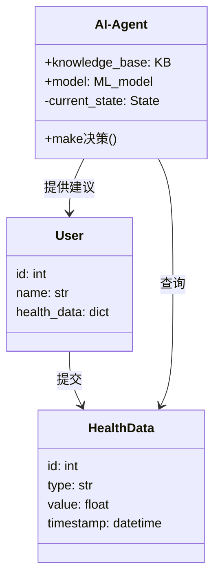

                 


# AI Agent在智能健康管理系统中的角色

> 关键词：智能健康管理系统、AI Agent、人工智能、健康管理、系统设计

> 摘要：本文探讨了AI Agent在智能健康管理系统中的关键角色，包括健康数据处理、个性化决策支持和用户交互。通过分析AI Agent的核心概念、算法原理和系统架构，结合实际项目案例，展示了AI Agent如何提升健康管理系统的智能化水平。

---

## 第1章 AI Agent与智能健康管理系统背景

### 1.1 AI Agent的基本概念

#### 1.1.1 AI Agent的定义
AI Agent是一种智能实体，能够感知环境、理解需求并采取行动以实现目标。它通过处理数据、学习和自适应来优化决策过程。

#### 1.1.2 AI Agent的核心特征
- **自主性**：无需外部干预，自主决策。
- **反应性**：实时感知环境并调整行为。
- **学习能力**：通过数据反馈优化模型。

#### 1.1.3 AI Agent在智能健康管理系统中的应用前景
AI Agent可应用于健康数据分析、个性化建议和疾病预测，显著提升健康管理的效率和精准度。

### 1.2 智能健康管理系统概述

#### 1.2.1 智能健康管理系统的定义
整合健康数据、医疗知识和AI技术，为用户提供个性化健康管理和疾病预防的系统。

#### 1.2.2 智能健康管理系统的功能模块
- 数据采集与存储
- 健康评估与分析
- 个性化建议生成
- 用户交互与反馈

#### 1.2.3 智能健康管理系统的发展现状
当前系统主要依赖规则引擎，AI Agent的引入将进一步提升智能化水平。

### 1.3 AI Agent在智能健康管理系统中的角色定位

#### 1.3.1 AI Agent在健康数据处理中的作用
AI Agent通过机器学习算法分析数据，识别健康风险。

#### 1.3.2 AI Agent在健康决策支持中的作用
提供个性化建议，优化治疗方案。

#### 1.3.3 AI Agent在用户交互中的作用
通过自然语言处理与用户互动，提升用户体验。

## 第2章 AI Agent的核心概念与原理

### 2.1 AI Agent的核心概念

#### 2.1.1 知识表示
使用符号逻辑或概率模型表示知识，帮助AI Agent理解健康数据。

#### 2.1.2 行为推理
基于逻辑推理或机器学习进行决策，确保建议的科学性。

#### 2.1.3 学习与自适应
通过数据反馈优化模型，提升AI Agent的适应性。

### 2.2 AI Agent的属性特征对比

| 属性 | 描述 |
|------|------|
| 知识表示 | 符号逻辑或概率模型 |
| 行为推理 | 基于逻辑或机器学习 |
| 学习能力 | 数据驱动优化 |

### 2.3 AI Agent与其他技术的联系

#### 2.3.1 AI Agent与传统规则引擎的对比
AI Agent结合机器学习，规则引擎依赖预设规则。

#### 2.3.2 AI Agent与机器学习模型的对比
AI Agent具备自适应能力，模型依赖数据训练。

#### 2.3.3 AI Agent与知识图谱的结合
知识图谱提供背景知识，AI Agent用于推理和决策。

## 第3章 AI Agent在智能健康管理系统中的核心算法

### 3.1 AI Agent的基本算法

#### 3.1.1 基于规则的AI Agent算法
```python
def rule_based_agent(data):
    if condition1(data):
        return action1
    elif condition2(data):
        return action2
    else:
        return default_action
```

#### 3.1.2 基于机器学习的AI Agent算法
```python
def ml_agent(data, model):
    prediction = model.predict(data)
    return action_map[prediction]
```

### 3.2 AI Agent算法的数学模型

#### 3.2.1 状态空间表示
$$ S = \{ s_1, s_2, ..., s_n \} $$

#### 3.2.2 动作空间表示
$$ A = \{ a_1, a_2, ..., a_m \} $$

#### 3.2.3 奖励函数
$$ R: S \times A \rightarrow \mathbb{R} $$

### 3.3 AI Agent算法的实现步骤

1. 数据预处理：清洗和特征提取。
2. 模型训练：使用训练数据训练AI Agent。
3. 推理阶段：处理新数据，生成决策。
4. 反馈优化：根据结果调整模型参数。

---

## 第4章 智能健康管理系统中的AI Agent设计

### 4.1 系统设计概述

#### 4.1.1 问题场景介绍
慢性病管理系统的开发，帮助用户监控和管理健康状况。

#### 4.1.2 项目介绍
目标是开发一个基于AI Agent的慢性病管理系统，提供个性化健康建议。

### 4.2 系统功能设计

#### 4.2.1 领域模型设计


### 4.3 系统架构设计

#### 4.3.1 系统架构图


#### 4.3.2 接口设计
- 用户接口：提交数据和接收建议。
- 数据层：存储和检索健康数据。
- AI-Agent：处理数据，生成建议。

### 4.4 项目实战

#### 4.4.1 环境安装
```bash
pip install numpy scikit-learn
```

#### 4.4.2 核心实现代码
```python
import numpy as np
from sklearn.tree import DecisionTreeClassifier

class AIHealthAgent:
    def __init__(self, model):
        self.model = model
    
    def predict_health_status(self, data):
        return self.model.predict(data)
    
    def provide_recommendation(self, prediction):
        recommendations = {
            0: "无异常",
            1: "关注健康指标",
            2: "建议就医检查"
        }
        return recommendations[prediction]
```

#### 4.4.3 应用案例分析
慢性病管理系统的应用，AI Agent通过分析用户数据，提供个性化的健康建议，帮助用户有效管理健康状况。

## 第5章 总结与展望

### 5.1 总结
AI Agent在智能健康管理系统中的应用显著提升了系统的智能化水平，通过数据处理、决策支持和用户交互，优化了健康管理过程。

### 5.2 最佳实践
- 数据质量至关重要，确保数据的准确性和完整性。
- 模型优化需要持续反馈和调整。
- 用户隐私保护需严格遵守相关法规。

### 5.3 未来展望
随着AI技术的发展，AI Agent在健康管理系统中的应用将更加广泛和深入，可能涉及更多的健康场景和更复杂的决策过程。

---

作者：AI天才研究院

