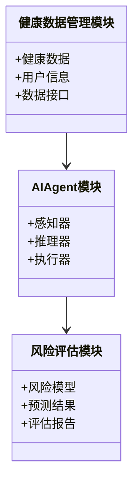
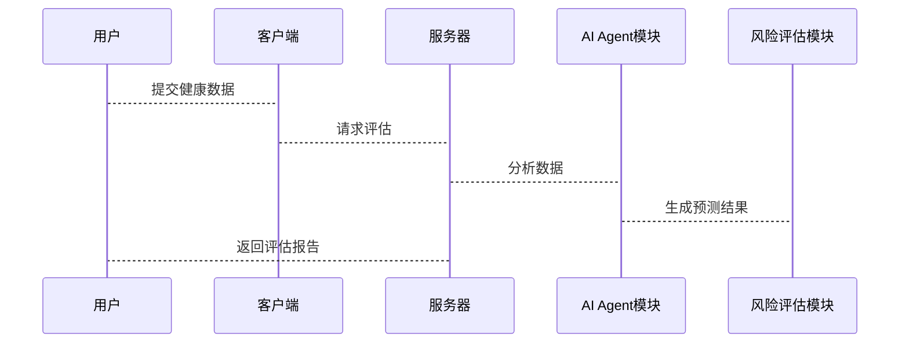

                 


# AI Agent在智能健康风险评估中的角色

> **关键词**: AI Agent, 智能健康风险评估, 人工智能, 健康管理, 风险预测

> **摘要**: 本文探讨AI Agent在智能健康风险评估中的核心作用，从背景、原理到实际应用，详细分析其在健康风险评估中的创新与价值。文章结合理论与实践，深入解析AI Agent如何通过多模态数据处理、自适应学习和智能化决策，提升健康风险评估的精准度和效率。

---

## 第1章 AI Agent的基本概念与技术背景

### 1.1 AI Agent的定义与核心特征

#### 1.1.1 AI Agent的定义
AI Agent（人工智能代理）是指能够感知环境、自主决策并执行任务的智能实体。与传统算法不同，AI Agent具备主动性、目标导向性和适应性，能够根据实时数据动态调整行为。

#### 1.1.2 AI Agent的核心特征
- **主动性**：AI Agent能够主动感知环境并采取行动，而非被动响应。
- **目标导向性**：AI Agent的行为基于明确的目标，能够优化决策路径。
- **适应性**：AI Agent能够通过学习和自适应算法，逐步优化自身性能。

#### 1.1.3 AI Agent与传统算法的区别
| 特性 | AI Agent | 传统算法 |
|------|-----------|-----------|
| 决策方式 | 主动决策 | 被动计算 |
| 学习能力 | 具备自适应学习能力 | 通常需要人工干预优化 |
| 任务执行 | 可独立完成任务 | 需人工干预 |

---

### 1.2 智能健康风险评估的背景

#### 1.2.1 健康风险评估的基本概念
健康风险评估是通过分析个体的健康数据（如生活习惯、生理指标、遗传信息等），预测未来可能出现的健康问题的过程。

#### 1.2.2 当前健康风险评估的主要方法
1. **基于统计的健康风险评估**：通过历史数据和统计模型预测健康风险。
2. **基于机器学习的健康风险评估**：利用机器学习算法分析数据，识别潜在风险因素。
3. **基于知识图谱的健康风险评估**：结合医学知识图谱，提供更精准的预测。

#### 1.2.3 智能化健康风险评估的需求与趋势
随着医疗数据的爆炸式增长，传统健康风险评估方法在效率和精度上逐渐暴露出局限性。AI Agent的引入为解决这些问题提供了新的思路。

---

## 第2章 AI Agent与健康风险评估的核心概念

### 2.1 AI Agent的核心概念与原理

#### 2.1.1 AI Agent的决策机制
AI Agent的决策机制包括感知、推理和行动三个环节：
1. **感知**：通过传感器或数据接口获取环境信息。
2. **推理**：基于感知数据进行分析和判断。
3. **行动**：根据推理结果采取相应的行动。

#### 2.1.2 AI Agent的学习与自适应能力
AI Agent通过监督学习、强化学习和无监督学习等方法，不断提升自身的预测和决策能力。

#### 2.1.3 AI Agent的多模态数据处理能力
AI Agent能够同时处理结构化数据（如电子健康记录）和非结构化数据（如文本、图像），实现更全面的健康风险评估。

### 2.2 健康风险评估的数学模型与方法

#### 2.2.1 健康风险评估的常用模型
1. **逻辑回归模型**：用于二分类问题，如患病风险预测。
2. **随机森林模型**：适用于多分类问题，能够处理高维数据。
3. **深度学习模型**：如LSTM和Transformer，适用于时间序列数据和自然语言处理任务。

#### 2.2.2 基于概率论的健康风险评估方法
$$ P(Disease | Symptoms) = \frac{P(Symptoms | Disease) \cdot P(Disease)}{P(Symptoms)} $$

#### 2.2.3 基于机器学习的健康风险评估方法
1. **监督学习**：用于分类和回归任务。
2. **无监督学习**：用于聚类和异常检测。
3. **半监督学习**：结合少量标注数据和大量无标注数据进行训练。

### 2.3 AI Agent与健康风险评估的结合模型

#### 2.3.1 AI Agent在健康风险评估中的功能模块划分
- **感知模块**：负责收集健康数据。
- **推理模块**：负责分析数据并生成预测结果。
- **执行模块**：负责根据预测结果采取相应行动。

#### 2.3.2 AI Agent与健康风险评估模型的结合方式
1. **嵌入式结合**：将AI Agent嵌入健康风险评估模型中，实时调整模型参数。
2. **协同式结合**：AI Agent与健康风险评估模型协同工作，共同完成风险预测。

#### 2.3.3 AI Agent在健康风险评估中的数据流分析


---

## 第3章 AI Agent在健康风险评估中的算法与数学模型

### 3.1 AI Agent的算法框架

#### 3.1.1 AI Agent的感知层算法
1. **数据预处理**：包括数据清洗、特征提取和标准化。
2. **数据融合**：将多模态数据进行融合，提高模型的准确性。

#### 3.1.2 AI Agent的决策层算法
1. **强化学习**：通过奖励机制优化决策路径。
2. **对抗训练**：通过生成对抗网络（GAN）提高模型的鲁棒性。

#### 3.1.3 AI Agent的执行层算法
1. **反馈机制**：根据执行结果调整后续行动。
2. **自适应优化**：动态调整模型参数，提升预测精度。

### 3.2 AI Agent的数学模型与公式

#### 3.2.1 基于概率论的健康风险评估公式
$$ P(Disease | Symptoms) = \prod_{i=1}^{n} P(Symptom_i | Disease) $$

#### 3.2.2 基于机器学习的健康风险评估公式
$$ y = \sum_{j=1}^{m} w_j x_j + b $$

---

## 第4章 AI Agent在健康风险评估中的系统分析与架构设计

### 4.1 问题场景介绍
健康风险评估系统需要处理海量的多模态数据，包括电子健康记录、可穿戴设备数据和基因数据等。

### 4.2 项目介绍
本项目旨在开发一个基于AI Agent的智能健康风险评估系统，实现对个体健康风险的实时预测和个性化管理。

### 4.3 系统功能设计（领域模型Mermaid类图）


### 4.4 系统架构设计（Mermaid架构图）


### 4.5 系统接口设计
1. **数据接口**：负责与外部数据源交互。
2. **用户接口**：提供用户友好的操作界面。
3. **API接口**：供其他系统调用。

### 4.6 系统交互（Mermaid序列图）


---

## 第5章 AI Agent在健康风险评估中的项目实战

### 5.1 环境安装
1. **安装Python**：建议使用Python 3.8及以上版本。
2. **安装依赖库**：如TensorFlow、Keras、Scikit-learn等。

### 5.2 系统核心实现源代码

#### 5.2.1 数据预处理代码
```python
import pandas as pd

def preprocess_data(data):
    # 数据清洗
    data.dropna(inplace=True)
    # 特征提取
    features = data[['age', 'gender', 'weight', 'height', 'smoking']]
    return features
```

#### 5.2.2 AI Agent实现代码
```python
class AI_Agent:
    def __init__(self, model):
        self.model = model
    
    def perceive(self, data):
        return self.model.predict(data)
    
    def act(self, prediction):
        if prediction > 0.5:
            return "建议就医"
        else:
            return "定期检查"
```

### 5.3 代码应用解读与分析
通过上述代码，AI Agent能够根据输入的健康数据，生成风险预测结果，并给出相应的建议。

### 5.4 实际案例分析
以高血压风险评估为例，系统能够根据用户的血压、年龄和生活习惯，预测未来5年内患高血压的概率。

### 5.5 项目小结
通过本项目，我们可以看到AI Agent在健康风险评估中的巨大潜力，尤其是在多模态数据处理和个性化决策方面。

---

## 第6章 总结与展望

### 6.1 总结
AI Agent通过其强大的感知、推理和执行能力，为智能健康风险评估提供了新的解决方案。本文从理论到实践，详细探讨了AI Agent在健康风险评估中的应用。

### 6.2 未来展望
随着AI技术的不断进步，AI Agent在健康风险评估中的应用将更加广泛和深入。未来的研究方向包括多模态数据的高效处理、模型的可解释性以及实时性优化。

---

## 第7章 最佳实践 Tips

### 7.1 小结
AI Agent在健康风险评估中的应用前景广阔，但同时也面临数据隐私和模型解释性等挑战。

### 7.2 注意事项
1. 数据隐私保护是AI Agent应用中的重要问题。
2. 模型的可解释性是用户信任的关键。

### 7.3 拓展阅读
1. 《Deep Learning》——Ian Goodfellow
2. 《强化学习导论》——Richard S. Sutton

---

## 作者

作者：AI天才研究院/AI Genius Institute & 禅与计算机程序设计艺术/Zen And The Art of Computer Programming

