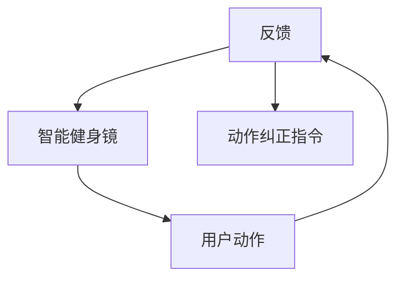
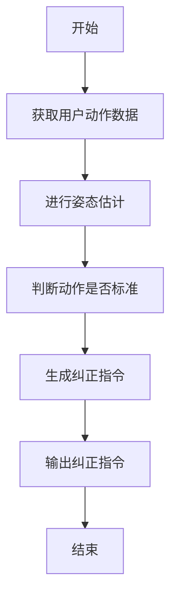

                 


# AI Agent在智能健身镜中的实时动作纠正

> 关键词：AI Agent, 智能健身镜, 实时动作纠正, 人工智能, 计算机视觉

> 摘要：本文深入探讨了AI Agent在智能健身镜中的实时动作纠正技术，从理论到实践，全面分析了其工作原理、系统架构、算法实现及实际应用案例。文章内容涵盖AI Agent的基本概念、智能健身镜的技术特点、实时动作纠正的算法原理、系统架构设计、项目实战及优化建议。

---

## 第一部分: AI Agent与智能健身镜概述

### 第1章: AI Agent与智能健身镜的背景介绍

#### 1.1 AI Agent的基本概念
- **1.1.1 什么是AI Agent**  
  AI Agent（人工智能代理）是指能够感知环境、自主决策并执行任务的智能实体。它可以理解为一种智能系统，通过传感器获取信息，利用算法进行分析和决策，并通过执行器与环境交互。

- **1.1.2 AI Agent的核心特征**  
  - 自主性：无需外部干预，自主完成任务。  
  - 反应性：能够实时感知环境并做出反应。  
  - 学习性：通过数据和经验不断优化自身的决策能力。  
  - 社会性：能够与其他系统或用户进行协作。

- **1.1.3 AI Agent的应用场景**  
  AI Agent广泛应用于自动驾驶、智能助手、机器人控制、智能家居等领域。在智能健身镜中，AI Agent主要用于实时分析用户的动作，并提供纠正建议。

#### 1.2 智能健身镜的定义与特点
- **1.2.1 智能健身镜的定义**  
  智能健身镜是一种结合了人工智能技术的镜子，能够通过摄像头捕捉用户的动作，并利用AI算法提供实时的健身指导和动作纠正。

- **1.2.2 智能健身镜的核心功能**  
  - 用户动作捕捉与识别  
  - 实时动作纠正  
  - 健身计划推荐  
  - 健身数据记录与分析  

- **1.2.3 智能健身镜的技术优势**  
  - 非接触式交互：用户无需佩戴额外设备即可完成动作捕捉。  
  - 实时反馈：能够在用户动作完成后立即提供纠正建议。  
  - 个性化指导：根据用户的动作特点提供定制化的健身方案。

#### 1.3 AI Agent在智能健身镜中的应用背景
- **1.3.1 健身行业的痛点**  
  - 用户缺乏专业的健身指导，容易出现动作错误。  
  - 传统健身镜无法提供实时反馈，用户难以及时纠正动作。  
  - 健身数据无法有效整合，难以提供个性化的健身方案。

- **1.3.2 AI技术在健身领域的应用潜力**  
  - 通过AI技术，可以实现用户动作的实时捕捉与分析。  
  - AI算法能够自动识别动作是否标准，并提供纠正建议。  
  - 基于AI的健身数据分析，可以为用户提供个性化的健身计划。

- **1.3.3 AI Agent在智能健身镜中的价值**  
  - 提供实时、精准的健身指导，帮助用户避免运动损伤。  
  - 通过AI算法优化用户的健身效果，提升运动效率。  
  - 为用户提供个性化的健身体验，增强用户粘性。

---

## 第2章: AI Agent与智能健身镜的核心概念与联系

### 2.1 AI Agent的核心原理
- **2.1.1 AI Agent的基本原理**  
  AI Agent通过感知环境、分析信息、做出决策并执行动作来完成任务。其核心包括感知模块、决策模块和执行模块。

- **2.1.2 AI Agent的感知与决策机制**  
  - 感知：通过摄像头、传感器等设备获取环境信息。  
  - 决策：基于感知信息，利用算法（如深度学习、强化学习）进行分析和判断。  
  - 执行：根据决策结果，通过执行器（如显示器、扬声器）输出反馈。

- **2.1.3 AI Agent的学习与优化过程**  
  AI Agent通过不断收集数据、学习新的知识，优化自身的算法模型，提升决策的准确性和效率。

### 2.2 智能健身镜的技术架构
- **2.2.1 智能健身镜的硬件组成**  
  - 摄像头：用于捕捉用户的动作。  
  - 显示屏：用于显示健身指导和纠正建议。  
  - 音频模块：用于播放语音提示。  
  - 传感器：用于辅助捕捉用户的运动数据。

- **2.2.2 智能健身镜的软件架构**  
  - 数据采集模块：负责捕捉用户的动作数据。  
  - 数据处理模块：对捕捉到的数据进行分析和处理。  
  - AI算法模块：用于动作识别和纠正建议生成。  
  - 用户界面模块：用于显示结果和交互。

- **2.2.3 智能健身镜的数据流分析**  
  数据流从摄像头进入系统，经过数据处理模块和AI算法模块的分析，生成纠正建议，并通过用户界面模块反馈给用户。

### 2.3 AI Agent与智能健身镜的实体关系图


---

## 第3章: 实时动作纠正的算法原理

### 3.1 姿态估计算法
- **3.1.1 姿态估计的基本原理**  
  姿态估计是通过摄像头捕捉人体关键点的位置和姿态，从而判断人体的动作状态。常用的算法包括基于深度学习的Hourglass网络、YOLO等。

- **3.1.2 基于深度学习的姿态估计模型**  
  - Hourglass网络：通过多尺度特征融合，实现高精度的姿态估计。  
  - YOLO：一种快速的物体检测算法，适用于实时姿态估计。

- **3.1.3 姿态估计的实现流程**  
  1. 摄像头捕捉用户的动作图像。  
  2. 通过姿态估计模型，提取人体关键点。  
  3. 根据关键点的位置，判断用户的动作是否标准。

### 3.2 动作纠正算法
- **3.2.1 动作纠正的基本原理**  
  动作纠正算法通过对比用户的动作与标准动作，找出动作偏差，并生成纠正建议。

- **3.2.2 基于AI Agent的动作纠正算法**  
  - 数据预处理：对捕捉到的动作数据进行标准化处理。  
  - 动作识别：通过对比用户的动作与标准动作，判断是否存在动作偏差。  
  - 纠正建议生成：根据动作偏差，生成个性化的纠正建议。

- **3.2.3 动作纠正算法的优化策略**  
  - 增强学习：通过强化学习优化算法的决策能力。  
  - 数据增强：通过数据增强技术，提高算法的泛化能力。  
  - 模型优化：通过模型压缩和并行计算，提高算法的运行效率。

### 3.3 算法流程图


---

## 第4章: 系统分析与架构设计

### 4.1 系统功能设计
- **4.1.1 问题场景介绍**  
  在智能健身镜中，用户需要通过镜子进行健身训练，系统需要实时捕捉用户的动作，并提供纠正建议。

- **4.1.2 系统功能设计**  
  - 用户动作捕捉与识别  
  - 动作纠正建议生成  
  - 健身数据记录与分析  

### 4.2 系统架构设计
- **4.2.1 系统架构图**  
  ```mermaid
  graph TD
      A[AI Agent] --> B[数据处理模块]
      B --> C[姿态估计模块]
      C --> D[动作纠正模块]
      D --> E[用户界面模块]
  ```

- **4.2.2 系统接口设计**  
  - 数据输入接口：摄像头、传感器。  
  - 数据输出接口：显示器、扬声器。  
  - 用户交互接口：触摸屏、语音指令。

- **4.2.3 系统交互流程图**  
  ```mermaid
  graph TD
      A[用户] --> B[摄像头]
      B --> C[数据处理模块]
      C --> D[姿态估计模块]
      D --> E[动作纠正模块]
      E --> F[用户界面模块]
      F --> G[用户]
  ```

---

## 第5章: 项目实战

### 5.1 环境安装与配置
- **5.1.1 系统环境**  
  - 操作系统：Windows 10或更高版本，或Linux系统。  
  - 开发工具：Python 3.8及以上版本，TensorFlow、Keras等深度学习框架。  
  - 硬件设备：摄像头、显示器、扬声器。

### 5.2 核心功能实现
- **5.2.1 姿态估计代码实现**  
  ```python
  import tensorflow as tf
  from tensorflow.keras import layers

  model = tf.keras.Sequential([
      layers.Conv2D(32, (3, 3), activation='relu', input_shape=(224, 224, 3)),
      layers.MaxPooling2D(pool_size=(2, 2)),
      layers.Conv2D(64, (3, 3), activation='relu'),
      layers.MaxPooling2D(pool_size=(2, 2)),
      layers.Flatten(),
      layers.Dense(128, activation='relu'),
      layers.Dense(10, activation='softmax')
  ])
  ```

- **5.2.2 动作纠正算法实现**  
  ```python
  def correct_pose(keypoints, standard_pose):
      # 计算动作偏差
      deviation = keypoints - standard_pose
      # 生成纠正建议
      suggestion = "请调整您的姿势，确保左右肩平齐。"
      return suggestion
  ```

### 5.3 实际案例分析
- **5.3.1 案例背景**  
  用户进行俯卧撑动作时，系统捕捉到用户的动作偏差，生成纠正建议。

- **5.3.2 案例分析**  
  - 用户动作捕捉结果：左肩低于右肩。  
  - 系统判断：动作不标准。  
  - 纠正建议：请调整您的姿势，确保左右肩平齐。

---

## 第6章: 总结与展望

### 6.1 总结
本文详细探讨了AI Agent在智能健身镜中的实时动作纠正技术，从理论到实践，全面分析了其工作原理、系统架构、算法实现及实际应用案例。通过本文的讲解，读者可以深入了解AI Agent在智能健身镜中的应用价值和技术实现。

### 6.2 优化建议
- 提高算法的实时性：优化数据处理模块，减少延迟。  
- 增强系统的鲁棒性：通过数据增强和模型优化，提高算法的抗干扰能力。  
- 提供更多个性化服务：根据用户的健身目标和身体状况，提供个性化的健身计划。

### 6.3 未来展望
随着AI技术的不断发展，智能健身镜的功能将更加智能化和个性化。未来的AI Agent将具备更强的自主学习能力和更高的决策效率，为用户提供更加精准和个性化的健身指导。

---

## 作者：AI天才研究院/AI Genius Institute & 禅与计算机程序设计艺术 /Zen And The Art of Computer Programming

