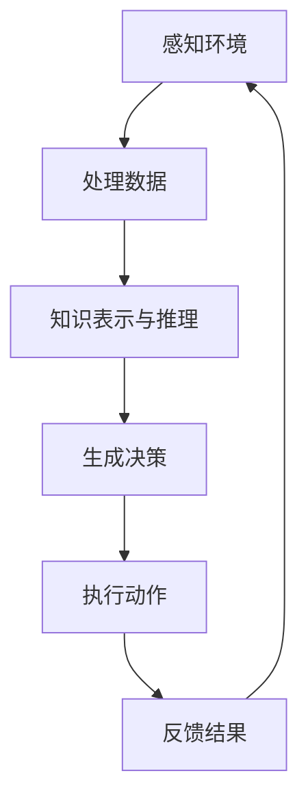
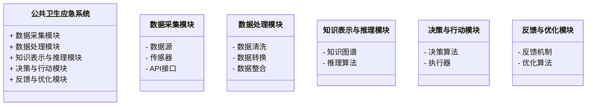
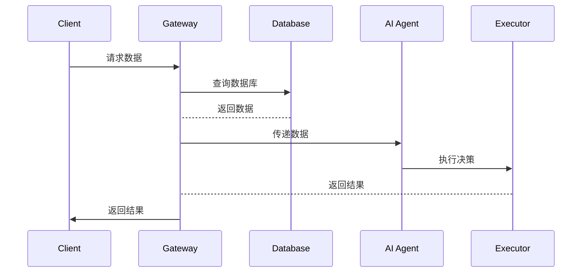

                 


# AI Agent在智能公共卫生应急中的角色

> **关键词**: AI Agent, 公共卫生, 应急响应, 人工智能, 医疗健康

> **摘要**: 本文深入探讨了AI Agent在智能公共卫生应急中的核心作用，分析了其在疾病传播预测、资源优化配置、应急决策支持等方面的优势，并结合实际案例展示了AI Agent在公共卫生应急中的应用场景。通过详细讲解AI Agent的算法原理、系统架构及数学模型，本文为AI Agent在公共卫生领域的未来发展提供了理论支持和实践指导。

---

# 第1章: 引言

## 1.1 公共卫生应急的背景与挑战

### 1.1.1 公共卫生应急的定义与范围
公共卫生应急是指在突发公共卫生事件（如传染病暴发、自然灾害导致的健康危机等）中，政府和社会组织采取的一系列措施，以保障公众健康和生命安全。这些措施包括疾病防控、资源分配、信息传播和应急响应等。

### 1.1.2 当前公共卫生应急的主要挑战
1. **信息处理复杂性**: 突发公共卫生事件通常涉及大量异构数据（如人口分布、医疗资源、疫情传播路径等），需要快速处理和分析。
2. **资源分配效率**: 在紧急情况下，医疗资源（如药品、疫苗、医护人员等）的分配效率直接影响应急响应的效果。
3. **决策时间压力**: 公共卫生事件往往具有突发性和不确定性，决策者需要在有限时间内做出准确判断。

### 1.1.3 AI Agent在公共卫生应急中的潜力
AI Agent（人工智能代理）是一种能够感知环境、自主决策并采取行动的智能系统。其在公共卫生应急中的潜力主要体现在：
- **实时数据处理与分析**: AI Agent可以快速处理海量数据，提供实时疫情监控和预测。
- **智能决策支持**: AI Agent能够基于数据和模型，为决策者提供最优建议。
- **自动化响应**: AI Agent可以实现部分应急响应的自动化，如自动分配医疗资源、发送预警信息等。

## 1.2 AI Agent的基本概念与特点

### 1.2.1 AI Agent的定义
AI Agent是指具有感知环境、自主决策和执行任务能力的智能体。它能够通过传感器或数据输入感知环境状态，并基于内置算法做出决策，执行相应的动作以达到目标。

### 1.2.2 AI Agent的核心特点
1. **自主性**: AI Agent能够在没有人工干预的情况下独立运行。
2. **反应性**: AI Agent能够实时感知环境变化并做出相应反应。
3. **目标导向性**: AI Agent的行为以实现特定目标为导向。
4. **学习能力**: 基于机器学习算法，AI Agent能够通过经验优化自身行为。

### 1.2.3 AI Agent与传统公共卫生应急工具的区别
传统的公共卫生应急工具主要依赖于人工分析和固定流程，而AI Agent具有以下优势：
- **实时性**: AI Agent能够实时处理数据并做出响应。
- **智能性**: AI Agent能够根据复杂情况自主调整策略。
- **可扩展性**: AI Agent可以在不同场景下灵活应用。

## 1.3 本章小结
本章介绍了公共卫生应急的背景与挑战，并重点阐述了AI Agent的基本概念与特点。通过对比分析，展示了AI Agent在公共卫生应急中的独特优势。

---

# 第2章: AI Agent在公共卫生应急中的核心作用

## 2.1 公共卫生应急中的关键问题

### 2.1.1 疾病传播预测与防控
疾病的传播路径和速度受多种因素影响，包括人口密度、交通网络、气候条件等。AI Agent可以通过分析历史数据和实时信息，预测疫情发展趋势，并提出防控建议。

### 2.1.2 紧急资源分配与调度
在突发公共卫生事件中，医疗资源的分配至关重要。AI Agent可以通过优化算法，确保资源（如疫苗、药品、医护人员）的高效分配。

### 2.1.3 应急决策支持
决策者需要在有限时间内做出最优决策。AI Agent可以通过模拟不同方案的效果，为决策者提供科学依据。

## 2.2 AI Agent在公共卫生应急中的应用场景

### 2.2.1 疾病传播预测与风险评估
AI Agent可以通过整合疫情数据、人口流动数据和环境数据，构建数学模型，预测疫情的传播趋势。例如，基于SIR模型的改进算法可以更准确地预测疫情峰值。

### 2.2.2 紧急资源优化配置
AI Agent可以利用强化学习算法，优化医疗资源的分配策略。例如，在疫情期间，AI Agent可以动态调整医护人员的分配，确保关键区域的医疗资源充足。

### 2.2.3 应急响应与协调
AI Agent可以实现多部门之间的协同工作，优化应急响应流程。例如，在地震发生后，AI Agent可以协调救援队伍、医疗资源和物资供应，提高应急响应效率。

## 2.3 AI Agent的优势与局限性

### 2.3.1 AI Agent的优势
1. **高效性**: AI Agent能够快速处理大量数据，提供实时支持。
2. **准确性**: 基于机器学习算法，AI Agent的预测和决策具有较高的准确性。
3. **灵活性**: AI Agent可以根据环境变化动态调整策略。

### 2.3.2 AI Agent的局限性
1. **数据依赖性**: AI Agent的表现高度依赖数据质量和数量。
2. **伦理问题**: AI Agent的决策可能引发隐私和伦理问题。
3. **技术成熟度**: 目前AI Agent在某些领域的应用还不够成熟。

### 2.3.3 未来发展的方向
1. **提升数据处理能力**: 加强对异构数据的处理能力，提高模型的泛化性。
2. **优化算法**: 开发更高效的算法，降低计算成本。
3. **解决伦理问题**: 建立伦理框架，确保AI Agent的决策符合社会规范。

## 2.4 本章小结
本章详细探讨了AI Agent在公共卫生应急中的核心作用，分析了其在疾病传播预测、资源分配和应急决策支持等方面的应用场景，并总结了其优势与局限性。

---

# 第3章: AI Agent的核心概念与原理

## 3.1 AI Agent的感知与认知机制

### 3.1.1 数据采集与处理
AI Agent通过多种传感器和数据源（如摄像头、GPS、社交媒体数据）获取环境信息，并进行清洗、整合和分析。

### 3.1.2 知识表示与推理
AI Agent需要将获取的知识表示为某种形式（如知识图谱），并通过推理算法（如逻辑推理、概率推理）进行逻辑推断。

### 3.1.3 意识与学习机制
基于深度学习算法，AI Agent能够从经验中学习，优化自身的感知和决策能力。

## 3.2 AI Agent的决策与行动机制

### 3.2.1 决策算法
AI Agent的决策算法包括：
1. **基于规则的决策**: 根据预设规则做出决策。
2. **基于机器学习的决策**: 利用训练好的模型进行预测和决策。
3. **基于强化学习的决策**: 通过试错学习优化决策策略。

### 3.2.2 行动规划
AI Agent需要根据决策结果制定行动计划，并通过执行器（如自动化系统）实现目标。

### 3.2.3 与环境的交互
AI Agent通过传感器感知环境状态，并通过执行器与环境交互，形成闭环控制系统。

## 3.3 AI Agent的协作与通信机制

### 3.3.1 多 Agent 协作
在复杂场景中，多个AI Agent需要协作完成任务。例如，在疫情期间，多个AI Agent可以分别负责疫情监测、资源分配和应急响应。

### 3.3.2 通信协议
AI Agent之间的通信需要遵循特定的协议，确保信息的准确传递和处理。

### 3.3.3 协作任务分配
基于分布式计算和任务分配算法（如蚁群算法），AI Agent可以动态分配任务，提高协作效率。

## 3.4 本章小结
本章详细讲解了AI Agent的核心概念与原理，包括其感知与认知机制、决策与行动机制，以及协作与通信机制。

---

# 第4章: AI Agent的算法原理与数学模型

## 4.1 AI Agent的核心算法

### 4.1.1 机器学习算法
1. **监督学习**: 用于分类和回归任务。
2. **无监督学习**: 用于聚类和降维任务。
3. **强化学习**: 用于序列决策任务。

### 4.1.2 自然语言处理算法
1. **文本分类**: 用于信息筛选和主题识别。
2. **实体识别**: 用于从文本中提取关键信息。
3. **情感分析**: 用于分析公众情绪。

### 4.1.3 图论算法
1. **网络流算法**: 用于资源分配和路径规划。
2. **聚类算法**: 用于数据分组和模式识别。

## 4.2 AI Agent的数学模型

### 4.2.1 状态空间模型
状态空间模型描述了系统的可能状态及其转移关系。例如，在疫情传播模型中，状态可以表示为“未感染”、“感染”、“康复”等。

### 4.2.2 动作空间模型
动作空间模型描述了系统可能执行的动作及其效果。例如，在资源分配中，动作可以是“分配更多医护人员”或“增加疫苗供应”。

### 4.2.3 奖励函数模型
奖励函数模型定义了系统在不同状态下的奖励值，用于指导强化学习算法的优化方向。

## 4.3 算法流程图
以下是AI Agent的决策流程图：



## 4.4 本章小结
本章详细讲解了AI Agent的核心算法与数学模型，展示了其在公共卫生应急中的应用潜力。

---

# 第5章: AI Agent在公共卫生应急中的系统架构

## 5.1 系统总体架构

### 5.1.1 系统模块划分
AI Agent系统通常包括以下模块：
1. **数据采集模块**: 负责收集各种数据源（如传感器数据、数据库、API接口等）。
2. **数据处理模块**: 对采集到的数据进行清洗、转换和整合。
3. **知识表示与推理模块**: 将数据转化为知识表示，并进行逻辑推理。
4. **决策与行动模块**: 根据推理结果生成决策，并执行相应的动作。
5. **反馈与优化模块**: 根据执行结果优化系统性能。

### 5.1.2 系统功能描述
1. **实时监控**: 实时采集和分析疫情相关数据。
2. **智能预测**: 基于数学模型预测疫情发展趋势。
3. **资源分配**: 优化医疗资源的分配策略。
4. **应急响应**: 协调多部门进行应急响应。

### 5.1.3 系统性能指标
1. **响应时间**: 系统对输入的响应时间。
2. **处理能力**: 系统能够处理的最大数据量。
3. **准确率**: 系统预测和决策的准确率。

## 5.2 系统功能设计

### 5.2.1 领域模型（mermaid类图）
以下是公共卫生应急系统的领域模型：



### 5.2.2 系统架构设计（mermaid架构图）
以下是系统的整体架构图：


### 5.2.3 系统接口设计
1. **数据接口**: 提供API接口，供其他系统调用。
2. **用户接口**: 提供人机交互界面，供用户查看和操作。
3. **反馈接口**: 用于接收系统执行后的反馈信息。

### 5.2.4 系统交互（mermaid序列图）
以下是系统交互的序列图：



## 5.3 本章小结
本章详细描述了AI Agent在公共卫生应急中的系统架构，包括模块划分、功能设计和系统交互。

---

# 第6章: 项目实战——基于AI Agent的公共卫生应急系统开发

## 6.1 项目介绍
本项目旨在开发一个基于AI Agent的公共卫生应急系统，实现疾病传播预测、资源优化配置和应急响应支持。

## 6.2 环境安装
以下是项目所需的开发环境：
1. **编程语言**: Python 3.8+
2. **框架与库**: TensorFlow, Keras, Pandas, NumPy, Matplotlib, Flask
3. **开发工具**: PyCharm, VS Code
4. **操作系统**: Windows/Mac/Linux

## 6.3 核心代码实现

### 6.3.1 数据处理代码
```python
import pandas as pd
import numpy as np

# 读取数据
data = pd.read_csv('epidemic_data.csv')

# 数据清洗
data.dropna(inplace=True)
data['date'] = pd.to_datetime(data['date'])
data.set_index('date', inplace=True)
```

### 6.3.2 AI Agent实现代码
```python
class AI-Agent:
    def __init__(self):
        self.models = {
            'disease_prediction': load_model('disease_prediction.h5'),
            'resource_allocation': load_model('resource Allocation.h5')
        }

    def perceive(self, input_data):
        # 数据处理和特征提取
        pass

    def decide(self, input_data):
        # 调用模型进行预测
        prediction = self.models['disease_prediction'].predict(input_data)
        return prediction

    def act(self, decision):
        # 执行决策
        pass
```

### 6.3.3 应用场景实现代码
```python
from flask import Flask, request, jsonify

app = Flask(__name__)

@app.route('/predict', methods=['POST'])
def predict():
    data = request.json['data']
    agent = AI-Agent()
    prediction = agent.decide(data)
    return jsonify({'result': prediction})

if __name__ == '__main__':
    app.run(debug=True)
```

## 6.4 实际案例分析
以新冠疫情防控为例，AI Agent可以通过分析疫情数据，预测疫情发展趋势，并提出防控建议。例如，AI Agent可以预测未来一周内某地区的新增病例数，并建议加强该地区的防疫措施。

## 6.5 本章小结
本章通过实际项目展示了AI Agent在公共卫生应急中的开发与应用，提供了完整的代码实现和应用场景分析。

---

# 第7章: 总结与展望

## 7.1 本章总结
本文详细探讨了AI Agent在公共卫生应急中的角色，分析了其在疾病传播预测、资源分配和应急响应中的应用，并结合实际案例展示了AI Agent的潜力。

## 7.2 未来展望
1. **技术进步**: 随着人工智能技术的不断发展，AI Agent在公共卫生应急中的应用将更加广泛。
2. **数据共享**: 建立统一的数据共享平台，提高AI Agent的数据处理能力。
3. **伦理规范**: 制定伦理规范，确保AI Agent的决策符合社会道德。

## 7.3 本章小结
本章总结了全文的主要内容，并展望了AI Agent在公共卫生应急中的未来发展。

---

# 作者：AI天才研究院/AI Genius Institute & 禅与计算机程序设计艺术 /Zen And The Art of Computer Programming

